# 阅读顺序与使用说明

> 本章是整套 Ragent 学习笔记的“使用说明书”。不要跳过它，否则你很容易在 18 篇文档和 400+ 个 Java 文件中迷路。

---

## 这套笔记适合谁

这套笔记面向刚接触 Java 企业项目、Spring Boot 和 RAG 的学习者。阅读目标不是背类名，而是学会沿着“页面 → 接口 → Service → 核心组件 → 数据库/模型”的方向追踪真实调用链。

如果你符合以下任意画像，这套笔记就是为你写的：

- **Java 基础一般**：能写 CRUD，但没见过 Maven 多模块、AOP、拦截器、线程池上下文透传。
- **Spring Boot 只会简单开发**：不知道 `@ConfigurationProperties`、自动装配、Bean 生命周期、全局异常处理。
- **前端基础薄弱**：只写过 Vue/React 简单页面，没跟过 SSE、Zustand、Vite 代理。
- **AI/RAG 概念零散**：听过 Embedding、向量检索，但不知道它们在代码里长什么样。
- **想从“看过项目”到“能讲项目”**：准备面试或希望把项目写进简历。

如果你已经能独立阅读 Spring Cloud 微服务、写过复杂 React 应用、调通过多个大模型 API，可以跳过部分基础说明，但建议 still 按顺序过一遍目录，避免遗漏 Ragent 特有的设计点。

---

## 如何使用这套笔记

### 第一步：先读导航文档（1 小时）

按这个顺序读：

1. `00-阅读顺序与使用说明.md`（本章）
2. `01-项目总览.md`
3. `14-术语表.md`

目标：建立全局地图，知道项目为什么存在、分哪些模块、有哪些核心流程、术语在源码哪里出现。

### 第二步：跟着学习计划推进（2 周）

按 `11-两周学习计划.md` 执行。每天 2～4 小时，不要贪多。计划中已经指定了：

- 每天要读的文档；
- 每天要读的源码；
- 每天要打的断点；
- 每天要执行的 SQL；
- 每天要画的图；
- 当天验收标准。

### 第三步：遇到问题时回查专项文档

| 问题类型 | 回查文档 |
|---|---|
| 启动失败、配置不懂 | `02-本地启动指南.md` |
| 模块为什么这么分 | `03-目录结构与模块职责.md` |
| Spring Boot 启动装 Bean 的逻辑 | `04-后端启动流程源码解析.md` |
| 表结构、字段含义、SQL | `05-数据库与核心表结构.md` |
| 文档怎么入库 | `06-文档入库流程解析.md` |
| 问答主流程 | `07-RAG问答主流程解析.md` |
| 模型调用、路由、熔断 | `08-模型调用与路由容错.md` |
| MCP 工具调用 | `09-MCP工具调用解析.md` |
| 前端页面、接口、SSE | `10-前端页面与接口关系.md` |
| 学习计划、小改造 | `11-两周学习计划.md`、`12-小改造任务建议.md` |
| 面试表达 | `13-面试复盘与项目讲解稿.md` |
| 认证、上下文、幂等、异常 | `17-认证上下文幂等与异常处理.md` |
| Trace、日志、排查 | `18-Trace日志与问题排查.md` |

### 第四步：用输出物检验自己

每学完一个模块，必须产出至少一样东西：

- 一张手绘或 Mermaid 流程图；
- 一条能口述的调用链；
- 一份数据库查询结果；
- 一段改造方案；
- 一个面试问答。

**没有输出物的学习，大概率只是“看过”。**

---

## 源码阅读五步法

读大型企业项目源码，最怕一头扎进私有实现。推荐按以下五步循序渐进：

### 第一步：看入口

先找到请求的入口。入口通常是：

- 前端页面组件：`frontend/src/pages/**/xxxPage.tsx`
- 前端 service：`frontend/src/services/xxxService.ts`
- 后端 Controller：`bootstrap/src/main/java/.../controller/XxxController.java`
- 启动类：`RagentApplication.java`、`McpServerApplication.java`

**示例**：想知道聊天接口入口，先搜 `RAGChatController`，而不是先读 `StreamChatPipeline`。

### 第二步：看依赖

入口类依赖哪些 Service/Component/Configuration？它注入了哪些 Bean？这些 Bean 属于哪个模块？

**示例**：`RAGChatServiceImpl` 注入了 `StreamChatPipeline`、`ChatQueueLimiter`、`StreamChatTraceRunner`。从依赖就能看出一次问答要过排队、Trace、Pipeline 三层。

### 第三步：看方法

看公开方法的签名：输入参数、返回值、抛出的异常。先不要钻私有方法。

**示例**：`StreamChatPipeline.execute(StreamChatContext, StreamCallback)` 的输入是上下文和回调，输出是流式响应。这告诉你它是“状态驱动 + 回调推流”。

### 第四步：看数据

跟踪一次请求中数据库表的变化。Ragent 是数据密集型项目，数据库是最好的老师。

**示例**：一次问答后查 `t_conversation`、`t_message`、`t_rag_trace_run`、`t_rag_trace_node`。

### 第五步：看异常

正常流程看懂后，再看异常和边界情况：什么会失败？失败时怎么短路？错误信息存在哪里？

**示例**：`IngestionEngine.executeNode()` 中节点失败会停止整条链；`RoutingLLMService.streamChat()` 首包失败会切换候选。

---

## 每天学习闭环

建议每天按这个闭环学习，而不是一直读文档：

```text
读文档（30～60 分钟）
  -> 找源码（30 分钟）
  -> 打断点（30～60 分钟）
  -> 查数据库（15 分钟）
  -> 画一张图（15 分钟）
  -> 复述一条调用链（15 分钟）
```

### 读文档

不要一次性读多篇。每天重点读 1～2 篇，带着问题读：

- 这篇文档解决什么问题？
- 它提到的类和方法在源码哪里？
- 它和昨天读的内容有什么联系？

### 找源码

用 IDEA 的 `Shift` 双击搜索类名，用 `Find Usages` 看调用方。重点找：

- Controller 方法；
- Service 公开方法；
- 配置类（带 `@ConfigurationProperties`）；
- DO/Mapper。

### 打断点

不要给所有方法打断点。一次只观察一条链路：

- 今天学登录：断点放在 `AuthController.login()` → `AuthServiceImpl.login()`。
- 今天学入库：断点放在 `IngestionTaskController.upload()` → `IngestionEngine.execute()`。
- 今天学 RAG：断点放在 `RAGChatController.chat()` → `StreamChatPipeline.execute()`。

### 查数据库

每次实操后，用 SQL 验证结果：

- 登录后查 `t_user`。
- 上传文档后查 `t_knowledge_document`。
- 提问后查 `t_message` 和 `t_rag_trace_run`。

### 画一张图

图不需要漂亮，能表达“谁调谁、数据怎么流”即可。推荐：

- 时序图：适合前后端交互。
- 流程图：适合主流程分支。
- ER 图：适合表关系。

### 复述一条调用链

试着用中文口述一条调用链，比如：

> 用户在前端输入问题，点击发送，`chatStore.sendMessage()` 调用 `useStreamResponse`，用 fetch 发 `GET /rag/v3/chat` 到 `RAGChatController.chat()`，然后进入 `RAGChatServiceImpl.streamChat()`，经过排队和 Trace 后进入 `StreamChatPipeline.execute()`……

如果卡壳，说明还有没理解的地方，回去补。

---

## 不同基础的人怎么学

### Java 基础弱

**重点补**：接口 vs 抽象类、泛型、Lambda、`CompletableFuture`、异常体系、`Optional`、集合常用操作。

**学习策略**：
- 先花 2～3 天补 Java 基础，不要直接追 RAG 主流程。
- 读源码时，遇到看不懂的语法先标记，不要死磕。
- 优先看 `framework` 模块：`Result.java`、`UserContext.java`、`GlobalExceptionHandler.java`，这些类代码量少、概念基础。

**推荐起步**：
- 第 1 天：`00`、`01`、`14`、`framework` 模块。
- 第 2 天：`02` 本地启动 + `04` 启动流程。
- 第 3 天：再进入 `06` 或 `07`。

### Spring Boot 弱

**重点补**：依赖注入、Bean 生命周期、`@ConfigurationProperties`、AOP、拦截器、MyBatis-Plus、全局异常处理。

**学习策略**：
- 先理解 Spring Boot 为什么能找到 Controller：从 `RagentApplication` 包扫描开始。
- 先看配置绑定：`RagTraceProperties`、`RagMcpProperties`、`SearchChannelProperties`。
- 再看 AOP：`RagTraceAspect`、`IdempotentSubmitAspect`。
- 最后看拦截器：`UserContextInterceptor`。

**推荐起步**：
- `04-后端启动流程源码解析.md`
- `17-认证上下文幂等与异常处理.md`
- `03-目录结构与模块职责.md`

### 前端弱

**重点补**：React 函数组件、Hook、Zustand、fetch/Axios、React Router、TypeScript 基础类型。

**学习策略**：
- 不要先看组件实现，先看目录结构和路由。
- 从 `router.tsx` 知道有哪些页面。
- 从 `services/api.ts` 知道请求怎么发。
- 从 `chatStore.ts` 知道全局状态怎么管理。
- 最后才看 `useStreamResponse.ts` 的 SSE 解析。

**推荐起步**：
- `10-前端页面与接口关系.md`
- `frontend/src/router.tsx`
- `frontend/src/services/api.ts`
- `frontend/src/stores/chatStore.ts`

### AI/RAG 概念弱

**重点补**：Embedding、向量相似度、余弦距离、Prompt、Token、Rerank、Top-K、意图识别、工具调用。

**学习策略**：
- 不要先读论文，先看代码里的具体实现。
- Embedding 是什么？看 `ChunkEmbeddingService.embed()` 的输入输出。
- 向量检索是什么？看 `PgRetrieverService` 怎么查 `t_knowledge_vector`。
- Rerank 是什么？看 `RoutingRerankService.rerank()`。
- Prompt 是什么？看 `resources/prompt/*.st` 模板。

**推荐起步**：
- `01-项目总览.md`
- `14-术语表.md`
- `06-文档入库流程解析.md` 的 Embedding 和向量写入部分
- `07-RAG问答主流程解析.md` 的检索和 Prompt 部分

### 如果你四项都弱

**建议**：先用 3 天补基础，再进入主流程。

- 第 1 天：Java 基础 + Spring Boot IoC。
- 第 2 天：前端三件套（React、TypeScript、HTTP）+ RAG 概念科普。
- 第 3 天：把 `00`、`01`、`14`、`02` 读完，启动项目。
- 第 4 天起：按 `11-两周学习计划.md` 执行。

---

## 不要怎么学

### 不要上来就改代码

大型项目里，一个看似简单的改动可能跨越 Controller、Service、配置、数据库、前端。在你能独立口述一条调用链之前，改代码只会带来更多 bug 和挫败感。

**正确做法**：
- 前 7 天只读、只跟断点、只查数据库。
- 第 8 天后再尝试写小改造方案（不改代码）。
- 第 14 天后再考虑真正动手改。

### 不要只看 README

README 只能告诉你项目“是什么”，不能告诉你“怎么运行起来”“怎么排查问题”“怎么扩展”。

**正确做法**：
- README 看一遍即可。
- 把主要时间花在 `docs/learning-notes/`、源码、数据库上。

### 不要让 Codex 一次性总结全项目

大模型一次处理太多文件时，容易每篇都加一点，但每篇都不深。你会得到一份“好像都讲了，但又讲不透”的总结。

**正确做法**：
- 按模块逐条执行提示词。
- 每次只扩写 1～3 篇文档。
- 每次执行后自己做 `git diff` 检查。

### 不要只收藏不输出

把文档放进收藏夹不等于学会。必须动手：

- 画流程图；
- 写 SQL；
- 打断点；
- 口述调用链；
- 写改造方案。

### 不要忽略数据库

Ragent 的很多设计（如会话摘要、Pipeline 节点日志、Trace）最终都落库。只跟 Java 代码不看表，会漏掉很多关键状态。

### 不要畏惧失败

本地启动失败、模型调用失败、SSE 中断都很正常。每次失败都是学习机会，关键是用“前端 → 日志 → 数据库 → 断点”的顺序定位问题。

---

## 14 天学习节奏总览图

```mermaid
flowchart LR
    subgraph 第1周["第 1 周：跑通 + 架构 + 入库"]
        D1["Day 1\n全局地图"]
        D2["Day 2\n本地启动"]
        D3["Day 3\n目录结构与启动流程"]
        D4["Day 4\n数据库表结构"]
        D5["Day 5\n入库流程上"]
        D6["Day 6\n入库流程下"]
        D7["Day 7\n第一周复习"]
    end

    subgraph 第2周["第 2 周：RAG + 模型 + 前端 + 表达"]
        D8["Day 8\nRAG 问答主流程"]
        D9["Day 9\n检索与 Rerank"]
        D10["Day 10\n模型路由与容错"]
        D11["Day 11\nMCP 工具调用"]
        D12["Day 12\n前端 SSE 与接口"]
        D13["Day 13\nTrace 与排查"]
        D14["Day 14\n小改造与面试复盘"]
    end

    D1 --> D2 --> D3 --> D4 --> D5 --> D6 --> D7
    D7 --> D8 --> D9 --> D10 --> D11 --> D12 --> D13 --> D14
```



### 第 1 周重点

| 天数 | 主题 | 核心产出 |
|---|---|---|
| Day 1 | 全局地图 | 手绘架构图、10 个术语 |
| Day 2 | 本地启动 | 环境检查清单、登录成功 |
| Day 3 | 目录结构与启动流程 | 模块职责表、拦截器断点 |
| Day 4 | 数据库表结构 | ER 图、10 条 SQL |
| Day 5 | 入库流程上 | 两条链路对比表 |
| Day 6 | 入库流程下 | 节点执行顺序表 |
| Day 7 | 第一周复习 | 5 分钟口述录音 |

### 第 2 周重点

| 天数 | 主题 | 核心产出 |
|---|---|---|
| Day 8 | RAG 问答主流程 | 问答调用链表、Context 字段说明 |
| Day 9 | 检索与 Rerank | 三类问题召回对比表 |
| Day 10 | 模型路由与容错 | 配置项解释、熔断状态图 |
| Day 11 | MCP 工具调用 | 工具列表、天气调用链 |
| Day 12 | 前端 SSE 与接口 | 页面→Controller 映射表、SSE 事件表 |
| Day 13 | Trace 与排查 | 一次具体问答的 Trace 节点表 |
| Day 14 | 小改造与面试复盘 | 改造方案、三段面试录音 |

---

## 每篇文档当前解决什么问题

| 文档 | 解决什么问题 |
|---|---|
| `01-项目总览.md` | Ragent 是什么、整体架构、核心能力 |
| `02-本地启动指南.md` | 怎么从零把项目跑起来 |
| `03-目录结构与模块职责.md` | 代码为什么这样分层 |
| `04-后端启动流程源码解析.md` | Spring Boot 启动时装配了什么 |
| `05-数据库与核心表结构.md` | 数据存在哪里、表之间什么关系 |
| `06-文档入库流程解析.md` | 文档怎么从上传变成可检索 |
| `07-RAG问答主流程解析.md` | 用户提问后系统怎么处理 |
| `08-模型调用与路由容错.md` | 怎么调大模型、失败怎么办 |
| `09-MCP工具调用解析.md` | 实时业务工具怎么被调用 |
| `10-前端页面与接口关系.md` | 前端页面怎么对应后端接口 |
| `11-两周学习计划.md` | 每天学什么、学到什么程度 |
| `12-小改造任务建议.md` | 怎么安全地设计小改造 |
| `13-面试复盘与项目讲解稿.md` | 怎么在面试中讲这个项目 |
| `14-术语表.md` | 关键术语是什么意思、在源码哪里 |
| `15-GitHub-Fork与同步流程.md` | 怎么管理自己的 Fork 和分支 |
| `17-认证上下文幂等与异常处理.md` | 登录、上下文、异常、幂等怎么实现 |
| `18-Trace日志与问题排查.md` | 出了问题怎么定位 |

---

## 学习工具建议

1. **IDEA**：
   - `Shift` 双击搜类名。
   - `Ctrl+Alt+B` 看实现类。
   - `Alt+F7` 看调用方。
   - Debug 时用 Evaluate Expression 看对象内容。

2. **浏览器 DevTools**：
   - Network 面板看请求 URL、参数、响应、SSE EventStream。
   - Console 面板看前端报错。

3. **DBeaver / IDEA Database**：
   - 只看表结构，先别改数据。
   - 把常用 SQL 保存为查询文件。

4. **Mermaid Live Editor**：
   - 验证文档中的 Mermaid 图是否能渲染。

5. **语音备忘录**：
   - 每天复述调用链时录音，回放检查是否卡壳。

---

## 看不懂源码怎么办

采用“五步法”的简化版：

1. **先看类名和包名**：这个类属于哪个模块？名字里有没有 `Controller`、`Service`、`Engine`、`Pipeline`、`Node`、`Client`？
2. **再看公开方法签名**：输入是什么？输出是什么？方法名是否说明白了动作？
3. **再看字段和依赖**：这个类依赖了哪些 Bean？字段名是什么？
4. **再看调用方**：谁调用了它？在入口打断点。
5. **最后才看私有实现**：先理解输入输出，再理解内部算法。

遇到泛型、异步、设计模式时，先用一句中文写出“输入 → 处理 → 输出”，不要一开始纠结所有语法。

**如果 30 分钟还看不懂一个类**：

- 先跳过，继续往下读，很多类会在后续文档中反复出现。
- 在 `14-术语表.md` 中查找相关术语。
- 把问题写下来，周末统一查资料或向项目维护者提问。

---

## 建议补齐的基础

| 方向 | 内容 |
|---|---|
| Java | 接口、继承、集合、异常、Lambda、线程池、`CompletableFuture` |
| Spring Boot | 依赖注入、Bean、Controller、Service、配置绑定、AOP、拦截器 |
| 数据库 | SQL、索引、事务、JSONB、向量字段基本概念 |
| HTTP | GET/POST、JSON、状态码、SSE、multipart/form-data |
| 前端 | TypeScript、React 组件、Hook、Axios/fetch、路由 |
| AI | Prompt、Token、Embedding、余弦相似度、Top-K、Rerank |

---

## 本章复习问题

1. 学习 Ragent 的黄金顺序是什么？
2. 源码阅读五步法的第三步是什么？
3. 每天学习闭环的最后一步是什么？
4. Java 基础弱的人应该先补什么、先看哪个模块？
5. 为什么不能一上来就改代码？
6. 14 天计划中，第 1 周和第 2 周的重点分别是什么？

## 参考答案

1. 先读 `00`、`01`、`14` 建立全局地图，再按 `11-两周学习计划.md` 推进，遇到问题时回查专项文档。
2. 看方法：输入参数、返回值、异常，先不要钻私有方法。
3. 复述一条调用链。
4. 先补接口、泛型、Lambda、CompletableFuture；先看 `framework` 模块的 `Result`、`UserContext`、`GlobalExceptionHandler`。
5. 因为大型项目一个改动可能跨越多个模块和表，在能独立口述调用链之前改代码容易带来更多 bug 和挫败感。
6. 第 1 周重跑通、架构、入库；第 2 周重 RAG、模型、前端、改造、面试。

---

## 下一步建议

阅读 `01-项目总览.md`，同时在 IDE 中打开根目录 `pom.xml` 和 `bootstrap/src/main/java/com/nageoffer/ai/ragent/RagentApplication.java`，把项目整体架构和模块边界先印在脑子里。
