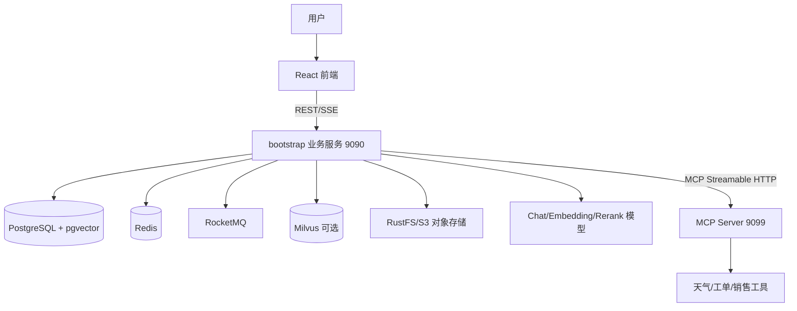

# 项目总览

## 项目做什么

Ragent 是一个前后端分离的企业级 Agentic RAG 平台，覆盖知识库、文档入库、检索问答、意图树、MCP 工具、模型路由、链路追踪和管理后台。项目定位见 `README.md`，真实业务入口主要位于 `bootstrap/src/main/java/com/nageoffer/ai/ragent`。

它解决的不是“调用一次大模型 API”，而是企业知识如何解析、切块、检索、引用，业务工具如何调用，以及模型失败后如何切换等工程问题。

## 核心概念

- **RAG**：先从知识库检索相关内容，再把内容放进 Prompt 让 LLM 回答。
- **Agentic RAG**：在普通 RAG 上增加问题改写、意图判断、工具调用、分支决策等主动编排能力。
- **MCP**：模型上下文协议。项目通过 MCP 客户端发现并调用远端工具。
- **Embedding**：把文本变成数字向量，语义接近的文本在向量空间中更接近。
- **向量检索**：用问题向量寻找相似文档块。项目支持 PostgreSQL pgvector 和 Milvus。
- **Rerank**：对召回候选再次排序，提高前几条结果的相关性。
- **SSE**：服务端持续向浏览器推送事件，用户能逐字看到模型回答。
- **模型路由**：从多个供应商和模型候选中按优先级选择，故障时自动降级。

## 总体架构

`bootstrap/src/main/resources/application.yaml` 默认使用 `rag.vector.type: pg`，因此 Milvus 是可选路径，不是默认必需路径。

## 技术栈

| 层次 | 技术 | 代码依据 |
|---|---|---|
| 后端 | Java 17、Spring Boot 3.5.7 | 根 `pom.xml` |
| 数据访问 | MyBatis-Plus、PostgreSQL、pgvector | `framework/pom.xml`、`schema_pg.sql` |
| 基础设施 | Redis、Redisson、RocketMQ、RustFS/S3 | `application.yaml`、各模块 POM |
| AI | 自研 Chat/Embedding/Rerank 客户端与路由 | `infra-ai/src/main/java/...` |
| 文档处理 | Apache Tika、节点化 Pipeline | `bootstrap/pom.xml`、`ingestion/node` |
| MCP | MCP Java SDK、Streamable HTTP | `mcp-server/pom.xml`、`McpClientAutoConfiguration` |
| 前端 | React 18、TypeScript、Vite、Zustand、Axios、Tailwind | `frontend/package.json` |

## 前后端和中间件如何协作

前端通过 `/api/ragent` 调后端。后端把用户、会话、文档元数据和追踪记录写入 PostgreSQL；Redis 用于认证/缓存/分布式限流；RocketMQ 支撑异步消息能力；文件进 RustFS；文本向量进 pgvector 或 Milvus；模型服务完成改写、分类、Embedding、Rerank 和生成；MCP 服务处理非知识类业务工具。

## 源码已确认与待确认

已确认代码中有 463 个 Java 文件、21 张 PostgreSQL 表、两套向量存储实现和独立 MCP 服务。需要进一步确认：当前机器是否已准备所有中间件、真实模型密钥和可用模型。

## 本章复习问题

1. 普通 RAG 与 Agentic RAG 的差别是什么？
2. pgvector 和 Milvus 在项目中承担什么共同职责？
3. 为什么生成模型、Embedding 模型和 Rerank 模型不能混为一谈？

## 下一步建议

阅读 `02-本地启动指南.md`，把每个依赖在架构图中标出端口和用途。
