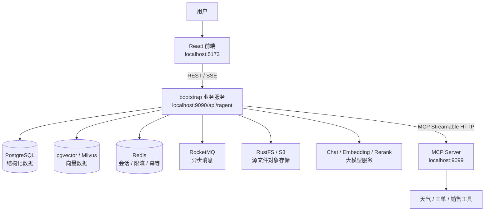
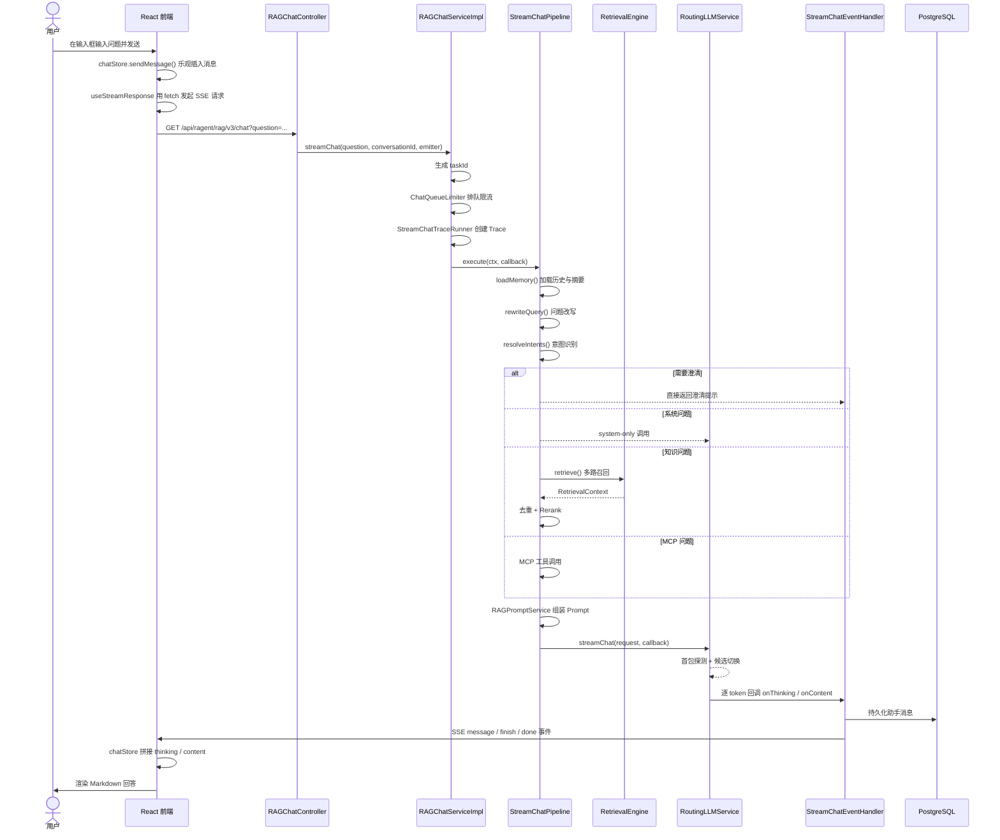
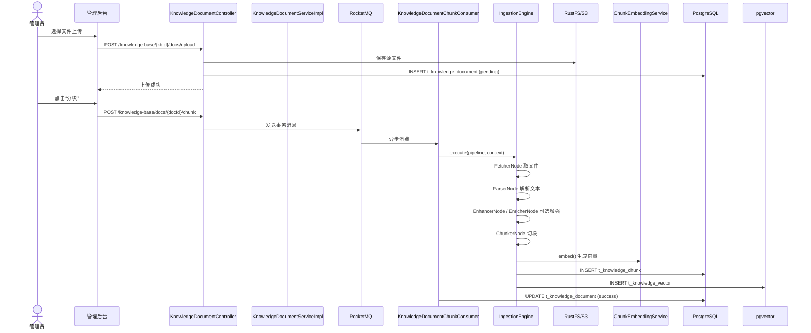

# 项目总览

> 本章是 Ragent 的“导游图”。读完它，你应该能回答：Ragent 是什么、解决什么问题、有哪些模块、一次问答和一次入库分别怎么走、每个能力在源码哪里入口。

---

## 用初学者语言解释 Ragent 是什么

**一句话**：Ragent 是一个让企业能用“自己的知识 + 实时业务工具”来回答问题的平台。

**更具体一点**：

想象你是一家公司的员工，经常需要问：

- “公司请假制度是什么？”（答案在内部文档里）
- “北京今天天气怎么样？”（答案在天气 API 里）
- “我的工单处理到哪一步了？”（答案在业务系统里）

传统方式是分别去查文档、查天气网站、查工单系统。Ragent 想把这三类问题统一到一个聊天框里：

- 问文档 → 系统先检索内部知识库，再让大模型组织答案。
- 问天气 → 系统识别出这是实时数据，调用天气工具。
- 问工单 → 系统识别出需要查业务系统，调用工单工具。

**Ragent 不是“一个大模型网页”**。它是一个完整的工程系统，包括：

- 文档怎么上传到系统里（入库 Pipeline）；
- 文档怎么变成能被检索的片段（切块、Embedding、向量存储）；
- 用户提问后怎么判断去哪里找答案（意图识别）；
- 找到答案后怎么组织语言（Prompt 组装、大模型生成）；
- 答案怎么快速显示到页面上（SSE 流式返回）；
- 大模型失败时怎么办（候选切换、熔断、降级）；
- 整个流程怎么被记录和排查（Trace、日志、数据库）。

**它解决的核心工程问题**：

1. 企业知识不是一次性问答能覆盖的，需要先“入库”再“检索”。
2. 大模型不能直接访问企业内部系统，需要通过 MCP 工具协议扩展。
3. 大模型服务不稳定，需要多供应商、多候选、失败降级。
4. 用户要实时看到回答生成过程，需要用 SSE 流式推送。
5. 复杂流程需要可观测，否则出问题没法定位。

---

## 总体架构

**默认值**：`rag.vector.type=pg`，所以默认向量存储是 PostgreSQL pgvector，Milvus 是可选路径。

---

## 一个用户问题从前端到模型再回到页面

**关键理解**：

- 不是每次问答都走检索。系统先判断意图，可能直接系统回答、澄清、检索或调工具。
- `StreamChatContext` 贯穿整个 Pipeline，保存每一步的中间结果。
- SSE 让模型生成过程实时可见，而不是等全部生成完再显示。

---

## 一个文档从上传到可检索

**关键理解**：

- “上传成功”只表示文件已存到 S3 并创建了文档记录，不等于“可检索”。
- 必须点击“分块”后，系统才会异步执行解析、切块、Embedding、向量写入。
- 通用 Ingestion Pipeline 链路是同步执行的，不创建 `t_knowledge_document`，直接写 `t_ingestion_task` 和向量存储。

---

## 模块边界

Ragent 不是一个大单体，而是按职责拆分的多模块项目。

### frontend（前端）

**职责**：用户界面、状态管理、接口调用、SSE 解析。

**技术栈**：React 18、TypeScript、Vite、Zustand、Axios/fetch、Tailwind、Radix UI。

**关键文件**：
- `frontend/src/router.tsx`：路由。
- `frontend/src/services/api.ts`：Axios 封装。
- `frontend/src/stores/chatStore.ts`：聊天状态。
- `frontend/src/hooks/useStreamResponse.ts`：SSE 解析。
- `frontend/src/pages/admin/traces/**`：Trace 管理页面。

**与后端关系**：通过 HTTP/SSE 调 bootstrap，不是 Maven 依赖。

### bootstrap（业务入口）

**职责**：Web 服务入口、RAG 问答、文档入库、用户认证、管理后台接口、Trace。

**关键包**：
- `rag/controller`：问答、会话、Trace 接口。
- `rag/service/pipeline`：`StreamChatPipeline`。
- `rag/core`：记忆、改写、意图、检索、Prompt、MCP。
- `ingestion`：`IngestionEngine`、Pipeline、节点。
- `knowledge`：知识库、文档、Chunk。
- `user`：登录、用户、上下文拦截器。
- `admin`：仪表盘统计。

**依赖**：依赖 `framework` 和 `infra-ai`。

### framework（通用框架能力）

**职责**：与具体业务无关，但所有 Web 服务都需要的基础能力。

**关键能力**：
- 统一返回 `Result<T>`：`framework/convention/Result.java`。
- 全局异常处理：`framework/web/GlobalExceptionHandler.java`。
- 用户上下文 `UserContext`：`framework/context/UserContext.java`。
- 幂等 AOP `@IdempotentSubmit`：`framework/idempotent/IdempotentSubmitAspect.java`。
- MQ 适配器：`framework/mq/RocketMQProducerAdapter.java`。
- Trace 上下文 `RagTraceContext`：`framework/trace/RagTraceContext.java`。

**被谁依赖**：`bootstrap` 和 `infra-ai` 都依赖它。

### infra-ai（AI 能力抽象）

**职责**：屏蔽模型供应商差异，提供统一接口。

**关键接口**：
- `LLMService`：文本生成。
- `EmbeddingService`：文本转向量。
- `RerankService`：检索结果重排。

**关键实现**：
- `RoutingLLMService`：模型路由。
- `ModelRoutingExecutor`：失败降级。
- `ModelHealthStore`：熔断状态。
- `BaiLianChatClient`、`SiliconFlowEmbeddingClient`、`OllamaChatClient` 等供应商 Client。

**被谁依赖**：`bootstrap` 依赖它。

### mcp-server（独立 MCP 工具服务）

**职责**：暴露天气、工单、销售等实时业务工具。

**关键文件**：
- `mcp-server/src/main/java/.../McpServerApplication.java`：启动类，端口 9099。
- `mcp-server/src/main/java/.../executor/WeatherMcpExecutor.java`：天气工具。
- `mcp-server/src/main/java/.../executor/TicketMcpExecutor.java`：工单工具。
- `mcp-server/src/main/java/.../executor/SalesMcpExecutor.java`：销售工具。

**与 bootstrap 关系**：bootstrap 通过 MCP Streamable HTTP 连接它，不是 Maven 子依赖。

### resources（资源文件）

**职责**：SQL、Docker、示例文档。

**关键目录**：
- `resources/database/schema_pg.sql`：建表 SQL。
- `resources/database/init_data_pg.sql`：初始化数据。
- `resources/docker/**`：中间件 Docker Compose。
- `resources/prompt/**`：Prompt 模板。

**注意**：不要把它和 `bootstrap/src/main/resources` 混淆。根 `resources` 是仓库级资源，`bootstrap/src/main/resources` 才是 Spring Boot 运行时加载的配置。

### docs（项目文档）

**职责**：架构说明、示例、设计文档。

**注意**：`docs/ragent-architecture.md` 部分仍写 MySQL，但当前代码实际用 PostgreSQL，阅读时要以源码为准。

---

## 核心能力清单与入口文件

| 核心能力 | 解决什么问题 | 推荐入口文件 | 相关表/配置 |
|---|---|---|---|
| **文档入库** | 把 PDF/Word/TXT 解析、切块、Embedding 后写入向量库 | `bootstrap/.../ingestion/engine/IngestionEngine.java` | `t_knowledge_document`、`t_knowledge_chunk`、`t_knowledge_vector`、`t_ingestion_task` |
| **检索** | 用问题向量找相似 Chunk | `bootstrap/.../rag/core/retrieve/RetrievalEngine.java` | `t_knowledge_vector` |
| **重排（Rerank）** | 对召回候选重新排序，提高 Top-K 质量 | `infra-ai/.../rerank/RoutingRerankService.java` | `ai.rerank.candidates`、`rag.rerank.enabled` |
| **Prompt 组装** | 把检索结果、历史、问题组装成模型输入 | `bootstrap/.../rag/core/prompt/RAGPromptService.java` | `resources/prompt/*.st` |
| **模型路由** | 从多个模型候选中选择并失败时切换 | `infra-ai/.../chat/RoutingLLMService.java` | `ai.chat.candidates`、`ai.selection` |
| **MCP 工具调用** | 调用天气、工单等实时业务工具 | `bootstrap/.../rag/core/mcp/McpClientToolExecutor.java` | `rag.mcp.servers`、`t_intent_node` |
| **会话记忆** | 保存多轮历史，控制 Token 成本 | `bootstrap/.../rag/core/memory/DefaultConversationMemoryService.java` | `t_message`、`t_conversation_summary` |
| **Trace** | 记录问答和入库各阶段耗时与状态 | `bootstrap/.../rag/trace/StreamChatTraceRunner.java` | `t_rag_trace_run`、`t_rag_trace_node` |
| **权限与认证** | 登录、Token、角色校验、用户上下文 | `bootstrap/.../user/controller/AuthController.java` | `t_user`、Sa-Token 配置 |
| **后台管理** | 知识库、Pipeline、Trace、用户、系统设置 | `frontend/src/pages/admin/**` | 多个管理表 |

---

## 项目学习难点清单

| 难点 | 为什么难 | 建议怎么学 |
|---|---|---|
| **异步流程** | RocketMQ Consumer、CompletableFuture、流式回调混在一起 | 先抓主线，再单独跟一条链路 |
| **SSE** | 不是普通 JSON，需要手动解析字节流 | 用浏览器 Network 观察 EventStream |
| **上下文对象** | `StreamChatContext`、`RetrievalContext`、`PromptContext` 字段多 | 打印每个阶段的对象内容 |
| **模型调用** | 多供应商、路由、熔断、首包探测、流式重试叠加 | 先看 `LLMService` 接口，再进入 `RoutingLLMService` |
| **向量检索** | Embedding、pgvector、Milvus、Top-K、置信度一起出现 | 先用 SQL 查 `t_knowledge_vector`，再看检索代码 |
| **Pipeline** | 节点配置、条件判断、链式执行、NodeLog | 先画节点连线图，再跟 `IngestionEngine` |
| **前后端联调** | 代理、跨域、Token、SSE 超时都可能导致问题 | 同时打开浏览器 Network 和 IDEA Debug |
| **配置项多** | `spring.*`、`rag.*`、`ai.*`、`rocketmq.*`、`sa-token.*` 混杂 | 按模块分组整理配置清单 |
| **术语多** | RAG、Embedding、Rerank、MCP、TTFT、意图树等 | 边学边查 `14-术语表.md` |

---

## 核心流程速查

### 想理解“用户提问后发生了什么”

入口：`RAGChatController.chat()` → `RAGChatServiceImpl.streamChat()` → `StreamChatPipeline.execute()`。

必读：`07-RAG问答主流程解析.md`。

### 想理解“文档怎么入库”

入口：`IngestionTaskController.upload()` → `IngestionTaskServiceImpl.upload()` → `IngestionEngine.execute()`。

必读：`06-文档入库流程解析.md`。

### 想理解“模型怎么被调用”

入口：`RoutingLLMService.chat()` / `streamChat()` → `ModelRoutingExecutor.executeWithFallback()`。

必读：`08-模型调用与路由容错.md`。

### 想理解“Trace 怎么记录”

入口：`StreamChatTraceRunner.run()` → `RagTraceAspect.aroundNode()`。

必读：`18-Trace日志与问题排查.md`。

---

## 源码已确认与待确认

### 已从源码确认

1. 后端用 Java 17 + Spring Boot 3.5.7，根 `pom.xml` 聚合四个 Maven 模块。
2. 主服务端口 9090，context path `/api/ragent`；MCP 服务端口 9099。
3. 默认向量存储是 PostgreSQL pgvector，Milvus 可选。
4. RAG 主链由 `StreamChatPipeline` 编排。
5. 入库由 `IngestionEngine` 和节点链编排。
6. 模型具有候选优先级、三态熔断和失败降级。
7. MCP 客户端通过 Streamable HTTP 发现并调用远端工具。
8. 前端使用 fetch 处理带认证和取消能力的 SSE。

### 需要进一步确认

- 当前机器是否已准备所有中间件、真实模型密钥和可用模型。
- 初始化用户的可用密码及真实登录结果。
- 各外部模型候选在当前网络和账号下是否可用。
- 完整 Docker 启动组合。仓库没有发现覆盖全部依赖的一键 Compose。
- 入库任务失败后的通用自动重试策略，源码扫描未确认统一实现。

---

## 本章复习问题

1. Ragent 解决的核心问题是什么？
2. 普通 RAG 与 Agentic RAG 的差别是什么？
3. 一次问答中，哪些情况下不会进入检索阶段？
4. “上传成功”和“可检索”之间还差哪些步骤？
5. `framework`、`bootstrap`、`infra-ai`、`mcp-server` 分别解决什么问题？
6. 学习 Ragent 最大的三个难点是什么？

## 参考答案

1. 让企业能用“私有知识 + 实时业务工具”统一回答问题，并解决大模型不稳定、流程复杂、需要可观测等工程问题。
2. 普通 RAG 只检索 + 生成；Agentic RAG 增加了问题改写、意图识别、工具调用、分支决策等主动编排能力。
3. 需要澄清、system-only 问题、直接调用 MCP 工具时可能不进入向量检索。
4. 上传成功只是文件存到 S3 并创建文档记录；还需要分块、解析、切块、Embedding、写入 `t_knowledge_chunk` 和 `t_knowledge_vector` 后才可检索。
5. `framework` 是通用 Web 基础设施；`bootstrap` 是业务入口；`infra-ai` 屏蔽模型供应商；`mcp-server` 是独立工具服务。
6. 异步 + SSE、上下文对象多、模型调用与路由复杂、向量检索概念多、Pipeline 配置抽象。

---

## 下一步建议

阅读 `02-本地启动指南.md`，把每个依赖在架构图中标出端口和用途，然后尝试启动最小可用环境（数据库 + Redis + 后端 + 前端）。
