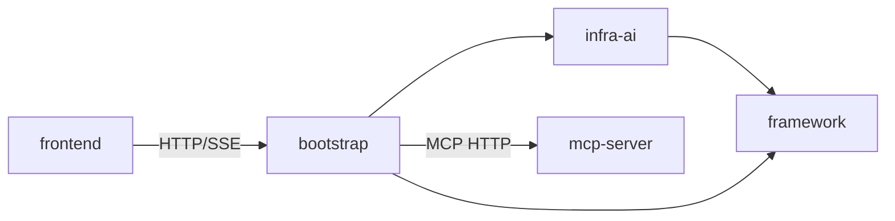

# 目录结构与模块职责

## 模块总表

| 模块 | 主要职责 | 推荐先读文件 | 关键类 | 初学者注意点 |
|---|---|---|---|---|
| `bootstrap` | Web 入口与 RAG/入库业务 | `RagentApplication.java`、`application.yaml` | `StreamChatPipeline`、`IngestionEngine` | 代码最多，按业务包读 |
| `framework` | 通用异常、响应、上下文、幂等、SSE、MQ | `Result.java`、`SseEmitterSender.java` | `IdempotentSubmitAspect` | 不包含具体 RAG 业务 |
| `infra-ai` | 屏蔽模型供应商差异 | `RoutingLLMService.java` | `ModelRoutingExecutor` | “接口 + 多客户端 + 路由” |
| `mcp-server` | 独立 MCP 工具服务 | `McpServerApplication.java` | `WeatherMcpExecutor` | 不是 bootstrap 的子进程 |
| `frontend` | React 用户端与管理端 | `router.tsx`、`services/api.ts` | `ChatPage`、`useStreamResponse` | 页面通过 services 调接口 |
| `resources` | SQL、Docker、样例知识文档 | `database/schema_pg.sql` | 无 | 不要把资源目录误当 Java resources |
| `docs` | 架构和样例说明 | `ragent-architecture.md` | 无 | 文档可能滞后于代码 |

## Maven 依赖关系

根 `pom.xml` 聚合四个模块。`bootstrap/pom.xml` 依赖 `framework` 和 `infra-ai`；`infra-ai/pom.xml` 依赖 `framework`；`mcp-server` 独立运行。前端通过 HTTP 调后端，不是 Maven 依赖。

## bootstrap 内部阅读地图

- `rag/controller`：问答、会话、设置、Trace 接口。
- `rag/service/pipeline`：一次问答的业务编排。
- `rag/core`：意图、改写、检索、Prompt、记忆、MCP。
- `knowledge`：知识库、文档、分块管理。
- `ingestion`：可配置文档入库 Pipeline。
- `user`：登录、用户和上下文。
- `admin`：仪表盘统计。

## 配置和资源

真正的 Spring Boot 配置是 `bootstrap/src/main/resources/application.yaml`。数据库脚本在根 `resources/database`；Docker 文件在根 `resources/docker`；示例知识文档在 `resources/docs/knowledge`。

仓库没有根级 `application.yml`，也没有 Gradle 配置。任务中提及但不存在的独立后端 `resources/` 模块应以当前结构为准。

## 为什么这样分层

业务层只依赖 `LLMService`、`EmbeddingService` 等能力接口，不直接绑定某个供应商。这样换模型主要改 `infra-ai` 和配置；通用的幂等、上下文、异常处理集中在 `framework`，避免每个业务重复实现。

## 本章复习问题

1. `bootstrap` 与 `infra-ai` 的边界是什么？
2. 为什么 `mcp-server` 不应该画成 bootstrap 的 Maven 子依赖？
3. 根 `resources` 与 `bootstrap/src/main/resources` 有何区别？

## 下一步建议

在 IDE 中按依赖方向阅读：先 `framework` 的接口模型，再 `infra-ai`，最后进入 `bootstrap` 的业务编排。
