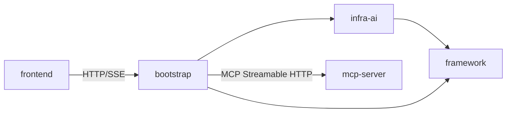

# 目录结构与模块职责

> 本章目标：让初学者理解 Ragent 的后端为什么分成这些模块，每个模块里有什么，以及“我想找某个功能时应该去哪个目录”。

---

## 根目录树

```text
ragent/
├── assets/                  # 项目 README/文档用的图片、徽章等静态资源
├── bootstrap/               # 主 Spring Boot 应用（业务入口）
├── docs/                    # 仓库级文档（架构说明、示例、PDF Pipeline 等）
├── frontend/                # React 前端项目
├── framework/               # 通用基础设施库
├── infra-ai/                # AI 能力抽象层（模型路由、Embedding、Rerank）
├── mcp-server/              # 独立 MCP 工具服务
├── resources/               # SQL、Docker Compose、示例文档、Prompt 模板
├── scripts/                 # 辅助脚本
├── pom.xml                  # 根父 POM，聚合 4 个 Maven 模块
├── mvnw / mvnw.cmd          # Maven Wrapper
└── README.md
```

### 逐项解释

| 目录/文件 | 职责 | 学习时重点看 |
|---|---|---|
| `assets/` | 项目文档图片、Star 历史图、架构图 | 不看代码，只看文档配图 |
| `bootstrap/` | 可部署的业务服务，包含 Controller、Service、RAG/入库/知识库/用户等所有业务 | 这是你最常读的模块 |
| `docs/` | 架构设计、示例说明 | 可能滞后于代码，以源码为准 |
| `frontend/` | React + Vite 前端 | 页面、路由、services、stores |
| `framework/` | 通用能力：统一响应、异常、上下文、幂等、MQ、Trace 上下文 | 先读 `Result`、`GlobalExceptionHandler`、`UserContext` |
| `infra-ai/` | 屏蔽模型供应商差异 | 先读 `LLMService`、`RoutingLLMService`、`ModelHealthStore` |
| `mcp-server/` | 独立工具服务 | 读 `McpServerApplication` 和三个 Executor |
| `resources/` | `schema_pg.sql`、`init_data_pg.sql`、Docker Compose、Prompt 模板 | 启动前必读 |
| `scripts/` | 辅助脚本，如 `sse_queue_test.sh` | 按需使用 |
| `pom.xml` | 父 POM，定义版本、模块聚合 | 看 `modules` 和 `dependencyManagement` |

---

## Maven 聚合关系

### 根 pom 是父工程

`pom.xml` 的 `<packaging>pom</packaging>` 说明它是一个聚合/父工程，不直接产生 jar。它通过 `<modules>` 管理四个子模块：

```xml
<modules>
    <module>bootstrap</module>
    <module>framework</module>
    <module>infra-ai</module>
    <module>mcp-server</module>
</modules>
```

根 POM 还定义了所有依赖的版本（`dependencyManagement`），比如：

- Spring Boot 3.5.7
- MyBatis-Plus 3.5.14
- Sa-Token 1.43.0
- Redisson 4.0.0
- RocketMQ Spring Boot Starter 2.3.5
- MCP SDK 1.1.2

### bootstrap 依赖谁

`bootstrap/pom.xml`：

```xml
<dependency>
    <groupId>com.nageoffer.ai</groupId>
    <artifactId>framework</artifactId>
</dependency>
<dependency>
    <groupId>com.nageoffer.ai</groupId>
    <artifactId>infra-ai</artifactId>
</dependency>
```

所以 `bootstrap` 依赖 `framework` 和 `infra-ai`。

### infra-ai 依赖谁

`infra-ai/pom.xml`：

```xml
<dependency>
    <groupId>com.nageoffer.ai</groupId>
    <artifactId>framework</artifactId>
</dependency>
```

所以 `infra-ai` 依赖 `framework`。

### mcp-server 是否独立运行

**是独立的**。

`mcp-server/pom.xml` 没有依赖 `framework` 或 `infra-ai`，它只依赖：

- `spring-boot-starter-web`
- MCP SDK

它有自己独立的启动类 `McpServerApplication`，运行在自己独立的 Spring Boot 容器中，默认端口 9099。

### frontend 为什么不是 Maven 模块

`frontend` 是 React 项目，构建工具是 Vite，依赖管理用 npm，不是 Java 项目。它通过 HTTP/SSE 与 `bootstrap` 通信，不是 Maven 编译依赖，因此不需要也不应该加入根 POM 的 `<modules>`。

---

## 模块依赖图



---

## 每个 Java 模块详解

### framework 模块

**模块定位**：

与具体 RAG/入库业务无关，但所有 Web 服务都需要的基础设施。`bootstrap` 和 `infra-ai` 都依赖它。

**主要包结构**：

```text
framework/src/main/java/com/nageoffer/ai/ragent/framework/
├── cache/              # Redis Key 序列化
├── config/             # DataBaseConfiguration、RocketMQAutoConfiguration、WebAutoConfiguration
├── context/            # UserContext、LoginUser、ApplicationContextHolder
├── convention/         # Result、ChatRequest、ChatMessage、RetrievedChunk
├── database/           # MyMetaObjectHandler（自动填充 createTime/updateTime）
├── distributedid/      # Snowflake ID 生成器
├── errorcode/          # 错误码枚举
├── exception/          # AbstractException、ClientException、ServiceException、RemoteException
├── idempotent/         # @IdempotentSubmit / @IdempotentConsume + AOP
├── mq/                 # MessageWrapper、RocketMQProducerAdapter
├── trace/              # RagTraceContext、RagTraceNode、RagStreamTraceSupport
└── web/                # Results、GlobalExceptionHandler、SseEmitterSender
```

**关键类**：

| 类 | 作用 |
|---|---|
| `Result<T>` | 统一 API 响应包装 |
| `Results` | 构造 Result 的工具类 |
| `GlobalExceptionHandler` | `@RestControllerAdvice` 全局异常处理 |
| `UserContext` | 当前请求线程的用户上下文 |
| `LoginUser` | 用户上下文中的用户对象 |
| `@IdempotentSubmit` / `IdempotentSubmitAspect` | 提交幂等注解和切面 |
| `RagTraceContext` | Trace 上下文，基于 TTL |
| `RagTraceNode` | Trace 节点注解 |
| `RocketMQProducerAdapter` | MQ 生产者适配器 |
| `SseEmitterSender` | SSE 发送工具 |

**推荐阅读顺序**：

1. `Result.java`
2. `Results.java`
3. `GlobalExceptionHandler.java`
4. `UserContext.java`
5. `LoginUser.java`
6. `IdempotentSubmitAspect.java`
7. `RagTraceContext.java`
8. `RocketMQProducerAdapter.java`

**新手容易误解的点**：

- `framework` 里不包含具体登录逻辑，登录在 `bootstrap/user`。
- `RocketMQAutoConfiguration` 名字带 Auto，但实际上是 `@Configuration`，通过包扫描注册。
- `UserContext` 不是 Sa-Token 替代品，它保存的是业务用户快照。

---

### infra-ai 模块

**模块定位**：

屏蔽模型供应商差异，让业务代码只依赖 `LLMService`、`EmbeddingService`、`RerankService` 三个能力接口。

**主要包结构**：

```text
infra-ai/src/main/java/com/nageoffer/ai/ragent/infra/
├── chat/               # LLM 接口、路由、Client、首包探测
├── config/             # AIModelProperties
├── embedding/          # Embedding 接口、路由、Client
├── enums/              # ModelCapability、ModelProvider
├── http/               # HTTP 请求辅助、URL 解析
├── model/              # ModelSelector、ModelHealthStore、ModelRoutingExecutor
├── rerank/             # Rerank 接口、路由、Client
├── token/              # Token 计数（启发式）
└── util/               # LLM 响应清理
```

**关键类**：

| 类 | 作用 |
|---|---|
| `LLMService` | 大模型能力接口 |
| `EmbeddingService` | Embedding 能力接口 |
| `RerankService` | Rerank 能力接口 |
| `RoutingLLMService` | LLM 路由实现，业务注入的实际 Bean |
| `RoutingEmbeddingService` | Embedding 路由实现 |
| `RoutingRerankService` | Rerank 路由实现 |
| `ModelSelector` | 候选模型选择 |
| `ModelHealthStore` | 三态熔断健康状态 |
| `ModelRoutingExecutor` | 失败降级执行器 |
| `ProbeStreamBridge` | 流式首包探测 |
| `LlmFirstPacketProbe` | 首包探测工具 |
| `AIModelProperties` | `ai.*` 配置绑定类 |

**推荐阅读顺序**：

1. `LLMService.java`
2. `RoutingLLMService.java`
3. `ModelSelector.java`
4. `ModelHealthStore.java`
5. `ModelRoutingExecutor.java`
6. `ProbeStreamBridge.java`
7. `EmbeddingService.java` / `RoutingEmbeddingService.java`
8. `RerankService.java` / `RoutingRerankService.java`

**新手容易误解的点**：

- 业务代码注入 `LLMService`，实际拿到的是 `RoutingLLMService`（因为有 `@Primary` 和 `@Service`）。
- 流式调用不走 `ModelRoutingExecutor`，而是 `RoutingLLMService` 自己实现降级循环。
- `NoopRerankClient` 是 Rerank 兜底，直接返回前 Top-K，不做排序。

---

### bootstrap 模块

**模块定位**：

Web 入口与业务编排中心。包含 RAG 问答、文档入库、知识库管理、用户认证、Trace、管理后台接口等所有业务。

**主要包结构**：

```text
bootstrap/src/main/java/com/nageoffer/ai/ragent/
├── RagentApplication.java
├── admin/              # 仪表盘统计
├── core/               # 文档解析、切块（非 Pipeline 的通用能力）
├── ingestion/          # 通用 Ingestion Pipeline
├── knowledge/          # 知识库、文档、Chunk、分块 MQ Consumer
├── rag/                # RAG 问答主流程
│   ├── aop/            # RagTraceAspect
│   ├── config/         # 各类配置类
│   ├── controller/     # REST 接口
│   ├── core/           # 记忆、改写、意图、检索、Prompt、MCP、向量
│   ├── dao/            # DO / Mapper
│   ├── dto/            # 内部 DTO
│   ├── enums/          # 枚举
│   ├── eval/           # 评估
│   ├── mq/             # MQ Consumer
│   ├── service/        # Service / Pipeline / 限流 / Handler
│   └── trace/          # StreamChatTraceRunner、RagStreamTraceSupportImpl
└── user/               # 登录、用户、上下文拦截器
```

**关键类**：

| 类 | 作用 |
|---|---|
| `RagentApplication` | Spring Boot 启动类 |
| `RAGChatController` | 聊天接口 |
| `RAGChatServiceImpl` | 聊天 Service |
| `StreamChatPipeline` | RAG 主编排 Pipeline |
| `StreamChatContext` | RAG 上下文 |
| `RetrievalEngine` | 检索引擎 |
| `MultiChannelRetrievalEngine` | 多路召回 |
| `RAGPromptService` | Prompt 组装 |
| `IngestionEngine` | 入库 Pipeline 引擎 |
| `IngestionTaskServiceImpl` | 入库任务 Service |
| `KnowledgeDocumentController` | 知识库文档接口 |
| `KnowledgeDocumentChunkConsumer` | 文档分块 MQ Consumer |
| `AuthController` / `AuthServiceImpl` | 登录 |
| `UserContextInterceptor` | 用户上下文拦截器 |
| `SaTokenConfig` | Sa-Token 和拦截器注册 |
| `RagTraceAspect` | Trace 采集切面 |

**推荐阅读顺序**：

1. `RagentApplication.java`
2. `user/controller/AuthController.java`
3. `user/config/SaTokenConfig.java`
4. `rag/controller/RAGChatController.java`
5. `rag/service/impl/RAGChatServiceImpl.java`
6. `rag/service/pipeline/StreamChatPipeline.java`
7. `rag/core/retrieve/RetrievalEngine.java`
8. `ingestion/engine/IngestionEngine.java`
9. `knowledge/controller/KnowledgeDocumentController.java`

**新手容易误解的点**：

- `core/` 包是通用文档解析/切块，不是 RAG 核心。
- `rag/core/` 才是 RAG 核心（记忆、改写、意图、检索等）。
- `knowledge` 和 `ingestion` 是两个不同的入库链路。
- `StreamChatPipeline` 不是唯一入口，真正的 Web 入口是 `RAGChatController`。

---

### mcp-server 模块

**模块定位**：

独立的 MCP 工具服务，暴露天气、工单、销售三个工具。`bootstrap` 通过 HTTP 调用它。

**主要包结构**：

```text
mcp-server/src/main/java/com/nageoffer/ai/ragent/mcp/
├── McpServerApplication.java
├── config/             # McpServerConfig
└── executor/           # WeatherMcpExecutor、TicketMcpExecutor、SalesMcpExecutor
```

**关键类**：

| 类 | 作用 |
|---|---|
| `McpServerApplication` | 启动类 |
| `McpServerConfig` | MCP Server 配置 |
| `WeatherMcpExecutor` | 天气查询工具 |
| `TicketMcpExecutor` | 工单查询工具 |
| `SalesMcpExecutor` | 销售数据查询工具 |

**推荐阅读顺序**：

1. `McpServerApplication.java`
2. `McpServerConfig.java`
3. `WeatherMcpExecutor.java`
4. `TicketMcpExecutor.java`

**新手容易误解的点**：

- mcp-server 不是 bootstrap 的子模块，要单独启动。
- mcp-server 默认端口 9099，不是 9090。
- 工具返回的是模拟数据，不是真实天气/工单系统。

---

## 按功能找代码速查表

| 想找什么 | 去哪里找 |
|---|---|
| **登录** | `bootstrap/user/controller/AuthController.java` |
| **聊天（RAG）** | `bootstrap/rag/controller/RAGChatController.java` |
| **聊天编排** | `bootstrap/rag/service/pipeline/StreamChatPipeline.java` |
| **文档上传（知识库）** | `bootstrap/knowledge/controller/KnowledgeDocumentController.java` |
| **文档上传（通用 Ingestion）** | `bootstrap/ingestion/controller/IngestionTaskController.java` |
| **入库 Pipeline** | `bootstrap/ingestion/engine/IngestionEngine.java` |
| **检索** | `bootstrap/rag/core/retrieve/RetrievalEngine.java` |
| **多路召回** | `bootstrap/rag/core/retrieve/MultiChannelRetrievalEngine.java` |
| **Prompt 组装** | `bootstrap/rag/core/prompt/RAGPromptService.java` |
| **模型路由** | `infra-ai/chat/RoutingLLMService.java`、`infra-ai/model/ModelRoutingExecutor.java` |
| **模型健康/熔断** | `infra-ai/model/ModelHealthStore.java` |
| **Embedding 路由** | `infra-ai/embedding/RoutingEmbeddingService.java` |
| **Rerank 路由** | `infra-ai/rerank/RoutingRerankService.java` |
| **MCP 客户端注册** | `bootstrap/rag/core/mcp/McpClientAutoConfiguration.java` |
| **MCP 工具执行** | `bootstrap/rag/core/mcp/McpClientToolExecutor.java` |
| **MCP 服务端工具** | `mcp-server/executor/WeatherMcpExecutor.java` |
| **Trace 记录** | `bootstrap/rag/trace/StreamChatTraceRunner.java`、`bootstrap/rag/aop/RagTraceAspect.java` |
| **用户上下文** | `framework/context/UserContext.java`、`bootstrap/user/config/UserContextInterceptor.java` |
| **统一响应/异常** | `framework/convention/Result.java`、`framework/web/GlobalExceptionHandler.java` |
| **幂等** | `framework/idempotent/IdempotentSubmitAspect.java` |
| **数据库实体** | `bootstrap/**/dao/entity/*.java` |
| **Mapper** | `bootstrap/**/dao/mapper/*.java` |
| **前端页面** | `frontend/src/pages/**/*.tsx` |
| **前端路由** | `frontend/src/router.tsx` |
| **前端服务** | `frontend/src/services/*.ts` |
| **前端 SSE** | `frontend/src/hooks/useStreamResponse.ts` |

---

## 本章复习问题

1. Ragent 后端为什么分成 framework、infra-ai、bootstrap 三个模块？
2. mcp-server 为什么不依赖 framework？
3. frontend 为什么不是 Maven 模块？
4. 根 POM 的 `dependencyManagement` 有什么用？
5. 想找登录代码应该打开哪个文件？
6. 想找模型路由代码应该打开哪个文件？

## 参考答案

1. `framework` 放通用基础设施，`infra-ai` 屏蔽模型供应商，`bootstrap` 编排业务。换模型不改业务，通用能力不重复实现。
2. mcp-server 是独立工具服务，只暴露工具，不需要 framework 的 Web/上下文/幂等等能力。
3. frontend 是 React + npm 项目，不是 Java 项目，通过 HTTP/SSE 调后端。
4. 统一管理所有依赖版本，子模块引用时不需要写版本号。
5. `bootstrap/user/controller/AuthController.java`。
6. `infra-ai/chat/RoutingLLMService.java`。

---

## 下一步建议

阅读 `04-后端启动流程源码解析.md`，理解 Spring Boot 启动后如何从 `RagentApplication.main()` 开始扫描和装配这些模块中的 Bean。
