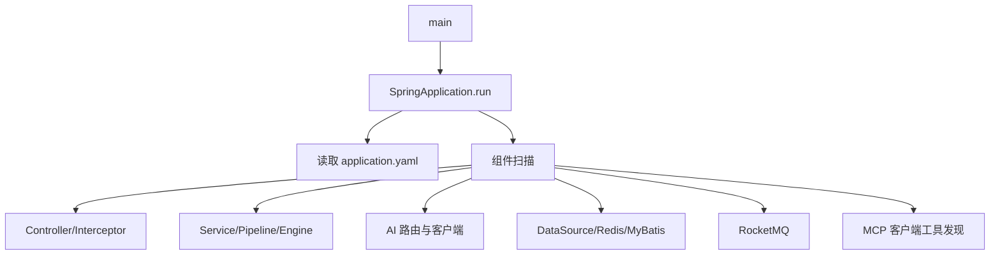

# 后端启动流程源码解析

## 启动入口

主服务入口是 `bootstrap/src/main/java/com/nageoffer/ai/ragent/RagentApplication.java` 的 `main()`。独立 MCP 服务入口是 `mcp-server/src/main/java/com/nageoffer/ai/ragent/mcp/McpServerApplication.java`。

Spring Boot 从 `RagentApplication` 所在的 `com.nageoffer.ai.ragent` 包向下扫描，因此 Controller、Service、Component、Configuration 和 Mapper 相关 Bean 会被发现。配置主文件为 `bootstrap/src/main/resources/application.yaml`。

## 启动时装配什么

主要配置来源：数据库和 Redis 在 `spring.*`；MQ 在 `rocketmq.*`；向量库在 `rag.vector` 与 `milvus`；对象存储在 `rustfs`；模型在 `ai.*`；MCP 地址在 `rag.mcp.servers`。

## Bean 类型

- Web：`RAGChatController`、`KnowledgeDocumentController`、`IngestionTaskController`。
- 业务编排：`StreamChatPipeline`、`IngestionEngine`。
- AI：`RoutingLLMService`、`RoutingEmbeddingService`、`RoutingRerankService`。
- RAG：`RetrievalEngine`、`IntentResolver`、`RAGPromptService`。
- 基础设施：MyBatis Mapper、Redis/Redisson、RocketMQ Adapter、S3 Client。
- 横切能力：用户上下文拦截器、幂等 AOP、Trace AOP、统一异常处理。

## Debug 断点

| 断点位置 | 文件路径 | 方法名 | 观察什么 |
|---|---|---|---|
| 应用入口 | `bootstrap/.../RagentApplication.java` | `main()` | 启动参数与 Profile |
| 登录 | `user/controller/AuthController.java` | `login()` | 请求、用户和 Token |
| 问答入口 | `rag/controller/RAGChatController.java` | `chat()` | question、conversationId |
| 问答编排 | `rag/service/pipeline/StreamChatPipeline.java` | `execute()` | 每阶段 Context 变化 |
| 入库入口 | `ingestion/controller/IngestionTaskController.java` | `upload()` | 文件与 pipelineId |
| 入库引擎 | `ingestion/engine/IngestionEngine.java` | `execute()` | 节点顺序和失败状态 |
| 模型路由 | `infra-ai/.../ModelRoutingExecutor.java` | `executeWithFallback()` | 候选、失败和降级 |
| MCP 注册 | `rag/core/mcp/McpClientAutoConfiguration.java` | `registerRemoteTools()` | 服务地址和 tools/list |

## 初学者观察方法

不要在启动阶段给所有 Bean 打断点。先看日志确认容器成功，再通过一次具体请求进入断点。若应用启动失败，优先找最底部的 `Caused by`，它通常指向数据库、Redis、MQ、对象存储或配置绑定错误。

## 本章复习问题

1. Spring Boot 为什么能找到 Controller？
2. `application.yaml` 中哪几组配置分别控制数据、AI 和 MCP？
3. 为什么业务 Debug 应从 Controller 开始？

## 下一步建议

启动后先调 `/user/me` 或登录接口验证 Web 与数据库，再调复杂的 RAG 接口。
