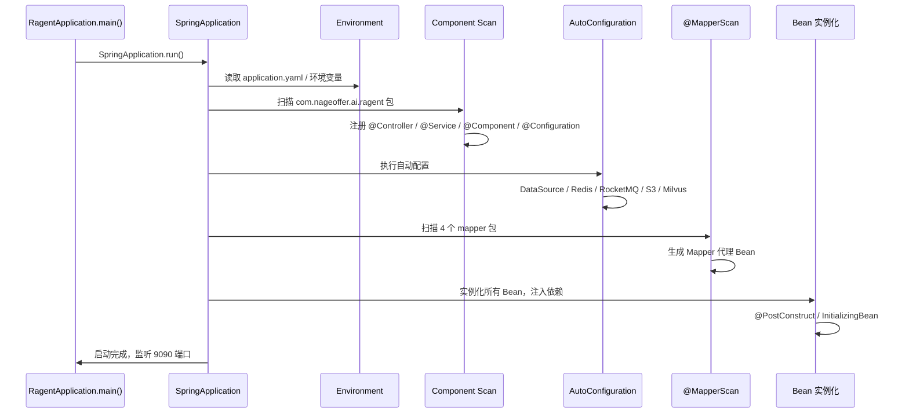
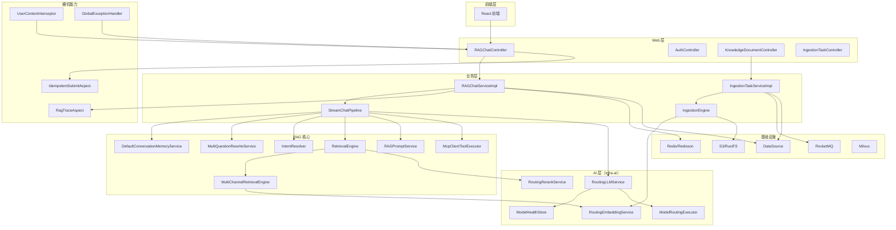

# 后端启动流程源码解析

> 本章目标：让初学者理解 Spring Boot 启动后到底装配了哪些东西，以及从哪里开始 Debug 后端代码。

---

## 启动入口：RagentApplication.main()

文件：`bootstrap/src/main/java/com/nageoffer/ai/ragent/RagentApplication.java`

```java
@SpringBootApplication
@EnableScheduling
@MapperScan(basePackages = {
        "com.nageoffer.ai.ragent.rag.dao.mapper",
        "com.nageoffer.ai.ragent.ingestion.dao.mapper",
        "com.nageoffer.ai.ragent.knowledge.dao.mapper",
        "com.nageoffer.ai.ragent.user.dao.mapper"
})
public class RagentApplication {
    public static void main(String[] args) {
        SpringApplication.run(RagentApplication.class, args);
    }
}
```

这 14 行代码是后端启动的核心。下面逐步解释每个注解和调用的作用。

---

## @SpringBootApplication 做了什么

`@SpringBootApplication` 是三个注解的合体：

```java
@Configuration
@EnableAutoConfiguration
@ComponentScan
```

### @Configuration

表示这个类是一个配置类，可以向 Spring 容器注册 Bean。

### @EnableAutoConfiguration

让 Spring Boot 根据 classpath 中的依赖自动装配一些默认 Bean。例如：

- 看到 `spring-boot-starter-web` → 自动装配 Tomcat、Spring MVC。
- 看到 `mybatis-plus-spring-boot3-starter` → 自动装配 MyBatis-Plus。
- 看到 `redisson-spring-boot-starter` → 自动装配 Redisson。
- 看到 `spring-boot-starter-data-redis` → 自动装配 RedisTemplate。

### @ComponentScan

默认扫描 `RagentApplication` 所在包及其子包。因为 `RagentApplication` 在 `com.nageoffer.ai.ragent`，所以 Spring 会扫描：

- `com.nageoffer.ai.ragent.*`（bootstrap 模块）
- `com.nageoffer.ai.ragent.framework.*`（framework 模块，因为 bootstrap 依赖它）
- `com.nageoffer.ai.ragent.infra.*`（infra-ai 模块，因为 bootstrap 依赖它）

**注意**：`mcp-server` 模块的包是 `com.nageoffer.ai.ragent.mcp`，它不会被 bootstrap 的启动类扫描，因为 mcp-server 是独立运行的 Spring Boot 应用。

---

## @EnableScheduling

文件同一行上面的注解：

```java
@EnableScheduling
```

**作用**：开启 Spring 定时任务。Ragent 中用到的定时任务包括：

- 知识库 URL 文档定时刷新：`knowledge/schedule/KnowledgeDocumentScheduleJob.java`
- 会话摘要/清理等后台任务。

如果没有这个注解，所有 `@Scheduled` 标注的方法都不会执行。

---

## @MapperScan 做了什么

```java
@MapperScan(basePackages = {
        "com.nageoffer.ai.ragent.rag.dao.mapper",
        "com.nageoffer.ai.ragent.ingestion.dao.mapper",
        "com.nageoffer.ai.ragent.knowledge.dao.mapper",
        "com.nageoffer.ai.ragent.user.dao.mapper"
})
```

**作用**：让 MyBatis-Plus 自动扫描这四个包下的 Mapper 接口，生成代理实现并注册为 Spring Bean。

如果不加 `@MapperScan`，就需要在每个 Mapper 接口上加 `@Mapper`。

Ragent 中的 Mapper 分布在：

| 包 | Mapper 数量 | 业务域 |
|---|---|---|
| `rag.dao.mapper` | 9 | 会话、消息、Trace、意图树、示例问题等 |
| `ingestion.dao.mapper` | 4 | Pipeline、任务、节点日志 |
| `knowledge.dao.mapper` | 6 | 知识库、文档、Chunk |
| `user.dao.mapper` | 1 | 用户 |

---

## Spring Boot 如何扫描 Controller、Service、Component、Configuration

### 扫描规则

Spring Boot 启动后，`@ComponentScan` 会递归扫描启动类所在包下的所有类，根据注解类型注册 Bean：

| 注解 | 注册为什么 Bean | 例子 |
|---|---|---|
| `@Controller` / `@RestController` | Web 控制器 | `RAGChatController` |
| `@Service` | 业务服务 | `RAGChatServiceImpl` |
| `@Component` | 通用组件 | `UserContextInterceptor` |
| `@Configuration` | 配置类 | `SaTokenConfig` |
| `@Aspect` | AOP 切面 | `RagTraceAspect` |
| `@Repository` | 数据访问 | 项目里主要用 Mapper 接口 |

### 扫描范围验证

你可以在启动日志中看到扫描到的 Bean 数量：

```text
o.s.b.w.e.tomcat.TomcatWebServer  : Tomcat started on port 9090 (http) with context path '/api/ragent'
```

如果想看具体注册了哪些 Bean，可以在启动类加一个测试 Bean：

```java
@Bean
public CommandLineRunner printBeans(ApplicationContext ctx) {
    return args -> {
        String[] names = ctx.getBeanDefinitionNames();
        Arrays.sort(names);
        for (String name : names) {
            if (name.toLowerCase().contains("chat") || name.toLowerCase().contains("retrieval")) {
                System.out.println(name + " -> " + ctx.getBean(name).getClass().getName());
            }
        }
    };
}
```

**注意**：这只是学习时用来理解扫描范围，不要提交到仓库。

---

## application.yaml 如何绑定到 Properties 类

Ragent 中有大量 `@ConfigurationProperties` 类，它们把 YAML 配置绑定成 Java 对象。

### 绑定示例

YAML 配置：

```yaml
rag:
  trace:
    enabled: true
    max-error-length: 1000
```

Properties 类：

```java
@Data
@ConfigurationProperties(prefix = "rag.trace")
public class RagTraceProperties {
    private boolean enabled = true;
    private int maxErrorLength = 1000;
}
```

### 如何生效

Properties 类本身不会自动被扫描，需要被某个 `@Configuration` 类用 `@EnableConfigurationProperties` 引入，或者类上同时加 `@Component`。

Ragent 中的做法：这些 Properties 类通常被对应的 `@Configuration` 类通过构造器注入，例如：

```java
@Configuration
@RequiredArgsConstructor
public class SomeConfig {
    private final RagTraceProperties traceProperties;
}
```

### 关键 Properties 类清单

| 类 | 前缀 | 作用 |
|---|---|---|
| `RagTraceProperties` | `rag.trace` | Trace 开关和错误长度 |
| `MemoryProperties` | `rag.memory` | 会话记忆轮次和摘要 |
| `SearchChannelProperties` | `rag.search.channels` | 检索通道配置 |
| `RAGDefaultProperties` | `rag.default` | 默认向量维度、SSE 超时 |
| `McpClientProperties` | `rag.mcp` | MCP 服务地址 |
| `AIModelProperties` | `ai` | 模型供应商和候选配置 |
| `RAGRateLimitProperties` | `rag.rate-limit` | 限流配置 |

---

## 启动过程中装配的关键 Bean

### Controller 层

启动后，以下 Controller 会被注册：

- `RAGChatController`：`/rag/v3/chat`
- `ConversationController`：会话 CRUD
- `AuthController`：`/auth/login`、`/auth/logout`
- `UserController`：用户管理
- `KnowledgeBaseController`、`KnowledgeDocumentController`、`KnowledgeChunkController`
- `IngestionTaskController`、`IngestionPipelineController`
- `RagTraceController`、`SampleQuestionController`、`IntentTreeController` 等

### Service 层

业务 Service 会被注册，例如：

- `RAGChatServiceImpl`（`RAGChatService` 接口的实现）
- `ConversationServiceImpl`
- `IngestionTaskServiceImpl`
- `KnowledgeDocumentServiceImpl`
- `KnowledgeBaseServiceImpl`

### Pipeline / Engine

- `StreamChatPipeline`：RAG 问答主编排
- `IngestionEngine`：入库 Pipeline 引擎

### AI 路由层

- `RoutingLLMService`：`LLMService` 的 `@Primary` 实现
- `RoutingEmbeddingService`：`EmbeddingService` 的实现
- `RoutingRerankService`：`RerankService` 的实现
- `ModelSelector`、`ModelHealthStore`、`ModelRoutingExecutor`
- 各供应商 Client：`BaiLianChatClient`、`SiliconFlowEmbeddingClient` 等

### RAG 核心组件

- `RetrievalEngine`：检索引擎
- `MultiChannelRetrievalEngine`：多路召回
- `RAGPromptService`：Prompt 组装
- `DefaultConversationMemoryService`：会话记忆
- `MultiQuestionRewriteService`：问题改写
- `IntentResolver`：意图识别
- `McpClientAutoConfiguration`：MCP 客户端注册
- `DefaultMcpToolRegistry`：MCP 工具注册表

### 基础设施

- `DataSource` / `HikariDataSource`：数据库连接池
- `MybatisPlusInterceptor`：MyBatis-Plus 分页插件
- `RedisTemplate` / `StringRedisTemplate`：Redis 操作
- `RedissonClient`：分布式锁和限流
- `RocketMQProducerAdapter`：MQ 生产者
- `S3Client`：对象存储客户端（如果配置了 RustFS/S3）
- `MilvusClient`：Milvus 客户端（如果启用）

### 横切能力

- `GlobalExceptionHandler`：全局异常处理
- `RagTraceAspect`：Trace 采集切面
- `IdempotentSubmitAspect` / `IdempotentConsumeAspect`：幂等切面
- `UserContextInterceptor`：用户上下文拦截器
- `SaInterceptor`：Sa-Token 登录拦截器

### MyBatis Mapper

`@MapperScan` 扫描的 20 个 Mapper 接口会被注册为 Bean：

- `UserMapper`
- `ConversationMapper`、`ConversationMessageMapper`、`ConversationSummaryMapper`
- `KnowledgeBaseMapper`、`KnowledgeDocumentMapper`、`KnowledgeChunkMapper`
- `IngestionTaskMapper`、`IngestionTaskNodeMapper`、`IngestionPipelineMapper`
- `RagTraceRunMapper`、`RagTraceNodeMapper`
- 其他系统 Mapper

---

## 启动流程时序图



---

## Bean 关系图



---

## 启动失败排查顺序

### 第一步：看最底层 Caused by

Spring Boot 启动失败时，日志通常很长。不要只看第一行，要拉到最下面看 `Caused by:`。

常见根因：

- `Connection refused`：数据库/Redis/RocketMQ 没启动。
- `FATAL: password authentication failed`：PostgreSQL 密码错。
- `Unknown database 'ragent'`：数据库没创建。
- `Port 9090 was already in use`：端口被占用。

### 第二步：看端口

```bash
lsof -i :9090
lsof -i :9099
lsof -i :5173
```

如果端口被占用，关闭占用服务或改配置。

### 第三步：看数据库

1. PostgreSQL 是否启动：

```bash
psql -h 127.0.0.1 -U postgres -c "SELECT 1;"
```

2. 数据库 `ragent` 是否创建。
3. `schema_pg.sql` 是否执行。
4. `application.yaml` 中 `spring.datasource` 配置是否正确。

### 第四步：看 Redis

```bash
redis-cli ping
```

如果返回 `PONG` 说明正常。再看 `spring.data.redis.password` 是否配置正确。

### 第五步：看配置绑定

如果启动时报 `Configuration property 'xxx.yyy' could not be bound`，说明 YAML 和 Properties 类类型不匹配。检查：

- 字段名是否和 YAML 键一致（驼峰 vs 短横线）。
- 类型是否匹配（如 YAML 是字符串，Properties 是 List）。

### 第六步：看 API Key

如果启动后问答失败，检查：

- `ai.providers.bailian.api-key` 等是否配置。
- 环境变量是否生效（如 `${BAILIAN_API_KEY:}`）。
- 模型候选是否可用（网络、账号、模型名）。

---

## Debug 断点路线

### 1. 启动入口

- **文件**：`bootstrap/src/main/java/com/nageoffer/ai/ragent/RagentApplication.java`
- **方法**：`main()`
- **看什么**：启动参数、SpringApplication 创建过程。

### 2. 登录接口

- **文件**：`bootstrap/user/controller/AuthController.java`
- **方法**：`login()`
- **看什么**：请求参数、Sa-Token 登录、Token 生成。

### 3. RAG 聊天入口

- **文件**：`bootstrap/rag/controller/RAGChatController.java`
- **方法**：`chat()`
- **看什么**：`question`、`conversationId`、`SseEmitter` 创建。

### 4. 入库入口

- **文件**：`bootstrap/ingestion/controller/IngestionTaskController.java`
- **方法**：`upload()`
- **看什么**：`pipelineId`、文件内容。

### 5. 模型路由

- **文件**：`infra-ai/chat/RoutingLLMService.java`
- **方法**：`streamChat()`
- **看什么**：候选列表、首包探测、失败切换。

### 6. MCP 注册

- **文件**：`bootstrap/rag/core/mcp/McpClientAutoConfiguration.java`
- **方法**：`registerRemoteTools()`
- **看什么**：MCP Server 地址、tools/list 返回、工具注册到 `DefaultMcpToolRegistry`。

---

## 启动后如何验证

### 验证 Web 层

```bash
curl http://localhost:9090/api/ragent/user/me \
  -H "Authorization: 你的token"
```

### 验证数据库

```sql
SELECT count(*) FROM t_user;
```

### 验证 Redis

```bash
redis-cli keys '*'
```

### 验证模型

```bash
curl -N "http://localhost:9090/api/ragent/rag/v3/chat?question=你好" \
  -H "Authorization: 你的token"
```

---

## 本章复习问题

1. `@SpringBootApplication` 包含哪三个注解？
2. `@MapperScan` 扫描了哪几个包？
3. mcp-server 为什么不会被 bootstrap 的启动类扫描？
4. `application.yaml` 如何绑定到 `RagTraceProperties`？
5. 启动失败后应该先看日志的哪一部分？
6. 想跟踪一次 RAG 请求应该在哪里打断点？

## 参考答案

1. `@Configuration`、`@EnableAutoConfiguration`、`@ComponentScan`。
2. `rag.dao.mapper`、`ingestion.dao.mapper`、`knowledge.dao.mapper`、`user.dao.mapper`。
3. 因为 mcp-server 是独立 Spring Boot 应用，包虽然也是 `com.nageoffer.ai.ragent.mcp`，但它需要单独启动，不被 bootstrap 扫描。
4. 通过 `@ConfigurationProperties(prefix = "rag.trace")` 注解，字段名和 YAML 键按驼峰/短横线对应绑定。
5. 先看最底层 `Caused by:`，它通常指出真正失败的原因（数据库、Redis、端口等）。
6. 在 `RAGChatController.chat()`、`RAGChatServiceImpl.streamChat()`、`StreamChatPipeline.execute()` 打断点。

---

## 下一步建议

阅读 `05-数据库与核心表结构.md`，把启动时装配的 Mapper 和数据库表对应起来。同时可以在 IDEA 中运行 `RagentApplication`，在启动日志中确认 DataSource、Redis、RocketMQ、MyBatis-Plus 等组件是否成功初始化。
