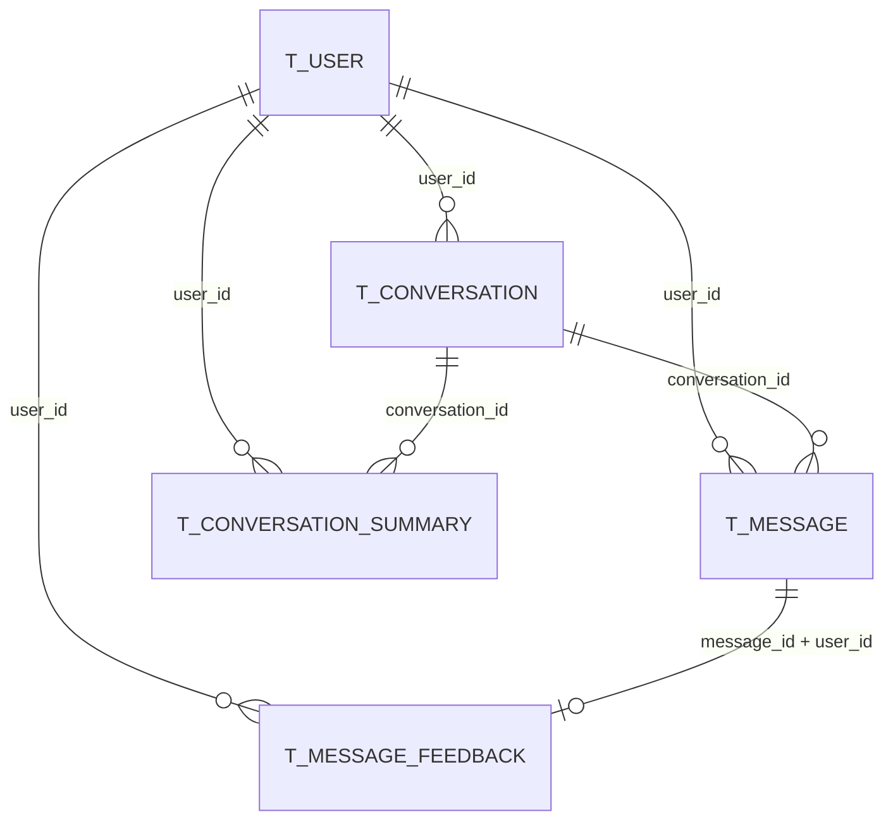
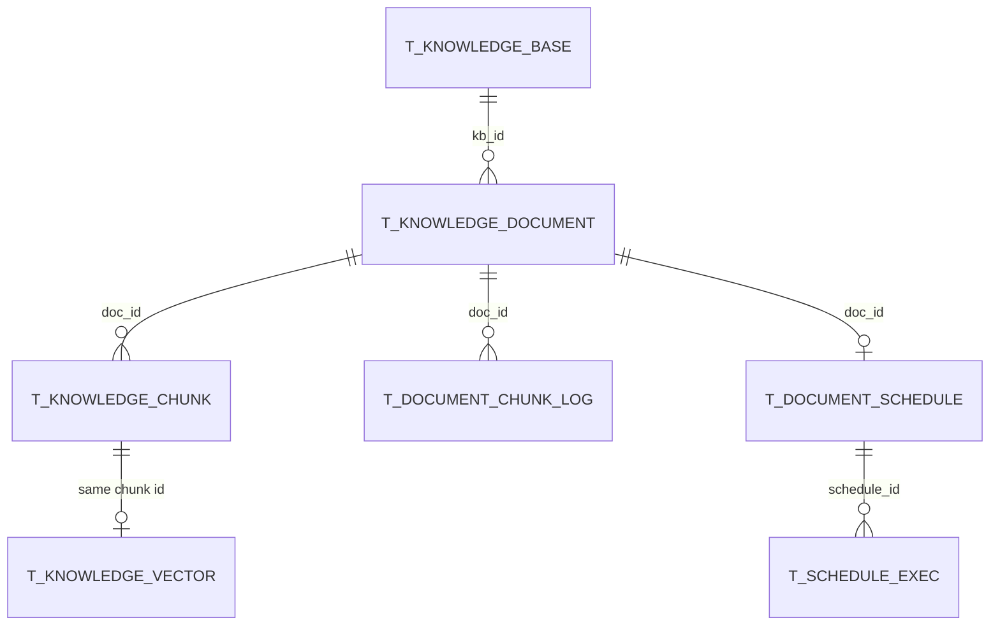
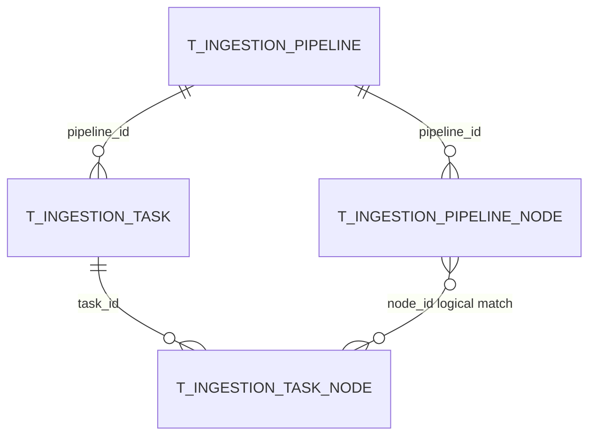
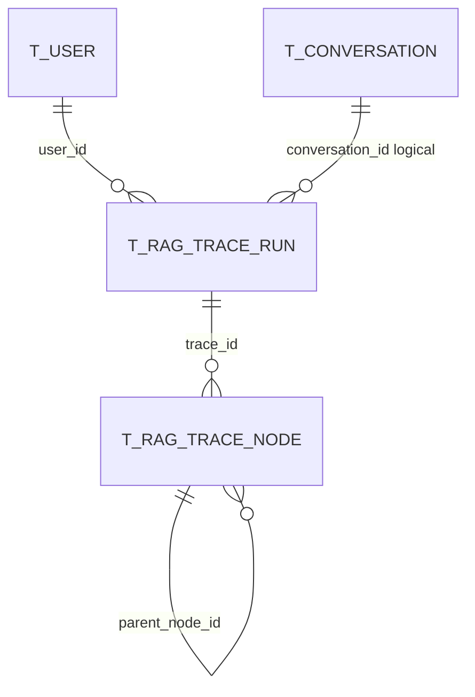

# 数据库与核心表结构

> 本章不是 SQL 字段清单，而是一份“从表结构反推业务流程”的学习手册。读完后，你应该能回答：用户上传一篇文档时哪些表变化、一次问答为什么会写多张表、入库失败和回答缓慢应先查哪里。

## 0. 先建立数据库全局地图

当前项目的主业务数据库是 PostgreSQL，连接配置位于：

`bootstrap/src/main/resources/application.yaml`

```yaml
spring:
  datasource:
    driver-class-name: org.postgresql.Driver
    url: jdbc:postgresql://127.0.0.1:5432/ragent?client_encoding=UTF8

rag:
  vector:
    type: pg
  default:
    dimension: 1536
```

`resources/database/schema_pg.sql` 一共创建 **21 张表**。它们不是 21 个孤岛，而是共同支撑以下业务：

```text
用户登录
  -> 创建会话
  -> 保存用户/助手消息
  -> 生成会话摘要
  -> 记录反馈

知识库创建
  -> 上传文档到 RustFS/S3
  -> 文档解析与切块
  -> Chunk 写 PostgreSQL
  -> Embedding 写 pgvector 或 Milvus

一次 RAG 问答
  -> 读取历史消息和摘要
  -> 读取意图树、术语映射、知识库信息
  -> 查询向量
  -> 写 Trace
  -> 写用户和助手消息
```

---

## 1. PostgreSQL、pgvector、RustFS 与 Milvus 的边界

### 1.1 PostgreSQL 存什么

PostgreSQL 保存“需要事务、筛选、分页、关联和长期审计”的结构化业务数据：

- 用户与角色。
- 会话、消息、会话摘要、反馈。
- 知识库、文档元数据、Chunk 正文。
- 入库 Pipeline 定义、任务和节点日志。
- RAG Trace 运行记录与节点耗时。
- 意图树、术语映射、示例问题。
- URL 文档定时刷新状态。

### 1.2 pgvector 存什么

pgvector 是 PostgreSQL 扩展，不是另一套独立数据库。schema 首先执行：

```sql
CREATE EXTENSION IF NOT EXISTS vector;
```

随后通过 `t_knowledge_vector.embedding vector(1536)` 保存 Chunk 的 Embedding，并使用 HNSW 索引做余弦距离检索。

业务 Chunk 和向量是两种数据：

| 数据 | 存储位置 | 用途 |
|---|---|---|
| Chunk 正文、字符数、Token 数、启用状态 | `t_knowledge_chunk` | 文档管理、编辑、展示 |
| Chunk 正文副本、metadata、Embedding | `t_knowledge_vector` | 语义检索 |

### 1.3 RustFS/S3 存什么

RustFS 提供 S3 兼容对象存储，保存 PDF、Markdown、TXT 等**源文件本体**。PostgreSQL 的 `t_knowledge_document.file_url` 只保存地址，例如：

```text
s3://knowledge-bucket/abc123.pdf
```

边界是：

- 大文件字节放对象存储。
- 文件名称、类型、大小、状态、来源和处理配置放数据库。
- 数据库事务不能自动回滚已经完成的 S3 上传，因此上传成功、数据库插入失败时理论上可能产生孤立对象。

### 1.4 Milvus 与 pgvector 的关系

二者是可替换的向量存储后端，由 `rag.vector.type` 选择：

- `pg`：启用 `PgVectorStoreService` 和 `PgRetrieverService`。
- `milvus`：启用 `MilvusVectorStoreService` 和 `MilvusRetrieverService`。

使用 Milvus 时，业务表仍在 PostgreSQL，但 `t_knowledge_vector` 不再是实际检索数据源。Milvus Collection 相当于 pgvector 中由 `metadata.collection_name` 逻辑划分出的向量空间。

初学者常见误解：配置了 Milvus并不代表可以不要 PostgreSQL。用户、会话、文档、Chunk、任务和 Trace 仍依赖 PostgreSQL。

---

## 2. 初始化与升级脚本

### 2.1 `schema_pg.sql` 创建什么

路径：`resources/database/schema_pg.sql`

它负责：

1. 启用 pgvector 扩展。
2. 创建 21 张当前版本的完整表。
3. 创建唯一约束、普通索引、GIN 索引和 HNSW 向量索引。
4. 添加表与字段注释。

该脚本代表**最新完整结构**，不是增量升级脚本。

### 2.2 `init_data_pg.sql` 初始化什么

路径：`resources/database/init_data_pg.sql`

当前只插入一个管理员：

```text
username = admin
password = admin
role     = admin
```

它不会初始化：

- 示例问题。
- 知识库。
- 意图树。
- Pipeline。
- 术语映射。

当前代码使用明文密码比较，生产环境必须视为安全缺口，不能继续使用默认密码，也不应把当前实现误认为密码哈希方案。

### 2.3 upgrade 脚本什么时候用

当前有：

- `upgrade_v1.0_to_v1.1.sql`：把分块日志的 `embedding_duration` 改名为 `embed_duration`，并新增 `persist_duration`。
- `upgrade_v1.1_to_v1.2.sql`：给 `t_message` 新增 `thinking_content`、`thinking_duration`。

只在“已有旧版本数据库，需要保留数据并升级”时按版本顺序执行。

### 2.4 新库不能乱执行哪些脚本

新建数据库的推荐顺序：

```text
创建空数据库
  -> 执行最新 schema_pg.sql
  -> 执行一次 init_data_pg.sql
  -> 修改默认管理员密码
```

不要做以下操作：

1. 不要在最新 `schema_pg.sql` 后再执行 v1.0/v1.1 upgrade。字段已存在或已改名，会报错。
2. 不要在已有业务库重复执行完整 schema。多数 `CREATE TABLE` 没有 `IF NOT EXISTS`。
3. 不要重复执行 `init_data_pg.sql`，`admin` 用户会撞唯一键。
4. 不要把 `resources/database/backups/` 中的历史 MySQL 风格脚本当 PostgreSQL 主脚本。
5. 不要跳版本执行 upgrade；应先确认数据库实际结构和应用版本。
6. 不要在生产库直接试跑未审查的 DDL，应先备份并在测试库演练。

---

## 3. 代码如何映射数据库表

项目主要使用 MyBatis-Plus：

```text
表
  <-> DO（@TableName）
  <-> Mapper（BaseMapper<DO>）
  <-> Service
  <-> Controller / Pipeline / 定时任务
```

例如：

```text
t_knowledge_document
  <-> KnowledgeDocumentDO
  <-> KnowledgeDocumentMapper
  <-> KnowledgeDocumentServiceImpl
```

大部分 Mapper 没有手写 SQL，只继承 `BaseMapper`。查询条件在 Service 中通过 `Wrappers.lambdaQuery()`、`lambdaUpdate()` 动态构造。

`t_knowledge_vector` 是例外：没有对应 DO 和 Mapper，由 `PgVectorStoreService`、`PgRetrieverService` 直接使用 `JdbcTemplate`。

### 3.1 逻辑删除

多数 DO 的 `deleted` 字段标记了 `@TableLogic`。调用 `deleteById()` 时，实际通常是把 `deleted` 改为 1，而不是物理删除。

但不是所有表都采用逻辑删除。例如 `t_knowledge_document_chunk_log` 没有 `deleted` 字段；清理时会物理删除。

### 3.2 没有外键不等于没有关系

schema 没有声明业务外键。关系由 `user_id`、`conversation_id`、`kb_id`、`doc_id`、`pipeline_id`、`task_id`、`trace_id` 等字段和 Service 代码维护。

优点是迁移和批处理更自由；代价是数据库不会自动阻止孤儿记录，删除逻辑必须由业务代码负责。

---

## 4. 用户与认证域

### 4.1 `t_user`

**关键字段**

| 字段 | 含义 |
|---|---|
| `id` | 字符串主键，MyBatis-Plus 分配 ID |
| `username` | 登录名 |
| `password` | 当前实现中的明文密码 |
| `role` | `admin` 或 `user` |
| `avatar` | 头像 URL |
| `deleted` | 逻辑删除标记 |

**约束与索引**

- 主键：`id`。
- 唯一键：`uk_user_username(username)`。

**写入时机**

- `init_data_pg.sql` 插入默认 admin。
- `UserServiceImpl.create()` 创建用户。
- 更新资料、修改密码、逻辑删除时更新。

**读取时机**

- `AuthServiceImpl.login()` 按 username 查询。
- 用户管理分页。
- Trace 列表把 `user_id` 转为用户名。
- 管理仪表盘统计用户数。

**代码映射**

- DO：`user/dao/entity/UserDO.java`
- Mapper：`user/dao/mapper/UserMapper.java`
- Service：`AuthServiceImpl`、`UserServiceImpl`

**典型查询**

```sql
SELECT id, username, role, avatar, create_time, deleted
FROM t_user
ORDER BY create_time DESC;
```

**容易误解**

- Sa-Token 管理登录态，但用户资料来源仍是 `t_user`。
- 当前密码不是 BCrypt 哈希，`passwordMatches()` 直接用字符串相等比较。
- Service 禁止修改或删除名为 `admin` 的默认管理员，但这不是数据库约束。

### 4.2 用户会话关系图



---

## 5. 会话与消息域

### 5.1 `t_conversation`

它是会话列表表，不保存消息正文。

**关键字段**：`conversation_id`、`user_id`、`title`、`last_time`。

**约束与索引**

- 主键是内部 `id`。
- `(conversation_id, user_id)` 唯一。
- `(user_id, last_time)` 索引用于按用户展示最近会话。

**写入/读取时机**

- `ConversationServiceImpl.createOrUpdate()`：第一次消息创建会话，之后更新 `last_time`。
- `listByUserId()`：读取侧边栏会话列表。
- 重命名、删除会话时更新；删除会话还会联动处理消息和摘要。

**代码映射**：`ConversationDO`、`ConversationMapper`、`ConversationServiceImpl`。

```sql
SELECT conversation_id, user_id, title, last_time
FROM t_conversation
WHERE user_id = '用户ID' AND deleted = 0
ORDER BY last_time DESC;
```

**误区**：`id` 与 `conversation_id` 不是同一概念。业务接口和消息关联主要使用 `conversation_id`。

### 5.2 `t_message`

**关键字段**

- `conversation_id`、`user_id`
- `role`：`user` 或 `assistant`
- `content`
- `thinking_content`
- `thinking_duration`
- `create_time`

**索引**

schema 创建了：

```sql
(conversation_id, user_id, create_time)
```

而且 `idx_conversation_user_time` 与 `idx_conversation_summary` 列完全相同，是重复索引，不代表两类不同数据。

**写入/读取时机**

- `JdbcConversationMemoryStore.append()` 调用 `ConversationMessageServiceImpl.addMessage()` 写用户或助手消息。
- 加载历史记忆、会话消息页面和反馈校验时读取。
- 管理仪表盘统计消息量、助手回答量和“未检索到文档”回答。

**代码映射**：`ConversationMessageDO`、`ConversationMessageMapper`、`ConversationMessageServiceImpl`、`JdbcConversationMemoryStore`。

```sql
SELECT id, role, content, thinking_duration, create_time
FROM t_message
WHERE conversation_id = '会话ID'
  AND user_id = '用户ID'
  AND deleted = 0
ORDER BY create_time, id;
```

**误区**：SSE 中看到文本不代表消息已经落库。最终完成回调后才保存完整助手消息；中途取消或异常要结合代码和实际数据判断。

### 5.3 `t_conversation_summary`

用于压缩长对话，降低每次请求携带全部历史的 Token 成本。

**关键字段**：`conversation_id`、`user_id`、`last_message_id`、`content`。

**索引**：`(conversation_id, user_id)`。

**写入/读取时机**

- `JdbcConversationMemorySummaryService.compressIfNeeded()` 达到配置轮数后异步生成摘要。
- `ConversationMessageServiceImpl.addMessageSummary()` 插入。
- 加载记忆时读取最新摘要，再拼接最近消息。

**代码映射**：`ConversationSummaryDO`、`ConversationSummaryMapper`、`ConversationGroupServiceImpl`、`JdbcConversationMemorySummaryService`。

```sql
SELECT last_message_id, content, create_time
FROM t_conversation_summary
WHERE conversation_id = '会话ID' AND user_id = '用户ID' AND deleted = 0
ORDER BY id DESC;
```

**误区**：摘要不是覆盖 `t_message`，而是新增一条压缩结果；原消息仍保留。

### 5.4 `t_message_feedback`

保存用户对助手消息的点赞或点踩。

**关键字段**：`message_id`、`conversation_id`、`user_id`、`vote`、`reason`、`comment`。

**约束与索引**

- `(message_id, user_id)` 唯一，一个用户对一条消息只有一份当前反馈。
- 分别索引 `conversation_id`、`user_id`。

**写入/读取时机**

- 前端提交后可通过 MQ 异步写入。
- `MessageFeedbackServiceImpl` 校验目标必须是当前用户的 assistant 消息，再 insert 或 update。
- 查询消息列表时可批量读取用户 vote。

**代码映射**：`MessageFeedbackDO`、`MessageFeedbackMapper`、`MessageFeedbackServiceImpl`。

```sql
SELECT message_id, vote, reason, comment, update_time
FROM t_message_feedback
WHERE conversation_id = '会话ID' AND deleted = 0;
```

**误区**：反馈表不是消息内容表，也不是每次点击都追加历史；当前实现更接近 upsert 当前选择。

---

## 6. 知识库、文档与定时刷新域

### 6.1 `t_knowledge_base`

**关键字段**：`name`、`embedding_model`、`collection_name`、创建/更新人。

**约束与索引**

- `collection_name` 唯一。
- `name` 有普通索引，但数据库没有声明名称唯一。

**写入/读取时机**

- `KnowledgeBaseServiceImpl.create()` 创建，并确保向量空间存在。
- 上传文档时读取 collection 和 Embedding 模型。
- 全局检索读取启用知识库集合。
- 删除前检查是否仍有文档。

**代码映射**：`KnowledgeBaseDO`、`KnowledgeBaseMapper`、`KnowledgeBaseServiceImpl`。

```sql
SELECT id, name, embedding_model, collection_name, created_by
FROM t_knowledge_base
WHERE deleted = 0
ORDER BY update_time DESC;
```

**误区**：`collection_name` 不是展示名称，而是向量空间标识；随意修改会让已有向量难以被检索。

### 6.2 `t_knowledge_document`

这是文档业务状态中心，不存文件二进制。

**关键字段**

| 字段 | 含义 |
|---|---|
| `kb_id` | 所属知识库 |
| `file_url` | RustFS/S3 地址 |
| `file_type/file_size` | 文件元数据 |
| `process_mode` | `chunk` 或 `pipeline` |
| `status` | `pending/running/success/failed` |
| `chunk_count` | 当前业务 Chunk 数 |
| `source_type/source_location` | file 或 URL 来源 |
| `chunk_strategy/chunk_config` | 直接分块配置 |
| `pipeline_id` | Pipeline 模式配置 |
| `enabled` | 文档是否参与业务使用 |

**索引**：`kb_id`。

**写入/读取时机**

- 上传完成后插入 pending。
- 点击分块后改 running。
- 入库完成后改 success 和 chunk_count；失败改 failed。
- 文档列表、详情、预览、检索过滤和定时刷新都会读取。

**代码映射**：`KnowledgeDocumentDO`、`KnowledgeDocumentMapper`、`KnowledgeDocumentServiceImpl`、`DocumentStatusHelper`。

```sql
SELECT id, kb_id, doc_name, process_mode, pipeline_id,
       status, enabled, chunk_count, file_url, update_time
FROM t_knowledge_document
WHERE deleted = 0
ORDER BY update_time DESC;
```

**误区**：上传接口返回成功只说明文档记录和源文件已准备好，不表示 `status=success`。

### 6.3 `t_knowledge_document_chunk_log`

记录每次分块/重新分块尝试。

**关键字段**：`doc_id`、`status`、`process_mode`、`extract_duration`、`chunk_duration`、`embed_duration`、`persist_duration`、`total_duration`、`error_message`。

**索引**：`doc_id`。

**写入/读取时机**

- `KnowledgeDocumentServiceImpl.runChunkTask()` 开始时插入 running。
- 成功或失败时更新耗时、数量和错误。
- 文档“分块详情”页面读取。

**代码映射**：`KnowledgeDocumentChunkLogDO`、`KnowledgeDocumentChunkLogMapper`、`KnowledgeDocumentServiceImpl`。

```sql
SELECT status, process_mode, chunk_count,
       extract_duration, chunk_duration, embed_duration,
       persist_duration, total_duration, error_message, start_time
FROM t_knowledge_document_chunk_log
WHERE doc_id = '文档ID'
ORDER BY create_time DESC;
```

**误区**：Pipeline 模式的多个节点耗时被整体计入 `chunk_duration`，不能把它等同于单纯字符串切块时间。

### 6.4 `t_knowledge_document_schedule`

保存 URL 文档的当前调度状态。

**关键字段**：`doc_id`、`cron_expr`、`enabled`、`next_run_time`、最后运行/成功时间、ETag、Last-Modified、内容哈希、分布式锁字段。

**约束与索引**

- `doc_id` 唯一，一篇文档最多一条当前调度配置。
- 索引 `next_run_time`、`lock_until`。

**写入/读取时机**

- `KnowledgeDocumentScheduleServiceImpl.upsertSchedule()` 创建或更新。
- 调度 Job 扫描到期记录。
- `ScheduleLockManager` 竞争和续租锁。
- `ScheduleStateManager` 写回最后执行状态。

**代码映射**：`KnowledgeDocumentScheduleDO`、`KnowledgeDocumentScheduleMapper`、调度 service/schedule 包。

```sql
SELECT doc_id, cron_expr, enabled, next_run_time,
       last_status, last_error, lock_owner, lock_until
FROM t_knowledge_document_schedule
ORDER BY next_run_time;
```

**误区**：这是“当前状态表”，不是每次执行历史。

### 6.5 `t_knowledge_document_schedule_exec`

它是每次定时刷新执行的历史记录。

**关键字段**：`schedule_id`、`doc_id`、`status`、`message`、开始/结束时间、文件信息、ETag 和内容哈希。

**索引**：`(schedule_id, start_time)`、`doc_id`。

**写入/读取时机**

- `ScheduleRefreshProcessor` 每次运行插入 running。
- `ScheduleStateManager` 更新 success/failed/skipped。
- 调度历史页面查询。

**代码映射**：`KnowledgeDocumentScheduleExecDO`、`KnowledgeDocumentScheduleExecMapper`、`ScheduleRefreshProcessor`、`ScheduleStateManager`。

```sql
SELECT status, message, start_time, end_time, file_size, content_hash
FROM t_knowledge_document_schedule_exec
WHERE doc_id = '文档ID'
ORDER BY start_time DESC;
```

**误区**：`skipped` 不一定是异常，可能表示远程文件未变化或文档正被其他任务处理。

### 6.6 知识库文档关系图



---

## 7. Chunk 与向量域

### 7.1 `t_knowledge_chunk`

**关键字段**：`kb_id`、`doc_id`、`chunk_index`、`content`、`content_hash`、`char_count`、`token_count`、`enabled`。

**索引**：`doc_id`。

**写入/读取时机**

- 文档入库完成时 `KnowledgeChunkServiceImpl.batchCreate()` 批量写入。
- Chunk 管理页分页读取。
- 手工创建、编辑、启停、删除 Chunk 时更新，并同步向量。
- 评测和部分业务逻辑会读取 Chunk 与文档关系。

**代码映射**：`KnowledgeChunkDO`、`KnowledgeChunkMapper`、`KnowledgeChunkServiceImpl`。

```sql
SELECT id, doc_id, chunk_index, enabled,
       char_count, token_count, left(content, 120) AS preview
FROM t_knowledge_chunk
WHERE doc_id = '文档ID' AND deleted = 0
ORDER BY chunk_index;
```

**误区**：禁用 Chunk 不只是改 `enabled`；Service 还会删除对应向量。直接手改数据库可能造成两边不一致。

### 7.2 `t_knowledge_vector`

**关键字段**

- `id`：Chunk ID。
- `content`：检索返回使用的文本副本。
- `metadata`：JSONB，至少含 `collection_name`、`doc_id`、`chunk_index`。
- `embedding vector(1536)`。

**索引**

- GIN：`metadata`。
- HNSW：`embedding vector_cosine_ops`。

**写入/读取时机**

- `PgVectorStoreService.indexDocumentChunks()` 批量插入。
- 更新 Chunk 时 upsert。
- 删除文档/Chunk 或禁用 Chunk 时删除。
- `PgRetrieverService` 按 collection 过滤并用 `<=>` 计算余弦距离。

**代码映射**

- 没有 DO、Mapper、普通 Service。
- 写：`PgVectorStoreService`。
- 读：`PgRetrieverService`。

```sql
SELECT metadata->>'collection_name' AS collection_name,
       metadata->>'doc_id' AS doc_id,
       count(*) AS vector_count
FROM t_knowledge_vector
GROUP BY 1, 2
ORDER BY vector_count DESC;
```

```sql
SELECT id, vector_dims(embedding) AS dimensions,
       metadata->>'chunk_index' AS chunk_index
FROM t_knowledge_vector
WHERE metadata->>'doc_id' = '文档ID';
```

**误区**

- pgvector 模式下 collection 不是独立表，而是 metadata 字段。
- 使用 Milvus 时查本表可能为 0，但不代表没有向量。
- `id` 与业务 Chunk ID 逻辑一致，但数据库没有外键。

---

## 8. 入库 Pipeline 域

### 8.1 `t_ingestion_pipeline`

保存可复用的 Pipeline 名称和描述。

**约束**：`(name, deleted)` 唯一，允许旧记录逻辑删除后重用名称。

**写入/读取时机**：管理页面 CRUD；执行任务或知识库 Pipeline 模式时读取。

**代码映射**：`IngestionPipelineDO`、`IngestionPipelineMapper`、`IngestionPipelineServiceImpl`。

```sql
SELECT id, name, description, updated_by, update_time
FROM t_ingestion_pipeline
WHERE deleted = 0
ORDER BY update_time DESC;
```

**误区**：这张表没有节点执行顺序，顺序在节点表的 `next_node_id`。

### 8.2 `t_ingestion_pipeline_node`

**关键字段**：`pipeline_id`、`node_id`、`node_type`、`next_node_id`、`settings_json`、`condition_json`。

**约束与索引**

- `(pipeline_id, node_id, deleted)` 唯一。
- `pipeline_id` 索引。

**写入/读取时机**

- 创建或更新 Pipeline 时，`upsertNodes()` 先删旧节点再插入新定义。
- `getDefinition()` 读取并组装 `PipelineDefinition`。

**代码映射**：`IngestionPipelineNodeDO`、`IngestionPipelineNodeMapper`、`IngestionPipelineServiceImpl`。

```sql
SELECT node_id, node_type, next_node_id, settings_json, condition_json
FROM t_ingestion_pipeline_node
WHERE pipeline_id = 'Pipeline ID' AND deleted = 0;
```

**误区**：数据库中的物理行顺序不等于执行顺序，必须沿 `next_node_id` 追踪。

### 8.3 `t_ingestion_task`

保存通用 Ingestion 的任务级结果。

**关键字段**：`pipeline_id`、来源信息、`status`、`chunk_count`、`error_message`、`logs_json`、`metadata_json`、开始/完成时间。

**索引**：`pipeline_id`、`status`。

**写入/读取时机**

- `IngestionTaskServiceImpl.executeInternal()` 开始时插入 running。
- Engine 返回后更新 completed/failed、Chunk 数、摘要日志和 metadata。
- 任务列表和详情读取。

**代码映射**：`IngestionTaskDO`、`IngestionTaskMapper`、`IngestionTaskServiceImpl`。

```sql
SELECT id, pipeline_id, source_type, source_file_name,
       status, chunk_count, error_message, started_at, completed_at
FROM t_ingestion_task
ORDER BY create_time DESC;
```

**误区**：通用 Ingestion 任务成功不表示创建了 `t_knowledge_document` 或 `t_knowledge_chunk`。

### 8.4 `t_ingestion_task_node`

保存每个节点执行后的结果快照。

**关键字段**：`task_id`、`pipeline_id`、`node_id`、`node_type`、`node_order`、`status`、`duration_ms`、消息、错误和 `output_json`。

**索引**：`task_id`、`pipeline_id`、`status`。

**写入/读取时机**

- Engine 整体返回后，`saveNodeLogs()` 才逐条插入。
- 任务节点详情读取。

**代码映射**：`IngestionTaskNodeDO`、`IngestionTaskNodeMapper`、`IngestionTaskServiceImpl`。

```sql
SELECT node_order, node_id, node_type, status,
       duration_ms, message, error_message
FROM t_ingestion_task_node
WHERE task_id = '任务ID'
ORDER BY node_order, id;
```

**误区**：它是执行记录，不是 Pipeline 配置；配置在 `t_ingestion_pipeline_node`。

### 8.5 入库 Pipeline 关系图



---

## 9. RAG Trace 域

### 9.1 `t_rag_trace_run`

一行代表一次完整流式问答链路。

**关键字段**：`trace_id`、`trace_name`、`entry_method`、`conversation_id`、`task_id`、`user_id`、状态、错误、起止时间、`duration_ms`、`extra_data`。

**约束与索引**

- `trace_id` 唯一。
- `task_id`、`user_id` 索引。

**写入/读取时机**

- `StreamChatTraceRunner.run()` 开始时插入 RUNNING。
- 回调完成或失败时 `finishRun()` 更新终态和总耗时。
- Trace 管理页面和 Dashboard 读取。

**代码映射**：`RagTraceRunDO`、`RagTraceRunMapper`、`RagTraceRecordServiceImpl`、`RagTraceQueryServiceImpl`、`StreamChatTraceRunner`。

```sql
SELECT trace_id, conversation_id, task_id, user_id,
       status, duration_ms, error_message, start_time
FROM t_rag_trace_run
ORDER BY start_time DESC
LIMIT 50;
```

**误区**：Trace 的 `task_id` 是流式问答 taskId，不是 `t_ingestion_task.id`。

### 9.2 `t_rag_trace_node`

一行代表问答链路中的一个可观测阶段。

**关键字段**：`trace_id`、`node_id`、`parent_node_id`、`depth`、`node_type`、`node_name`、类/方法、状态、耗时和错误。

**约束**：`(trace_id, node_id)` 唯一。

**写入/读取时机**

- `@RagTraceNode` AOP 记录改写、意图、检索等同步节点。
- `RagStreamTraceSupportImpl` 记录跨线程流式节点。
- `StreamChatTraceRunner` 额外记录 `user-first-packet`，其耗时是用户感知 TTFT。

已确认的节点名包括：

- `query-rewrite`
- `query-rewrite-and-split`
- `intent-resolve`
- `guidance-detect`
- `retrieval-engine`
- `multi-channel-retrieval`
- `conversation-title-gen`
- `user-first-packet`

**代码映射**：`RagTraceNodeDO`、`RagTraceNodeMapper`、Trace record/query service、Trace AOP/support。

```sql
SELECT node_name, node_type, status, duration_ms,
       class_name, method_name, error_message
FROM t_rag_trace_node
WHERE trace_id = 'Trace ID'
ORDER BY start_time, depth, node_id;
```

**误区**：所有节点耗时之和不一定等于 run 总耗时，因为节点可能嵌套、并行或只覆盖部分阶段。

### 9.3 RAG Trace 关系图



---

## 10. 意图树、MCP 与术语域

### 10.1 `t_intent_node`

它把知识库意图、系统意图和 MCP 意图统一存在一棵树中。

**关键字段**

- `intent_code`、`parent_code`、`level`：树结构。
- `kind`：`0=KB`、`1=SYSTEM`、`2=MCP`。
- `kb_id`、`collection_name`、`top_k`：知识库检索配置。
- `mcp_tool_id`：MCP 工具引用。
- `examples`、description：意图分类依据。
- Prompt 片段、模板和参数提取模板。
- `sort_order`、`enabled`。

**约束与索引**

schema 只有主键，没有为 `intent_code` 建数据库唯一键，也没有 `parent_code` 索引。Service 在创建时做逻辑重复校验。

**写入/读取时机**

- `IntentTreeServiceImpl` 管理 CRUD，并清除 Redis 意图树缓存。
- 意图分类器从缓存或数据库加载树。
- KB 意图决定 collection/topK；MCP 意图决定工具和参数 Prompt。

**代码映射**：`IntentNodeDO`、`IntentNodeMapper`、`IntentTreeServiceImpl`、Intent classifier/resolver。

```sql
SELECT intent_code, parent_code, level, kind, name,
       kb_id, collection_name, mcp_tool_id, top_k, enabled
FROM t_intent_node
WHERE deleted = 0
ORDER BY sort_order, id;
```

**误区**

- `parent_code` 关联的是父节点 `intent_code`，不是父节点主键 ID。
- 项目没有独立 MCP 工具表；`mcp_tool_id` 引用运行时 MCP Server 暴露的工具。
- MCP Server 地址来自 `application.yaml`，不是这张表。

### 10.2 `t_query_term_mapping`

用于在问题改写前后做术语归一化，例如把别名替换为标准词。

**关键字段**：`domain`、`source_term`、`target_term`、`match_type`、`priority`、`enabled`、`remark`。

**索引**：`domain`、`source_term`。

**写入/读取时机**

- 管理端通过 `QueryTermMappingAdminServiceImpl` CRUD。
- `QueryTermMappingService.normalize()` 优先从 Redis 缓存读取，缓存未命中才查启用规则。
- 修改规则后管理 Service 清理缓存。

**代码映射**：`QueryTermMappingDO`、`QueryTermMappingMapper`、Admin service、`QueryTermMappingService`。

```sql
SELECT domain, source_term, target_term, match_type, priority, enabled
FROM t_query_term_mapping
WHERE deleted = 0
ORDER BY priority DESC, length(source_term) DESC;
```

**误区**：直接改数据库不会自动清除 Redis 缓存，应用可能暂时仍使用旧规则。

---

## 11. 示例问题、系统设置与其他边界

### 11.1 `t_sample_question`

保存聊天首页可展示的示例问题。

**关键字段**：`title`、`description`、`question`、`deleted`。

**索引**：`deleted`。

**写入/读取时机**

- `SampleQuestionServiceImpl` 管理 CRUD。
- `listRandomQuestions()` 使用 PostgreSQL `ORDER BY RANDOM() LIMIT 3` 随机读取。

**代码映射**：`SampleQuestionDO`、`SampleQuestionMapper`、`SampleQuestionServiceImpl`。

```sql
SELECT id, title, description, question
FROM t_sample_question
WHERE deleted = 0
ORDER BY update_time DESC;
```

**误区**：`init_data_pg.sql` 没有插入示例问题；新库为空是正常现象。

### 11.2 系统设置不是数据库表

当前 schema 没有 `t_system_setting`。以下配置主要来自 `application.yaml`：

- 数据源、Redis、RocketMQ、RustFS、Milvus。
- 向量后端和维度。
- 模型候选与路由。
- 会话记忆阈值。
- 限流、检索和 Trace 开关。
- MCP Server URL。

修改配置文件和修改数据库是两类不同操作。

---

## 12. 至少 10 条必会学习 SQL

以下 SQL 默认只读，适合在 DBeaver 中学习。

### 12.1 查看用户

```sql
SELECT id, username, role, create_time
FROM t_user
WHERE deleted = 0;
```

### 12.2 查看某用户的会话

```sql
SELECT conversation_id, title, last_time
FROM t_conversation
WHERE user_id = '用户ID' AND deleted = 0
ORDER BY last_time DESC;
```

### 12.3 查看一次会话的完整消息

```sql
SELECT id, role, content, thinking_duration, create_time
FROM t_message
WHERE conversation_id = '会话ID' AND deleted = 0
ORDER BY create_time, id;
```

### 12.4 查看知识库及文档数

```sql
SELECT kb.id, kb.name, kb.embedding_model, kb.collection_name,
       count(d.id) FILTER (WHERE d.deleted = 0) AS document_count
FROM t_knowledge_base kb
LEFT JOIN t_knowledge_document d ON d.kb_id = kb.id
WHERE kb.deleted = 0
GROUP BY kb.id, kb.name, kb.embedding_model, kb.collection_name;
```

### 12.5 查看文档处理状态

```sql
SELECT id, doc_name, process_mode, status, chunk_count, update_time
FROM t_knowledge_document
WHERE kb_id = '知识库ID' AND deleted = 0
ORDER BY update_time DESC;
```

### 12.6 查看文档 Chunk

```sql
SELECT id, chunk_index, enabled, char_count, token_count,
       left(content, 100) AS preview
FROM t_knowledge_chunk
WHERE doc_id = '文档ID' AND deleted = 0
ORDER BY chunk_index;
```

### 12.7 比较 Chunk 数和 pgvector 数

```sql
SELECT
  (SELECT count(*) FROM t_knowledge_chunk
   WHERE doc_id = '文档ID' AND deleted = 0) AS chunk_count,
  (SELECT count(*) FROM t_knowledge_vector
   WHERE metadata->>'doc_id' = '文档ID') AS vector_count;
```

### 12.8 查看向量维度

```sql
SELECT vector_dims(embedding) AS dimensions, count(*)
FROM t_knowledge_vector
GROUP BY vector_dims(embedding);
```

### 12.9 查看最近入库任务

```sql
SELECT id, pipeline_id, source_file_name, status,
       chunk_count, error_message, started_at, completed_at
FROM t_ingestion_task
ORDER BY create_time DESC
LIMIT 20;
```

### 12.10 查看入库节点日志

```sql
SELECT node_order, node_id, node_type, status,
       duration_ms, message, error_message
FROM t_ingestion_task_node
WHERE task_id = '任务ID'
ORDER BY node_order, id;
```

### 12.11 查看最近 RAG Trace

```sql
SELECT trace_id, conversation_id, task_id, status,
       duration_ms, error_message, start_time
FROM t_rag_trace_run
ORDER BY start_time DESC
LIMIT 20;
```

### 12.12 查看一次 Trace 的慢节点

```sql
SELECT node_name, node_type, status, duration_ms,
       class_name, method_name, error_message
FROM t_rag_trace_node
WHERE trace_id = 'Trace ID'
ORDER BY duration_ms DESC NULLS LAST;
```

### 12.13 查看反馈与助手消息

```sql
SELECT f.vote, f.reason, f.comment,
       m.conversation_id, left(m.content, 120) AS answer
FROM t_message_feedback f
JOIN t_message m ON m.id = f.message_id
WHERE f.deleted = 0
ORDER BY f.update_time DESC;
```

### 12.14 查看 URL 文档调度失败

```sql
SELECT s.doc_id, s.last_status, s.last_error, s.next_run_time,
       e.status AS exec_status, e.message, e.start_time
FROM t_knowledge_document_schedule s
LEFT JOIN t_knowledge_document_schedule_exec e
  ON e.schedule_id = s.id
WHERE s.last_status = 'failed' OR e.status = 'failed'
ORDER BY e.start_time DESC NULLS LAST;
```

---

## 13. 上传一篇文档后哪些表会变化

知识库页面的“上传”和“分块”是两个阶段。

### 13.1 只点击上传

1. RustFS/S3 新增源文件对象。
2. `t_knowledge_document` 插入一行，通常是 `pending`、`chunk_count=0`。
3. 如果是 URL 来源且后续启用调度，调度记录通常在触发分块事务时通过 `upsertSchedule()` 同步。

此时不会写：

- `t_knowledge_chunk`
- `t_knowledge_vector`
- `t_knowledge_document_chunk_log`

### 13.2 点击“分块”并成功

1. `t_knowledge_document.status` 改为 `running`。
2. MQ Consumer 开始后，插入 `t_knowledge_document_chunk_log(running)`。
3. 解析、切块、Embedding 主要在内存中完成。
4. 删除该文档旧 `t_knowledge_chunk`，批量插入新 Chunk。
5. pgvector 模式删除旧 `t_knowledge_vector` 后写新向量；Milvus 模式写对应 Collection。
6. `t_knowledge_document` 改为 `success`，更新 `chunk_count`。
7. chunk log 改为 success，并写各阶段耗时。
8. URL 定时文档还可能新增或更新 `t_knowledge_document_schedule`。

### 13.3 使用通用 Ingestion 页面

它写的是：

- `t_ingestion_task`
- `t_ingestion_task_node`
- pgvector/Milvus 向量

它不会自动创建知识库文档和业务 Chunk。

---

## 14. 问答一次后哪些表会变化

以正常完成的一次新会话为例：

1. `t_rag_trace_run` 插入 RUNNING。
2. 改写、意图、检索等阶段向 `t_rag_trace_node` 写节点记录。
3. Pipeline 加载 `t_conversation_summary` 和最近 `t_message` 作为记忆。
4. 术语归一化可能读取 `t_query_term_mapping`；缓存命中时不查数据库。
5. 意图识别可能读取 `t_intent_node`；缓存命中时不查数据库。
6. 检索读取 `t_knowledge_base` 和 pgvector/Milvus。
7. 首次会话写 `t_conversation`，后续问答更新 `last_time`。
8. 用户问题写一条 `t_message(role=user)`。
9. 模型完成后写一条 `t_message(role=assistant)`，可能包含 thinking 字段。
10. Trace run 和节点更新为 SUCCESS 或 ERROR。
11. 达到摘要阈值时，异步向 `t_conversation_summary` 插入新摘要。
12. 用户随后点赞/点踩时，才写 `t_message_feedback`。

不会因为一次普通问答而修改知识库 Chunk 或向量。

---

## 15. 如何通过数据库定位入库失败

### 第一步：确定走哪条链路

- 有 `t_knowledge_document`：知识库文档链路。
- 有 `t_ingestion_task`：通用 Ingestion 链路。

### 第二步：知识库文档链路

```sql
SELECT id, status, chunk_count, file_url, process_mode, pipeline_id
FROM t_knowledge_document
WHERE id = '文档ID';
```

判断：

- `pending`：只上传，尚未触发分块。
- `running` 长时间不变：检查 RocketMQ Consumer、消息投递和进程日志。
- `failed`：继续查 chunk log。

```sql
SELECT *
FROM t_knowledge_document_chunk_log
WHERE doc_id = '文档ID'
ORDER BY create_time DESC;
```

耗时定位：

- `extract_duration` 高：对象存储读取或 Tika 解析慢。
- `chunk_duration` 高：切块慢；Pipeline 模式还包含整个节点链。
- `embed_duration` 高：Embedding 服务慢。
- `persist_duration` 高：数据库或向量库写入慢。
- `error_message`：第一现场错误。

再核对一致性：

```sql
SELECT d.chunk_count,
       count(DISTINCT c.id) AS chunks,
       count(DISTINCT v.id) AS vectors
FROM t_knowledge_document d
LEFT JOIN t_knowledge_chunk c
  ON c.doc_id = d.id AND c.deleted = 0
LEFT JOIN t_knowledge_vector v
  ON v.metadata->>'doc_id' = d.id
WHERE d.id = '文档ID'
GROUP BY d.chunk_count;
```

使用 Milvus 时不能用最后一列判断，应到 Milvus Collection 查询。

### 第三步：通用 Ingestion 链路

```sql
SELECT status, error_message, logs_json
FROM t_ingestion_task
WHERE id = '任务ID';
```

```sql
SELECT node_order, node_type, status, duration_ms, error_message
FROM t_ingestion_task_node
WHERE task_id = '任务ID'
ORDER BY node_order;
```

第一条 failed 节点通常就是排查起点。若任务创建后整个事务异常回滚，可能连 task 行都没有，此时必须查应用日志和 HTTP 错误。

---

## 16. 如何通过数据库定位 RAG 回答慢

### 16.1 先找慢 run

```sql
SELECT trace_id, conversation_id, task_id, duration_ms, status, start_time
FROM t_rag_trace_run
WHERE duration_ms > 20000
ORDER BY duration_ms DESC
LIMIT 50;
```

Dashboard 当前也把 20 秒以上视为慢请求。

### 16.2 再按节点耗时排序

```sql
SELECT node_name, node_type, duration_ms, status, error_message
FROM t_rag_trace_node
WHERE trace_id = 'Trace ID'
ORDER BY duration_ms DESC NULLS LAST;
```

常见解释：

- `query-rewrite` 高：改写模型慢。
- `intent-resolve` 高：意图模型或树加载慢。
- `retrieval-engine` / `multi-channel-retrieval` 高：Embedding、向量检索或 Rerank 慢。
- `conversation-title-gen` 高：新会话标题生成慢。
- `user-first-packet` 高：用户在前端等待首字时间长，它包含前置 Pipeline 和模型首包。

### 16.3 Trace 看不到全部细节怎么办

当前 Trace 节点覆盖取决于 `@RagTraceNode` 和流式 span 埋点，不保证每个内部方法都有独立行。此时应结合：

- run 总耗时。
- `user-first-packet`。
- 已记录节点的嵌套关系。
- 应用日志中的模型路由、检索和 SSE 时间。
- 数据库连接池、pgvector 执行计划和外部模型监控。

### 16.4 检查 pgvector 查询计划

可在测试环境使用真实向量执行 `EXPLAIN (ANALYZE, BUFFERS)`，确认 HNSW 索引是否生效。不要在生产高峰对大表随意运行带 ANALYZE 的重查询。

还应检查：

```sql
SELECT count(*) FROM t_knowledge_vector;
SELECT metadata->>'collection_name', count(*)
FROM t_knowledge_vector
GROUP BY 1;
```

向量总量过大、collection 过滤选择性差、维度不一致或索引未建立都会影响检索。

---

## 17. 结构设计中值得初学者特别观察的点

1. 21 张表中没有业务外键，删除一致性依赖 Service。
2. 多数表采用逻辑删除，但日志和向量表不完全一致。
3. `t_message` 有重复复合索引，可能增加写入成本。
4. `t_intent_node.intent_code` 由 Service 保证唯一，数据库没有唯一约束。
5. `t_rag_trace_node.trace_id` 在 schema 中是 `VARCHAR(20)`，run 表为 `VARCHAR(64)`；当前 Snowflake 字符串通常可放入 20 位，但两表定义不一致。
6. `t_knowledge_vector` 没有外键，业务 Chunk 和向量可能因跨系统失败而不一致。
7. pgvector 固定 1536 维，修改模型必须同步 schema、配置和历史数据。
8. Redis 缓存使“数据库刚改完”不一定立即反映在意图树和术语映射中。
9. RustFS、Milvus、RocketMQ 都在 PostgreSQL 事务边界之外。
10. `init_data_pg.sql` 只有默认用户，不代表系统已拥有可用知识库、意图和 Pipeline。

---

## 18. 本章复习清单

1. `t_knowledge_document` 为什么只保存 `file_url` 而不保存文件字节？
2. pgvector 与 PostgreSQL 是什么关系？
3. 使用 Milvus 后哪些 PostgreSQL 表仍必须保留？
4. 为什么最新 schema 后不能再执行旧 upgrade？
5. `conversation.id` 与 `conversation_id` 有何区别？
6. 会话摘要是否会删除原消息？
7. `t_ingestion_pipeline_node` 与 `t_ingestion_task_node` 有何区别？
8. 为什么不能只看 `t_knowledge_document.chunk_count` 判断入库完整？
9. `t_knowledge_chunk.id` 与向量 ID 如何关联？
10. `mcp_tool_id` 为什么没有数据库外键？
11. 哪张表最适合定位 Embedding 慢？
12. 哪个 Trace 节点最接近用户感知首包时间？
13. 为什么直接修改术语表后可能没有立即生效？
14. 通用 Ingestion 成功后为什么没有知识库文档？
15. 没有数据库外键时，删除业务对象要注意什么？

---

## 19. 已确认内容与仍需运行验证的关系

### 已从源码确认

- schema 创建 21 张表并启用 pgvector。
- `init_data_pg.sql` 只创建默认 admin。
- 当前默认向量后端是 pg，维度 1536。
- 所有关键表对应的 DO、Mapper 和主要 Service。
- 上传文档、通用入库、问答、摘要、反馈和 Trace 的主要写入时机。
- 系统设置和 MCP Server 没有独立数据库表。
- pgvector 由 JdbcTemplate 直接读写，没有 DO/Mapper。

### 仍需在实际部署中确认

- 生产环境是否覆盖为 Milvus。
- 数据库是否已按版本顺序应用所有 upgrade。
- Redis 缓存 TTL 与手工清理策略。
- RocketMQ、RustFS、Milvus 跨系统失败后的补偿任务。
- 生产库实际索引、表膨胀和 HNSW 查询计划。
- 是否已有外部迁移工具管理 schema，而不是手工 SQL。

---

## 20. 下一步建议

下一轮建议扩写 `04-项目配置与启动流程.md`，把 `application.yaml` 中 PostgreSQL、Redis、RocketMQ、RustFS、Milvus、模型路由和环境变量串成一套可启动、可验证的本地环境检查清单。
