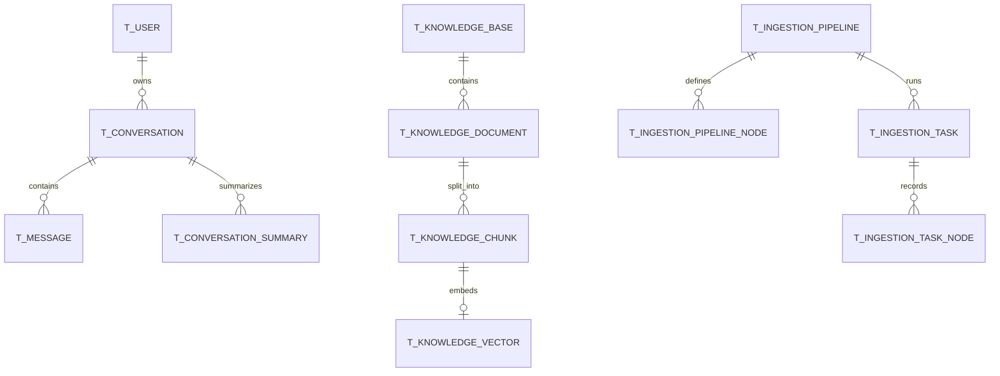

# 数据库与核心表结构

## 脚本位置

当前主脚本为 `resources/database/schema_pg.sql` 和 `resources/database/init_data_pg.sql`，数据库是 PostgreSQL。`backups/` 是历史备份，`upgrade_*.sql` 用于版本升级。

## 核心表

| 表名 | 业务含义 | 关键字段 | 对应代码 | 典型场景 |
|---|---|---|---|---|
| `t_user` | 用户 | username、password、role | `user/dao/entity/UserDO.java` | 登录、权限 |
| `t_conversation` | 会话组 | conversation_id、user_id、title | `rag/dao/entity/ConversationDO.java` | 会话列表 |
| `t_message` | 对话消息 | role、content、thinking_content | `ConversationMessageDO.java` | 记忆与历史 |
| `t_conversation_summary` | 历史摘要 | last_message_id、content | `ConversationSummaryDO.java` | 压缩长对话 |
| `t_knowledge_base` | 知识库 | embedding_model、collection_name | `KnowledgeBaseDO.java` | 隔离向量集合 |
| `t_knowledge_document` | 文档元数据 | kb_id、file_url、status、pipeline_id | `KnowledgeDocumentDO.java` | 上传和处理状态 |
| `t_knowledge_chunk` | 文档块 | doc_id、content、chunk_index | `KnowledgeChunkDO.java` | 检索结果正文 |
| `t_knowledge_vector` | pgvector 向量 | metadata、embedding vector(1536) | `PgVectorStoreService.java` | 默认向量检索 |
| `t_intent_node` | 意图树 | intent_code、kb_id、mcp_tool_id、kind | `IntentNodeDO.java` | 决定知识或工具路径 |
| `t_ingestion_pipeline` | 入库流程定义 | name、description | `IngestionPipelineDO.java` | 保存 Pipeline |
| `t_ingestion_pipeline_node` | 流程节点 | node_type、next_node_id、settings_json | `IngestionPipelineNodeDO.java` | 节点编排 |
| `t_ingestion_task` | 入库任务 | source_type、status、chunk_count | `IngestionTaskDO.java` | 任务状态 |
| `t_ingestion_task_node` | 节点执行记录 | node_type、duration_ms、output_json | `IngestionTaskNodeDO.java` | 排错与观测 |
| `t_rag_trace_run/node` | RAG Trace | trace_id、status、duration_ms | `RagTraceRunDO/NodeDO.java` | 链路追踪 |

另外还有反馈、示例问题、术语映射、文档调度与切块日志等表，共 21 张。

## 核心关系

SQL 没有为所有关系声明外键，很多关联由业务字段维护。初学者不要把“没有数据库外键”误解为“没有业务关系”。

## 文档与代码不一致

`docs/ragent-architecture.md` 部分段落仍写 MySQL，但当前 `application.yaml` 使用 PostgreSQL，主脚本也是 `schema_pg.sql`。学习和运行应以当前代码配置为准。

## 本章复习问题

1. 文档元数据、正文分块和向量为何分开存？
2. `t_ingestion_pipeline_node` 与 `t_ingestion_task_node` 有什么区别？
3. 没有外键时如何理解表关系？

## 下一步建议

在 DBeaver 中只读查看上述表，上传一份测试文档后对比任务、文档、分块和向量记录的变化。
