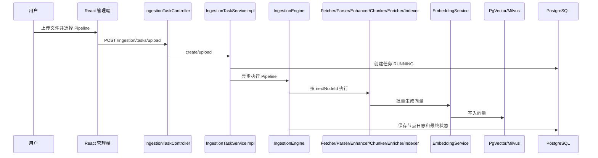

# 文档入库流程解析

## 两个入口

管理知识库上传入口是 `KnowledgeDocumentController.upload()`，对应前端 `knowledgeService.ts` 的 `uploadKnowledgeDocument()`。通用 Pipeline 入口是 `IngestionTaskController.upload()`，对应 `ingestionService.ts` 的 `uploadIngestionTask()`。知识库页面还能选择 `pipelineId`。

## 节点化流程

| 步骤 | 输入 | 处理类/方法 | 输出 | 说明 |
|---|---|---|---|---|
| 1 | 文件/URL/S3 等来源 | `FetcherNode` | `DocumentSource` | Local、HTTP、S3、飞书策略 |
| 2 | 原始文件 | `ParserNode` | `StructuredDocument` | Apache Tika 等解析文本 |
| 3 | 解析文本 | `EnhancerNode` | 增强文档 | 可做格式/上下文增强 |
| 4 | 文档 | `ChunkerNode` | chunks | 按配置切分、重叠 |
| 5 | chunks | `EnricherNode` | 丰富 chunks | 摘要/关键词等增强能力 |
| 6 | chunks | `IndexerNode` | 数据库与向量记录 | Embedding 后写向量存储 |
| 7 | 节点结果 | `IngestionEngine` | 状态和日志 | 记录耗时、输出、异常 |

节点定义来自 `t_ingestion_pipeline_node`，`next_node_id` 决定后继，`settings_json` 保存配置，`condition_json` 控制条件执行。`IngestionNode` 是模板方法基类，各节点关注自身处理。

## 失败与状态

`IngestionTaskServiceImpl` 创建任务并驱动引擎，`IngestionEngine` 为每个节点记录状态、耗时、消息和输出。失败会把任务/节点置为失败并记录错误。当前扫描未确认通用节点级自动重试策略，不能把模型路由的降级误认为入库任务重试；是否由调度器再次触发需要进一步实际验证。

旧知识文档链路还有 `t_knowledge_document_chunk_log`，记录 extract/chunk/embed/persist 各阶段耗时。学习时应区分“知识库文档管理接口”和“通用入库 Pipeline”，两者在当前项目中并存。

## 前端触发

`frontend/src/pages/admin/knowledge/KnowledgeDocumentsPage.tsx` 管理知识库文档；`frontend/src/pages/admin/ingestion/IngestionPage.tsx` 管理 Pipeline 和任务。请求封装分别在 `knowledgeService.ts`、`ingestionService.ts`。

## 本章复习问题

1. Pipeline 定义与一次 Pipeline 任务有什么区别？
2. 为什么 Embedding 应在切块后执行？
3. 哪些表可用于定位入库失败节点？

## 下一步建议

用 `docs/examples/pdf-pipeline-request.json` 对照数据库中的节点配置，在 `IngestionEngine.execute()` 和各节点 `execute()` 附近逐步 Debug。
