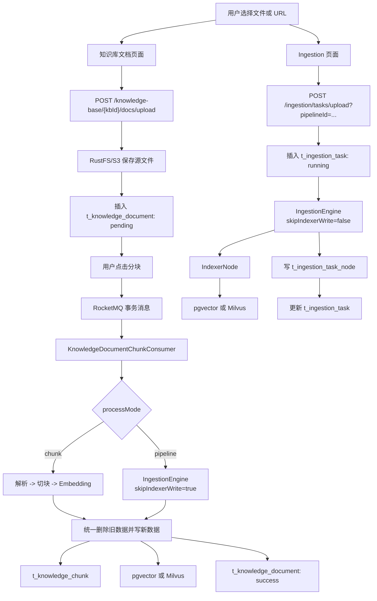
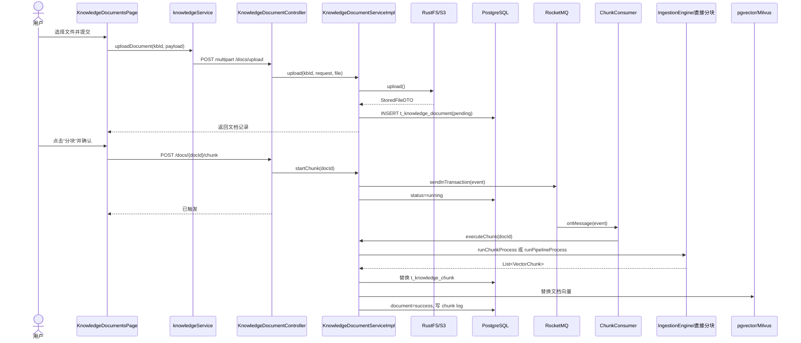
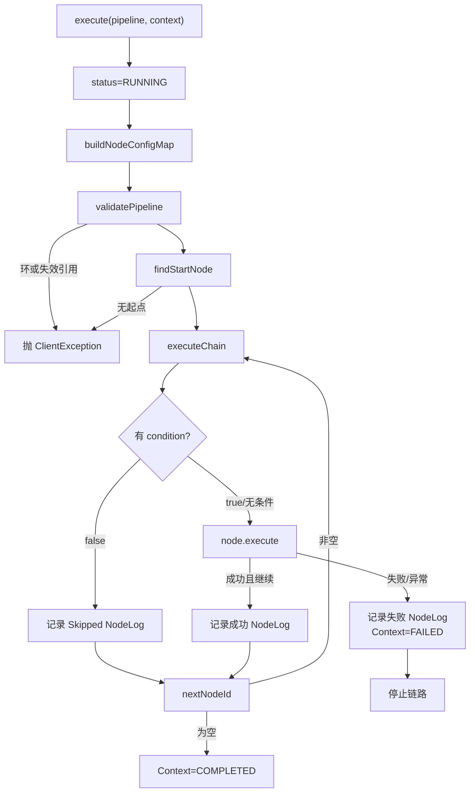
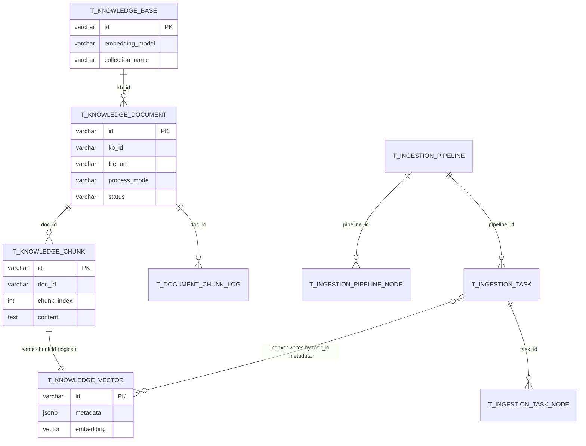

# 文档入库流程解析

> 本章面向 Java 与 RAG 初学者，目标不是记住一句“Fetcher -> Parser -> Chunker”，而是能够在 IDE 中从前端上传按钮开始，逐步跟到文件存储、文本解析、切块、Embedding、关系数据库和向量存储写入完成。

## 0. 先建立一个不会混乱的结论

当前项目有两条相互关联、但并不相同的入库链路：

1. **知识库文档链路**：面向真实知识库管理。先上传并创建 `t_knowledge_document`，用户再点击“分块”，后端通过 RocketMQ 异步执行，最终同时写 `t_knowledge_chunk` 和向量存储。
2. **通用 Ingestion Pipeline 链路**：面向 Pipeline 调试和通用数据摄取。上传后在当前 HTTP 请求线程中同步执行 Pipeline，写 `t_ingestion_task`、`t_ingestion_task_node`，并可由 `IndexerNode` 直接写向量存储。

知识库文档也可以选择 `processMode=pipeline`。此时它会复用 `IngestionEngine` 和各节点，但设置 `skipIndexerWrite=true`，让 `IndexerNode` 只校验和准备结果，最后仍由知识库 Service 统一写 chunk 表和向量库。

这三句话是本章最重要的地图：

- “上传文件成功”不等于“入库完成”。
- “执行 Pipeline 成功”不一定写了 `t_knowledge_chunk`。
- 是否由 `IndexerNode` 直接写向量库，取决于 `IngestionContext.skipIndexerWrite`。

---

## 1. 入库流程总览

### 1.1 为什么 RAG 必须先入库

大模型不能直接高效地在整份 PDF、Word 或 Markdown 中查找答案。RAG 通常把离线文档处理成以下层次：

| 层次 | 项目中的对象/存储 | 作用 |
|---|---|---|
| 原始文档 | RustFS/S3 对象、`t_knowledge_document` | 保存文件本体及文档元数据 |
| 解析文本 | `IngestionContext.rawText`、`StructuredDocument` | 把 PDF/Word 等二进制转换成文本 |
| Chunk | `VectorChunk`、`t_knowledge_chunk` | 将长文本切成可检索的小段 |
| Embedding | `VectorChunk.embedding` | 把每个 Chunk 转换为固定维度的浮点向量 |
| 向量索引 | `t_knowledge_vector` 或 Milvus Collection | 支持按语义相似度召回 Chunk |

关系可以理解为：

```text
一个 KnowledgeBase
  └── 多个 Document
        └── 多个 Chunk
              └── 每个 Chunk 对应一个 Embedding 向量
```

Chunk 的文本用于最终给大模型阅读，Embedding 用于“找出哪些 Chunk 最相关”。向量本身不是答案，也不是摘要。

### 1.2 两条主链路对比

| 对比项 | 知识库文档链路 | 通用 Ingestion 链路 |
|---|---|---|
| 前端页面 | `KnowledgeDocumentsPage.tsx` | `IngestionPage.tsx` |
| 上传接口 | `POST /knowledge-base/{kbId}/docs/upload` | `POST /ingestion/tasks/upload?pipelineId=...` |
| 上传后是否立即处理 | 否，需再次点击“分块” | 是，同一 HTTP 请求中同步执行 |
| 文件是否保存到 RustFS/S3 | 是 | 上传接口中只读取为 `byte[]`，不落对象存储 |
| 核心业务记录 | `t_knowledge_document` | `t_ingestion_task` |
| 节点明细 | Pipeline 模式下只存在内存 `NodeLog`，未写任务节点表 | 写 `t_ingestion_task_node` |
| Chunk 业务表 | 写 `t_knowledge_chunk` | 不写 `t_knowledge_chunk` |
| 向量写入者 | `KnowledgeDocumentServiceImpl` 统一写 | `IndexerNode` 直接写 |
| 执行线程 | RocketMQ Consumer | Controller 请求线程 |

### 1.3 入库总流程图



---

## 2. 前端入口

### 2.1 知识库文档页面

源码：

- `frontend/src/pages/admin/knowledge/KnowledgeDocumentsPage.tsx`
- `frontend/src/services/knowledgeService.ts`

#### 第一步：用户填写上传表单

`UploadDialog` 使用 `react-hook-form` 和 Zod 校验以下信息：

- `sourceType`：`file` 或 `url`。
- `processMode`：`chunk` 或 `pipeline`。
- 直接分块模式：必须选择 `chunkStrategy` 并填写分块参数。
- Pipeline 模式：必须选择 `pipelineId`。
- URL 来源：必须填写 `sourceLocation`；启用定时刷新时还必须填写 `scheduleCron`。

`handleSubmit()` 的关键输入是 `UploadFormValues`，输出是 `KnowledgeDocumentUploadPayload`。直接分块模式会把表单数值组装为 JSON 字符串，例如：

```json
{"chunkSize":512,"overlapSize":128}
```

#### 第二步：调用 `uploadDocument()`

`KnowledgeDocumentsPage` 的 `onSubmit` 调用：

```ts
await uploadDocument(kbId, payload);
```

`knowledgeService.ts` 中的 `uploadDocument()` 创建 `FormData`，可能加入：

- `file`
- `sourceType`
- `sourceLocation`
- `scheduleEnabled`
- `scheduleCron`
- `processMode`
- `chunkStrategy`
- `chunkConfig`
- `pipelineId`

请求为：

```http
POST /api/ragent/knowledge-base/{kbId}/docs/upload
Content-Type: multipart/form-data
```

响应是新建的 `KnowledgeDocument`。页面提示“上传成功”并刷新列表，但此时文档通常还是 `pending`，Chunk 和向量还没有生成。

#### 第三步：用户点击“分块”

列表中的“分块”按钮只设置 `chunkTarget`。用户在确认框中点击“开始”后，`handleChunk()` 调用：

```ts
await startDocumentChunk(String(chunkTarget.id));
```

对应请求：

```http
POST /api/ragent/knowledge-base/docs/{docId}/chunk
```

这个接口返回时只代表任务已成功投递，不代表异步解析和向量写入已经结束。页面之后通过重新查询文档列表观察 `running/success/failed` 状态。

### 2.2 Ingestion Pipeline 页面

源码：

- `frontend/src/pages/admin/ingestion/IngestionPage.tsx`
- `frontend/src/services/ingestionService.ts`

页面既能管理 Pipeline，也能创建任务。上传本地文件时：

1. `TaskDialog` 或 `UploadDialog` 检查 `pipelineId`、文件是否为空、文件大小是否超限。
2. 调用 `uploadIngestionTask(pipelineId, file)`。
3. Service 创建只包含 `file` 的 `FormData`，把 `pipelineId` 放在查询参数。

请求为：

```http
POST /api/ragent/ingestion/tasks/upload?pipelineId={pipelineId}
Content-Type: multipart/form-data

file=<binary>
```

响应是 `IngestionResult`：`taskId`、`pipelineId`、`status`、`chunkCount`、`message`。

**当前实现是同步执行。** 前端 `await uploadIngestionTask()` 会一直等到 `IngestionEngine` 执行完成并更新任务后才返回。`docs/examples/pdf-ingestion-example.md` 中“先返回 RUNNING、再轮询”的说明与当前源码不一致。

### 2.3 前后端时序图



---

## 3. 后端入口：两个 Controller

### 3.1 `KnowledgeDocumentController.upload()`

源码：`bootstrap/src/main/java/com/nageoffer/ai/ragent/knowledge/controller/KnowledgeDocumentController.java`

方法签名的核心是：

```java
upload(String kbId,
       MultipartFile file,
       KnowledgeDocumentUploadRequest requestParam)
```

参数绑定方式：

- `kbId`：路径参数 `@PathVariable("kb-id")`。
- `file`：可选的 `@RequestPart("file")`，因为 URL 来源不需要本地文件。
- 其他字段：通过 `@ModelAttribute` 从 multipart 普通字段绑定到 `KnowledgeDocumentUploadRequest`。

Controller 自身不处理文件，只调用 `documentService.upload()`，返回 `KnowledgeDocumentVO`。

### 3.2 `KnowledgeDocumentController.startChunk()`

```java
POST /knowledge-base/docs/{doc-id}/chunk
```

它调用 `documentService.startChunk(docId)`，没有请求体。真正的耗时工作不在 Controller 线程中完成。

### 3.3 `IngestionTaskController.upload()`

源码：`bootstrap/src/main/java/com/nageoffer/ai/ragent/ingestion/controller/IngestionTaskController.java`

方法参数：

- `pipelineId`：必填查询参数 `@RequestParam`。
- `file`：必填 multipart part `@RequestPart("file")`。

它同步调用 `taskService.upload(pipelineId, file)` 并返回 `IngestionResult`。

### 3.4 `IngestionTaskController.create()`

通用任务还支持 JSON 来源：

```http
POST /api/ragent/ingestion/tasks
Content-Type: application/json
```

`IngestionTaskCreateRequest` 包含：

- `pipelineId`
- `source`：来源类型、位置、文件名、凭证
- `metadata`
- `vectorSpaceId`

当前 `IngestionTaskServiceImpl.execute()` 会使用 `pipelineId`、`source`、`vectorSpaceId`，但没有把请求中的 `metadata` 设置进 `IngestionContext`。这是阅读源码时应注意的当前实现缺口。

### 3.5 两个入口的本质差异

知识库入口是“业务资产管理”：有知识库、文档、Chunk、对象存储、状态、重分块和删除一致性。

通用 Ingestion 入口是“流水线执行器”：重点是来源、节点配置、执行日志和向量索引，不负责创建知识库文档与业务 Chunk 记录。

---

## 4. Pipeline 定义如何从数据库变成 Java 对象

### 4.1 `PipelineDefinition`

源码：`bootstrap/src/main/java/com/nageoffer/ai/ragent/ingestion/domain/pipeline/PipelineDefinition.java`

字段：

- `id`
- `name`
- `description`
- `List<NodeConfig> nodes`

它是一次执行所需的内存定义，不是 MyBatis 数据库实体。

### 4.2 `NodeConfig`

源码：`bootstrap/src/main/java/com/nageoffer/ai/ragent/ingestion/domain/pipeline/NodeConfig.java`

字段含义：

| 字段 | 作用 |
|---|---|
| `nodeId` | Pipeline 内节点实例 ID，例如 `parser-1` |
| `nodeType` | 找 Spring 节点 Bean 的类型，例如 `parser` |
| `settings` | 不同节点自己的 JSON 配置 |
| `condition` | 执行条件 JSON |
| `nextNodeId` | 下一个节点 ID；为空表示链结束 |

`nodeId` 与 `nodeType` 不同：`parser-1`、`parser-2` 可以都是 `parser` 类型，但有不同配置和位置。

### 4.3 两张定义表

`t_ingestion_pipeline` 保存 Pipeline 头信息。

`t_ingestion_pipeline_node` 保存节点：

- `node_type`：节点类型。
- `next_node_id`：单向链路。
- `settings_json`：节点参数。
- `condition_json`：条件。

`IngestionPipelineServiceImpl.getDefinition()` 的过程是：

1. 按 ID 查询 `t_ingestion_pipeline`。
2. 查询同一 `pipeline_id` 下未删除的节点。
3. `toNodeConfig()` 把 `settings_json`、`condition_json` 解析为 `JsonNode`。
4. 组装 `PipelineDefinition`。

### 4.4 示例 Pipeline

`docs/examples/pdf-pipeline-request.json` 定义了：

```text
fetcher-1 -> parser-1 -> enhancer-1 -> chunker-1 -> indexer-1
```

注意两个源码事实：

1. `ChunkerNode` 已经负责调用 Embedding，`IndexerNode` 不生成向量，只校验并写入。
2. `IndexerSettings.embeddingModel` 当前被解析，但 `IndexerNode.execute()` 没有使用它；Pipeline 中的 `ChunkerNode` 调用 `embed(chunks, null)`，因此走系统默认 Embedding 路由。

---

## 5. `IngestionEngine` 源码逐方法解析

源码：`bootstrap/src/main/java/com/nageoffer/ai/ragent/ingestion/engine/IngestionEngine.java`

### 5.1 构造方法：建立“节点类型 -> Bean”映射

Spring 注入所有 `IngestionNode` 实现，构造器执行：

```java
nodes.stream().collect(toMap(IngestionNode::getNodeType, n -> n))
```

因此 `nodeType=parser` 最终会找到 `ParserNode` Bean。若两个 Bean 返回同一类型，应用启动时构造 Map 就会冲突。

### 5.2 `execute()`

输入：

- `PipelineDefinition pipeline`
- 可变的 `IngestionContext context`

输出：同一个被逐步填充的 `IngestionContext`。

执行顺序：

1. 日志列表为空时创建 `ArrayList`。
2. 状态设置为 `RUNNING`。
3. `buildNodeConfigMap()` 建立节点配置 Map。
4. `validatePipeline()` 校验环和失效引用。
5. `findStartNode()` 找入口。
6. `executeChain()` 沿 `nextNodeId` 执行。
7. 如果状态仍是 `RUNNING`，改成 `COMPLETED`。

这里没有统一 `try/catch` 包住配置校验。配置错误会直接抛出；节点执行错误则通常在 `executeNode()` 中被转成失败 `NodeResult`。

### 5.3 `buildNodeConfigMap()`

输入：`List<NodeConfig>`。

输出：`Map<String, NodeConfig>`，键是 `nodeId`。

细节：

- `nodes == null` 返回空 Map。
- 重复 `nodeId` 会由 `Collectors.toMap()` 抛异常，没有自定义错误文案。
- Map 不表达执行顺序，顺序由 `nextNodeId` 决定。

### 5.4 `validatePipeline()`

它从每个尚未访问的节点开始沿后继指针向下走：

- 当前节点已出现在本次 `path` 中：存在环，抛 `ClientException`。
- `nextNodeId` 非空但目标不在 Map：抛“找不到下一个节点”。
- 后继为空：该路径校验结束。

它校验的是“不会形成环、引用存在”，但不强制整张图只有一个起点。若配置出两条互不连接的链，`findStartNode()` 只选择其中一个，另一条不会执行。

### 5.5 `findStartNode()`

算法：

1. 收集所有非空 `nextNodeId`，得到“被引用节点集合”。
2. 找第一个不在该集合中的节点。

若所有节点都被引用，通常意味着环；若节点 Map 为空，也会返回 `null`。`execute()` 随后抛“流水线未找到起始节点”。

### 5.6 `executeChain()`

核心循环变量：

- `currentNodeId`：当前节点。
- `executedCount`：已经进入循环的次数。
- `maxNodes`：配置节点总数，用于二次防死循环。

每轮：

1. 检查执行次数是否超过上限。
2. 取得当前 `NodeConfig`。
3. 调用 `executeNode(context, config)`。
4. 失败时把 Context 设为 `FAILED`，保存异常并停止。
5. `shouldContinue=false` 时正常终止。
6. 否则移动到 `config.nextNodeId`。

条件不满足的节点返回 `NodeResult.skip()`，它的 `success=true`、`shouldContinue=true`，所以只是跳过当前节点，后继仍会继续执行。

### 5.7 `executeNode()`

这是最值得打断点的方法。

#### 第一步：按 `nodeType` 找实现

找不到时返回失败结果，不直接抛出。

#### 第二步：条件判断

`ConditionEvaluator` 支持字段比较、`and/or/not` 组合和 SpEL。常见操作符包括：

- `eq/ne`
- `in/contains`
- `regex`
- `gt/gte/lt/lte`
- `exists/not_exists`

条件为 false 时添加一条耗时为 0、消息以 `Skipped:` 开头的 `NodeLog`。

#### 第三步：执行节点并计时

```java
NodeResult result = node.execute(context, nodeConfig);
```

执行后，`NodeOutputExtractor` 按节点类型从 Context 抽取输出快照，再写入 `NodeLog`。

#### 第四步：异常转换

若节点方法抛异常，`executeNode()` 会：

1. 记录失败 `NodeLog`。
2. 打 error 日志。
3. 返回 `NodeResult.fail(e)`。

随后 `executeChain()` 设置整个 Context 为 `FAILED` 并停止后继节点。

### 5.8 NodeLog 如何落库

`NodeLog` 包含：节点 ID、类型、消息、耗时、成功标记、错误、输出。

通用任务在引擎返回后，由 `IngestionTaskServiceImpl.saveNodeLogs()` 批量逐条插入 `t_ingestion_task_node`。它不是每执行完一个节点就立刻落库，因此任务执行期间通常看不到实时节点记录。

`NodeOutputExtractor` 对 Fetcher 甚至会输出原始字节的 Base64。`truncateOutputJson()` 最终把单节点输出截断到约 1 MB，但大文件仍可能在截断前造成较大的内存和 JSON 序列化开销。

### 5.9 引擎节点执行图



---

## 6. `IngestionContext`：节点之间传递的共享工作台

源码：`bootstrap/src/main/java/com/nageoffer/ai/ragent/ingestion/domain/context/IngestionContext.java`

### 6.1 字段与写入阶段

| 字段 | 谁初始化/写入 | 含义 |
|---|---|---|
| `taskId` | 调用方 | 通用任务 ID；知识库 Pipeline 模式下直接使用 `docId` |
| `pipelineId` | 调用方 | 当前 Pipeline ID |
| `source` | 通用任务调用方/Fetcher | 来源类型、地址、文件名、凭证 |
| `rawBytes` | 上传调用方或 Fetcher | 文件原始字节 |
| `mimeType` | 上传调用方、Fetcher 或 Parser | MIME 类型 |
| `rawText` | Parser | 解析后的文本 |
| `document` | Parser | `StructuredDocument` |
| `enhancedText` | Enhancer | 文档级增强后的文本 |
| `keywords` | Enhancer | 文档级关键词 |
| `questions` | Enhancer | 文档级问题列表 |
| `metadata` | Enhancer/调用方 | 文档级元数据 |
| `chunks` | Chunker，Enricher 原地修改 | 带文本、元数据和向量的 Chunk 列表 |
| `vectorSpaceId` | 调用方 | 指定目标向量空间 |
| `status` | Engine | `RUNNING/COMPLETED/FAILED` |
| `logs` | Engine | 节点日志 |
| `error` | Engine | 第一个导致链路失败的异常 |
| `skipIndexerWrite` | 知识库 Pipeline 调用方 | 是否让 Indexer 只准备、不直接写向量库 |

### 6.2 为什么 Pipeline 喜欢 Context 对象

若每个节点都定义长参数列表，Parser 的输出要逐层传给 Enhancer、Chunker、Indexer，扩展一个字段会修改许多方法签名。Context 把一次任务的中间状态集中起来，使所有节点都遵守统一接口：

```java
NodeResult execute(IngestionContext context, NodeConfig config)
```

代价是 Context 是可变对象。Debug 时必须关注“当前字段是谁写的、是否被后续节点覆盖”，并避免多个线程共享同一个 Context。

---

## 7. 六类节点逐个解析

所有节点都实现：

`bootstrap/src/main/java/com/nageoffer/ai/ragent/ingestion/node/IngestionNode.java`

### 7.1 `FetcherNode`

类路径：`bootstrap/src/main/java/com/nageoffer/ai/ragent/ingestion/node/FetcherNode.java`

职责：根据 `DocumentSource.type` 选择 `DocumentFetcher`，把外部文档加载为内存字节。

输入：

- `context.source`
- 或已经存在的 `context.rawBytes`

输出：

- `context.rawBytes`
- `context.mimeType`
- 可能更新 `context.source.fileName`

关键方法：`execute()`。

执行逻辑：

1. `rawBytes` 已存在时跳过真实获取；必要时补做 MIME 检测。
2. 来源为空或类型为空，返回失败。
3. 从构造器建立的 `Map<SourceType, DocumentFetcher>` 中选择策略。
4. 调用 `fetcher.fetch(source)`。
5. 将 `FetchResult` 写回 Context。

支持的策略类：

- `LocalFileFetcher`
- `HttpUrlFetcher`
- `S3Fetcher`
- `FeishuFetcher`

失败场景：地址为空、类型不支持、HTTP 失败、S3 路径非法、凭证失败、文件读取失败。

Debug 断点：`FetcherNode.execute()` 第 61、74、79 行附近。重点看 `rawBytes.length`、`source.type`、选中的 `fetcher`、`FetchResult.mimeType`。

### 7.2 `ParserNode`

类路径：`bootstrap/src/main/java/com/nageoffer/ai/ragent/ingestion/node/ParserNode.java`

职责：把字节解析为纯文本和结构化文档对象。

输入：

- `context.rawBytes`
- `context.mimeType`
- `context.source.fileName`
- `ParserSettings.rules`

输出：

- `context.rawText`
- `context.document`

关键方法：

- `execute()`
- `validateMimeType()`
- `matchRule()`
- `resolveType()`

它最终固定选择 `ParserType.TIKA`，调用：

```java
parser.parse(rawBytes, mimeType, options)
```

`StructuredDocument` 当前主要填入 `text` 和解析元数据；章节、表格字段在这个节点中没有进一步构造。

失败场景：原始字节为空、Pipeline 规则不允许当前文件类型、没有 Tika Parser、Tika 解析异常。

Debug 断点：`ParserNode.execute()` 第 63、74、80、87、88 行附近。重点比较 `mimeType`、`fileName`、匹配规则、`result.text().length()`。

### 7.3 `EnhancerNode`

类路径：`bootstrap/src/main/java/com/nageoffer/ai/ragent/ingestion/node/EnhancerNode.java`

职责：在切块前调用 LLM 做文档级增强。

输入：

- `context.rawText` 或已有 `enhancedText`
- `EnhancerSettings.modelId`
- `EnhancerSettings.tasks`

输出按任务类型写入：

- `CONTEXT_ENHANCE` -> `context.enhancedText`
- `KEYWORDS` -> `context.keywords`
- `QUESTIONS` -> `context.questions`
- `METADATA` -> `context.metadata`

每个任务都会构造 `ChatRequest`，包含 system 和 user 两条消息，再调用 `LLMService.chat(request, modelId)`。

失败场景：模型不可用、超时、Prompt 输出不是预期 JSON、上游文本为空。任务列表为空不是失败，而是成功跳过增强。

Debug 断点：`EnhancerNode.execute()` 第 71、76、80、85、91、92 行附近。重点看任务类型、最终 Prompt、模型 ID、原始响应及 Context 写入结果。

### 7.4 `ChunkerNode`

类路径：`bootstrap/src/main/java/com/nageoffer/ai/ragent/ingestion/node/ChunkerNode.java`

职责不只是切块，还会立即生成 Embedding。

输入文本选择规则：

```text
enhancedText 非空 -> 使用 enhancedText
否则 -> 使用 rawText
```

配置：

- `strategy`
- `chunkSize`
- `overlapSize`
- `separator` 字段存在于 Settings，但当前转换方法没有使用它

执行过程：

1. `parseSettings()` 解析配置，并为非法大小补默认值 `512/128`。
2. `ChunkingStrategyFactory.requireStrategy()` 找具体策略。
3. `strategy.chunk(text, options)` 生成 `VectorChunk`。
4. `convertToVectorChunks()` 复制字段。
5. `ChunkEmbeddingService.embed(chunks, null)` 批量生成向量。
6. `context.setChunks(chunks)`。

失败场景：文本为空、策略为空或非法、切块实现异常、Embedding 服务失败、Embedding 返回数量不匹配。

Debug 断点：`ChunkerNode.execute()` 第 59、63、64、70、74、76 行附近。检查实际使用的是增强文本还是原始文本、Chunk 数量、首块内容、首个向量长度。

### 7.5 `EnricherNode`

类路径：`bootstrap/src/main/java/com/nageoffer/ai/ragent/ingestion/node/EnricherNode.java`

职责：在切块后，对每个 Chunk 调用 LLM 做块级增强。

输入：`context.chunks`、文档级 `metadata`、Enricher 任务配置。

输出：原地更新每个 `VectorChunk.metadata`：

- `KEYWORDS` -> `keywords`
- `SUMMARY` -> `summary`
- `METADATA` -> 合并模型返回对象

`attachDocumentMetadata` 默认为 true，会先把文档级元数据复制到每个 Chunk。

重要顺序问题：当前推荐链通常是 `Chunker -> Enricher -> Indexer`，但 Embedding 已经在 Chunker 中基于 Chunk 内容生成。Enricher 只改 metadata，不改向量，因此没有重复 Embedding。

失败场景：LLM 调用失败、返回 JSON 解析不符合预期。Chunk 列表为空或任务为空会返回成功，不会让 Pipeline 失败。

Debug 断点：`EnricherNode.execute()` 第 64、72、73、83、91、98、99 行附近。观察单个 Chunk 的 metadata 在调用前后如何变化。

### 7.6 `IndexerNode`

类路径：`bootstrap/src/main/java/com/nageoffer/ai/ragent/ingestion/node/IndexerNode.java`

职责：校验 Chunk 向量、确保目标向量空间存在、组织向量行，并根据 Context 决定是否立即写入。

输入：

- `context.chunks`
- `context.vectorSpaceId`
- `context.taskId`
- `context.pipelineId`
- `context.source`
- `IndexerSettings.metadataFields`
- `RAGDefaultProperties.dimension/collectionName`

输出：

- 为缺少 ID 的 Chunk 生成 `chunkId`
- 保留/设置 embedding
- 可写向量存储

执行关键点：

1. Chunk 为空直接失败。
2. 优先用 `vectorSpaceId.logicalName`，否则使用默认 collection。
3. 优先用配置的全局 dimension，否则从 Chunk 向量推断。
4. `toArrayFromChunks()` 校验每个向量非空且维度一致。
5. `ensureVectorSpace()` 检查并创建向量空间。
6. `buildRows()` 生成 ID、内容、metadata 和 embedding。
7. `skipIndexerWrite=true` 时不写，只返回“已准备”。
8. 否则 `insertRows()` 转回 `VectorChunk` 并调用 `VectorStoreService.indexDocumentChunks()`。

失败场景：Chunk 为空、collection 为空、dimension 未配置、向量缺失、维度不匹配、向量空间创建失败、pgvector/Milvus 写入失败。

Debug 断点：`IndexerNode.execute()` 第 81、86、91、97、102、103、105、110 行附近，以及 `toArrayFromChunks()`。务必查看 `skipIndexerWrite`，它决定“现在写”还是“调用方稍后写”。

---

## 8. 知识库文档链路逐方法跟踪

核心类：`bootstrap/src/main/java/com/nageoffer/ai/ragent/knowledge/service/impl/KnowledgeDocumentServiceImpl.java`

### 8.1 `upload()`：只完成源文件和文档记录

输入：`kbId`、上传参数、可选 `MultipartFile`。

步骤：

1. 查询 `t_knowledge_base`，不存在则短路。
2. 规范化 `sourceType`，校验 URL 和定时配置。
3. `resolveStoredFile()`：
   - file -> `FileStorageService.upload()`
   - url -> `RemoteFileFetcher.fetchAndStore()`
4. `resolveProcessModeConfig()` 校验直接分块或 Pipeline 配置。
5. 构造 `KnowledgeDocumentDO`，初始 `chunkCount=0`、`status=pending`。
6. 插入 `t_knowledge_document`。
7. 返回 VO。

`S3FileStorageService.upload()` 使用 Tika 检测类型，通过 S3 预签名 URL 流式 PUT 到 RustFS/S3，最终保存形如 `s3://bucket/key` 的 `file_url`。

### 8.2 `startChunk()`：事务消息和防重复执行

步骤：

1. 构造 `KnowledgeDocumentChunkEvent(docId, operator)`。
2. `messageQueueProducer.sendInTransaction()` 发送事务消息。
3. 本地事务把文档状态从非 running 更新为 `running`。
4. 若更新行数为 0，查询文档并抛“正在进行中”。
5. 补充 `kbId`，并更新定时任务配置。

这使同一文档不能被重复触发并发分块。

### 8.3 `KnowledgeDocumentChunkConsumer.onMessage()`

源码：`bootstrap/src/main/java/com/nageoffer/ai/ragent/knowledge/mq/KnowledgeDocumentChunkConsumer.java`

Consumer 从事件恢复操作者到 `UserContext`，调用：

```java
documentService.executeChunk(event.getDocId());
```

最后清理 ThreadLocal，避免线程复用时用户串号。

### 8.4 `executeChunk()` 与 `runChunkTask()`

`executeChunk()` 查不到文档时只记录 warn 并返回；查到后进入 `runChunkTask()`。

`runChunkTask()`：

1. 插入 `t_knowledge_document_chunk_log`，状态 `running`。
2. 根据 `processMode` 选择：
   - `runChunkProcess()`
   - `runPipelineProcess()`
3. 取得 `List<VectorChunk>`。
4. 调用 `persistChunksAndVectorsAtomically()`。
5. 更新日志为 success。
6. 任意异常进入 catch：文档标记 failed，日志记录错误和耗时。

异常被 catch 后不会继续向 MQ Consumer 抛出，因此当前代码更倾向于“记录失败状态并消费完成”，不是依赖 MQ 自动重试。

### 8.5 `runChunkProcess()`：直接分块模式

顺序严格是：

```text
openStream -> Tika extractText -> ChunkingStrategy.chunk -> ChunkEmbeddingService.embed
```

Embedding 模型来自当前知识库 `t_knowledge_base.embedding_model`，这与通用 Pipeline 的默认模型路由不同。

### 8.6 `runPipelineProcess()`：复用通用引擎

步骤：

1. 读取 `pipelineId`。
2. 查询知识库，取得 `collectionName`。
3. `IngestionPipelineService.getDefinition()` 加载 Pipeline。
4. 从 S3/RustFS 把源文件读为 `byte[]`。
5. 构建 `IngestionContext`：
   - `taskId=docId`
   - `pipelineId=pipelineId`
   - `rawBytes=fileBytes`
   - `mimeType=document.fileType`
   - `vectorSpaceId.logicalName=knowledgeBase.collectionName`
   - `skipIndexerWrite=true`
6. 调用 `ingestionEngine.execute()`。
7. 失败时抛异常；成功时返回 `result.chunks`。

因为 `rawBytes` 已经存在，所以 Pipeline 中的 `FetcherNode` 会走“原始字节已存在”的跳过分支。

### 8.7 `persistChunksAndVectorsAtomically()`

它先把 `VectorChunk` 映射为 `KnowledgeChunkCreateRequest`，然后在 `TransactionOperations` 中：

1. 删除旧 `t_knowledge_chunk`。
2. 批量创建新 `t_knowledge_chunk`。
3. 删除该文档旧向量。
4. 写入新向量。
5. 更新文档 `chunk_count` 和 `status=success`。

方法名中的 “Atomically” 对 pgvector 最成立，因为业务表和 `t_knowledge_vector` 都在 PostgreSQL 事务内。若使用 Milvus，Milvus 是外部系统，Spring 数据库事务不能自动回滚已经成功的 Milvus 调用；因此仍可能出现跨存储短暂或永久不一致，需要补偿或重试策略兜底。

---

## 9. 通用 Ingestion 任务逐方法跟踪

核心类：`bootstrap/src/main/java/com/nageoffer/ai/ragent/ingestion/service/impl/IngestionTaskServiceImpl.java`

### 9.1 `upload()`

1. 校验文件非空。
2. `file.getBytes()` 把整个文件读入 JVM 堆。
3. 取得文件名并检测 MIME。
4. 构造 `DocumentSource(type=FILE, location=fileName, fileName=fileName)`。
5. 调用 `executeInternal()`。

这条链不会把上传文件保存到 RustFS/S3。大文件会直接占用堆内存，因此前端文件大小限制和后端 multipart 限制都很重要。

### 9.2 `execute()`

JSON 来源任务先通过 `toSource()` 构造 `DocumentSource`，然后进入同一个 `executeInternal()`。

### 9.3 `executeInternal()`

步骤：

1. 校验并解析 `pipelineId`。
2. 加载 `PipelineDefinition`。
3. 插入 `t_ingestion_task`，状态 `running`。
4. 创建 `IngestionContext`。
5. 同步调用 `engine.execute()`。
6. `saveNodeLogs()` 写 `t_ingestion_task_node`。
7. `updateTaskFromContext()` 更新任务状态、Chunk 数、错误、日志摘要和元数据。
8. 返回 `IngestionResult`。

该方法处于 `@Transactional` 调用链内。节点业务失败被 Engine 转成 `context.failed` 后不会抛出，因此失败任务和节点日志可以正常提交；若在 Pipeline 加载、任务插入或其他未捕获位置抛异常，事务会回滚。

### 9.4 `saveNodeLogs()`

它先用 `buildNodeOrderMap()` 推导节点顺序，再逐条写：

- `success`
- `failed`
- `skipped`

判断 skipped 的依据是 `NodeLog.message` 是否以 `Skipped:` 开头。

### 9.5 通用任务结束后数据库里有什么

- 有 `t_ingestion_task`。
- 有 `t_ingestion_task_node`。
- 若 Indexer 成功，有 `t_knowledge_vector` 或 Milvus 数据。
- 没有自动创建 `t_knowledge_document`。
- 没有自动创建 `t_knowledge_chunk`。

---

## 10. Embedding 与向量写入

### 10.1 `ChunkEmbeddingService`

源码：`bootstrap/src/main/java/com/nageoffer/ai/ragent/core/chunk/ChunkEmbeddingService.java`

`embed(chunks, embeddingModel)`：

1. 空列表直接返回。
2. 所有 Chunk 已有向量时直接返回。
3. 提取所有 Chunk 文本。
4. 有模型 ID时调用 `embeddingService.embedBatch(texts, modelId)`，否则调用默认重载。
5. 校验向量数量必须等于 Chunk 数。
6. 把 `List<Float>` 转为 `float[]`，原地写入 Chunk。

### 10.2 `RoutingEmbeddingService`

源码：`infra-ai/src/main/java/com/nageoffer/ai/ragent/infra/embedding/RoutingEmbeddingService.java`

它是 `@Primary` 的 `EmbeddingService` 实现。

默认模型调用：

1. `ModelSelector.selectEmbeddingCandidates()` 获取候选模型。
2. `ModelRoutingExecutor.executeWithFallback()` 依次尝试。
3. 按 provider 从 `clientsByProvider` 选择 `EmbeddingClient`。
4. 执行 `client.embedBatch(texts, target)`。

指定模型调用会把候选缩小为指定 `modelId`。源码注释写“不进行重试或降级”，实际仍调用同一个 executor，但候选列表只有一个，所以不存在切换到其他模型的空间。

### 10.3 为什么维度必须一致

`schema_pg.sql` 定义：

```sql
embedding vector(1536)
```

如果模型输出 768、1024 或 4096 维，而表或 Milvus Collection 要求 1536 维，写入就会失败。更换 Embedding 模型时必须同步考虑：

- `rag.vector.dimension`
- pgvector 表列维度
- Milvus Collection schema
- 已有历史向量是否需要全量重建

同一知识库的入库和查询必须使用兼容的 Embedding 模型，否则即使维度相同，向量空间语义也可能不兼容。

### 10.4 pgvector 写入

源码：`bootstrap/src/main/java/com/nageoffer/ai/ragent/rag/core/vector/PgVectorStoreService.java`

`indexDocumentChunks()` 使用 JDBC batch insert：

```sql
INSERT INTO t_knowledge_vector(id, content, metadata, embedding)
VALUES (?, ?, ?::jsonb, ?::vector)
```

关联方式：

- `t_knowledge_vector.id` 与 `t_knowledge_chunk.id/chunkId` 使用同一个 Chunk ID。
- `metadata.collection_name` 标记知识库向量空间。
- `metadata.doc_id` 标记所属文档。
- `metadata.chunk_index` 标记块序号。

### 10.5 Milvus 写入

源码：`bootstrap/src/main/java/com/nageoffer/ai/ragent/rag/core/vector/MilvusVectorStoreService.java`

`indexDocumentChunks()`：

1. 按全局 dimension 校验每个向量。
2. 为每个 Chunk 组装 `id/content/metadata/embedding`。
3. 构造 `InsertReq`。
4. `milvusClient.insert(req)`。

Milvus 通过 collectionName 进行物理隔离；pgvector 使用同一张表，并通过 metadata 中的 collectionName 逻辑隔离。

---

## 11. 数据库变化时间线

### 11.1 知识库文档链路

| 时刻 | 数据变化 |
|---|---|
| 上传前 | 已有 `t_knowledge_base`，尚无文档 |
| 文件保存成功 | RustFS/S3 新增对象；数据库还可能没有文档记录 |
| `upload()` 完成 | 插入 `t_knowledge_document`，`pending`、`chunk_count=0` |
| 点击分块 | 事务消息本地事务把文档改为 `running` |
| Consumer 开始 | 插入 `t_knowledge_document_chunk_log`，状态 `running` |
| 解析/切块/Embedding | 主要变化在内存；还未替换正式 Chunk |
| 持久化 | 删除旧 `t_knowledge_chunk` 和旧向量，再写新数据 |
| 成功 | 文档 `success`、更新 `chunk_count`；日志 `success` 和各阶段耗时 |
| 失败 | 文档 `failed`；日志 `failed`、`error_message`、结束时间 |

### 11.2 通用 Ingestion 链路

| 时刻 | 数据变化 |
|---|---|
| Pipeline 配置 | `t_ingestion_pipeline` + `t_ingestion_pipeline_node` |
| 任务开始 | 插入 `t_ingestion_task`，状态 `running` |
| 节点执行中 | 状态主要在内存 Context；节点表尚未逐节点实时写入 |
| Indexer | 写 `t_knowledge_vector` 或 Milvus |
| Engine 返回 | 插入多条 `t_ingestion_task_node` |
| 最终更新 | `t_ingestion_task` 改为 `completed/failed`，写日志摘要、Chunk 数、错误 |

### 11.3 数据落库关系图



`schema_pg.sql` 中没有为这些关系全部声明数据库外键，图中多数是业务逻辑关系。

---

## 12. 失败路径与短路点

### 12.1 文件拿不到

- 知识库 file 上传：`S3FileStorageService.upload()` 失败时，`t_knowledge_document` 尚未插入。
- 知识库 URL：远程下载或二次上传 S3 失败，同样不会创建文档记录。
- Pipeline Fetcher：返回失败 `NodeResult`，Context 变 failed，后续节点停止。

### 12.2 解析失败

常见原因：字节为空、MIME 规则不允许、Tika 不支持或文件损坏。

知识库链路最终把文档和 chunk log 标记 failed；通用任务写 failed task/node。

### 12.3 切块为空

当前行为并不完全统一：

- 输入文本为空：`ChunkerNode` 明确失败。
- 策略返回空列表：`ChunkerNode` 本身仍可能返回“已分块 0 段”。
- 通用 Pipeline 后续有 Indexer 时，Indexer 会因“没有可索引的分块”失败。
- 知识库 Pipeline 的 `runPipelineProcess()` 对空 chunks 只 warn 并返回空列表，随后持久化逻辑可能清空旧数据并把文档标记 success、数量 0。

因此“空 Chunk 是否应算失败”是当前实现需要重点验证和可能完善的边界。

### 12.4 Embedding 失败

可能发生在网络、鉴权、模型路由、批量结果数量、单行结果为空等位置。异常从 `ChunkEmbeddingService` 抛出：

- Pipeline 节点会被 Engine 捕获并记录失败。
- 直接分块会被 `runChunkProcess()` 包装为“文档内容提取或分块失败”，再由外层标记任务失败。

### 12.5 向量维度不匹配

- `IndexerNode.toArrayFromChunks()` 会提前校验。
- `MilvusVectorStoreService.extractVector()` 再次校验。
- pgvector 由 PostgreSQL 的 `vector(1536)` 列在写入时拒绝错误维度。

### 12.6 RustFS/S3 失败

- 上传失败：无文档记录，但可能需要检查对象端是否出现未完整清理的对象。
- 后续 `openStream()` 失败：已有文档会变 failed。
- 重新分块读取失败：旧 Chunk 在持久化前尚未删除，因此通常仍保留。

### 12.7 数据库写入失败

pgvector 模式下，Chunk 表、向量表和文档状态位于同一 PostgreSQL 事务，数据库异常通常整体回滚。

Milvus 模式下跨系统无法依靠单个本地事务保证原子性。例如 Milvus 写成功后，文档状态更新失败，可能留下向量但业务表回滚。

### 12.8 Pipeline 配置失败

- 重复 `nodeId`
- 环
- `nextNodeId` 指向不存在节点
- 没有起点
- 多个互不连接起点导致只执行一条链
- 未注册的 `nodeType`

### 12.9 并发和重复执行

知识库 `startChunk()` 通过条件更新阻止同一文档同时进入 running。通用 Ingestion 每次请求都会创建独立任务，没有同类防重逻辑。

---

## 13. 可跟着做的最小 TXT Debug 实验

### 13.1 准备文件

创建 `rag-debug.txt`，内容保持简单但足够产生多个 Chunk：

```text
RAG 是检索增强生成。
文档入库会经历解析、切块、向量化和索引写入。
查询时，系统使用问题向量召回相关文本块。
```

为了更容易观察多个块，可重复这三行十几次，并把 `chunkSize` 设置小一些，例如 50，`overlapSize` 设置为 10。

### 13.2 推荐先走知识库直接分块模式

1. 打开知识库文档页面。
2. 上传 `rag-debug.txt`。
3. 选择 `processMode=chunk`、`fixed_size`。
4. 上传后先查 `t_knowledge_document`，确认 `pending`。
5. 点击“分块”。
6. 在 MQ Consumer 和 Service 断点中继续。
7. 最后查 Chunk、向量和日志表。

### 13.3 建议按顺序设置的断点

1. `KnowledgeDocumentsPage.UploadDialog.handleSubmit()`：看表单如何变成 payload。
2. `knowledgeService.uploadDocument()`：看 `FormData` 字段。
3. `KnowledgeDocumentController.upload()`：看 Spring multipart 绑定结果。
4. `KnowledgeDocumentServiceImpl.upload()`：看知识库、sourceType、modeConfig。
5. `S3FileStorageService.streamUploadToS3()`：看 bucket、key、size、contentType。
6. `KnowledgeDocumentServiceImpl.startChunk()`：看 event 和状态条件更新。
7. `KnowledgeDocumentChunkConsumer.onMessage()`：确认已切换到 MQ 消费线程。
8. `KnowledgeDocumentServiceImpl.runChunkTask()`：看 processMode 和 chunk log ID。
9. `KnowledgeDocumentServiceImpl.runChunkProcess()`：看提取文本长度。
10. `ChunkingStrategy.chunk()` 的具体实现：看配置和结果边界。
11. `ChunkEmbeddingService.embed()`：看 texts 数量和 embeddingModel。
12. `RoutingEmbeddingService.embedBatch()`：看候选模型和 provider。
13. `ChunkEmbeddingService.applyEmbeddings()`：看 vectors 数量和维度。
14. `KnowledgeDocumentServiceImpl.persistChunksAndVectorsAtomically()`：看删除旧数据前的新 Chunk。
15. `KnowledgeChunkService.batchCreate()`：看 Chunk ID 是否保留。
16. `PgVectorStoreService.indexDocumentChunks()` 或 `MilvusVectorStoreService.indexDocumentChunks()`。
17. `KnowledgeDocumentServiceImpl.updateChunkLog()`：看最终耗时和状态。

走 Pipeline 模式时，再增加：

18. `IngestionPipelineServiceImpl.getDefinition()`：看数据库配置转成的节点列表。
19. `IngestionEngine.execute()`：看起点。
20. `IngestionEngine.executeNode()`：每次观察 nodeId、nodeType、condition。
21. 六个节点各自的 `execute()`。
22. `IndexerNode.execute()`：重点看 `skipIndexerWrite`。

### 13.4 建议执行的 SQL

```sql
-- 1. 文档状态
SELECT id, kb_id, doc_name, process_mode, pipeline_id, status, chunk_count, file_url
FROM t_knowledge_document
ORDER BY create_time DESC
LIMIT 10;

-- 2. Chunk
SELECT id, doc_id, chunk_index, char_count, token_count, left(content, 100)
FROM t_knowledge_chunk
WHERE doc_id = '替换为文档ID'
ORDER BY chunk_index;

-- 3. pgvector 元数据和维度
SELECT id,
       metadata->>'collection_name' AS collection_name,
       metadata->>'doc_id' AS doc_id,
       metadata->>'chunk_index' AS chunk_index,
       vector_dims(embedding) AS dimensions
FROM t_knowledge_vector
WHERE metadata->>'doc_id' = '替换为文档ID';

-- 4. 分块日志
SELECT status, process_mode, chunk_count,
       extract_duration, chunk_duration, embed_duration,
       persist_duration, total_duration, error_message
FROM t_knowledge_document_chunk_log
WHERE doc_id = '替换为文档ID'
ORDER BY create_time DESC;

-- 5. 通用 Ingestion 任务
SELECT id, pipeline_id, source_type, status, chunk_count, error_message
FROM t_ingestion_task
ORDER BY create_time DESC
LIMIT 10;

-- 6. 通用任务节点
SELECT node_order, node_id, node_type, status, duration_ms, message, error_message
FROM t_ingestion_task_node
WHERE task_id = '替换为任务ID'
ORDER BY node_order, id;
```

### 13.5 期望结果

- 文档状态从 `pending` -> `running` -> `success`。
- `t_knowledge_chunk` 行数等于文档 `chunk_count`。
- pgvector 模式下 `t_knowledge_vector` 行数通常与 Chunk 数一致。
- Chunk 表 ID 与向量表 ID 一致。
- `vector_dims(embedding)` 等于配置维度。
- chunk log 中 total duration 大于等于主要阶段耗时之和。

---

## 14. Debug 时如何快速定位问题

| 现象 | 第一检查点 | 第二检查点 |
|---|---|---|
| 上传按钮立即失败 | 浏览器 Network multipart 字段 | `KnowledgeDocumentController.upload()` 参数 |
| 上传成功但一直 pending | 是否点击了“分块” | 前端是否调用 `/docs/{id}/chunk` |
| 一直 running | RocketMQ 是否消费 | `KnowledgeDocumentChunkConsumer.onMessage()` |
| 文档 failed | `t_knowledge_document_chunk_log.error_message` | `runChunkTask()` catch 的堆栈 |
| Parser 失败 | MIME、文件名、规则 | Tika `ParseResult` |
| Chunk 为 0 | `rawText/enhancedText` | 分块策略配置和结果 |
| Embedding 数量不一致 | 输入 texts 数 | provider 返回行数 |
| 维度不匹配 | 首个 `embedding.length` | `rag.vector.dimension` 与表/Collection |
| Chunk 表有数据但向量没有 | `VectorStoreService` 实现选择 | pg/Milvus 写入异常 |
| 向量有数据但 Chunk 表没有 | 是否走通用 Ingestion | Milvus 跨事务不一致 |
| Pipeline 少执行一段 | 检查是否有多个起点 | `findStartNode()` 返回值 |
| 条件节点被跳过 | `condition_json` | `ConditionEvaluator.readField()` 读到的左值 |

---

## 15. 当前源码与示例文档的差异

阅读 `docs/examples/pdf-ingestion-example.md` 时不要直接照抄以下内容：

1. 示例把 `pipelineId` 写成 multipart 字段；当前 Controller 要求查询参数。
2. 示例上传 `metadata` multipart 字段；当前上传 Controller 不接收该字段。
3. 示例描述先返回 RUNNING 再轮询；当前 Service 同步执行完整 Pipeline 后才返回。
4. 示例中的部分响应字段名和当前 `IngestionResult/IngestionTaskVO` 不完全一致。
5. 示例给 Indexer 配置 `embeddingModel`，但当前实际 Embedding 在 Chunker 中完成，Indexer 没有使用该字段。

调试和写新调用代码时，以 Controller、Request DTO 和 Service 实现为准。

---

## 16. 本章复习问题与参考答案

### 1. 上传知识库文件成功后，为什么还没有向量？

因为 `upload()` 只保存源文件并插入 `t_knowledge_document`。用户还要调用分块接口，异步任务才会解析、切块、Embedding 和写向量。

### 2. 知识库直接分块与 Pipeline 模式在哪里分叉？

在 `KnowledgeDocumentServiceImpl.runChunkTask()` 中按 `ProcessMode` 选择 `runChunkProcess()` 或 `runPipelineProcess()`。

### 3. 通用 Ingestion 上传是异步的吗？

当前不是。`IngestionTaskServiceImpl.upload()` 在 HTTP 请求线程内同步调用 `executeInternal()` 和 `IngestionEngine.execute()`。

### 4. `PipelineDefinition` 与 `t_ingestion_pipeline` 有什么区别？

前者是执行时的内存领域对象，后者是 Pipeline 头信息表；节点还需要从 `t_ingestion_pipeline_node` 加载后组装进去。

### 5. `nodeId` 和 `nodeType` 有什么区别？

`nodeId` 标识 Pipeline 中的一个实例，`nodeType` 决定使用哪个 `IngestionNode` 实现类。

### 6. 引擎如何找到第一个节点？

收集所有被 `nextNodeId` 引用的节点，再找一个未被引用的节点作为起点。

### 7. 条件不满足会导致任务失败吗？

不会。引擎记录 skipped 日志，并继续执行该节点的后继。

### 8. 节点抛异常后为什么 Controller 不一定收到原异常？

`executeNode()` 会捕获异常并转成失败 `NodeResult`，`executeChain()` 把异常保存到 Context 后停止。

### 9. Fetcher 为什么会被跳过？

如果调用方已经把上传文件放入 `context.rawBytes`，Fetcher 只补 MIME 并返回成功，避免重复 I/O。

### 10. Parser 的主要输出是什么？

`context.rawText` 和 `context.document`。

### 11. Enhancer 与 Enricher 的区别是什么？

Enhancer 在切块前处理整篇文档；Enricher 在切块后逐块补关键词、摘要或元数据。

### 12. 当前哪个节点实际调用 Embedding？

`ChunkerNode` 通过 `ChunkEmbeddingService.embed()` 调用。Indexer 主要校验并写入。

### 13. `skipIndexerWrite` 为什么存在？

知识库 Pipeline 希望先完成所有节点，再由知识库 Service 在统一持久化步骤中同时维护业务 Chunk 和向量，因此让 Indexer 不直接写。

### 14. pgvector 中如何知道向量属于哪个文档？

通过 `t_knowledge_vector.metadata` 中的 `collection_name`、`doc_id` 和 `chunk_index`。

### 15. `t_knowledge_chunk.id` 与向量 ID 有什么关系？

知识库链路使用相同的 Chunk ID，形成逻辑一一对应。

### 16. 为什么更换 Embedding 模型可能需要重建全部向量？

模型输出维度可能变化；即使维度相同，不同模型的向量语义空间也不兼容。

### 17. 为什么 Milvus 模式不能完全依靠 PostgreSQL 事务？

Milvus 是外部系统，Spring 本地数据库事务不能回滚已经完成的 Milvus 请求。

### 18. 通用 Ingestion 为什么没有 `t_knowledge_chunk`？

它是通用流水线任务，不创建知识库文档业务对象；Indexer 只把结果写入向量存储。

### 19. 为什么任务执行时可能查不到实时节点日志？

`saveNodeLogs()` 在 `engine.execute()` 返回后才写 `t_ingestion_task_node`。

### 20. Pipeline 有两条互不相连的链会怎样？

当前校验不一定报错，`findStartNode()` 只选一个起点，另一条链可能不执行。

### 21. 知识库重新分块会发生什么？

成功进入持久化阶段后，会删除旧业务 Chunk 和旧向量，再写入新结果；手工编辑过的 Chunk 也会丢失。

### 22. 最快判断一次知识库入库是否完整的方法是什么？

核对文档 `status/chunk_count`、Chunk 行数、向量行数和最新 chunk log，确认 ID、docId、维度相互一致。

---

## 17. 本章确认范围与仍需运行验证的内容

### 已从源码确认

- 两个前端入口及请求方法。
- 知识库上传与分块是两个独立 HTTP 动作。
- 知识库分块通过 RocketMQ Consumer 异步执行。
- 通用 Ingestion 上传在当前请求线程同步执行。
- `IngestionEngine` 的起点、校验、条件、日志和失败短路逻辑。
- 六类节点的输入、输出和主要配置。
- Embedding 实际发生在 `ChunkerNode/ChunkEmbeddingService`。
- `skipIndexerWrite` 对两条链路写入职责的影响。
- pgvector 与 Milvus 两套 `VectorStoreService` 写入实现。
- 相关数据库表和 pgvector 的 `vector(1536)` 定义。

### 仍建议通过运行环境确认

- 当前部署实际使用 `rag.vector.type=pg` 还是 `milvus`。
- 实际启用的 Embedding 候选模型、输出维度和降级顺序。
- RocketMQ 事务消息在部署环境中的重试、死信与告警配置。
- RustFS/S3 的桶创建、权限、超时和对象残留清理策略。
- Pipeline 返回空 Chunk 时，业务上是否应改为 failed。
- 多起点 Pipeline 是否应在保存或执行前强制拒绝。
- Milvus 与业务数据库跨存储失败后的补偿策略。

---

## 18. 节点日志与排查入口

通用 Ingestion Pipeline 链路执行完成后，所有 `NodeLog` 会写入 `t_ingestion_task_node`，同时 `t_ingestion_task.logs_json` 会保存一份去掉 `output` 的摘要。遇到 Parser 失败、Embedding 失败、Chunk 为空等问题时，可按以下顺序排查：

1. 前端 Network 确认 `/ingestion/tasks/upload` 的 `Result.code` 是否为 `"0"`。
2. 查 `t_ingestion_task` 看 `status` 和 `error_message`。
3. 查 `t_ingestion_task_node` 按 `node_order` 排序，定位第一个 `status='failed'` 的节点。
4. 根据 `node_type` 打断点：Parser 失败看 `ParserNode.execute()`，Embedding 失败看 `ChunkerNode` / `ChunkEmbeddingService`。

更完整的 Trace、日志、入库节点排查方法见 **`18-Trace日志与问题排查.md`**。

---

## 19. 建议的下一章

下一轮建议扩写 `05-知识库与文档管理解析.md`，重点连接“知识库创建时如何确定 collectionName 和 embeddingModel”“文档与 Chunk 的增删改”“手工编辑 Chunk 后如何重建向量”。这样能把本章的入库写入与后续管理闭环连起来。同时可配合阅读 **`18-Trace日志与问题排查.md`**，把节点日志排查与实际入库流程对应起来。
