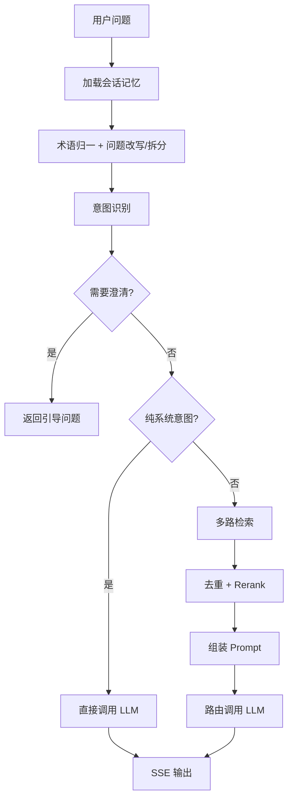
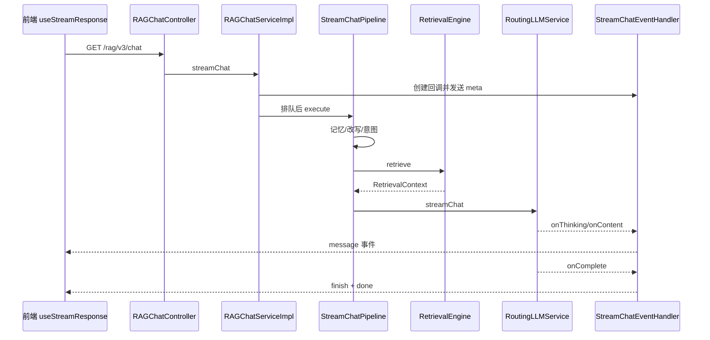

# RAG 问答主流程解析

## 调用链

| 调用顺序 | 类/文件 | 方法 | 作用 | 关键输入输出 |
|---|---|---|---|---|
| 1 | `RAGChatController` | `chat()` | 创建 SSE emitter | question -> SseEmitter |
| 2 | `RAGChatServiceImpl` | `streamChat()` | 建 conversation/task、排队、Trace | 请求 -> Context |
| 3 | `StreamChatPipeline` | `execute()` | 编排主流程 | Context 持续丰富 |
| 4 | `ConversationMemoryService` | `loadAndAppend()` | 读取摘要/历史并保存问题 | history |
| 5 | `MultiQuestionRewriteService` | `rewriteWithSplit()` | 术语归一、改写、拆问 | RewriteResult |
| 6 | `IntentResolver` | `resolve()` | 意图分类 | SubQuestionIntent |
| 7 | `IntentGuidanceService` | `detectAmbiguity()` | 低置信度时引导澄清 | GuidanceDecision |
| 8 | `RetrievalEngine` | `retrieve()` | 知识与 MCP 检索编排 | RetrievalContext |
| 9 | `MultiChannelRetrievalEngine` | 检索方法 | 意图定向/全局向量并行召回 | chunks |
| 10 | 去重、Rerank 处理器 | `process()` | 合并和重排 | Top-K chunks |
| 11 | `RAGPromptService` | `buildStructuredMessages()` | 组装知识/MCP/历史 Prompt | ChatMessage 列表 |
| 12 | `RoutingLLMService` | `streamChat()` | 模型路由和流式调用 | token chunks |
| 13 | `StreamChatEventHandler` | 回调方法 | SSE、持久化、完成事件 | meta/message/finish/done |

## 流程图

## 时序图

## 异常与短路

- 歧义时不检索，直接返回澄清提示。
- 全部为系统意图时绕过知识检索。
- 检索为空时返回“未检索到”并完成。
- Redis 队列限流控制并发和等待。
- `/rag/v3/stop` 可取消任务。
- 模型首包失败可切换候选；流已经输出后能否无缝切换受流式语义限制。
- `StreamChatEventHandler` 在完成或取消时尽力持久化回答。

## 本章复习问题

1. 为什么问题改写发生在意图和检索之前？
2. 哪两种情况会让 Pipeline 提前结束？
3. SSE 的 `meta`、`message`、`finish`、`done` 各有什么作用？

## 下一步建议

在 `StreamChatPipeline.execute()` 给每个私有阶段打断点，用一个知识问题和一个天气问题比较两条路径。
