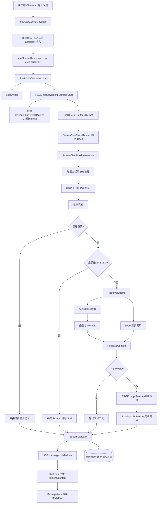
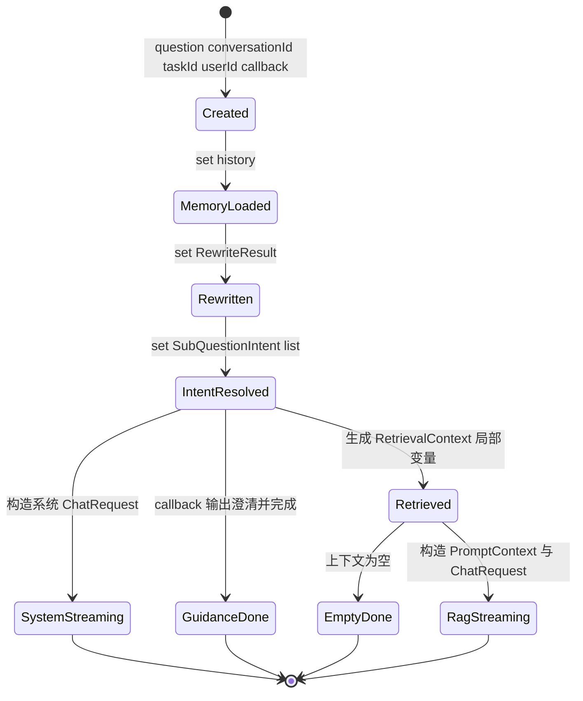
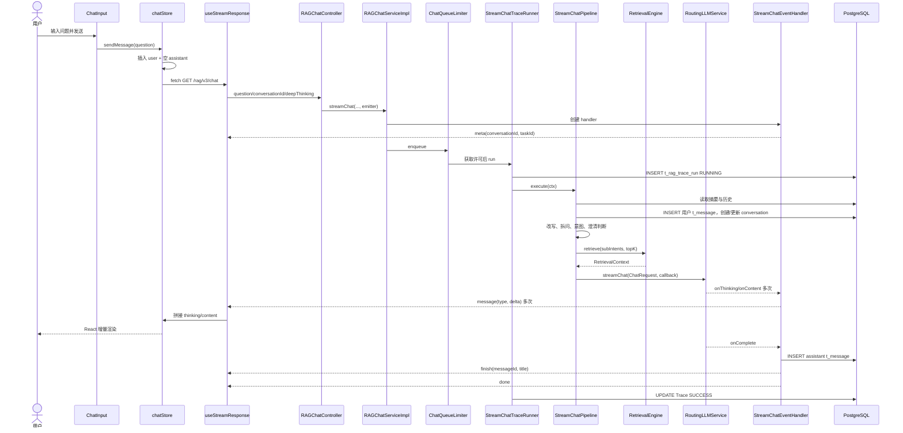
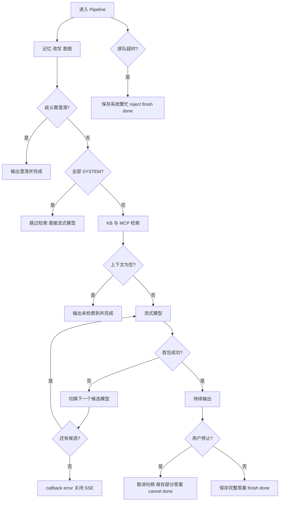

# RAG 问答主流程解析

> 本章是整套学习笔记的核心。建议先完整读一遍，再打开 IDE 按“Debug 路线”逐步跟踪。不要试图第一次就记住所有类，先抓住三条线：**数据怎么流动、在哪里可能短路、什么时候写数据库**。

## 本章目标

读完并完成实践后，你应该能够回答：

1. 用户在前端按下 Enter 后，问题经过哪些组件和 Java 类？
2. `StreamChatContext`、`RewriteResult`、`SubQuestionIntent`、`RetrievalContext`、`PromptContext` 分别保存什么？
3. 为什么一次问答不一定会执行向量检索？
4. 模型输出的思考内容和正式回答怎样变成 SSE 事件？
5. 用户点击“停止生成”后，前端、Redis 和模型取消句柄怎样协作？
6. 一次问答会修改哪些数据库表，怎样用 SQL 验证？

## 先记住这条主线

```text
ChatInput
  -> chatStore.sendMessage()
  -> useStreamResponse / fetch
  -> RAGChatController.chat()
  -> RAGChatServiceImpl.streamChat()
  -> ChatQueueLimiter + StreamChatTraceRunner
  -> StreamChatPipeline.execute()
  -> 记忆 -> 改写 -> 意图 -> 澄清/系统短路 -> KB/MCP 检索
  -> RAGPromptService
  -> RoutingLLMService.streamChat()
  -> StreamChatEventHandler
  -> SSE meta/message/finish/done
  -> chatStore 更新 Message
  -> MessageItem / MarkdownRenderer 渲染
```

完整接口路径还要叠加后端 Context Path：

```text
GET  /api/ragent/rag/v3/chat
POST /api/ragent/rag/v3/stop?taskId=...
```

其中 `/api/ragent` 来自 `bootstrap/src/main/resources/application.yaml` 的 `server.servlet.context-path`。

## 一次问答的全局图



## 核心类速查

| 阶段 | 文件 | 类/方法 | 主要输入 | 主要输出 |
|---|---|---|---|---|
| 输入 | `frontend/src/components/chat/ChatInput.tsx` | `handleSubmit()` | 输入框文本 | `sendMessage(content)` |
| 前端状态 | `frontend/src/stores/chatStore.ts` | `sendMessage()` | 文本、会话 ID、深度思考开关 | 本地消息、SSE 请求 |
| SSE 解析 | `frontend/src/hooks/useStreamResponse.ts` | `readSseStream()` | Fetch `Response.body` | 各事件处理器回调 |
| Web 入口 | `bootstrap/src/main/java/com/nageoffer/ai/ragent/rag/controller/RAGChatController.java` | `chat()` | query 参数 | `SseEmitter` |
| Service | `bootstrap/src/main/java/com/nageoffer/ai/ragent/rag/service/impl/RAGChatServiceImpl.java` | `streamChat()` | 问题、会话、emitter | 排队后的 Pipeline 任务 |
| 限流 | `bootstrap/src/main/java/com/nageoffer/ai/ragent/rag/service/ratelimit/ChatQueueLimiter.java` | `enqueue()` | 任务与限流配置 | 获取许可或 reject |
| Trace | `bootstrap/src/main/java/com/nageoffer/ai/ragent/rag/trace/StreamChatTraceRunner.java` | `run()` | taskId、callback、业务函数 | Trace 包装后的 callback |
| 主编排 | `bootstrap/src/main/java/com/nageoffer/ai/ragent/rag/service/pipeline/StreamChatPipeline.java` | `execute()` | `StreamChatContext` | 流式响应 |
| 记忆 | `bootstrap/src/main/java/com/nageoffer/ai/ragent/rag/core/memory/DefaultConversationMemoryService.java` | `load()`、`append()` | 会话、用户、消息 | 历史与消息 ID |
| 改写 | `bootstrap/src/main/java/com/nageoffer/ai/ragent/rag/core/rewrite/MultiQuestionRewriteService.java` | `rewriteWithSplit()` | 原问题、历史 | `RewriteResult` |
| 意图 | `bootstrap/src/main/java/com/nageoffer/ai/ragent/rag/core/intent/IntentResolver.java` | `resolve()` | `RewriteResult` | `SubQuestionIntent` 列表 |
| 澄清 | `bootstrap/src/main/java/com/nageoffer/ai/ragent/rag/core/guidance/IntentGuidanceService.java` | `detectAmbiguity()` | 改写问题、意图 | `GuidanceDecision` |
| 检索 | `bootstrap/src/main/java/com/nageoffer/ai/ragent/rag/core/retrieve/RetrievalEngine.java` | `retrieve()` | 子问题意图、Top-K | `RetrievalContext` |
| 多路召回 | `bootstrap/src/main/java/com/nageoffer/ai/ragent/rag/core/retrieve/MultiChannelRetrievalEngine.java` | `retrieveKnowledgeChannels()` | 意图、Top-K | `RetrievedChunk` 列表 |
| Prompt | `bootstrap/src/main/java/com/nageoffer/ai/ragent/rag/core/prompt/RAGPromptService.java` | `buildStructuredMessages()` | 上下文、历史、问题 | `ChatMessage` 列表 |
| 模型 | `infra-ai/src/main/java/com/nageoffer/ai/ragent/infra/chat/RoutingLLMService.java` | `streamChat()` | `ChatRequest`、callback | `StreamCancellationHandle` |
| SSE 回调 | `bootstrap/src/main/java/com/nageoffer/ai/ragent/rag/service/handler/StreamChatEventHandler.java` | `onThinking/onContent/onComplete` | 模型增量 | SSE 与消息落库 |

## 前端如何发起请求

### 页面与输入组件

聊天页面是 `frontend/src/pages/ChatPage.tsx`。它本身不直接发请求，主要负责：

- 从 URL 读取 `sessionId`；
- 调用 `fetchSessions()`、`selectSession()` 或 `createSession()`；
- 把 `messages`、`isLoading`、`isStreaming` 交给 `MessageList`；
- 渲染 `ChatInput`。

真正接收键盘输入的是 `frontend/src/components/chat/ChatInput.tsx`：

1. 文本先保存在组件局部状态 `value` 中。
2. 按 Enter 且不是中文输入法组合状态时调用 `handleSubmit()`。
3. 如果正在生成，按钮行为变为 `cancelGeneration()`。
4. 如果未生成且文本非空，清空输入框并调用 `sendMessage(next)`。
5. `deepThinkingEnabled` 会决定是否发送 `deepThinking=true`。

这里要区分两种状态：

- `value` 是输入框尚未发送的临时文本，只属于 `ChatInput`。
- `messages` 是已进入对话区的消息，属于全局 Zustand store。

### chatStore 先做乐观更新

文件：`frontend/src/stores/chatStore.ts`

`sendMessage()` 不会等后端返回后才展示消息，而是先构造两条本地消息：

```text
userMessage      = 当前用户问题，status=done
assistantMessage = 空内容，status=streaming
```

随后把两条消息追加到 `messages`，并设置：

| 状态字段 | 此时的值 | 用途 |
|---|---|---|
| `isStreaming` | `true` | 禁止重复提问并显示停止按钮 |
| `streamingMessageId` | 临时 assistant ID | 后续增量要更新哪条消息 |
| `streamTaskId` | `null` | 等待后端 `meta` 事件赋值 |
| `thinkingStartAt` | `null` | 首个 thinking 片段到达后计时 |
| `cancelRequested` | `false` | 处理 taskId 尚未返回时的提前取消 |

临时 ID 类似 `assistant-时间戳`。当 `finish` 事件带回数据库消息 ID 后，store 会把临时 ID 替换成真实 ID。`MessageItem` 也利用这一点：临时 ID 开头的消息不会显示点赞/点踩按钮。

### URL 和认证头

`sendMessage()` 使用 `buildQuery()` 组装：

```text
question=<用户问题>
conversationId=<已有会话 ID，可选>
deepThinking=true（开启时）
```

请求 URL 是：

```text
${VITE_API_BASE_URL}/rag/v3/chat?...query...
```

Token 从 `storage.getToken()` 读取，并通过 `Authorization` 请求头传递。

### 为什么不用普通 Axios JSON 请求

普通 Axios 调用通常等待整个响应结束后再给出完整 `response.data`。聊天回答需要边生成边显示，因此 `frontend/src/hooks/useStreamResponse.ts` 使用原生 `fetch()`：

1. `fetch` 返回后读取 `response.body.getReader()`；
2. `TextDecoder` 把字节增量解码为 UTF-8 文本；
3. 用 `buffer` 保存尚未形成完整行的数据；
4. 解析 `event:` 与一个或多个 `data:` 行；
5. 空行代表一个 SSE 事件结束，调用 `dispatchEvent()`；
6. JSON 数据交给 `onMeta/onMessage/onFinish/...`。

选择 `fetch` 还有两个实际好处：

- 可以显式设置 `Authorization`；
- 可以传入 `AbortSignal`。

浏览器原生 `EventSource` API 不方便设置自定义 Authorization 请求头，所以本项目没有直接使用 `EventSource`。

### AbortSignal 与当前停止实现

`createStreamResponse()` 内部创建 `AbortController`，返回：

```text
start()  -> 发起并读取 SSE
cancel() -> controller.abort()
```

`chatStore` 把 `cancel` 保存到 `streamAbort`。但要注意一个当前源码事实：

> 当前 `cancelGeneration()` 只设置 `cancelRequested` 并调用后端 `stopTask(taskId)`，没有调用 `streamAbort()`。

因此当前 UI 的“停止生成”主路径是：

```text
前端 POST /rag/v3/stop
  -> 后端取消模型句柄
  -> 后端发送 cancel + done
  -> SSE 正常结束
```

`AbortSignal` 仍用于 `fetch` 流和重试代码的中止判断，但当前停止按钮没有直接触发它。Debug 时不要假设点击停止一定会立即执行浏览器 `reader.cancel()`；应同时观察 `/rag/v3/stop` 请求与 `cancel` SSE 事件。

如果用户在 `meta` 到达前就点击停止，`streamTaskId` 还是空。store 会先把 `cancelRequested` 设为 `true`，等 `onMeta()` 收到 taskId 后补调 `stopTask(taskId)`，避免这个时间窗口丢失取消请求。

## Controller 层

文件：`bootstrap/src/main/java/com/nageoffer/ai/ragent/rag/controller/RAGChatController.java`

### chat()

接口定义：

```java
@GetMapping(value = "/rag/v3/chat", produces = "text/event-stream;charset=UTF-8")
public SseEmitter chat(String question, String conversationId, Boolean deepThinking)
```

三个参数的含义：

| 参数 | 是否必填 | 含义 |
|---|---|---|
| `question` | 是 | 用户原始问题 |
| `conversationId` | 否 | 已有会话 ID；空表示新会话 |
| `deepThinking` | 否，默认 false | 是否选择支持 thinking 的模型候选 |

Controller 创建 `SseEmitter`，超时来自：

```yaml
rag:
  default:
    sse-timeout-ms: 300000
```

当前默认是 300000 毫秒，即 5 分钟。Controller 不等待模型回答完成，而是把 emitter 交给 `ragChatService.streamChat()` 后立即返回，让后续线程持续向连接推事件。

`chat()` 上还有 `@IdempotentSubmit`。它使用当前用户 ID 作为 key，目的是阻止同一用户在上一会话仍处理时再次并发提交。它与后面的全局排队限流解决的问题不同：

- 幂等注解控制同一用户重复/并发提交；
- `ChatQueueLimiter` 控制全局模型并发和等待队列。

### stop()

```text
POST /rag/v3/stop?taskId=<meta 事件返回的 taskId>
```

`stop()` 调用 `ragChatService.stopTask(taskId)`，最终进入 `StreamTaskManager.cancel(taskId)`。停止接口本身返回普通统一结果，不是 SSE。

## Service 层

文件：`bootstrap/src/main/java/com/nageoffer/ai/ragent/rag/service/impl/RAGChatServiceImpl.java`

### conversationId 与 taskId

`streamChat()` 首先处理两个标识：

- 已传 `conversationId`：沿用现有会话。
- 未传 `conversationId`：使用雪花 ID 生成新会话 ID。
- 每次提问都生成新的 `taskId`，即使在同一 conversation 中也不复用。

因此：

```text
conversationId = 一组多轮对话的身份
taskId         = 本次流式生成任务的身份
traceId        = 本次 Trace 的身份
messageId      = 一条数据库消息的身份
```

初学者最容易把这四个 ID 混在一起。Debug 时建议在 Watches 中同时固定观察它们。

### 创建 StreamChatEventHandler

`StreamCallbackFactory.createChatEventHandler()` 创建 `StreamChatEventHandler`。构造器会立即：

1. 用 emitter 创建线程安全封装 `SseEmitterSender`；
2. 从 `UserContext` 读取用户 ID；
3. 判断新会话完成时是否需要返回标题；
4. 发送 `meta`，内容是 `conversationId + taskId`；
5. 在 `StreamTaskManager` 注册任务和取消时的持久化函数。

也就是说，`meta` 往往早于问题改写、检索和模型调用。前端正是靠它尽早获得新会话 ID 和停止任务所需的 taskId。

### 用户上下文

`RAGChatServiceImpl` 构造 `StreamChatContext` 时读取 `UserContext.getUserId()`。这个 userId 会用于：

- 隔离会话和消息；
- 加载正确用户的历史；
- 写 `t_conversation`、`t_message`；
- 写 Trace 的 userId；
- 幂等与认证关联。

异步线程中还能读取到上下文，依赖项目线程池的上下文透传配置。若 Debug 时异步线程 userId 为空，应优先检查上下文拦截器与 TTL 包装线程池。

### 排队和并发限流

`ChatQueueLimiter.enqueue()` 根据 `rag.rate-limit.global.enabled` 决定是否排队。默认配置：

```yaml
max-concurrent: 10
max-wait-seconds: 15
lease-seconds: 30
poll-interval-ms: 200
```

拿到许可后，`onAcquire` 才会进入 Trace 和 Pipeline。等待超时或入口线程池拒绝任务时走 `handleReject()`：

1. 保存用户问题；
2. 保存助手消息“系统繁忙，请稍后再试”；
3. 发送 `meta`；
4. 发送 `reject`；
5. 发送 `finish`；
6. 发送 `done`。

所以“被限流”不是简单 HTTP 429，而是一条可在聊天页面展示、也会落库的完整 SSE 业务结果。

这里还有一个值得实测的细节：`RAGChatServiceImpl` 在进入 `enqueue()` 之前已经创建了 `StreamChatEventHandler`，其构造过程会先发送一次 `meta`；而 reject 分支的 `sendRejectEvents()` 又会发送一组 `meta/reject/finish/done`，并新建一个 reject taskId。静态阅读表明排队拒绝时前端可能收到两次 `meta`，且两次 taskId 不同。应通过制造排队超时并观察浏览器 EventStream，确认实际事件顺序与原任务注册清理情况。

### Trace 创建

`StreamChatTraceRunner.run()` 在 `rag.trace.enabled=true` 时：

- 生成 `traceId`；
- 向 `t_rag_trace_run` 写一条 `RUNNING` 记录；
- 保存 conversationId、taskId、userId；
- 用 `ForwardingStreamCallback` 包装原 callback；
- 第一个真正内容到达时记录 `user-first-packet`；
- 完成或异常时把 run 更新为 `SUCCESS` 或 `ERROR`。

`extra_data` 当前会保存问题长度和问题文本。生产环境使用时要结合数据安全要求评估是否应保留完整问题。

## StreamChatContext：贯穿 Pipeline 的工作台

文件：`bootstrap/src/main/java/com/nageoffer/ai/ragent/rag/service/pipeline/StreamChatContext.java`

### 字段清单

| 字段 | 创建时是否已有 | 谁读取/写入 | 含义 |
|---|---|---|---|
| `question` | 是 | 改写、记忆 | 用户原始问题 |
| `conversationId` | 是 | 记忆、SSE | 会话 ID |
| `taskId` | 是 | 取消句柄绑定 | 本次任务 ID |
| `deepThinking` | 是 | 模型请求 | 是否开启 thinking |
| `userId` | 是 | 记忆与数据隔离 | 当前用户 ID |
| `callback` | 是 | 所有输出分支 | Trace 包装后的流回调 |
| `history` | 否 | `loadMemory()` 写 | 摘要 + 近期历史 |
| `rewriteResult` | 否 | `rewriteQuery()` 写 | 改写问题和子问题 |
| `subIntents` | 否 | `resolveIntents()` 写 | 每个子问题的意图候选 |

它没有保存 `RetrievalContext`，因为检索结果只在 `execute()` 后半段局部使用，并直接传给 `streamRagResponse()`。

### 为什么使用 Context 对象

如果不用 Context，`execute()` 后面的参数会越来越长：问题、会话、任务、用户、历史、改写结果、意图、callback 都要逐层传递。Context 的价值是：

- 把一次请求的状态集中到一个对象；
- 让阶段方法只接收一个参数；
- 清楚区分不可变输入和逐步填充的中间结果；
- Debug 时只观察 `ctx` 就能了解流程走到哪里。

代价也要知道：Context 可变字段过多时，阶段之间会形成隐式依赖。当前 `StreamChatContext` 只保留三个可变阶段字段，范围还比较克制。

### Context 状态变化图



## StreamChatPipeline.execute() 总体控制

文件：`bootstrap/src/main/java/com/nageoffer/ai/ragent/rag/service/pipeline/StreamChatPipeline.java`

`execute()` 的真实顺序是：

```java
loadMemory(ctx);
rewriteQuery(ctx);
resolveIntents(ctx);

if (handleGuidance(ctx)) return;
if (handleSystemOnly(ctx)) return;

RetrievalContext retrievalCtx = retrieve(ctx);
if (handleEmptyRetrieval(ctx, retrievalCtx)) return;

streamRagResponse(ctx, retrievalCtx);
```

这里的设计重点是：前三步必走，后三个 `handleXxx()` 使用 boolean 表示“我已经完整处理了响应，上层现在应 return”。

## loadMemory()：加载历史并先保存用户问题

```java
memoryService.loadAndAppend(
    conversationId,
    userId,
    ChatMessage.user(question)
)
```

`ConversationMemoryService.loadAndAppend()` 的顺序是：

1. `load()` 获取追加前的历史；
2. `append()` 保存本轮用户问题；
3. 返回旧历史。

因此 `ctx.history` 不包含刚刚保存的当前问题。当前问题会在改写请求和最终 Prompt 中单独追加，避免重复。

`DefaultConversationMemoryService.load()` 并行读取：

- 最新摘要；
- 最近若干轮 user/assistant 消息。

失败策略比较温和：摘要失败就忽略摘要，历史失败就返回空列表，不会因为记忆不可用直接终止本次问答。

`JdbcConversationMemoryStore.append()` 保存用户消息时，还会调用 `ConversationService.createOrUpdate()`：

- 新会话：生成标题并写 `t_conversation`；
- 已有会话：更新 `last_time`。

所以新会话并不是前端先单独创建的，而是在第一条用户消息持久化时创建。

## rewriteQuery()：把口语问题变成检索问题

调用：

```java
queryRewriteService.rewriteWithSplit(ctx.getQuestion(), ctx.getHistory())
```

默认实现是 `MultiQuestionRewriteService`，输出 `RewriteResult`：

```text
rewrittenQuestion = 归一化、补全指代后的主问题
subQuestions      = 一个或多个可独立分类和检索的子问题
```

处理过程：

1. `QueryTermMappingService.normalize()` 做术语映射；
2. 若 `rag.query-rewrite.enabled=false`，使用规则拆分；
3. 否则加载 `bootstrap/src/main/resources/prompt/user-question-rewrite.st`；
4. 只带最近最多四条 user/assistant 历史，不把 system 摘要送入本次改写；
5. 使用非流式 `LLMService.chat()`；
6. 解析模型返回的 `rewrite` 与 `sub_questions`；
7. JSON 无效或模型调用失败时，退回“归一化问题 + 单子问题”。

改写不会因为模型失败而让主流程失败，这是一个明确的降级点。

### 多轮历史为什么重要

例如：

```text
上一轮：OA 系统的审批流程是什么？
本轮：它支持移动端吗？
```

只检索“它支持移动端吗”几乎没有意义。改写模型可以结合近期历史还原为“OA 系统是否支持移动端审批”。

### 拆问怎样影响后续

若用户问“年假怎么算？病假需要什么材料？”，输出两个子问题后：

- `IntentResolver` 会并行分类两个问题；
- `RetrievalEngine` 会并行构建两个子问题上下文；
- Prompt 中会用编号问题和分组证据组织结果。

## resolveIntents()：为每个子问题找路线

`IntentResolver.resolve()` 接收 `RewriteResult`，对每个子问题异步调用 `IntentClassifier.classifyTargets()`。

默认分类器 `DefaultIntentClassifier` 会：

1. 从 Redis 加载意图树，缓存未命中时查 `t_intent_node`；
2. 展平树并选择叶子节点；
3. 用 `intent-classifier.st` 构造分类 Prompt；
4. 调用 LLM 返回意图 ID、score；
5. 将 ID 映射回 `IntentNode`；
6. 按分数降序；
7. `IntentResolver` 过滤低于 `INTENT_MIN_SCORE` 的项并限制总数量。

单个子问题分类异常时会降级为：

```java
new SubQuestionIntent(question, List.of())
```

空意图不代表流程结束。它会使全局向量检索成为兜底候选。

### 三类意图

`IntentKind` 定义在 `bootstrap/src/main/java/com/nageoffer/ai/ragent/rag/enums/IntentKind.java`：

| 类型 | code | 后续行为 | 关键节点字段 |
|---|---:|---|---|
| `KB` | 0 | 知识库检索 | `collectionName`、`topK` |
| `SYSTEM` | 1 | 不检索，直接生成 | `promptTemplate` |
| `MCP` | 2 | 提参并调用工具 | `mcpToolId`、`paramPromptTemplate` |

`SubQuestionIntent` 把一个子问题和它的 `NodeScore` 列表绑在一起。一个多问句可能产生多个 `SubQuestionIntent`。

## handleGuidance()：歧义时先问清楚

`IntentGuidanceService.detectAmbiguity()` 只在符合条件时返回引导语。主要判断包括：

- 当前只有一个子问题；
- 至少有两个 KB 候选；
- 候选来自不同系统/分类分组；
- 前两名分数比例接近；
- 用户问题没有明确写出系统名；
- 边界区间可再调用 LLM 确认是否歧义。

一旦 `decision.isPrompt()` 为 true：

```java
callback.onContent(decision.getPrompt());
callback.onComplete();
return true;
```

这条路径不会继续检索，也不会再次调用最终回答模型。澄清文本作为 assistant 消息通过 `onComplete()` 正常落入 `t_message`。

## handleSystemOnly()：纯系统问题绕过检索

只有所有子问题都满足 `intentResolver.isSystemOnly()` 时才进入。`isSystemOnly()` 要求某个子问题恰好只有一个意图，且 kind 是 `SYSTEM`。

典型问题可能是“你好”“你是谁”。流程会：

1. 从命中的意图节点寻找自定义 `promptTemplate`；
2. 没有自定义模板时加载 `answer-chat-system.st`；
3. 组装 system + history + 当前问题；
4. 构造 `ChatRequest`，`temperature=0.7`、`thinking=false`；
5. 调 `llmService.streamChat()`；
6. 把取消句柄绑定到 taskId；
7. `return true`，不进入知识或 MCP 检索。

注意：前端即使开启深度思考，system-only 路径也显式设置 `thinking=false`。

## retrieve()：统一执行 KB 与 MCP

```java
retrievalEngine.retrieve(ctx.getSubIntents(), searchProperties.getDefaultTopK())
```

`RetrievalEngine` 不是只做向量检索。它统一编排：

- 每个子问题的 KB 意图检索；
- 每个子问题的 MCP 工具调用；
- 多子问题结果格式化；
- 最终 `RetrievalContext` 合并。

每个子问题由 `ragContextExecutor` 并行处理。某个子问题失败时记录日志并降级为空上下文，不直接拖垮其他子问题。

### RetrievalContext

| 字段 | 内容 | 后续用途 |
|---|---|---|
| `kbContext` | 格式化后的知识片段 | Prompt 的 `<documents>` |
| `mcpContext` | 格式化后的工具结果 | Prompt 的 `<tool-data>` |
| `intentChunks` | intent ID 到 chunks 的映射 | 判断哪些意图真正命中文档 |

`isEmpty()` 只有在 KB 与 MCP 上下文都为空时才返回 true。

## MultiChannelRetrievalEngine：多路知识检索

`RetrievalEngine.retrieveAndRerank()` 调用：

```java
multiChannelRetrievalEngine.retrieveKnowledgeChannels(subIntents, topK)
```

这里分两大阶段。

### 阶段一：并行 SearchChannel

当前源码主要有两个通道。

#### intent-directed

类：`bootstrap/src/main/java/com/nageoffer/ai/ragent/rag/core/retrieve/channel/IntentDirectedSearchChannel.java`

启用条件：

- 配置 `intent-directed.enabled=true`；
- 至少存在分数达到 `min-intent-score` 的 KB 意图。

它根据意图节点指定的 collection/知识库做定向检索。候选数量会乘 `top-k-multiplier`，当前配置为 2，给后续去重和 Rerank 留足候选。

#### vector-global

类：`bootstrap/src/main/java/com/nageoffer/ai/ragent/rag/core/retrieve/channel/VectorGlobalSearchChannel.java`

它用于兜底或补充：

- 意图定向检索关闭；
- 没有识别出意图；
- 最大意图分数低于 `confidence-threshold`；
- 单一意图处于补充阈值范围。

它从 `t_knowledge_base` 读取所有未删除知识库的 `collection_name`，并行跨 collection 检索。当前 `top-k-multiplier` 为 3。

> 需要进一步确认：`single-intent-supplement-threshold` 未在当前 `application.yaml` 显式配置，应以 `SearchChannelProperties` 默认值和实际绑定结果为准。

两个通道由 `ragRetrievalExecutor` 并行执行。单个通道异常被转换为空结果，其他通道仍可继续。

### 阶段二：后处理器链

处理器按 `getOrder()` 排序。

1. `DeduplicationPostProcessor`，order=1：按 chunk ID 去重；没有 ID 时用文本 hash；重复时保留较高分。
2. `RerankPostProcessor`，order=10：当 `rag.rerank.enabled=true` 时调用 `RerankService.rerank(question, chunks, topK)`，输出最终 Top-K。

某个后处理器异常时，`MultiChannelRetrievalEngine` 记录错误并继续下一个处理器，不让整次检索直接失败。

### Top-K 在哪里决定

默认值来自 `SearchChannelProperties.defaultTopK`。每个 KB 意图节点还可以配置自己的 `topK`。`RetrievalEngine.resolveSubQuestionTopK()` 会从该子问题的 KB 意图中取有效 topK 的最大值，否则使用默认值。

要区分：

- 通道召回数量可能是 Top-K 的 2 倍或 3 倍；
- Rerank 最终才裁剪到目标 Top-K；
- Top-K 太小可能漏信息，太大会增加 Prompt 噪声和 Token 成本。

## MCP 在 RetrievalEngine 中如何融合

若子问题命中 MCP 意图，`RetrievalEngine` 会：

1. 从 `IntentNode.mcpToolId` 获取工具 ID；
2. 从 `McpToolRegistry` 查执行器；
3. 读取 MCP 工具定义；
4. `McpParameterExtractor` 用问题和工具 schema 提取参数；
5. `McpToolExecutor.execute(params)` 调远端工具；
6. 按 toolId 分组工具结果；
7. `ContextFormatter.formatMcpContext()` 生成 `mcpContext`。

多个 MCP 意图由 `mcpBatchExecutor` 并行执行。工具异常会被包装成 `isError=true` 的 `CallToolResult`，因此错误信息也可能进入 MCP 上下文，供最终模型用自然语言解释。

## handleEmptyRetrieval()：没有证据就停止

若 `RetrievalContext.isEmpty()`：

```java
callback.onContent("未检索到与问题相关的文档内容。");
callback.onComplete();
return true;
```

这条路径不调用最终回答模型，但提示仍会：

- 通过 `message` 事件显示；
- 作为 assistant 消息写 `t_message`；
- 触发 `finish` 和 `done`；
- 正常结束 Trace。

## streamRagResponse()：进入最终生成

如果至少有 KB 或 MCP 上下文：

1. `intentResolver.mergeIntentGroup()` 汇总所有 KB/MCP 意图；
2. 调 `streamLLMResponse()`；
3. 得到 `StreamCancellationHandle`；
4. `taskManager.bindHandle(taskId, handle)`。

绑定句柄后，`StreamTaskManager` 才能把 `/rag/v3/stop` 转换成底层模型客户端的 `handle.cancel()`。

如果用户在句柄绑定前已经取消，`bindHandle()` 会检查已取消状态并立即调用新句柄的 `cancel()`。

## Prompt 组装

文件：`bootstrap/src/main/java/com/nageoffer/ai/ragent/rag/core/prompt/RAGPromptService.java`

### PromptContext

`streamLLMResponse()` 把检索结果和意图转换为：

```text
question     = rewrittenQuestion
mcpContext   = 工具结果文本
kbContext    = 知识片段文本
mcpIntents   = MCP 意图
kbIntents    = KB 意图
intentChunks = 意图到 chunk 的映射
```

`PromptContext` 与 `StreamChatContext` 不同：

- `StreamChatContext` 服务于整条业务 Pipeline；
- `PromptContext` 只服务于 Prompt 规划和渲染。

### 场景选择

`RAGPromptService.plan()` 根据上下文选择：

| 场景 | 条件 | 默认模板 |
|---|---|---|
| `KB_ONLY` | 只有知识上下文 | `answer-chat-kb.st` |
| `MCP_ONLY` | 只有工具上下文 | `answer-chat-mcp.st` |
| `MIXED` | 两者都有 | `answer-chat-mcp-kb-mixed.st` |

模板实际位于 `bootstrap/src/main/resources/prompt/`，不是项目根目录 `resources/prompt/`。

单一意图若配置了节点级 `promptTemplate`，可以覆盖默认基础模板。多意图统一使用默认模板，避免多个完整系统模板互相冲突。

### 最终消息顺序

`buildStructuredMessages()` 生成：

```text
1. system: 选定并清理后的系统 Prompt
2. history: 摘要（可能是 system）与近期 user/assistant 历史
3. user: MCP/KB 证据 + 当前问题或编号子问题
```

证据和当前问题合并成最后一条 user message，格式由 `context-format.st` 统一渲染，例如：

```text
<tool-data>...</tool-data>
<documents>...</documents>
<question>...</question>
```

这让模型清楚区分规则、历史、证据和当前请求。

## streamSystemResponse() 与 streamLLMResponse()

### streamSystemResponse()

用于 system-only：

- 消息：system + history + question；
- `temperature=0.7`；
- `thinking=false`；
- 不包含 KB/MCP 证据。

### streamLLMResponse()

用于正常 RAG/MCP：

- 消息来自 `RAGPromptService`；
- `thinking=deepThinking`；
- MCP 场景 `temperature=0.3`、`topP=0.8`；
- 纯 KB 场景 `temperature=0`、`topP=1`。

这里的意图是：知识问答尽量稳定保守；MCP 动态数据场景适度放宽表达，但事实仍应受工具结果约束。

## 模型流式调用

### LLMService 与 ChatRequest

业务层依赖 `infra-ai/src/main/java/com/nageoffer/ai/ragent/infra/chat/LLMService.java`，实际 Bean 是 `RoutingLLMService`。

`ChatRequest` 定义在 `framework/src/main/java/com/nageoffer/ai/ragent/framework/convention/ChatRequest.java`，核心字段：

- `messages`：system/user/assistant 序列；
- `temperature`、`topP`：采样控制；
- `thinking`：是否请求思考输出；
- `maxTokens`、`topK`：可选控制项。

### RoutingLLMService.streamChat()

1. `ModelSelector.selectChatCandidates(thinking)` 选候选；
2. 深度思考时过滤掉不支持 thinking 的模型；
3. 跳过熔断状态不允许调用的模型；
4. 找到供应商 `ChatClient`；
5. 使用 `ProbeStreamBridge` 暂存首包前事件；
6. 启动流式请求并获得取消句柄；
7. 等待首个 thinking/content 包；
8. 首包成功才提交缓冲并正式向下游发送；
9. 启动失败、首包超时、无内容完成时取消当前句柄并尝试下一个模型；
10. 所有候选失败时调用 callback error 并抛异常。

首包之后已经把内容发给用户，当前方法就返回该模型的 handle，不再对后续中途失败做“从另一个模型重头续写”，因为那会造成重复和答案不一致。

### StreamCallback

模型客户端不直接认识 SSE，它只调用统一回调：

```text
onThinking(chunk) -> 思考增量
onContent(chunk)  -> 正式回答增量
onComplete()      -> 正常完成
onError(error)    -> 异常
```

这种设计把“模型供应商协议”与“SSE/数据库/UI”解耦。

## SSE 返回与前端解析

### 后端事件

`StreamChatEventHandler` 使用 `SseEmitterSender` 发送命名事件。

| 事件 | 数据 | 发送时机 | 前端处理 |
|---|---|---|---|
| `meta` | conversationId、taskId | Handler 初始化 | 建立会话、保存 taskId |
| `message` | type=`think/response`、delta | 模型增量 | 分别追加 thinking/content |
| `finish` | messageId、title | 正常回答落库后 | 替换真实消息 ID、更新标题 |
| `cancel` | messageId、title | 用户停止后 | 标记 cancelled、追加停止提示 |
| `reject` | response delta | 排队超时/线程池拒绝 | 显示系统繁忙 |
| `done` | `[DONE]` | 流最终结束 | 清理 streaming 状态 |
| `error` | 错误信息 | 前端解析器支持 | 标记 error |

两个准确性说明：

1. thinking 并不是独立 SSE 事件名，而是 `event: message` 中 `type=think`。
2. 后端 `SSEEventType` 当前没有 `ERROR` 枚举；`StreamChatEventHandler.onError()` 调用 `completeWithError()`。因此多数模型/连接错误会表现为 fetch 流异常并进入前端 catch，而不是收到命名的 `event:error`。前端解析器虽然支持 `error`，但当前主后端链路未显式发送它。

### StreamChatEventHandler 怎样发片段

Handler 分别累积：

- `thinking` StringBuilder；
- `answer` StringBuilder。

`sendChunked()` 按 `ai.stream.message-chunk-size` 把模型片段再次切成面向前端的小块。当前配置为 1 个 Unicode code point，中文和 emoji 不会被错误拆成半个代理字符。

首个 thinking 到来时记录开始时间；首个正式 content 到来时计算 thinking 秒数。

### 前端怎样更新页面

`readSseStream()` 对 `message` 做二次分发：

- type=`think`：调用 `onThinking()`；
- 所有 message 都调用 `onMessage()`，但 store 的 `onMessage` 只接受 type=`response`。

`appendThinkingContent()`：

- 第一次写 `thinkingStartAt`；
- 把 delta 拼到当前 assistant 的 `thinking`；
- `isThinking=true`。

`appendStreamContent()`：

- 把 delta 拼到 `content`；
- 若此前在 thinking，结束 thinking 状态并计算耗时。

`MessageItem.tsx` 最终：

- 用户消息用普通气泡显示；
- thinking 进行中显示 `ThinkingIndicator`；
- thinking 完成后可折叠展开；
- content 交给 `MarkdownRenderer`；
- error 状态显示“生成已中断”；
- 后端真实 messageId 到达后显示反馈按钮。

### 完整时序图



## 数据库在一次问答中的变化

建表脚本：`resources/database/schema_pg.sql`

### t_conversation

第一条用户消息写入时，`JdbcConversationMemoryStore.append()` 调 `ConversationService.createOrUpdate()`：

- 新会话插入 conversation_id、user_id、title、last_time；
- 老会话更新 last_time；
- `(conversation_id, user_id)` 有唯一约束。

标题由 `ConversationTitleGenerator` 调 LLM 生成，失败时应结合其源码观察兜底逻辑。

### t_message

本轮至少写两条：

1. `role=user`：在 `loadMemory()` 中先保存；
2. `role=assistant`：在 `StreamChatEventHandler.onComplete()` 保存。

assistant 还可能保存：

- `thinking_content`；
- `thinking_duration`。

取消时如果已有正式回答内容，`buildCompletionPayloadOnCancel()` 会保存部分回答。若只有 thinking、没有 answer，则当前代码不会保存 assistant 消息。

### t_conversation_summary

每次 append assistant 后，`JdbcConversationMemorySummaryService.compressIfNeeded()` 异步检查是否需要摘要。默认：

```yaml
history-keep-turns: 4
summary-start-turns: 5
summary-enabled: true
summary-max-chars: 200
```

含义是近期历史保留 4 轮；达到摘要条件后，把更早消息压缩为不超过 200 字的话题摘要。摘要不保存具体答案，只保存话题、状态和约束，防止旧答案覆盖最新知识。

这套设计控制 Token 成本：最终 Prompt 不必携带全部历史，只携带摘要和最近消息。

### t_rag_trace_run

一次问答对应一条 run：

- 开始是 `RUNNING`；
- 正常回调完成后为 `SUCCESS`；
- 异常为 `ERROR`；
- 保存 traceId、conversationId、taskId、userId 和总耗时。

### t_rag_trace_node

带 `@RagTraceNode` 的阶段会产生节点，例如：

- `query-rewrite-and-split`；
- `intent-resolve`；
- `guidance-detect`；
- `retrieval-engine`；
- `multi-channel-retrieval`；
- `llm-stream-routing`；
- `llm-first-packet`；
- 具体模型供应商节点；
- `user-first-packet`。

节点保存 class_name、method_name、status、duration_ms、父子层级和错误。

### 验证 SQL

以下 SQL 只用于学习环境，请替换占位符：

```sql
SELECT *
FROM t_conversation
WHERE conversation_id = 'your-conversation-id';

SELECT id, role, content, thinking_content, thinking_duration, create_time
FROM t_message
WHERE conversation_id = 'your-conversation-id'
ORDER BY create_time;

SELECT *
FROM t_conversation_summary
WHERE conversation_id = 'your-conversation-id'
ORDER BY create_time DESC;

SELECT trace_id, task_id, status, duration_ms, error_message
FROM t_rag_trace_run
WHERE conversation_id = 'your-conversation-id'
ORDER BY create_time DESC;

SELECT node_type, node_name, class_name, method_name, status, duration_ms, error_message
FROM t_rag_trace_node
WHERE trace_id = 'your-trace-id'
ORDER BY start_time;
```

## 短路与异常路径



### 需要澄清

不检索、不调用最终回答模型，直接把澄清问题当作回答保存。

### system-only

不走 KB/MCP，但仍调用流式 LLM，并使用历史与系统 Prompt。

### 检索为空

不调用最终回答模型，返回固定提示并正常落库。

### 模型失败

首包前失败可切换候选；所有候选失败后 callback error，SSE 以异常结束。首包后中途失败不会自动从另一个模型续写。

### 用户停止

`StreamTaskManager`：

1. Redis 写 `ragent:stream:cancel:<taskId>`，TTL 30 分钟；
2. 向 `ragent:stream:cancel` Topic 发布 taskId；
3. 每个实例监听 Topic，本地命中任务后 CAS 标记 cancelled；
4. 调模型 `handle.cancel()`；
5. 保存已累积的正式回答；
6. 发送 `cancel` 和 `done`。

这使停止操作支持多实例：停止请求落到实例 B，也能通知真正执行任务的实例 A。

### SSE 超时

`SseEmitterSender` 在 emitter timeout 时把连接标记为 closed，后续发送会被忽略。`ChatQueueLimiter` 也把 emitter timeout 绑定为排队取消信号。

> 需要进一步确认：连接在模型已开始生成后发生 SSE 超时时，是否总能同步取消底层模型句柄。当前 `SseEmitterSender` 负责关闭标记，`StreamTaskManager` 的模型取消主要由显式 stop 驱动，应通过实际超时实验确认资源释放行为。

### 并发限流

等待超时会走 reject 业务路径，不进入 Trace/Pipeline；用户仍看到可理解提示，并产生会话消息。

## 案例 A：知识库问题

问题示例：

```text
公司的年假如何计算？
```

### 每个阶段会发生什么

1. `ChatInput.handleSubmit()` 调 `sendMessage()`。
2. store 立即显示用户问题和等待中的 assistant 气泡。
3. 后端创建 conversationId、taskId，先发 `meta`。
4. 排队许可获取成功，创建 Trace。
5. `loadMemory()` 读取该用户近期历史，并把本问题写 `t_message`；新会话同时写 `t_conversation`。
6. `rewriteQuery()` 可能把礼貌语去掉，得到“公司年假计算规则”。
7. `resolveIntents()` 命中人事/薪资福利或假期相关 KB 节点。
8. 若多个系统都有“年假”且问题不明确，`handleGuidance()` 可能先让用户选择；否则继续。
9. `IntentDirectedSearchChannel` 在命中知识库定向召回。
10. 若置信度不够，`VectorGlobalSearchChannel` 同时跨知识库补充召回。
11. 去重处理重复 chunk，Rerank 选出最终 Top-K。
12. `RetrievalContext.kbContext` 有值，`mcpContext` 为空。
13. `RAGPromptService` 选择 `KB_ONLY`，组装系统规则、历史、文档证据和问题。
14. `RoutingLLMService` 选择普通 Chat 候选，首包探测成功后流式输出。
15. Handler 把 content 变成 `message(type=response)`。
16. 前端持续拼接并由 `MarkdownRenderer` 展示。
17. 完成时 assistant 消息写 `t_message`，发 `finish(messageId,title)` 和 `done`。
18. Trace run 与 nodes 更新耗时，可检查检索和模型哪个阶段更慢。

## 案例 B：天气 MCP 工具问题

问题示例：

```text
北京今天天气怎么样？
```

> 需要进一步确认：当前初始化数据是否已配置一个启用的天气 MCP 意图节点及其准确 `mcp_tool_id`。服务端确实存在 `mcp-server/src/main/java/com/nageoffer/ai/ragent/mcp/executor/WeatherMcpExecutor.java`，但本地验证前应查询 `t_intent_node`。

### 每个阶段会发生什么

1. 前端和 Controller/Service 流程与知识问题一致。
2. 改写保留“北京”“今天”等工具参数线索。
3. 意图分类应命中 kind=`MCP` 的天气节点。
4. `handleSystemOnly()` 返回 false。
5. `RetrievalEngine.buildSubQuestionContext()` 将它分到 mcpIntents。
6. Registry 根据 `mcpToolId` 找 `McpClientToolExecutor`。
7. `LLMMcpParameterExtractor` 根据工具定义提取城市和时间等参数。
8. MCP 客户端调用 9099 服务，最终执行 `WeatherMcpExecutor`。
9. 工具结果格式化为 `RetrievalContext.mcpContext`。
10. 若没有 KB 意图，`kbContext` 为空。
11. `RAGPromptService` 选择 `MCP_ONLY` 模板，把实时工具数据放入 `<tool-data>`。
12. `streamLLMResponse()` 使用 MCP 参数：`temperature=0.3`、`topP=0.8`。
13. 模型根据工具结果生成自然语言回答，仍走统一 SSE 和落库流程。

如果 MCP 服务没启动、toolId 不匹配或参数提取失败，应重点观察：

- `RetrievalEngine.executeSingleMcpTool()`；
- `McpToolRegistry.getExecutor()`；
- MCP 启动时 `tools/list` 日志；
- `RetrievalContext.mcpContext` 是否为空或含错误结果。

## Debug 路线

建议使用一个新会话和一句简单问题，按下表顺序打断点。异步线程较多，IDE 中可开启“只暂停当前线程”，避免所有线程互相阻塞。

| 顺序 | 断点位置 | 文件 | 重点观察 |
|---:|---|---|---|
| 1 | `handleSubmit()` | `frontend/src/components/chat/ChatInput.tsx` | `value`、`isStreaming`、`deepThinkingEnabled` |
| 2 | `sendMessage()` | `frontend/src/stores/chatStore.ts` | `trimmed`、临时 assistantId、conversationId |
| 3 | `readSseStream()` | `frontend/src/hooks/useStreamResponse.ts` | `eventName`、`dataLines`、`payload` |
| 4 | `RAGChatController.chat()` | `bootstrap/src/main/java/com/nageoffer/ai/ragent/rag/controller/RAGChatController.java` | 三个请求参数、SSE timeout |
| 5 | `RAGChatServiceImpl.streamChat()` | `bootstrap/src/main/java/com/nageoffer/ai/ragent/rag/service/impl/RAGChatServiceImpl.java` | actualConversationId、taskId、UserContext |
| 6 | `StreamChatEventHandler.initialize()` | `bootstrap/src/main/java/com/nageoffer/ai/ragent/rag/service/handler/StreamChatEventHandler.java` | meta 发送、任务注册 |
| 7 | `ChatQueueLimiter.enqueue()` | `bootstrap/src/main/java/com/nageoffer/ai/ragent/rag/service/ratelimit/ChatQueueLimiter.java` | 限流是否启用、是否拿到许可 |
| 8 | `StreamChatTraceRunner.run()` | `bootstrap/src/main/java/com/nageoffer/ai/ragent/rag/trace/StreamChatTraceRunner.java` | traceId、RUNNING 记录 |
| 9 | `StreamChatPipeline.execute()` | `bootstrap/src/main/java/com/nageoffer/ai/ragent/rag/service/pipeline/StreamChatPipeline.java` | 每一步后完整 `ctx` |
| 10 | `DefaultConversationMemoryService.load()` | `bootstrap/src/main/java/com/nageoffer/ai/ragent/rag/core/memory/DefaultConversationMemoryService.java` | summary、history 数量 |
| 11 | `JdbcConversationMemoryStore.append()` | `bootstrap/src/main/java/com/nageoffer/ai/ragent/rag/core/memory/JdbcConversationMemoryStore.java` | user 消息与 conversation 创建 |
| 12 | `MultiQuestionRewriteService.rewriteWithSplit()` | `bootstrap/src/main/java/com/nageoffer/ai/ragent/rag/core/rewrite/MultiQuestionRewriteService.java` | normalizedQuestion、history、RewriteResult |
| 13 | `IntentResolver.resolve()` | `bootstrap/src/main/java/com/nageoffer/ai/ragent/rag/core/intent/IntentResolver.java` | subQuestions、NodeScore、score |
| 14 | `IntentGuidanceService.detectAmbiguity()` | `bootstrap/src/main/java/com/nageoffer/ai/ragent/rag/core/guidance/IntentGuidanceService.java` | ratio、是否 prompt |
| 15 | `RetrievalEngine.retrieve()` | `bootstrap/src/main/java/com/nageoffer/ai/ragent/rag/core/retrieve/RetrievalEngine.java` | kb/mcp intents、finalTopK、contexts |
| 16 | `MultiChannelRetrievalEngine.executeSearchChannels()` | `bootstrap/src/main/java/com/nageoffer/ai/ragent/rag/core/retrieve/MultiChannelRetrievalEngine.java` | enabledChannels、各通道结果数 |
| 17 | `RerankPostProcessor.process()` | `bootstrap/src/main/java/com/nageoffer/ai/ragent/rag/core/retrieve/postprocessor/RerankPostProcessor.java` | rerank 前后 chunk 顺序和数量 |
| 18 | `RAGPromptService.buildStructuredMessages()` | `bootstrap/src/main/java/com/nageoffer/ai/ragent/rag/core/prompt/RAGPromptService.java` | scene、system/history/user 消息 |
| 19 | `RoutingLLMService.streamChat()` | `infra-ai/src/main/java/com/nageoffer/ai/ragent/infra/chat/RoutingLLMService.java` | targets、health、首包结果、handle |
| 20 | `StreamChatEventHandler.onThinking/onContent()` | `bootstrap/src/main/java/com/nageoffer/ai/ragent/rag/service/handler/StreamChatEventHandler.java` | chunk、answer、thinking、取消状态 |
| 21 | `StreamChatEventHandler.onComplete()` | 同上 | messageId、finish、done |
| 22 | store 的 `onMeta/onMessage/onFinish` | `frontend/src/stores/chatStore.ts` | taskId、临时 ID 替换、状态收尾 |

### Debug 时推荐 Watches

```text
conversationId
taskId
traceId
ctx.question
ctx.history
ctx.rewriteResult
ctx.subIntents
retrievalCtx.kbContext
retrievalCtx.mcpContext
chatRequest.messages
target.id()
taskManager.isCancelled(taskId)
```

## 实践任务

### 实践一：观察普通知识问答

1. 创建新会话。
2. 提问一个确定已入库的问题。
3. 在浏览器 Network 打开 `/rag/v3/chat`。
4. 记录 meta、前 3 个 message、finish、done。
5. 在数据库查询 conversation、message、trace。
6. 画出实际命中的 SearchChannel。

验收标准：能说清临时 assistantId 何时变为数据库 messageId。

### 实践二：制造检索为空

1. 提问一个明显不在知识库、也不属于 MCP 的问题。
2. 在 `handleEmptyRetrieval()` 断点。
3. 确认最终模型没有被调用。
4. 查询固定提示是否写入 `t_message`。

验收标准：能证明“没有回答模型调用”不等于“没有 assistant 消息”。

### 实践三：停止生成

1. 开启深度思考并提一个较复杂问题。
2. 收到 meta 后点击停止。
3. 观察 `/rag/v3/stop`、Redis 取消流程和 `handle.cancel()`。
4. 检查前端是否收到 cancel、done。
5. 查询部分正式回答是否落库。

验收标准：能解释为何只有 thinking、没有 content 时可能没有 assistant 消息落库。

### 实践四：比较 KB 与 MCP

分别执行知识问题和天气问题，记录：

| 观察项 | KB 问题 | MCP 问题 |
|---|---|---|
| IntentKind |  |  |
| kbContext 是否有值 |  |  |
| mcpContext 是否有值 |  |  |
| PromptScene |  |  |
| temperature/topP |  |  |
| 是否执行 Rerank |  |  |

## 常见误解

1. **“RAG 每次都查向量库”**：错误。澄清和 system-only 都会短路，MCP-only 也可能没有 KB 检索结果。
2. **“前端显示用户消息说明数据库已保存”**：错误。前端先乐观更新，数据库写入发生在后端 `loadMemory()`。
3. **“thinking 是一个 SSE 事件”**：当前实现中它是 `message` 事件的 `type=think`。
4. **“finish 等于连接结束”**：finish 携带业务完成信息，done 才用于前端清理流状态，随后连接 complete。
5. **“Top-K 是第一次召回数量”**：通道会扩大候选，最终 Top-K 主要由 Rerank 输出。
6. **“停止按钮就是 AbortController”**：当前 UI 主要调用后端 stop，未直接调用保存的 `streamAbort`。
7. **“历史消息全部发给模型”**：只保留近期轮次，并可附加压缩摘要。
8. **“模型失败必然整次失败”**：改写失败可退化，检索通道失败可跳过，首包前 Chat 模型失败可换候选。

## 本章复习问题与参考答案

### 1. 用户按 Enter 后第一个业务方法是什么？

参考答案：`ChatInput.handleSubmit()`，它校验输入和流状态后调用 Zustand store 的 `sendMessage()`。

### 2. 为什么前端要先插入一条空 assistant 消息？

参考答案：它是流式内容的渲染目标。后续 thinking/content delta 根据 `streamingMessageId` 持续更新这条消息。

### 3. 为什么聊天 SSE 使用 fetch 而不是普通 Axios JSON？

参考答案：需要读取 `Response.body` 的增量字节流、携带 Authorization，并支持 AbortSignal，而不是等待完整 JSON。

### 4. conversationId、taskId、messageId 有什么区别？

参考答案：conversationId 标识多轮会话；taskId 标识本次生成任务并用于取消；messageId 标识数据库中的单条消息。

### 5. meta 事件为什么要尽早发送？

参考答案：新会话前端需要 conversationId 更新路由，停止生成需要 taskId；两者不能等模型完成后才返回。

### 6. `loadAndAppend()` 返回的 history 包含当前问题吗？

参考答案：不包含。它先 load 旧历史，再 append 当前用户消息，返回的是追加前历史。

### 7. 新会话的 `t_conversation` 在哪里创建？

参考答案：保存第一条 user 消息时，`JdbcConversationMemoryStore.append()` 调 `ConversationService.createOrUpdate()` 创建。

### 8. 问题改写失败会怎样？

参考答案：退回术语归一化后的问题，并把它作为唯一子问题，不中止主流程。

### 9. 多问句拆分后如何处理？

参考答案：每个子问题并行意图分类和上下文构建，最后按子问题包装 KB/MCP 证据，并在 Prompt 中编号。

### 10. 三种 IntentKind 分别是什么？

参考答案：KB 走知识检索，SYSTEM 直接生成，MCP 调实时业务工具。

### 11. 什么情况下会触发澄清？

参考答案：单子问题有多个相近 KB 候选、跨系统存在歧义、用户未明确系统，且分数比例或 LLM 复核判定歧义。

### 12. system-only 为什么不进入 RetrievalEngine？

参考答案：它属于欢迎语、身份介绍等系统交互，不需要外部知识证据，直接使用系统 Prompt 和历史生成。

### 13. 没有意图时是否完全不能检索？

参考答案：不是。`VectorGlobalSearchChannel` 会在没有意图或低置信度时作为全局兜底。

### 14. intent-directed 与 vector-global 的区别是什么？

参考答案：前者根据高置信度 KB 意图在目标知识范围检索；后者跨所有知识库 collection 做兜底或补充。

### 15. 去重发生在 Rerank 前还是后？

参考答案：前。`DeduplicationPostProcessor` order=1，`RerankPostProcessor` order=10。

### 16. `RetrievalContext.isEmpty()` 的判断依据是什么？

参考答案：`kbContext` 与 `mcpContext` 都为空。`intentChunks` 本身不参与 `isEmpty()` 判断。

### 17. Prompt 的消息顺序是什么？

参考答案：系统 Prompt、摘要与近期历史、最后一条“证据 + 当前问题”的 user 消息。

### 18. KB-only 与 MCP-only 使用相同模板吗？

参考答案：不同。分别使用 `answer-chat-kb.st` 和 `answer-chat-mcp.st`，混合场景使用第三套模板。

### 19. 深度思考如何影响模型选择？

参考答案：`ChatRequest.thinking=true`，`ModelSelector` 使用 deep-thinking-model 并过滤不支持 `supportsThinking` 的候选。

### 20. 首包探测解决什么问题？

参考答案：在任何内容发给用户前判断当前模型是否能正常开始输出；失败可安全取消并切换候选，避免用户看到重复开头。

### 21. thinking 与 response 怎样区分？

参考答案：都通过 SSE `message` 事件发送，payload 的 `type` 分别是 `think` 和 `response`。

### 22. finish 与 done 有什么区别？

参考答案：finish 携带数据库 messageId 和会话 title，完成业务状态更新；done 表示流结束并清理前端 streaming 状态。

### 23. 用户停止时为什么要用 Redis Topic？

参考答案：支持多实例部署。停止请求可能落在另一实例，Topic 能通知真正持有模型任务的实例。

### 24. 取消后部分答案一定会保存吗？

参考答案：只有 `answer` 中已有非空正式 content 时才保存；仅有 thinking 时当前取消持久化逻辑不会写 assistant 消息。

### 25. 并发限流超时后为什么仍会写消息？

参考答案：项目把 reject 设计成可见的业务回答，会保存用户问题和“系统繁忙”助手消息，再发送完整 SSE 收尾事件。

### 26. 哪张表最适合判断回答慢在哪个阶段？

参考答案：`t_rag_trace_node`，按 traceId 查看各 node 的 `duration_ms`；总耗时看 `t_rag_trace_run`。

## Debug 建议

1. 第一次只跟知识问题，暂时跳过 MCP 和深度思考。
2. 先在 `StreamChatPipeline.execute()` 每一行 Step Over，观察 `ctx` 三个可变字段。
3. 第二次再进入 `RetrievalEngine`，记录每个通道输入/输出数量。
4. 第三次观察 `RoutingLLMService` 的候选与首包，不要一开始钻供应商 HTTP 解析。
5. 前后端同时调试时，先在 Network 记下 conversationId/taskId，再与 Java Watches 和数据库对应。
6. 异步断点若看不到 UserContext，检查线程池上下文透传，而不是先怀疑数据库。
7. 不要在生产环境记录 Prompt、完整知识片段、Token 或用户隐私。

## Trace 与日志排查入口

一次 RAG 问答失败后，除了直接看控制台异常，还可以通过 `t_rag_trace_run` 和 `t_rag_trace_node` 还原完整链路：

1. 从浏览器 Network 找到 `/rag/v3/chat` 响应中的 `taskId`，或从 `t_message` 查到 `task_id`。
2. 用 `task_id` 查 `t_rag_trace_run` 得到 `trace_id` 和最终 `status`。
3. 用 `trace_id` 查 `t_rag_trace_node`，按 `start_time` 排序，看哪个节点 `ERROR` 或耗时最长。
4. 常见节点类型：
   - `REWRITE`：问题改写阶段；
   - `INTENT`：意图识别阶段；
   - `RETRIEVE` / `RETRIEVE_CHANNEL`：检索阶段；
   - `USER_TTFT`：首字返回时间。

排查 SSE 中断、模型超时、检索为空、MCP 工具失败等场景的详细方法见 **`18-Trace日志与问题排查.md`**。

---

## 需要进一步确认

1. 当前初始化数据中天气意图节点的准确 `mcp_tool_id` 与启用状态，需要查询 `t_intent_node` 并实际启动 MCP 服务。
2. `vector-global.single-intent-supplement-threshold` 未在当前 YAML 显式出现，需要以 Properties 默认值或运行时绑定值为准。
3. SSE 自然超时后是否总能取消已经启动的底层模型，需要用缩短超时的隔离实验验证；本章不建议直接修改用户现有配置。
4. 前端保存了 `streamAbort` 但停止按钮当前未调用它，这是源码现状；是否属于待优化点需要项目维护者确认。
5. 排队 reject 分支在 Handler 初始化后再次发送 `meta`，静态阅读显示可能出现双 meta 与不同 taskId，需要实际制造限流超时验证。
6. 本章根据源码静态分析编写，模型供应商、Redis、MCP 和向量库的实际行为仍应通过本地运行验证。

## 下一步建议

先完成“实践一：普通知识问答”，把浏览器 SSE 事件、Java Context、数据库五张表用 conversationId/taskId/traceId 串起来。完成后再阅读 `08-模型调用与路由容错.md`，深入理解本章只概述的候选模型、首包探测和三态熔断。
