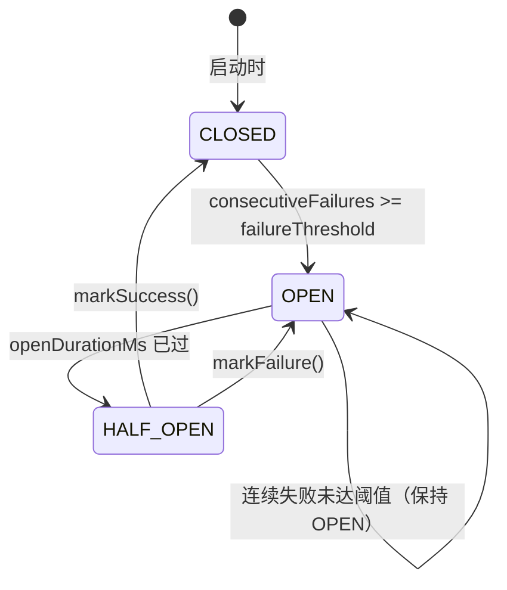
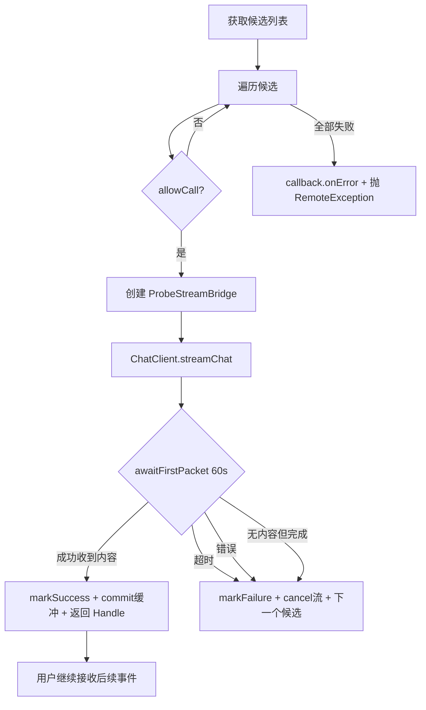
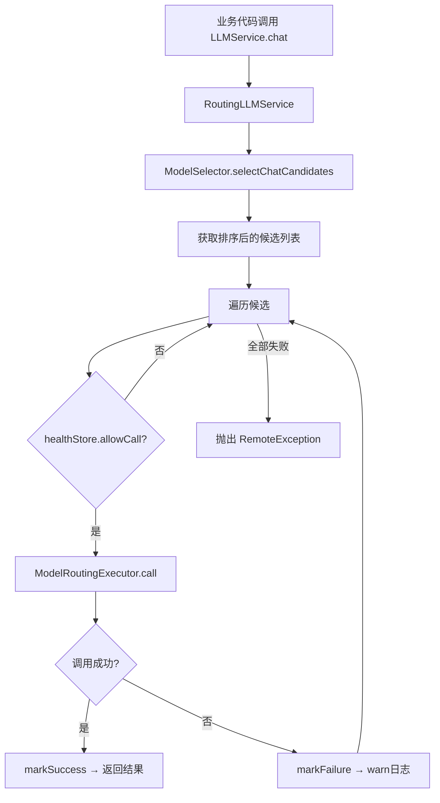
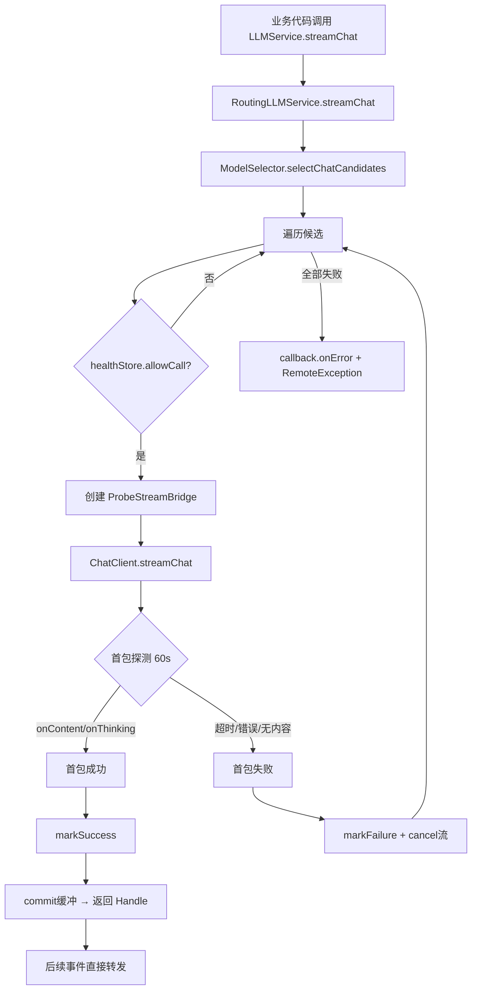
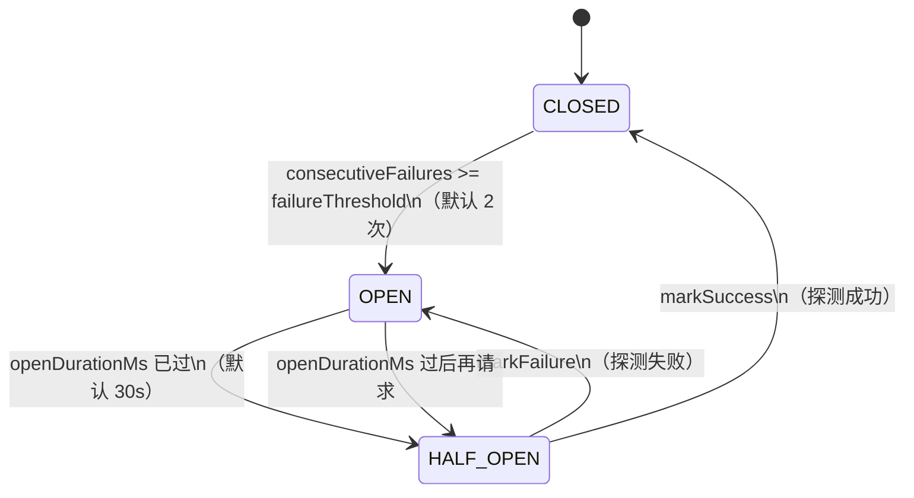

# 模型调用与路由容错

> 本章目标：让初学者理解 `infra-ai` 模块不是"调个 API"，而是负责多供应商适配、模型能力抽象、候选选择、健康状态、熔断、降级和流式首包探测。读完本章后，你应该能回答：为什么业务代码从不直接写 HTTP 调模型？一次 Chat 调用经过哪些类？流式调用为什么不能简单重试？熔断的三态是怎么转换的？

## 0. 先建立一个不会混乱的结论

整个 `infra-ai` 模块有且仅有一个使命：**让业务代码只依赖 `LLMService`、`EmbeddingService`、`RerankService` 三个接口，不必关心背后是百炼、SiliconFlow、AIHubMix 还是 Ollama。**

这三条线的架构完全对称：

```
业务层 (LLMService / EmbeddingService / RerankService)
        │
路由层 (RoutingLLMService / RoutingEmbeddingService / RoutingRerankService)
        │
选择 + 熔断 (ModelSelector + ModelHealthStore + ModelRoutingExecutor)
        │
供应商抽象 (ChatClient / EmbeddingClient / RerankClient)
        │
模板基类 (AbstractOpenAIStyleChatClient / AbstractOpenAIStyleEmbeddingClient)
        │
具体供应商 (BaiLian / SiliconFlow / AIHubMix / Ollama / Noop)
```

**所有配置在 `application.yaml` 的 `ai.*` 下，所有路由逻辑在 `infra-ai` 模块，业务代码在 `bootstrap` 里只写 `llmService.chat(...)` 或 `embeddingService.embed(...)`。**

---

## 1. infra-ai 模块定位

### 1.1 为什么不在业务代码里直接写 HTTP 调模型

假设你在 `StreamChatPipeline` 里直接写 OkHttp 调百炼的 `/compatible-mode/v1/chat/completions`，会立刻遇到这些问题：

1. **换供应商要改业务代码**——如果百炼挂了想切到 SiliconFlow，至少改 3 处：URL、鉴权方式、响应解析。
2. **模型失败没有降级**——一个模型 500，整个问答就失败。
3. **流式调用没有容错**——SSE 连接建立后模型超时，无法切换下一候选。
4. **测试无法 mock**——每种调用都耦合了真实的 HTTP Client。

`infra-ai` 用分层抽象解决了这些问题：业务层只看接口，路由层选择候选，熔断器保护健康度，供应商 Client 屏蔽协议差异。

### 1.2 三大能力接口的边界

| 接口 | 职责 | 方法 | 返回值 | 在哪里被调用 |
|---|---|---|---|---|
| `LLMService` | 文本生成（问答、改写、分类、摘要等） | `chat(ChatRequest)` / `chat(ChatRequest, String modelId)` / `streamChat(ChatRequest, StreamCallback)` | `String` / `StreamCancellationHandle` | StreamChatPipeline、EnricherNode、EnhancerNode、问题改写、意图分类、记忆摘要、标题生成、MCP 参数提取 |
| `EmbeddingService` | 文本转向量 | `embed(String)` / `embed(String, modelId)` / `embedBatch(List<String>)` / `embedBatch(List<String>, modelId)` | `List<Float>` / `List<List<Float>>` | :入库阶段 ChunkerNode 通过 ChunkEmbeddingService 调用；查询阶段 PgRetrieverService / MilvusRetrieverService 调用；KnowledgeChunkServiceImpl 人工维护 chunk 时也调用 |
| `RerankService` | 对检索结果重排序 | `rerank(String query, List<RetrievedChunk> candidates, int topN)` | `List<RetrievedChunk>` | RerankPostProcessor 在检索后处理阶段调用 |

**关键理解**：`LLMService` 有同步和流式两种调用方式；`EmbeddingService` 有单条和批量两种调用方式；`RerankService` 只有一种同步调用方式。三条线的路由和熔断逻辑完全相同，差异只在流式 Chat 的"首包探测"。

---

## 2. 模型供应商适配

### 2.1 供应商总览

| 供应商 | 枚举值 | 支持能力 | Chat Client | Embedding Client | Rerank Client | API Key | 特殊配置 |
|---|---|---|---|---|---|---|---|
| 百炼 (BaiLian) | `BAI_LIAN` | Chat + Rerank | `BaiLianChatClient` | 无 | `BaiLianRerankClient` | `${BAILIAN_API_KEY}` | Chat 走 `/compatible-mode/v1/chat/completions`；Rerank 走 `/api/v1/services/rerank/text-rerank/text-rerank` |
| SiliconFlow | `SILICON_FLOW` | Chat + Embedding | `SiliconFlowChatClient` | `SiliconFlowEmbeddingClient` | 无 | `${SILICONFLOW_API_KEY}` | Embedding 批量上限 32 条 |
| AIHubMix | `AI_HUB_MIX` | Chat + Embedding | `AIHubMixChatClient` | `AIHubMixEmbeddingClient` | 无 | `${AIHUBMIX_API_KEY}` | Embedding 批量上限 32 条 |
| Ollama | `OLLAMA` | Chat + Embedding | `OllamaChatClient` | `OllamaEmbeddingClient` | 无 | 无需 Key | 本地部署；走 `/v1/chat/completions` 和 `/v1/embeddings`；不支持 `encoding_format` 参数 |
| Noop | `NOOP` | Rerank 兜底 | 无 | 无 | `NoopRerankClient` | 无 | 直接返回前 topN 条，不做排序；优先级最低（100） |

### 2.2 请求差异

所有 Chat Client 都继承 `AbstractOpenAIStyleChatClient`，统一走 OpenAI 兼容协议（`/v1/chat/completions`）。差异在：

- **BaiLian**：Chat 端点路径是 `/compatible-mode/v1/chat/completions`（百炼的兼容模式），Rerank 是百炼私有协议。
- **Ollama**：不需要 Bearer Token（`requiresApiKey()` 返回 `false`）。
- **Ollama Embedding**：不支持 `encoding_format` 参数，`OllamaEmbeddingClient` 覆写 `customizeRequestBody()` 什么都不加。
- **SiliconFlow / AIHubMix**：完全标准的 OpenAI 兼容 API，区别只在 base URL 和 API Key。

### 2.3 配置位置

所有供应商配置在 `application.yaml` 的 `ai.providers` 下：

```yaml
ai:
  providers:
    ollama:
      url: http://localhost:11434
      endpoints:
        chat: /v1/chat/completions
        embedding: /v1/embeddings
    bailian:
      url: https://dashscope.aliyuncs.com
      api-key: ${BAILIAN_API_KEY:}
      endpoints:
        chat: /compatible-mode/v1/chat/completions
        rerank: /api/v1/services/rerank/text-rerank/text-rerank
    aihubmix:
      url: https://aihubmix.com
      api-key: ${AIHUBMIX_API_KEY:}
      endpoints:
        chat: /v1/chat/completions
        embedding: /v1/embeddings
    siliconflow:
      url: https://api.siliconflow.cn
      api-key: ${SILICONFLOW_API_KEY:}
      endpoints:
        chat: /v1/chat/completions
        embedding: /v1/embeddings
```

**初学者注意**：`endpoints` 是一个 `Map<String, String>`，key 是能力名称的小写（`chat`、`embedding`、`rerank`），value 是 URL 路径。最终 URL 由 `ModelUrlResolver.resolveUrl()` 拼接：优先用候选的 `url` 字段，否则用 `provider.url` + `provider.endpoints.get(capability)`。

---

## 3. Chat 调用链

### 3.1 调用链总览

```
业务代码
  └─ LLMService.chat(ChatRequest) 或 LLMService.streamChat(ChatRequest, StreamCallback)
       │
       └─ RoutingLLMService（@Service @Primary）
            │
            ├─ 同步 chat → ModelRoutingExecutor.executeWithFallback()
            │    └─ 遍历候选 → ModelHealthStore.allowCall() → ChatClient.chat() → 成功 markSuccess / 失败 markFailure
            │
            └─ 流式 streamChat → 内部自己实现的降级循环（不用 ModelRoutingExecutor）
                 └─ 遍历候选 → ModelHealthStore.allowCall() → ChatClient.streamChat()
                      └─ ProbeStreamBridge 首包探测
                           ├─ 首包成功 → markSuccess → 返回 StreamCancellationHandle
                           ├─ 首包超时/失败 → markFailure → cancel → 取下一个候选
                           └─ 全部失败 → callback.onError() → 抛 RemoteException
```

### 3.2 ChatRequest

**文件**：`framework/src/main/java/com/nageoffer/ai/ragent/framework/convention/ChatRequest.java`

| 字段 | 类型 | 含义 | 常见值 |
|---|---|---|---|
| `messages` | `List<ChatMessage>` | 对话消息列表 | system + 历史 + user |
| `temperature` | `Double` | 随机性控制 | 意图分类 0.1，摘要 0.3，RAG 问答 0~0.3 |
| `topP` | `Double` | 核采样参数 | 通常 0.3~1.0 |
| `topK` | `Integer` | Top-K 参数 | 较少用到 |
| `maxTokens` | `Integer` | 最大输出 Token | 较少用到 |
| `thinking` | `Boolean` | 是否启用深度思考 | 分类/改写 false，问答按配置 |
| `enableTools` | `Boolean` | 启用工具调用 | 当前未深度使用 |

**ChatMessage** 包含 `Role` 枚举（`SYSTEM`、`USER`、`ASSISTANT`）和 `content` 字段，以及创建 Assistant 带推理内容消息的工厂方法。

### 3.3 LLMService 接口

**文件**：`infra-ai/src/main/java/com/nageoffer/ai/ragent/infra/chat/LLMService.java`

```java
public interface LLMService {
    String chat(String prompt);                                          // 简便方法
    String chat(ChatRequest request);                                    // 同步调用，走路由降级
    String chat(ChatRequest request, String modelId);                    // 指定模型ID
    StreamCancellationHandle streamChat(String prompt, StreamCallback);  // 简便流式
    StreamCancellationHandle streamChat(ChatRequest request, StreamCallback callback); // 流式调用
}
```

**初学者注意**：`chat(request, modelId)` 只有在业务明确指定模型时才用（如入库节点指定模型ID）。绝大多数场景用 `chat(request)` 走默认候选路由。

### 3.4 RoutingLLMService

**文件**：`infra-ai/src/main/java/com/nageoffer/ai/ragent/infra/chat/RoutingLLMService.java`

核心类，`@Service @Primary`，业务注入的 `LLMService` 实际指向它。

**同步调用（chat）**：
1. 调用 `ModelSelector.selectChatCandidates(request.getThinking())` 获取候选列表。
2. 如果指定了 `modelId`，调用 `resolveTarget(modelId)` 构建单候选列表。
3. 调用 `ModelRoutingExecutor.executeWithFallback()` 遍历候选——每个候选：检查健康 → 调用 `ChatClient.chat()` → 成功返回 / 失败继续下一个。
4. 全部失败抛出 `RemoteException`。

**流式调用（streamChat）**——有自己的降级循环，**不走 ModelRoutingExecutor**：
1. 获取候选列表。
2. 遍历每个候选：检查健康 → 创建 `ProbeStreamBridge` 包装原始回调 → 调用 `ChatClient.streamChat()`。
3. 用 `LlmFirstPacketProbe.awaitFirstPacket(bridge, 60, SECONDS)` 等待首包。
4. 首包成功 → `markSuccess()` → 返回 `StreamCancellationHandle`。
5. 首包超时/失败/无内容 → `markFailure()` → cancel 当前流 → 取下一个候选。
6. 全部失败 → `callback.onError()` → 抛 `RemoteException`。

**首包探测超时**：`FIRST_PACKET_TIMEOUT_SECONDS = 60`。

### 3.5 ChatClient 接口与抽象基类

**ChatClient 接口**：
```java
public interface ChatClient {
    String provider();
    String chat(ChatRequest request, ModelTarget target);
    StreamCancellationHandle streamChat(ChatRequest request, StreamCallback callback, ModelTarget target);
}
```

**AbstractOpenAIStyleChatClient** 是所有 Chat Client 的模板基类，实现了：

| 方法 | 作用 |
|---|---|
| `doChat(ChatRequest, ModelTarget)` | 构建 JSON 请求体、发送同步 POST、解析 `choices[0].message.content` |
| `doStreamChat(ChatRequest, StreamCallback, ModelTarget)` | 构建带 `stream: true` 的请求体、异步提交到线程池、解析 SSE 事件、回调 `onContent`/`onThinking`/`onComplete` |
| `buildRequestBody(ChatRequest, ModelTarget, boolean)` | 构建完整 JSON body：model、messages、temperature、top_p、top_k、max_tokens、stream |
| `buildMessages(ChatRequest)` | 把 `ChatMessage` 列表转成 JSON 数组 |
| `newAuthorizedRequest(ProviderConfig, ModelTarget)` | 构建 OkHttp Request，添加 Bearer Token |
| `customizeRequestBody(JsonObject, ChatRequest)` | **可覆写的钩子**——子类添加供应商特定字段（如 `enable_thinking`） |
| `requiresApiKey()` | **可覆写**——Ollama 返回 `false` |

四个具体子类都是极简实现——只覆写 `provider()` 和 `requiresApiKey()`：

| Client 类 | 文件 | `provider()` | `requiresApiKey()` |
|---|---|---|---|
| `BaiLianChatClient` | `infra-ai/.../chat/BaiLianChatClient.java` | `BAI_LIAN` | `true`（默认） |
| `SiliconFlowChatClient` | `infra-ai/.../chat/SiliconFlowChatClient.java` | `SILICON_FLOW` | `true`（默认） |
| `AIHubMixChatClient` | `infra-ai/.../chat/AIHubMixChatClient.java` | `AI_HUB_MIX` | `true`（默认） |
| `OllamaChatClient` | `infra-ai/.../chat/OllamaChatClient.java` | `OLLAMA` | `false` |

### 3.6 StreamCallback 与 StreamCancellationHandle

**StreamCallback**（文件：`infra-ai/.../chat/StreamCallback.java`）：

```java
public interface StreamCallback {
    void onContent(String content);         // 每个内容增量
    default void onThinking(String content) {}  // 推理/思考内容增量
    void onComplete();                      // 流结束
    void onError(Throwable error);          // 流错误
}
```

**StreamCancellationHandle**（文件：`infra-ai/.../chat/StreamCancellationHandle.java`）：

```java
public interface StreamCancellationHandle {
    void cancel();  // 取消正在进行的流
}
```

**StreamCancellationHandles** 是工厂类，提供：
- `noop()` — 空操作句柄
- `fromOkHttp(Call, AtomicBoolean)` — 包装 OkHttp Call 的取消操作，CAS-once 保证只取消一次

### 3.7 流式回调装饰器

| 类 | 文件 | 作用 |
|---|---|---|
| `ForwardingStreamCallback` | `infra-ai/.../chat/ForwardingStreamCallback.java` | 装饰器基类。转发 onContent/onThinking/onComplete/onError。在第一次 onContent 时触发 onFirstContent()。用 CAS-once 保证 onComplete/onError 只触发一次，并调用 onFinish(success, error) |
| `StreamSpanCallback` | `infra-ai/.../chat/StreamSpanCallback.java` | 继承 ForwardingStreamCallback，把流事件与 RagStreamTraceSupport.StreamSpan 生命周期绑定——成功 finishSuccess、失败 finishError、取消 finishCancelledIfRunning |
| `ProbeStreamBridge` | `infra-ai/.../chat/ProbeStreamBridge.java` | 首包探测桥。在首包确认前缓冲所有事件，确认后 commit() 把缓冲转发给下游回调。暴露 `awaitFirstPacket(timeout, unit)` 阻塞等待首包结果 |
| `StreamAsyncExecutor` | `infra-ai/.../chat/StreamAsyncExecutor.java` | 把 OkHttp 异步 Call 提交到线程池，处理 RejectedExecutionException |
| `LlmFirstPacketProbe` | `infra-ai/.../chat/LlmFirstPacketProbe.java` | Spring `@Component`，包装 ProbeStreamBridge.awaitFirstPacket()，加 `@RagTraceNode(name = "llm-first-packet", type = "LLM_TTFT")` 以便 AOP 拦截记录 TTFT（首包时间） |

### 3.8 OpenAIStyleSseParser

**文件**：`infra-ai/.../chat/OpenAIStyleSseParser.java`

负责解析 OpenAI 兼容格式的 SSE 行：
- 去除 `data:` 前缀
- 识别 `[DONE]` 终止标记
- 从 `choices[0].delta.content` 提取内容增量
- 从 `choices[0].delta.reasoning_content` 提取推理内容增量（用于深度思考模式）
- 检查 `finish_reason` 判断是否完成

返回 `ParsedEvent` record 包含 `content`、`reasoning`、`completed` 三个字段。

---

## 4. Embedding 调用链

### 4.1 两阶段调用

Embedding 在项目中有两次出现：

| 阶段 | 调用方 | 方法 | 说明 |
|---|---|---|---|
| **入库阶段** | `ChunkerNode` → `ChunkEmbeddingService` → `EmbeddingService.embedBatch()` | 批量 | 把 chunk 文本列表同时转向量，写入 pgvector/Milvus |
| **查询阶段** | `PgRetrieverService` / `MilvusRetrieverService` → `EmbeddingService.embed()` | 单条 | 只把用户问题转向量，用于相似度搜索 |

额外：`KnowledgeChunkServiceImpl` 在人工维护 chunk（同步/启用）时也会调用 `embed()` 或 `embedBatch()`。

### 4.2 调用链

```
业务代码
  └─ EmbeddingService.embed(text) 或 embedBatch(texts)
       │
       └─ RoutingEmbeddingService（@Service @Primary）
            │
            └─ ModelRoutingExecutor.executeWithFallback()
                 └─ 遍历候选 → ModelHealthStore.allowCall() → EmbeddingClient.embed/embedBatch()
                      → 成功 markSuccess → 返回 List<Float> 或 List<List<Float>>
                      → 失败 markFailure → 取下一个候选
```

**注意**：Embedding 没有流式调用，都走 `ModelRoutingExecutor` 统一降级。

### 4.3 EmbeddingService 接口

```java
public interface EmbeddingService {
    List<Float> embed(String text);
    List<Float> embed(String text, String modelId);
    List<List<Float>> embedBatch(List<String> texts);
    List<List<Float>> embedBatch(List<String> texts, String modelId);
    default int dimension() { return 0; }
}
```

### 4.4 维度如何保证一致

**关键配置**：

```yaml
ai:
  embedding:
    candidates:
      - id: qwen-emb-8b
        provider: siliconflow
        model: Qwen/Qwen3-Embedding-8B
        dimension: ${rag.default.dimension}   # ← 引用全局维度配置
        priority: 1
```

- `dimension` 字段在 `ModelCandidate` 中定义，引用 `${rag.default.dimension}`（默认 1536）。
- 入库和查询必须用**同一模型的同一维度**——如果入库用 1536 维的 `text-embedding-3-large`，查询就不能用 768 维的模型。
- `OllamaEmbeddingClient` 不支持 `encoding_format` 参数（它的 `customizeRequestBody()` 是空操作），但返回的向量维度由本地模型决定，如果维度不匹配会直接报错。

### 4.5 批量 Embedding 如何处理

`AbstractOpenAIStyleEmbeddingClient` 的 `embedBatch()` 方法：

1. 如果 `maxBatchSize() > 0` 且文本数超过 `maxBatchSize()`，分批调用 `doEmbed()`，再合并结果。
2. `SiliconFlowEmbeddingClient.maxBatchSize()` 返回 32。
3. `AIHubMixEmbeddingClient.maxBatchSize()` 返回 32。
4. `OllamaEmbeddingClient.maxBatchSize()` 返回 0（不限），单条请求一次性发送。

---

## 5. Rerank 调用链

### 5.1 调用链

```
RerankPostProcessor.process()
  └─ RerankService.rerank(question, chunks, topK)
       │
       └─ RoutingRerankService（@Service @Primary）
            │
            └─ ModelRoutingExecutor.executeWithFallback()
                 └─ 遍历候选 → ModelHealthStore.allowCall() → RerankClient.rerank()
                      → 成功 markSuccess → 返回排序后的 List<RetrievedChunk>
                      → 失败 markFailure → 取下一个候选
```

**启发条件**：`RerankPostProcessor` 只有在 `ragConfigProperties.getRerankEnabled()` 为 true 且 chunks 非空时才调用 Rerank。优先级 `@Order(10)`，是检索后处理链的最后一步。

### 5.2 Rerank 输出如何影响 Top-K

`RerankService.rerank()` 的第三个参数就是 `topK`。在 `BaiLianRerankClient` 中：

1. 先对候选按 ID 去重（同一篇文章的不同 chunk 可能被多次召回）。
2. 如果去重后数量 ≤ topK，直接返回，不调 API。
3. 否则调百炼 Rerank API，取 `top_n` 条结果，按 `relevance_score` 排序。
4. 不足 topK 的部分用未进入 Rerank 结果的候选补充。

### 5.3 rerank-noop 的作用

`NoopRerankClient` 是 `ModelProvider.NOOP` 的实现：

```java
public List<RetrievedChunk> rerank(String query, List<RetrievedChunk> candidates, int topN, ModelTarget target) {
    return candidates.subList(0, Math.min(topN, candidates.size()));
}
```

- **不调 API，不排序**，直接取前 topN 条。
- 配置中优先级为 100（最低），作为所有 Rerank 候选失败后的兜底。
- **代价**：没有按相关性重排序，直接取的前 topN 条可能是按召回顺序（而非相关性）排列的。
- **用途**：测试环境、Rerank 服务不可用时保证系统不挂。

---

## 6. ModelSelector

**文件**：`infra-ai/src/main/java/com/nageoffer/ai/ragent/infra/model/ModelSelector.java`

### 6.1 选择机制

```java
// 三组候选，分别对应三种能力
selectChatCandidates(boolean deepThinking)   // → ai.chat
selectEmbeddingCandidates()                   // → ai.embedding
selectRerankCandidates()                       // → ai.rerank
```

### 6.2 default-model

- 对于 Chat 组，`default-model` 决定首选模型 ID。
- 对于 Embedding 组，`default-model` 决定首选 Embedding 模型 ID。
- 对于 Rerank 组，`default-model` 决定首选 Rerank 模型 ID。

如果指定了 `deepThinking=true`，则用 `deepThinkingModel` 替代 `defaultModel` 作为首选。

### 6.3 candidates 与 priority

```yaml
ai:
  chat:
    candidates:
      - id: qwen-plus
        provider: bailian
        model: qwen-plus-latest
        priority: 1                    # ← 数字越小优先级越高
      - id: qwen3-local
        provider: ollama
        model: qwen3:8b-fp16
        priority: 2
      - id: qwen3-max
        provider: bailian
        model: qwen3-max
        supports-thinking: true
        priority: 3
      - id: glm-4.7
        provider: siliconflow
        model: Pro/zai-org/GLM-4.7
        supports-thinking: true
        priority: 4
      - id: gpt-5.4
        provider: aihubmix
        model: gpt-5.4
        priority: 5
```

**排序规则**（`filterAndSortCandidates` 方法）：
1. 首选模型（匹配 `defaultModel` 或 `deepThinkingModel`）排第一。
2. 其余按 `priority` 升序。
3. `priority` 相同按 `id` 字母序。

### 6.4 supports-thinking

`supports-thinking: true` 的候选才会在 `deepThinking=true` 时被选出。

在 `ModelSelector.selectChatCandidates(true)` 中：
1. 首选用 `deepThinkingModel`（如 `qwen3-max`）。
2. 其余候选只保留 `supportsThinking=true` 的。

如果 `deepThinking=false`，所有候选都可以参与（不论 `supports-thinking` 的值）。

### 6.5 候选过滤规则

`buildAvailableTargets()` 会对每个候选做两道过滤：

1. **健康检查**：`healthStore.isUnavailable(id)` → 如果模型处于熔断状态，跳过。
2. **供应商配置检查**：找 `providers` map 中对应的 `ProviderConfig`。如果找不到且 `provider` 不是 `noop`，打印警告并跳过。

---

## 7. ModelHealthStore

**文件**：`infra-ai/src/main/java/com/nageoffer/ai/ragent/infra/model/ModelHealthStore.java`

### 7.1 三态模型



| 状态 | 含义 | 行为 |
|---|---|---|
| `CLOSED` | 正常 | 允许调用 |
| `OPEN` | 熔断中 | 拒绝调用（`allowCall` 返回 `false`） |
| `HALF_OPEN` | 半开 | 只允许一个探测请求 |

### 7.2 字段说明

每个模型 ID 维护一个 `ModelHealth` 对象：

| 字段 | 类型 | 含义 |
|---|---|---|
| `consecutiveFailures` | `int` | 连续失败次数 |
| `openUntil` | `long` | 熔断到期时间（毫秒时间戳） |
| `halfOpenInFlight` | `boolean` | 半开状态是否已有探测请求在途中 |
| `state` | `State` 枚举 | CLOSED / OPEN / HALF_OPEN |

### 7.3 核心方法

#### `isUnavailable(String id)`

返回 `true` 的条件：状态为 OPEN 且未到期，或者 HALF_OPEN 且已有探测请求在途中。用于 `ModelSelector.buildAvailableTargets()` 过滤候选。

#### `allowCall(String id)`

使用 `ConcurrentHashMap.compute()` 原子操作：

- `CLOSED` → 允许调用，状态保持 CLOSED。
- `OPEN` → 如果 `openUntil > now`，拒绝；否则转到 `HALF_OPEN`，设置 `halfOpenInFlight=true`，允许这一个探测。
- `HALF_OPEN` → 如果 `halfOpenInFlight` 已经 `true`，拒绝；否则设置 `halfOpenInFlight=true`，允许。

#### `markSuccess(String id)`

重置：`consecutiveFailures=0`、`openUntil=0`、`halfOpenInFlight=false`、`state=CLOSED`。

#### `markFailure(String id)`

- 如果当前 `HALF_OPEN` → 立即转 `OPEN`，设置 `openUntil = now + openDurationMs`。
- 否则 → `consecutiveFailures++`，如果 `>= failureThreshold` → 转 `OPEN`，设置 `openUntil`。

### 7.4 配置参数

```yaml
ai:
  selection:
    failure-threshold: 2        # 连续失败 2 次进入 OPEN
    open-duration-ms: 30000      # 熔断持续 30 秒
```

**初学者注意**：`failureThreshold` 默认 2，意味着一个模型连续失败 2 次就会被熔断。`openDurationMs` 默认 30 秒，意味着 30 秒后才允许一个探测请求。这两个值太小可能导致偶发网络波动就熔断，太大的话故障模型恢复慢——生产环境建议根据模型响应时间调整。

---

## 8. ModelRoutingExecutor

**文件**：`infra-ai/src/main/java/com/nageoffer/ai/ragent/infra/model/ModelRoutingExecutor.java`

### 8.1 executeWithFallback()

```java
public <C, T> T executeWithFallback(
    ModelCapability capability,
    List<ModelTarget> targets,
    Function<ModelTarget, C> clientResolver,
    ModelCaller<C, T> caller
)
```

**执行流程**：

1. 遍历 `targets`（已按 priority 排序）。
2. 用 `clientResolver` 从 `ModelTarget` 找到对应的 Client 实例。
3. 调用 `healthStore.allowCall(target.id())`。
4. 如果不允许（熔断中），跳到下一个候选。
5. 允许则调用 `caller.call(client, target)`。
6. 成功：`healthStore.markSuccess(target.id())`，返回结果。
7. 异常：`healthStore.markFailure(target.id())`，打 warn 日志，继续下一个。
8. 所有候选都失败：抛出 `RemoteException("All {label} model candidates failed: {last error}")`。

### 8.2 哪些能力共用这个逻辑

| 能力 | 路由服务 | 是否使用 executeWithFallback |
|---|---|---|
| Chat（同步） | `RoutingLLMService.chat()` | ✅ 是 |
| Embedding | `RoutingEmbeddingService` | ✅ 是 |
| Rerank | `RoutingRerankService` | ✅ 是 |
| Chat（流式） | `RoutingLLMService.streamChat()` | ❌ 不是——有自己的首包探测降级循环 |

### 8.3 最终失败如何抛出

所有候选失败后抛出 `RemoteException`，错误码为 `C000001`（远程服务错误），消息格式为 `"All Chat model candidates failed: ..."` / `"All Embedding model candidates failed: ..."` / `"All Rerank model candidates failed: ..."`。

这个异常会被 `GlobalExceptionHandler` 捕获，转换为前端看到的错误响应。

---

## 9. 流式 Chat 特殊性

### 9.1 为什么流式不能简单重试

同步调用（Chat `chat()`、Embedding、Rerank）失败时，没有任何输出已经发给用户，所以可以安全重试下一个候选。

流式调用（Chat `streamChat()`）不同：

1. **部分内容已发出**——如果模型已通过 SSE 发送了 200 个 token 给前端，此时模型超时，前端已经显示了这 200 个 token。你不能"撤回"已经显示的内容。
2. **上下文状态已变**——SSE 流已开始发送 `meta` 和 `message` 事件，前端状态已进入"接收中"。
3. **重试会导致内容重复**——如果前一个候选已经输出了内容，第二个候选从头开始生成，用户会看到重复。

### 9.2 首包探测

`RoutingLLMService.streamChat()` 采用**首包探测**（First Packet Probing）策略：



**ProbeStreamBridge** 的工作方式：

1. 创建一个包装原始 `StreamCallback` 的 `ProbeStreamBridge`。
2. 在首包确认前，所有事件（`onContent`、`onThinking`）缓存在内存中。
3. 调用 `awaitFirstPacket(60, SECONDS)` 阻塞等待。
4. 如果在 60 秒内收到 `onContent` 或 `onThinking` → 首包成功，调用 `commit()` 把缓冲事件全部转发给下游回调，后续事件直接转发。
5. 如果超时、错误或无内容 → 首包失败，取消当前流，取下一个候选。

### 9.3 已输出内容后失败的处理限制

如果首包探测成功后，流中途又失败了：

- 已经 `commit()` 的内容无法撤回，前端已经显示。
- `StreamCancellationHandle.cancel()` 会取消 OkHttp Call，但已发送的 SSE 事件不可撤回。
- 前端通过 SSE `done` 或 `error` 事件判断流结束。

**这意味着**：首包探测只能保证"第一个有意义的 token 成功到达"，不能保证整个流成功完成。这是流式调用的固有限制。

### 9.4 取消句柄

`StreamCancellationHandle` 接口只有一个方法 `cancel()`。

在 `RoutingLLMService.streamChat()` 返回后，业务代码（如 `StreamChatPipeline`）持有这个句柄。当用户点击"停止回答"时：

1. 前端通过 `AbortSignal` 中断 fetch 请求。
2. 后端 `RAGChatController` 调用 `StreamTaskManager.cancel(taskId)`。
3. `StreamTaskManager` 找到对应的 `StreamCancellationHandle` 并调用 `cancel()`。
4. `cancel()` 内部调用 OkHttp `Call.cancel()` 并设置 `AtomicBoolean cancelled=true`。

**幂等性**：`cancel()` 使用 CAS-once 保证只执行一次真正的取消操作，重复调用安全。

---

## 10. 配置项逐段解释

### 10.1 ai.providers

```yaml
ai:
  providers:
    ollama:                    # 供应商名称，对应 ModelProvider 枚举
      url: http://localhost:11434     # base URL
      # api-key 省略 → Ollama 不需要
      endpoints:                       # 能力到 URL 路径的映射
        chat: /v1/chat/completions
        embedding: /v1/embeddings
    bailian:
      url: https://dashscope.aliyuncs.com
      api-key: ${BAILIAN_API_KEY:}     # 环境变量注入，默认空
      endpoints:
        chat: /compatible-mode/v1/chat/completions
        rerank: /api/v1/services/rerank/text-rerank/text-rerank
    aihubmix:
      url: https://aihubmix.com
      api-key: ${AIHUBMIX_API_KEY:}
      endpoints:
        chat: /v1/chat/completions
        embedding: /v1/embeddings
    siliconflow:
      url: https://api.siliconflow.cn
      api-key: ${SILICONFLOW_API_KEY:}
      endpoints:
        chat: /v1/chat/completions
        embedding: /v1/embeddings
```

**初学者注意**：
- `endpoints` 是 `Map<String, String>`，key 必须是 `chat`、`embedding`、`rerank`（能力名小写）。
- 如果某种能力没有配端点，该供应商就不支持那种能力。例如 `ollama` 没有 `rerank` 端点。
- `api-key` 用 `${VAR:}` 环境变量注入，冒号后为空是默认值。

### 10.2 ai.selection

```yaml
ai:
  selection:
    failure-threshold: 2        # 连续失败几次进入熔断
    open-duration-ms: 30000     # 熔断持续多少毫秒
```

| 参数 | 默认值 | 含义 | 调参建议 |
|---|---|---|---|
| `failure-threshold` | 2 | 连续失败几次后熔断 | 偶发网络抖动建议设为 3；稳定环境可设为 1 |
| `open-duration-ms` | 30000 | 熔断多久后半开 | 30 秒适合大多数场景；模型恢复快可缩短 |

### 10.3 ai.stream

```yaml
ai:
  stream:
    message-chunk-size: 1       # SSE 每个 chunk 的最小内容大小
```

这个参数控制 SSE 事件的内容粒度。值为 1 表示每收到 1 个字符就推一个 SSE 事件。**注意**：`AIModelProperties.Stream` 的 Java 默认值是 5，但 yaml 中设为 1——运行时以 yaml 为准。

### 10.4 ai.chat

```yaml
ai:
  chat:
    default-model: qwen3-max              # 首选模型 ID
    deep-thinking-model: qwen3-max         # 深度思考模型 ID（thinking=true 时用）
    candidates:                             # 候选列表
      - id: qwen-plus                      # 候选唯一标识
        provider: bailian                  # 对应 ai.providers 的 key
        model: qwen-plus-latest           # 供应商侧的模型名
        priority: 1                        # 优先级（数字越小越高）
      - id: qwen3-local
        provider: ollama
        model: qwen3:8b-fp16
        priority: 2
      - id: qwen3-max
        provider: bailian
        model: qwen3-max
        supports-thinking: true             # ← 支持深度思考
        priority: 3
      - id: glm-4.7
        provider: siliconflow
        model: Pro/zai-org/GLM-4.7
        supports-thinking: true
        priority: 4
      - id: gpt-5.4
        provider: aihubmix
        model: gpt-5.4
        priority: 5
```

**关键规则**：
- `default-model` 必须能在 `candidates` 中找到对应 ID。
- 如果没有配 `deep-thinking-model`，深度思考会回退到 `default-model`。
- 候选按 `priority` 排序；同 priority 按 `id` 字母序。
- `enabled: false`（默认 true）可以临时禁用某个候选。

### 10.5 ai.embedding

```yaml
ai:
  embedding:
    default-model: qwen-emb-8b
    candidates:
      - id: qwen-emb-8b
        provider: siliconflow
        model: Qwen/Qwen3-Embedding-8B
        dimension: ${rag.default.dimension}   # 维度引用全局配置
        priority: 1
      - id: qwen-emb-local
        provider: ollama
        model: qwen3-embedding:8b-fp16
        dimension: ${rag.default.dimension}
        priority: 2
      - id: text-embedding-3-large
        provider: aihubmix
        model: text-embedding-3-large
        dimension: ${rag.default.dimension}
        priority: 3
```

**初学者注意**：
- `dimension` 必须与 `rag.default.dimension` 一致，否则入库和查询的向量维度不匹配会导致检索失败。
- 所有候选的维度应相同——不同维度的模型不能互为候选（降级后维度变了就查不到了）。
- 入库用的模型 ID 会被记录在知识库配置中，切换模型后需要重新入库。

### 10.6 ai.rerank

```yaml
ai:
  rerank:
    default-model: qwen3-rerank
    candidates:
      - id: qwen3-rerank
        provider: bailian
        model: qwen3-rerank
        priority: 1
      - id: rerank-noop              # ← 兜底候选
        provider: noop
        model: noop
        priority: 100                 # 最低优先级
```

**rerank-noop 是安全网**：当所有真实 Rerank 候选都失败时，`NoopRerankClient` 直接返回前 topN 条，不排序。系统不会因 Rerank 失败而完全无法工作，但检索质量会下降。

---

## 11. 故障实验设计

> 以下仅为实验方案，**不要在本次学习中真的修改配置文件**。建议在独立测试分支上操作。

### 实验 1：错误 API Key

**目的**：观察熔断从 CLOSED → OPEN 的过程。

**方案**：
1. 在 `BAILIAN_API_KEY` 环境变量设为一个无效值。
2. 发起一次 Chat 请求。
3. 观察后端日志：应该看到 BaiLian Chat 失败（401 UNAUTHORIZED），然后 `ModelRoutingExecutor` 尝试下一个候选。
4. 观察 `ModelHealthStore`：`qwen-plus` 和 `qwen3-max` 应该各 `markFailure` 一次。
5. 如果只有 2 个百炼候选且都失败，`failureThreshold=2` 时第二次失败后进入 OPEN。

**预期结果**：请求降级到 Ollama 或 AIHubMix（如果可用）。所有候选都失败则返回错误。

### 实验 2：关闭 Ollama

**目的**：观察本地模型不可用时的降级行为。

**方案**：
1. 停止本地 Ollama 服务。
2. 发起一次 Chat 请求。
3. 观察日志：Ollama 连接被拒，`markFailure`，尝试下一个候选。
4. 启动 Ollama，等 30 秒后再请求，观察 HALF_OPEN 探测。

**预期结果**：请求降级到百炼或其他云端候选。

### 实验 3：设置不可用模型

**目的**：观察 `ModelSelector` 如何跳过不可用候选。

**方案**：
1. 在 `ai.chat.candidates` 中添加一个 `provider: nonexist` 的候选。
2. 观察日志：`ModelSelector` 打印 warn 日志，跳过该候选。

**预期结果**：该候选被跳过，不影响其他候选选择。

### 实验 4：观察候选切换

**目的**：直观看到候选优先级如何工作。

**方案**：
1. 设置 `ai.chat.default-model: qwen3-max`。
2. 正常发起请求，观察日志中通过的候选 ID。
3. 手动把 `qwen3-max` 的 API Key 设为无效。
4. 再次请求，观察是否自动切换到 `qwen-plus`（priority=1）或其他候选。

**预期结果**：正常时用首选模型；首选失败后自动降级。

### 实验 5：观察熔断状态

**目的**：验证 HALF_OPEN 探测机制。

**方案**：
1. 在 IDE 中在 `ModelHealthStore.allowCall()` 方法打条件断点。
2. 触发连续 2 次模型失败（设 `failureThreshold=2`）。
3. 观察断点：第三次请求时 `state` 应该是 OPEN，`allowCall` 返回 false。
4. 等待 `openDurationMs`（30 秒）过去。
5. 再次请求，观察 `state` 变为 `HALF_OPEN`，允许一次探测。
6. 探测成功 → CLOSED；探测失败 → 重新 OPEN。

**预期结果**：熔断周期 30 秒，期间请求跳过被熔断的候选。

---

## 12. Mermaid 图

### 12.1 非流式调用降级图



### 12.2 流式调用图



### 12.3 熔断状态机图



---

## 13. 面试讲法

### 13.1 一分钟讲法

> Ragent 的模型调用层不直接耦合供应商，而是通过 LLMService / EmbeddingService / RerankService 三个接口让业务代码只关心能力。路由层 RoutingLLMService 读取 YAML 配置的候选列表，按优先级排序后依次尝试。每个候选调用前检查 ModelHealthStore 的熔断状态——连续失败 2 次就熔断 30 秒，之后半开探测一次。流式 Chat 因为已经发出了部分内容不能简单重试，所以用 ProbeStreamBridge 做首包探测——60 秒内没收到内容就切换下一个候选。三态熔断和首包探测是两个最核心的容错机制。

### 13.2 三分钟讲法

> 整个 infra-ai 模块是六个字的架构：**接口 → 路由 → 供应商**。
>
> 接口层只暴露 `LLMService.chat()`、`LLMService.streamChat()`、`EmbeddingService.embed()`、`RerankService.rerank()`。业务层注入接口，不知道背后是百炼还是 Ollama。
>
> 路由层是三个 `@Primary` 的 Routing 服务。它们的工作分三步：第一，`ModelSelector` 读配置选出候选，按 priority 排序，首选模型排第一；第二，对每个候选调用 `ModelHealthStore.allowCall()`，熔断的跳过；第三，调用供应商 Client。
>
> 供应商层用模板方法模式——`AbstractOpenAIStyleChatClient` 处理了 OkHttp 请求构建、SSE 解析、重试逻辑，四个子类只覆写 `provider()` 和 `requiresApiKey()`。新增供应商只需要写一个类，加几行 YAML。
>
> 容错的核心是 `ModelHealthStore` 的三态熔断：CLOSED 正常调用；OPEN 拒绝调用；HALF_OPEN 允许一个探测。配置 `failure-threshold: 2` 和 `open-duration-ms: 30000` 控制阈值和冷却时间。
>
> 流式调用最特殊——已经发给前端的内容不能撤回，所以不能用 ModelRoutingExecutor 简单循环。`RoutingLLMService.streamChat()` 自己实现了降级循环，用 `ProbeStreamBridge` 做首包探测。60 秒内如果第一个模型没有返回任何内容，就取消这个流，切换下一个候选。一旦首包成功，后续失败就不能再切换了，这是流式调用的固有限制。

### 13.3 面试追问与回答

**Q：为什么不用 Spring Cloud CircuitBreaker 或 Resilience4j？**
A：项目的熔断需求很明确——只针对模型候选列表做开闭控制，不涉及服务网格、线程池隔离或降级回调。`ModelHealthStore` 30 行代码就解决了，引入额外框架反而增加理解成本和依赖。如果将来需要线程池隔离或滑动窗口统计，可以考虑迁移。

**Q：首包探测超时 60 秒会不会太长？**
A：对于 LLM 推理来说，60 秒是合理的上限——模型冷启动或长上下文确实可能需要几十秒才返回第一个 token。实际生产中可以根据模型类型分别配置——轻量分类模型 10 秒就够，深度思考模型可以更长。当前代码中 `FIRST_PACKET_TIMEOUT_SECONDS = 60` 是常量，改起来需要重新编译。

**Q：rerank-noop 会不会降低检索质量？**
A：会。`NoopRerankClient` 直接取前 topN 条不做排序，相当于"没有重排"。在 Rerank 服务恢复前，顶多保证系统不挂，但检索准确性会打折。生产环境应该监控 Rerank 候选是否正常，而不是长期依赖 noop。

**Q：Embedding 为什么不走流式？**
A：Embedding 是同步批处理操作，服务端一次性返回所有向量，没有逐 token 输出的场景。所以 Embedding 调用只走 `ModelRoutingExecutor` 的同步降级循环。

**Q：如果所有模型都熔断了怎么办？**
A：`ModelSelector.buildAvailableTargets()` 会过滤掉所有 OPEN 状态的模型。如果过滤后候选列表为空，`executeWithFallback()` 的循环不执行，直接抛 `RemoteException`。这意味着熔断不是"无限等待"，而是"快速失败"。

**Q：为什么维度配置用 `${rag.default.dimension}` 引用而不是硬编码？**
A：因为入库和查询必须用同一维度。如果把维度写在每个候选里并改了值，很容易导致一个用 1536 一个用 768。引用全局配置变量 `rag.default.dimension` 保证所有 Embedding 候选维度一致。

---

## 14. Debug 断点

| # | 位置 | 文件路径 | 方法 | 观察什么 |
|---|---|---|---|---|
| 1 | 路由入口 | `RoutingLLMService.java` | `chat(ChatRequest)` | 候选列表、降级循环 |
| 2 | 流式入口 | `RoutingLLMService.java` | `streamChat(ChatRequest, StreamCallback)` | 首包探测逻辑 |
| 3 | 选择器 | `ModelSelector.java` | `selectChatCandidates(boolean)` | 首选模型是谁、支持 thinking 的有哪些 |
| 4 | 健康检查 | `ModelHealthStore.java` | `allowCall(String id)` | 当前状态、失败次数、是否放行 |
| 5 | 成功标记 | `ModelHealthStore.java` | `markSuccess(String id)` | 状态变为 CLOSED |
| 6 | 失败标记 | `ModelHealthStore.java` | `markFailure(String id)` | 失败次数递增、是否进入 OPEN |
| 7 | 降级循环 | `ModelRoutingExecutor.java` | `executeWithFallback()` | 哪个候选失败、下一个候选是谁 |
| 8 | 供应商调用 | `AbstractOpenAIStyleChatClient.java` | `doChat()` | 请求体、URL、响应 |
| 9 | SSE 解析 | `OpenAIStyleSseParser.java` | `parse()` | 每行 SSE 内容 |
| 10 | 首包探测 | `ProbeStreamBridge.java` | `awaitFirstPacket()` | 探测结果：SUCCESS/TIMEOUT/ERROR/NO_CONTENT |
| 11 | Rerank 入口 | `RoutingRerankService.java` | `rerank()` | 候选列表、降级循环 |
| 12 | Noop Rerank | `NoopRerankClient.java` | `rerank()` | 直接截取前 topN |
| 13 | URL 解析 | `ModelUrlResolver.java` | `resolveUrl()` | 最终请求 URL 是什么 |

---

## 15. 核心源码路径清单

| 类 | 路径 |
|---|---|
| AIModelProperties | `infra-ai/src/main/java/com/nageoffer/ai/ragent/infra/config/AIModelProperties.java` |
| LLMService | `infra-ai/src/main/java/com/nageoffer/ai/ragent/infra/chat/LLMService.java` |
| RoutingLLMService | `infra-ai/src/main/java/com/nageoffer/ai/ragent/infra/chat/RoutingLLMService.java` |
| ChatClient | `infra-ai/src/main/java/com/nageoffer/ai/ragent/infra/chat/ChatClient.java` |
| AbstractOpenAIStyleChatClient | `infra-ai/src/main/java/com/nageoffer/ai/ragent/infra/chat/AbstractOpenAIStyleChatClient.java` |
| StreamCallback | `infra-ai/src/main/java/com/nageoffer/ai/ragent/infra/chat/StreamCallback.java` |
| StreamCancellationHandle | `infra-ai/src/main/java/com/nageoffer/ai/ragent/infra/chat/StreamCancellationHandle.java` |
| ProbeStreamBridge | `infra-ai/src/main/java/com/nageoffer/ai/ragent/infra/chat/ProbeStreamBridge.java` |
| LlmFirstPacketProbe | `infra-ai/src/main/java/com/nageoffer/ai/ragent/infra/chat/LlmFirstPacketProbe.java` |
| OpenAIStyleSseParser | `infra-ai/src/main/java/com/nageoffer/ai/ragent/infra/chat/OpenAIStyleSseParser.java` |
| ForwardingStreamCallback | `infra-ai/src/main/java/com/nageoffer/ai/ragent/infra/chat/ForwardingStreamCallback.java` |
| StreamSpanCallback | `infra-ai/src/main/java/com/nageoffer/ai/ragent/infra/chat/StreamSpanCallback.java` |
| EmbeddingService | `infra-ai/src/main/java/com/nageoffer/ai/ragent/infra/embedding/EmbeddingService.java` |
| RoutingEmbeddingService | `infra-ai/src/main/java/com/nageoffer/ai/ragent/infra/embedding/RoutingEmbeddingService.java` |
| AbstractOpenAIStyleEmbeddingClient | `infra-ai/src/main/java/com/nageoffer/ai/ragent/infra/embedding/AbstractOpenAIStyleEmbeddingClient.java` |
| RerankService | `infra-ai/src/main/java/com/nageoffer/ai/ragent/infra/rerank/RerankService.java` |
| RoutingRerankService | `infra-ai/src/main/java/com/nageoffer/ai/ragent/infra/rerank/RoutingRerankService.java` |
| BaiLianRerankClient | `infra-ai/src/main/java/com/nageoffer/ai/ragent/infra/rerank/BaiLianRerankClient.java` |
| NoopRerankClient | `infra-ai/src/main/java/com/nageoffer/ai/ragent/infra/rerank/NoopRerankClient.java` |
| ModelSelector | `infra-ai/src/main/java/com/nageoffer/ai/ragent/infra/model/ModelSelector.java` |
| ModelHealthStore | `infra-ai/src/main/java/com/nageoffer/ai/ragent/infra/model/ModelHealthStore.java` |
| ModelRoutingExecutor | `infra-ai/src/main/java/com/nageoffer/ai/ragent/infra/model/ModelRoutingExecutor.java` |
| ModelTarget | `infra-ai/src/main/java/com/nageoffer/ai/ragent/infra/model/ModelTarget.java` |
| ModelCaller | `infra-ai/src/main/java/com/nageoffer/ai/ragent/infra/model/ModelCaller.java` |
| ModelProvider | `infra-ai/src/main/java/com/nageoffer/ai/ragent/infra/enums/ModelProvider.java` |
| ModelCapability | `infra-ai/src/main/java/com/nageoffer/ai/ragent/infra/enums/ModelCapability.java` |
| ChatRequest | `framework/src/main/java/com/nageoffer/ai/ragent/framework/convention/ChatRequest.java` |
| ChatMessage | `framework/src/main/java/com/nageoffer/ai/ragent/framework/convention/ChatMessage.java` |
| RetrievedChunk | `framework/src/main/java/com/nageoffer/ai/ragent/framework/convention/RetrievedChunk.java` |
| ModelUrlResolver | `infra-ai/src/main/java/com/nageoffer/ai/ragent/infra/http/ModelUrlResolver.java` |
| ModelClientException | `infra-ai/src/main/java/com/nageoffer/ai/ragent/infra/http/ModelClientException.java` |
| TokenCounterService | `infra-ai/src/main/java/com/nageoffer/ai/ragent/infra/token/TokenCounterService.java` |

---

## 16. 本章复习问题

1. **分层动机**：为什么不在业务代码里直接写 OkHttp 调模型？如果只有一种模型供应商，还需要路由吗？
2. **三线对称**：LLMService、EmbeddingService、RerankService 的路由结构有什么共同点？唯一的不同点在哪里？
3. **候选选择**：`ModelSelector` 排序候选的三个规则是什么？`supports-thinking: true` 在什么条件下才参与过滤？
4. **熔断状态**：CLOSED、OPEN、HALF_OPEN 三种状态分别意味着什么？从 OPEN 到 HALF_OPEN 的条件是什么？
5. **降级循环**：`ModelRoutingExecutor.executeWithFallback()` 遍历候选时，哪个步骤在调用之前？哪个步骤在调用之后？
6. **流式特殊性**：为什么流式 Chat 不能复用 `ModelRoutingExecutor`？首包探测解决了什么问题？
7. **ProbeStreamBridge**：首包成功前和首包成功后，事件的处理方式有什么不同？
8. **取消句柄**：用户点击"停止回答"时，从浏览器到后端，取消信号如何传递？
9. **维度一致**：入库阶段的 Embedding 和查询阶段的 Embedding 为什么必须用相同维度？如果换了模型怎么办？
10. **批量处理**：`SiliconFlowEmbeddingClient` 的 `maxBatchSize()` 返回 32，这是什么意思？如果传入 100 条文本会怎样？
11. **Rerank 去重**：`BaiLianRerankClient` 为什么在调 API 之前先对候选按 ID 去重？
12. **Noop 代价**：系统降级到 `NoopRerankClient` 后，用户会观察到什么不同？开发者应该监控什么指标？
13. **配置注入**：`ai.providers` 中的 `api-key: ${BAILIAN_API_KEY:}` 冒号后面为空意味着什么？如果环境变量未设置会怎样？
14. **Ollama 特殊**：`OllamaChatClient` 和 `OllamaEmbeddingClient` 分别覆写了 `requiresApiKey()` 和 `customizeRequestBody()`，为什么？
15. **URL 拼接**：如果一个候选的 `url` 字段有值，`ModelUrlResolver.resolveUrl()` 如何处理？如果没有呢？
16. **失败传播**：所有模型候选都失败后，`RemoteException` 的错误码是什么？前端如何看到这个错误？
17. **流式中间失败**：首包探测成功后，如果模型在第 200 个 token 处超时，会发生什么？能不能切换候选？

---

## 17. 下一步建议

阅读 `09-MCP工具调用解析.md`，对比 MCP 工具调用与 LLM 调用在架构上的异同——MCP 是 JSON-RPC，没有候选降级；LLM 是 REST + SSE，有完整的路由容错。同时在 IDE 中打开 `ModelHealthStore.java` 和 `RoutingLLMService.java`，断点跟踪一次完整的模型调用。