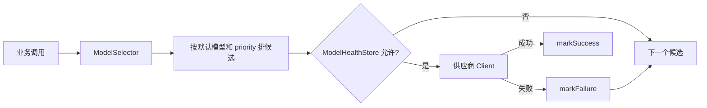

# 模型调用与路由容错

## infra-ai 的职责

`infra-ai` 把供应商 HTTP 协议、鉴权、响应解析、流式事件和故障切换封装起来。业务层依赖 `LLMService`、`EmbeddingService`、`RerankService`，不直接依赖百炼、SiliconFlow、AIHubMix 或 Ollama。

| 能力 | 相关类 | 配置来源 | 调用入口 | 失败处理 |
|---|---|---|---|---|
| Chat | `RoutingLLMService`、各 `ChatClient` | `ai.chat`、`ai.providers` | `chat()`/`streamChat()` | 跳过熔断模型、首包探测、降级 |
| Embedding | `RoutingEmbeddingService`、各 `EmbeddingClient` | `ai.embedding` | `embed()`/`embedBatch()` | `executeWithFallback()` |
| Rerank | `RoutingRerankService`、`BaiLianRerankClient` | `ai.rerank` | `rerank()` | 失败转下一个，最终可走 noop |

## 路由过程

`ModelHealthStore` 实现三态熔断：`CLOSED` 正常调用；连续失败达到 `ai.selection.failure-threshold` 后进入 `OPEN`；经过 `open-duration-ms` 后进入 `HALF_OPEN`，只放行探测请求；成功恢复，失败重新打开。

## 一次失败会怎样

非流式 Chat、Embedding、Rerank 统一由 `ModelRoutingExecutor.executeWithFallback()` 尝试候选。流式 Chat 由 `RoutingLLMService.streamChat()` 结合首包探测处理：如果模型在有效输出前失败，可切换下一候选；如果已经向用户发送内容，继续切换可能造成重复或语义断裂，因此代码需要更谨慎地管理回调和取消句柄。

## 配置注意

- `default-model` 必须能在 candidates 中找到。
- `supports-thinking` 决定深度思考候选资格。
- Embedding 输出维度必须与 `rag.default.dimension` 和 pgvector 列一致，目前为 1536。
- API Key 通过环境变量注入，不应写死。
- `rerank-noop` 是可用性兜底，不等于真正完成重排。

## 面试可讲的 3 个亮点

1. 业务通过能力接口解耦供应商，新增供应商主要实现 Client。
2. 优先级候选链配合三态熔断，避免持续请求故障模型。
3. 流式调用加入首包探测和取消句柄，比普通同步重试更贴近真实 SSE 场景。

## 本章复习问题

1. 为什么模型路由不能只写一个 `try-catch`？
2. `HALF_OPEN` 状态解决什么问题？
3. `rerank-noop` 的优点和代价是什么？

## 下一步建议

在 `ModelRoutingExecutor.executeWithFallback()` 断点观察候选顺序，再临时使用无效的本地模型配置进行只读调试规划；不要在本任务中改配置。
