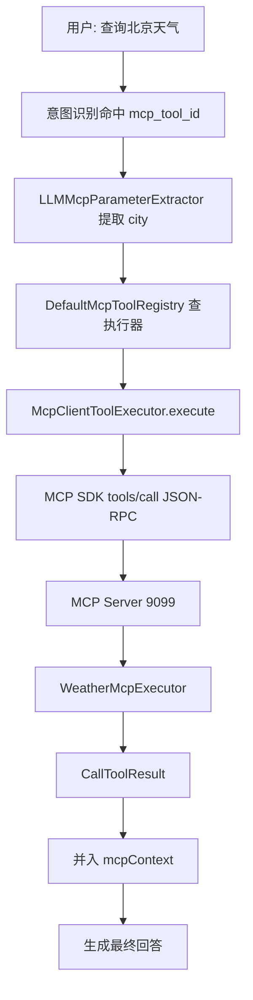

# MCP 工具调用解析

## MCP 是什么

MCP（Model Context Protocol）让 AI 应用用统一协议发现和调用工具。知识库适合回答“制度是什么”，MCP 更适合“查天气、查工单、查销售数据”这类需要实时业务系统的请求。

## 项目组件

| 组件 | 作用 | 相关代码 | 初学者理解方式 |
|---|---|---|---|
| MCP 服务入口 | 启动 9099 服务 | `mcp-server/.../McpServerApplication.java` | 工具商店服务器 |
| 工具实现 | 暴露天气/工单/销售能力 | `WeatherMcpExecutor`、`TicketMcpExecutor`、`SalesMcpExecutor` | 具体业务函数 |
| 服务配置 | 把工具注册到 SDK | `McpServerConfig.java` | 告诉服务器有哪些工具 |
| 客户端配置 | 连接 MCP 并执行 `tools/list` | `McpClientAutoConfiguration.java` | 开机读取工具目录 |
| Registry | 按 toolId 保存执行器 | `DefaultMcpToolRegistry.java` | Java Map 形式的工具索引 |
| 参数提取 | 用 LLM 从用户问题提参数 | `LLMMcpParameterExtractor.java` | 把自然语言转参数 JSON |
| 执行器 | 调 `mcpClient.callTool()` | `McpClientToolExecutor.java` | 远程代理对象 |

底层 MCP Java SDK负责 JSON-RPC 消息和 Streamable HTTP 传输；项目业务代码没有手写完整 JSON-RPC 解析器。配置地址是 `rag.mcp.servers[].url`，默认 `http://localhost:9099`。

## 调用流程

## 真实例子

`WeatherMcpExecutor` 是真实工具实现之一。用户问题先由意图树节点中的 `mcp_tool_id` 关联工具，再提取城市等参数。工具结果不会直接等同于最终自然语言答案，而会进入 `RetrievalContext.mcpContext`，随后由 `RAGPromptService` 与知识上下文一起组装。

## 常见问题

- MCP 服务未启动：客户端工具发现失败，Registry 中没有远端工具。
- toolId 与意图节点不一致：意图命中但无法找到执行器。
- 参数提取 JSON 不合法：工具调用前失败。
- 工具内部异常：应标准化为调用错误，再由上层决定如何回复。

## 本章复习问题

1. MCP 与向量检索分别适合什么问题？
2. 为什么启动时要先 `tools/list`？
3. 工具结果为什么还要交给 LLM？

## 下一步建议

同时启动 9099 和 9090，在 `registerRemoteTools()`、`McpClientToolExecutor.execute()`、`WeatherMcpExecutor` 三处打断点追踪一次天气问题。
