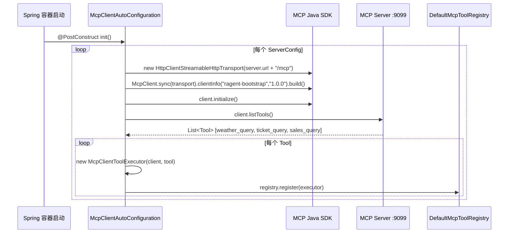
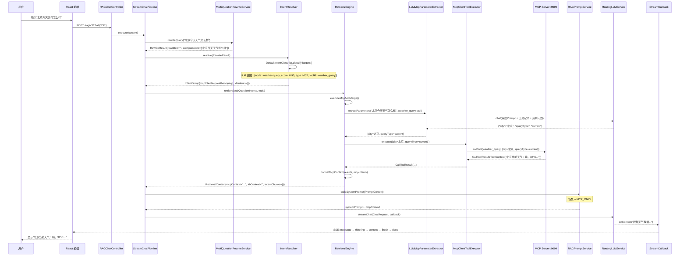
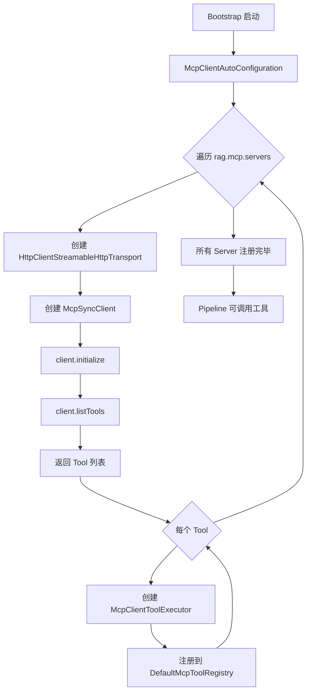
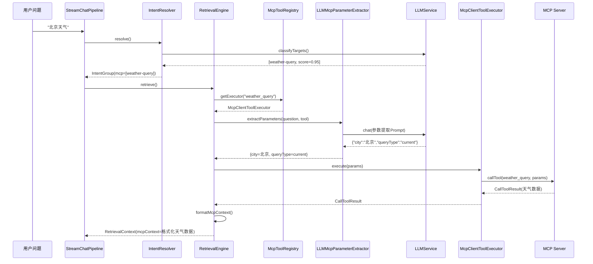
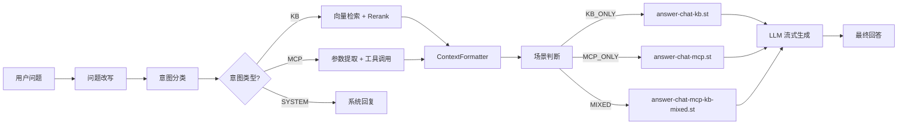

# MCP 工具调用解析

> 本章目标：让初学者理解 MCP 在 Ragent 中解决什么问题、服务端如何暴露工具、客户端如何发现工具、RAG 主流程如何选择并调用工具、工具结果如何进入最终 Prompt。读完本章后，你应该能回答：MCP 和 RAG 检索的区别是什么？用户问"北京今天天气怎么样"时，从意图识别到工具调用再到最终回答经过了哪些步骤？

## 0. 先建立一个不会混乱的结论

MCP 在 Ragent 中只解决一个问题：**知识库检索不到的实时业务数据，通过工具调用来补。**

知识库回答"制度是什么"——这是 RAG 检索的职责。工具调用回答"北京今天天气怎么样"、"本季度华东区销售数据"、"我的工单处理到哪一步了"——这是 MCP 的职责。

两者在 RAG 主流程中的位置是对称的：意图识别后，知识类意图走检索，MCP 类意图走工具调用，结果都写入同一个 Prompt 上下文。

---

## 1. MCP 是什么，用初学者语言解释

MCP（Model Context Protocol）是一个标准协议，让 AI 应用用统一的方式发现和调用外部工具。

**类比**：如果你用过手机上的"快捷指令"或"IFTTT"，就是把不同 App 的能力（查天气、查订单、发通知）封装成标准接口，一个调度器统一调用。MCP 就是 AI 领域的"快捷指令框架"。

**核心概念**：

| 概念 | 解释 |
|---|---|
| MCP Server | 提供工具的服务端，注册自己有哪些工具、每个工具有什么参数 |
| MCP Client | 调用工具的客户端，连接 Server，发现工具，调用工具 |
| Tool | 一个具体能力，有名称、描述、参数 schema |
| `tools/list` | Client 向 Server 请求工具列表的协议方法 |
| `callTool` | Client 调用某个工具的协议方法，传入参数，拿到结果 |
| Streamable HTTP | MCP 的传输方式，Server 通过 HTTP Servlet 暴露端点 |

**在 Ragent 中**：
- `mcp-server` 模块是 MCP **Server**——它暴露天气、工单、销售三个工具。
- `bootstrap` 模块是 MCP **Client**——它启动时连接 Server，发现工具，注册到本地 Registry，在问答时按意图调用。

---

## 2. MCP 和 RAG 检索的区别

| 维度 | RAG 检索 | MCP 工具调用 |
|---|---|---|
| 数据来源 | 已入库的文档（向量数据库） | 外部系统实时数据 |
| 数据特征 | 静态、历史、文本 | 动态、实时、结构化 |
| 调用方式 | 相似度搜索（Embedding + Top-K） | RPC 调用（JSON 参数 → JSON 结果） |
| 典型问题 | "公司请假制度是什么" | "北京今天多少度" |
| 命中意图 | `IntentKind.KB`（kind=0） | `IntentKind.MCP`（kind=2） |
| 结果形态 | `List<RetrievedChunk>`（文本片段） | `CallToolResult`（结构化文本） |
| 进入 Prompt 方式 | `kbContext` 字段 | `mcpContext` 字段 |

**关键理解**：MCP 不是替代检索，而是补充检索。一个用户问题可能同时命中知识意图和 MCP 意图，此时 Prompt 中同时包含 `kbContext` 和 `mcpContext`。

---

## 3. 为什么企业 RAG 项目需要工具调用

企业应用中很多数据不在文档里，而在业务系统中：

1. **实时数据**——天气、股票、航班、汇率，每分钟都在变，入库来不及。
2. **权限数据**——工单状态、审批进度、个人订单，不同用户看到不同的数据。
3. **结构化查询**——销售额按地区汇总、工单按状态统计，这类 SQL 式查询语言模型自己写不安全。
4. **外部集成**——连接 ERP、CRM、OA 等已有系统，不动历史代码。

Ragent 用 MCP 把这些能力统一成"工具"，让意图识别自动选择：知识问题检索文档，业务问题调用工具。

---

## 4. mcp-server 模块结构

```
mcp-server/
  pom.xml                          ← 依赖：spring-boot-starter-web + MCP SDK 1.1.2
  src/main/java/com/nageoffer/ai/ragent/mcp/
    McpServerApplication.java      ← 启动类，端口 9099
    config/
      McpServerConfig.java         ← 配置类：创建 MCP Server 和 Servlet
    executor/
      WeatherMcpExecutor.java      ← 天气查询工具
      TicketMcpExecutor.java       ← 工单查询工具
      SalesMcpExecutor.java        ← 销售数据查询工具
```

整个模块只有 5 个 Java 文件。一个非常精简的 MCP 工具服务。

**Maven 依赖**（`mcp-server/pom.xml`）：

| 依赖 | 版本 | 作用 |
|---|---|---|
| `spring-boot-starter-web` | Spring Boot 3.5.7 | 提供 HTTP Servlet 容器 |
| `io.modelcontextprotocol.sdk:mcp` | 1.1.2 | MCP 核心协议 |
| `io.modelcontextprotocol.sdk:mcp-json-jackson2` | 1.1.2 | MCP JSON 序列化 |

`mcp-server` 是一个独立运行的 Spring Boot 应用，不是 `bootstrap` 的子模块或子进程。

---

## 5. MCP Server 启动入口

**文件**：`mcp-server/.../McpServerApplication.java`

```java
@SpringBootApplication
public class McpServerApplication {
    public static void main(String[] args) {
        SpringApplication.run(McpServerApplication.class, args);
    }
}
```

标准 Spring Boot 入口。`@SpringBootApplication` 触发自动配置和组件扫描（`com.nageoffer.ai.ragent.mcp` 及子包）。

**启动命令**：

```bash
./mvnw -pl mcp-server spring-boot:run
# 或
java -jar mcp-server/target/mcp-server-0.0.1-SNAPSHOT.jar
```

**默认端口**：9099（在 `mcp-server/src/main/resources/application.yaml` 中配置）。

**如何判断启动成功**：

1. 日志无异常。
2. 可以用 curl 测试工具列表：

```bash
curl -X POST http://localhost:9099/mcp \
  -H "Content-Type: application/json" \
  -d '{"jsonrpc":"2.0","id":1,"method":"tools/list","params":{}}'
```

如果返回包含 `weather_query`、`ticket_query`、`sales_query` 三个工具的 JSON 描述，说明 MCP Server 启动成功。

---

## 6. 工具实现类逐个解释

每个工具执行器遵循相同模式：`@Component` + `@Bean` 方法返回 `SyncToolSpecification`。

### 6.1 WeatherMcpExecutor——天气查询

**文件**：`mcp-server/.../executor/WeatherMcpExecutor.java`

| 项 | 值 |
|---|---|
| 工具 ID | `weather_query` |
| 描述 | 查询城市天气信息，支持当前实时天气和未来多天天气预报 |
| 数据来源 | 确定性模拟数据（基于纬度和日期种子） |

**参数 schema**：

| 参数 | 类型 | 必填 | 说明 |
|---|---|---|---|
| `city` | string | 是 | 城市名称（北京、上海等 20 个城市） |
| `queryType` | string | 否 | `"current"`（默认）或 `"forecast"` |
| `days` | integer | 否 | 预报天数，默认 3，最多 7 |

**支持的城市**：北京、上海、广州、深圳、杭州、成都、武汉、南京、西安、重庆、长沙、天津、苏州、郑州、青岛、大连、厦门、昆明、哈尔滨、三亚——共 20 个城市，硬编码在 `CITY_COORDINATES` map 中。

**模拟数据算法**：
- 基于城市纬度和日期生成确定性伪随机天气。
- 考虑季节因素：春/夏/秋/冬的基准温度、天气类型、湿度、空气质量不同。
- 输出包括温度、湿度、风向/风力、空气质量，以及条件提醒（带伞、防暑、保暖）。
- 预报模式（`forecast`）会输出多天天气和趋势分析（温差 ≥5°C 提示）。

**内部结构**：
- 生成方法 `generateWeatherForDate(city, date)` 每次调用返回相同结果的确定性数据。
- 格式方法 `buildCurrentResult()` 和 `buildForecastResult()` 把数据转为中文可读文本。
- 返回类型：`CallToolResult` 包含 `TextContent`。

### 6.2 TicketMcpExecutor——工单查询

**文件**：`mcp-server/.../executor/TicketMcpExecutor.java`

| 项 | 值 |
|---|---|
| 工具 ID | `ticket_query` |
| 描述 | 查询客户技术支持工单数据，支持按地区、状态、优先级、产品、客户等维度筛选 |
| 数据来源 | 确定性模拟数据（每日生成，缓存有效期 1 天） |

**参数 schema**：

| 参数 | 类型 | 必填 | 说明 |
|---|---|---|---|
| `region` | string | 否 | 华东、华南、华北、西南、西北 |
| `status` | string | 否 | 待处理、处理中、已解决、已关闭 |
| `priority` | string | 否 | 紧急、高、中、低 |
| `product` | string | 否 | 企业版、专业版、基础版 |
| `customerName` | string | 否 | 客户名称关键字（模糊匹配） |
| `queryType` | string | 否 | `"summary"`（默认）、`"list"`、`"stats"` |
| `limit` | integer | 否 | 返回条数限制，默认 10 |

**所有参数都是可选的**——不传参数会返回整体概览。

**三种查询模式**：

| queryType | 返回内容 |
|---|---|
| `summary`（默认） | 按状态、解决率、产品分布、地区分布的汇总统计 |
| `list` | 按优先级排序的工单列表（紧急 > 高 > 中 > 低，再按创建日期降序） |
| `stats` | 问题类别分布、各产品解决率、处理人待处理/处理中排名 |

**模拟数据**：
- 生成过去 30 天的工单（排除周末）。
- 每天 2~6 个工单。
- 标题来自 15 个问题模板。
- 优先级分布：约 5% 紧急、15% 高、40% 中、40% 低。
- 状态分布：较新的工单更可能"待处理"，较旧的更可能"已关闭"。

### 6.3 SalesMcpExecutor——销售数据查询

**文件**：`mcp-server/.../executor/SalesMcpExecutor.java`

| 项 | 值 |
|---|---|
| 工具 ID | `sales_query` |
| 描述 | 查询软件销售数据，支持按地区、时间、产品、销售人员等维度筛选 |
| 数据来源 | 确定性模拟数据（每日生成，缓存有效期 1 天） |

**参数 schema**：

| 参数 | 类型 | 必填 | 说明 |
|---|---|---|---|
| `region` | string | 否 | 华东、华南、华北、西南、西北 |
| `period` | string | 否 | 本月（默认）、上月、本季度、上季度、本年 |
| `product` | string | 否 | 企业版、专业版、基础版 |
| `salesPerson` | string | 否 | 销售人员姓名 |
| `queryType` | string | 否 | `"summary"`（默认）、`"ranking"`、`"detail"`、`"trend"` |
| `limit` | integer | 否 | 返回条数限制，默认 10 |

**四种查询模式**：

| queryType | 返回内容 |
|---|---|
| `summary` | 总销售额、订单数、平均单价、按产品/地区分布 |
| `ranking` | 按销售额排名的销售人员列表 |
| `detail` | 金额最高的销售记录 |
| `trend` | 按周分组的销售额聚合趋势 |

**模拟数据**：
- 每个工作日 3~8 笔订单。
- 5 个区域各 3 名销售代表。
- 三个产品层级价格：企业版 50-200 万、专业版 10-50 万、基础版 1-10 万。
- 客户名称从 20 个公司名池中抽取。

### 6.4 工具实现的通用模式

三个执行器共享相同的代码结构：

| 组件 | 说明 |
|---|---|
| `@Component` | 让 Spring 容器发现 |
| `@Bean` 方法 | 返回 `McpServerFeatures.SyncToolSpecification`，包含 `Tool` 定义和 `CallToolRequest → CallToolResult` 处理器 |
| `TOOL_ID` | 工具唯一标识字符串 |
| `buildTool()` | 用 `Tool.builder()` + `JsonSchema` 构建参数 schema |
| `handleCall(CallToolRequest)` | 解包参数、处理逻辑、返回结果 |
| `stringArg()` / `intArg()` | 从 `Map<String, Object>` 安全取参 |
| `successResult()` / `errorResult()` | 快速构建 `CallToolResult` |

**新增工具只需要**：
1. 创建一个 `XxxMcpExecutor.java`。
2. 实现 `@Component` + `@Bean SyncToolSpecification xxxToolSpecification()`。
3. 定义 `TOOL_ID`、参数 schema、处理逻辑。
4. `McpServerConfig` 会自动发现（Spring 自动注入 `List<SyncToolSpecification>`）。

---

## 7. 工具注册配置

**文件**：`mcp-server/.../config/McpServerConfig.java`

`McpServerConfig` 做了三件事：

1. **创建传输层**：
```java
@Bean
public HttpServletStreamableServerTransportProvider transportProvider() {
    return HttpServletStreamableServerTransportProvider.builder().build();
}
```

2. **注册 Servlet 映射**：
```java
@Bean
public ServletRegistrationBean<HttpServletStreamableServerTransportProvider> mcpServlet(
        HttpServletStreamableServerTransportProvider transportProvider) {
    return new ServletRegistrationBean<>(transportProvider, "/mcp");
}
```
把 MCP 传输提供者注册为 Servlet，路径 `/mcp`。所有 MCP 请求都走 `http://localhost:9099/mcp`。

3. **构建 MCP Server**：
```java
@Bean
public McpSyncServer mcpServer(HttpServletStreamableServerTransportProvider transportProvider,
                               List<McpServerFeatures.SyncToolSpecification> toolSpecs) {
    return McpServer.sync(transportProvider)
            .serverInfo("ragent-mcp-server", "0.0.1")
            .tools(toolSpecs)
            .build();
}
```
关键：`List<McpServerFeatures.SyncToolSpecification> toolSpecs` 由 Spring 自动注入——容器中所有 `SyncToolSpecification` bean 都会被收集进来（目前是 weather、ticket、sales 三个）。

**所以工具注册不需要手动配置列表，只需要加一个 `@Component` 类，Spring 就会自动发现它。**

---

## 8. MCP Java SDK 在项目中的作用

MCP Java SDK（版本 1.1.2）提供了协议层的完整实现：

| SDK 提供的 | 用途 |
|---|---|
| `McpServer` + `McpSyncServer` | Server 端框架，处理 `tools/list` 和 `callTool` 请求 |
| `McpClient` | Client 端框架，发起 `tools/list` 和 `callTool` 请求 |
| `McpSchema.Tool` | 工具定义标准格式（名称、描述、参数 schema） |
| `McpSchema.CallToolRequest` | 调用工具的标准请求格式（工具名 + 参数 map） |
| `McpSchema.CallToolResult` | 调用工具的标准返回格式（`TextContent`/`ImageContent` 列表 + isError 标志） |
| `McpSchema.JsonSchema` | JSON Schema 构建器，用于参数 schema |
| `HttpServletStreamableServerTransportProvider` | Server 端 HTTP 传输（Servlet 方式） |
| `HttpClientStreamableHttpTransport` | Client 端 HTTP 传输 |

**项目手工写的部分**：

| 组件 | 说明 |
|---|---|
| `McpServerConfig` | 把 SDK 的 Server 组装成 Bean |
| 三个 Executor | 实现具体的工具逻辑 |
| `McpClientAutoConfiguration` | 用 SDK 的 Client 连接远程 Server |
| `McpClientToolExecutor` | 用 SDK 的 Client 调用 `callTool` |
| `DefaultMcpToolRegistry` | 用 `Map<String, McpToolExecutor>` 管理工具 |
| `LLMMcpParameterExtractor` | 用 LLM 从自然语言提取参数 |

**项目没有手写 JSON-RPC 解析器，没有手写 HTTP 端点——这些全部由 SDK 处理。**

---

## 9. bootstrap 侧 MCP Client 配置

**文件**：`bootstrap/.../mcp/McpClientProperties.java`

```java
@ConfigurationProperties(prefix = "rag.mcp")
@Data
public class McpClientProperties {
    private List<ServerConfig> servers;

    @Data
    public static class ServerConfig {
        private String name;
        private String url;
    }
}
```

**YAML 配置**（`application.yaml`）：

```yaml
rag:
  mcp:
    servers:
      - name: default
        url: http://localhost:9099
```

**初学者注意**：
- `servers` 是一个列表，意味着可以配置多个 MCP Server。
- `url` 是 Server 的地址，不包含 `/mcp` 路径。`McpClientAutoConfiguration` 会在 URL 末尾自动拼接 `/mcp`（如果还没有的话）。
- 当前只配置了一个名为 `default` 的 Server，指向本地 9099 端口。

---

## 10. 启动时 tools/list 如何发现工具

**文件**：`bootstrap/.../mcp/McpClientAutoConfiguration.java`

启动时的流程：



**关键步骤解析**：

1. `@PostConstruct init()` 在 Spring Bean 初始化完成后执行。
2. 遍历 `McpClientProperties.servers` 列表。
3. 对每个 Server：创建 HTTP 传输、创建 MCP Client、调用 `initialize()` 初始化连接。
4. 调用 `client.listTools()` 获取远程 Server 上的所有工具描述。
5. 为每个 Tool 创建 `McpClientToolExecutor`（包装 Client 和 Tool 定义），注册到 `DefaultMcpToolRegistry`。
6. `@PreDestroy destroy()` 在应用关闭时关闭所有 MCP Client 连接。

**如果 MCP Server 没启动**：`client.initialize()` 或 `client.listTools()` 会抛出连接异常，Bootstrap 启动会失败。整个 Ragent 依赖 MCP Server 可用。

---

## 11. DefaultMcpToolRegistry 如何保存工具

**文件**：`bootstrap/.../mcp/DefaultMcpToolRegistry.java`

```java
@Component
public class DefaultMcpToolRegistry implements McpToolRegistry {
    private final Map<String, McpToolExecutor> executorMap = new ConcurrentHashMap<>();

    @PostConstruct
    void init() {
        // 自动发现 Spring 容器中所有 McpToolExecutor Bean
        // 逐一注册
    }

    // register / unregister / getExecutor / listAllTools / listAllExecutors / contains / size
}
```

| 方法 | 作用 |
|---|---|
| `register(McpToolExecutor)` | 注册工具执行器，key 是 `toolId`（即 Tool 的 `name` 字段） |
| `unregister(String toolId)` | 反注册 |
| `getExecutor(String toolId)` | 按 toolId 查找执行器 |
| `listAllTools()` | 返回所有工具的 `McpSchema.Tool` 定义列表 |
| `contains(String toolId)` | 检查是否存在 |
| `size()` | 已注册工具数量 |

**McpToolExecutor 接口**：

```java
public interface McpToolExecutor {
    Tool getToolDefinition();                           // 工具定义（名称、描述、参数schema）
    CallToolResult execute(Map<String, Object> params); // 执行工具
    default String getToolId() {                        // 工具 ID
        return getToolDefinition().name();
    }
}
```

**McpClientToolExecutor 实现**：包装了 MCP SDK 的 `McpSyncClient`，调用 `mcpClient.callTool(new CallToolRequest(toolId, parameters))`。

---

## 12. IntentResolver 如何把用户问题关联到 mcp_tool_id

意图识别是 MCP 调用的入口。整个流程：

### 12.1 意图树的数据来源

意图树存储在 `t_intent_node` 表中，关键字段：

| 字段 | 说明 |
|---|---|
| `intent_code` | 节点业务编码（如 `sales-data`、`weather-query`） |
| `level` | 0=DOMAIN, 1=CATEGORY, 2=TOPIC |
| `parent_code` | 父节点编码，形成树结构 |
| `kind` | 0=KB（知识库）, 1=SYSTEM（系统交互）, **2=MCP（工具调用）** |
| `mcp_tool_id` | **MCP 节点才有**，值为工具 ID（如 `sales_query`、`weather_query`） |
| `examples` | 示例问题文本 |
| `prompt_snippet` | 短规则片段，用于 Prompt |
| `prompt_template` | 完整 Prompt 模板 |
| `param_prompt_template` | **MCP 专用**，自定义参数提取 Prompt 模板 |

### 12.2 意图分类流程

**文件**：`bootstrap/.../intent/DefaultIntentClassifier.java`

1. `loadIntentTreeData()` 从 `t_intent_node` 加载所有节点（优先从 Redis 缓存，缓存未命中则查库）。
2. 过滤叶子节点。
3. 构建包含 `id`、`path`、`description`、`type`（KB/SYSTEM/MCP）、`toolId` 的意图列表。
4. 构建系统 Prompt（用 `intent-classifier.st` 模板），列出所有叶子节点。
5. 调用 `llmService.chat()`，温度 0.1，让模型返回 JSON 格式的节点匹配分数。
6. 解析 JSON 为 `List<NodeScore>`，按 score 降序排列。

**关键**：MCP 节点在 Prompt 中被标记为 `type=MCP`、`toolId=<值>`，这样 LLM 知道这是一个工具类意图。

### 12.3 IntentResolver 分组

**文件**：`bootstrap/.../intent/IntentResolver.java`

`resolve(RewriteResult)` 之后，`mergeIntentGroup()` 把分类结果分成两组：

```java
// NodeScoreFilters.mcp() —— 过滤出 MCP 意图
List<NodeScore> mcpIntents = NodeScoreFilters.mcp(scores);
// NodeScoreFilters.kb() —— 过滤出 KB 意图
List<NodeScore> kbIntents = NodeScoreFilters.kb(scores);
```

过滤条件：
- `mcp`：`node != null && node.getKind() == MCP && node.getMcpToolId() != null && !blank`
- `kb`：`node != null && node.getKind() == KB`

结果组成 `IntentGroup(mcpIntents, kbIntents)`，分别推入检索和工具调用两条线。

---

## 13. LLMMcpParameterExtractor 如何从自然语言提参数

**文件**：`bootstrap/.../mcp/LLMMcpParameterExtractor.java`

当用户问"北京今天天气怎么样"时，意图识别命中了 `weather_query` 工具，但"北京"是自然语言，需要提取成结构化参数 `{"city": "北京"}`。

**提取流程**：

1. 检查工具的 `inputSchema`，如果无参数属性则直接返回空 Map。
2. 构建系统 Prompt（用 `prompt/mcp-parameter-extract.st` 模板）。
3. 构建用户 Prompt（用 `prompt/mcp-parameter-extract-user.st` 模板），包含：
   - `{tool_definition}`：工具名称、描述、参数列表（类型、必填、默认值、枚举值）。
   - `{user_question}`：用户的原始问题。
4. 如果意图节点有 `paramPromptTemplate`（自定义参数提取模板），则使用自定义模板覆盖默认的系统 Prompt。
5. 调用 `llmService.chat()`，温度 0.1、topP 0.3。
6. 解析返回的 JSON，只保留工具 schema 中声明的参数名，忽略模型幻觉生成的多余字段。
7. 用 `fillDefaults()` 补充缺失参数的默认值（如 `queryType` 默认 `"current"`）。
8. 解析失败时返回全默认参数，不中断流程。

**示例**：

用户问题："北京今天天气怎么样"
工具 schema：`weather_query`，需要 `city`（必填）、`queryType`（可选）

系统 Prompt：请从用户问题中提取工具参数...
用户 Prompt：工具定义：weather_query(city, queryType...)，用户问题：北京今天天气怎么样

LLM 返回：`{"city": "北京", "queryType": "current"}`

---

## 14. McpClientToolExecutor 如何执行 callTool

**文件**：`bootstrap/.../mcp/McpClientToolExecutor.java`

```java
@Slf4j @RequiredArgsConstructor
public class McpClientToolExecutor implements McpToolExecutor {
    private final McpSyncClient mcpClient;
    private final Tool toolDefinition;

    @Override
    public Tool getToolDefinition() {
        return toolDefinition;
    }

    @Override
    public CallToolResult execute(Map<String, Object> parameters) {
        CallToolRequest request = new CallToolRequest(toolDefinition.name(), parameters);
        // 记录开始时间
        CallToolResult result = mcpClient.callTool(request);
        // 记录耗时和内容大小
        return result;
        // 异常时返回 CallToolResult(isError=true, TextContent("工具调用失败: ..."))
    }
}
```

**关键**：
- 这是一个非常薄的包装层——核心调用就是 `mcpClient.callTool(request)`。
- `mcpClient` 是 MCP Java SDK 的 `McpSyncClient`，在启动时通过 `McpClientAutoConfiguration` 创建。
- 异常被 catch，不会让工具失败导致整个问答崩溃。

---

## 15. 工具结果如何进入 RetrievalContext.mcpContext

**文件**：`bootstrap/.../retrieve/RetrievalEngine.java`

`RetrievalEngine` 是检索+工具调用的总调度。在 `retrieve()` 方法中：

```java
// 对每个子问题异步执行：KB 检索 + MCP 工具调用
SubQuestionContext ctx = buildSubQuestionContext(subQ, topK);

// buildSubQuestionContext 内部：
// 1. 分离 MCP 意图和 KB 意图
// 2. KB 意图走 retrieveAndRerank()
// 3. MCP 意图走 executeMcpAndMerge()
```

**`executeMcpAndMerge()` 的流程**：

1. 对每个 MCP 意图，调用 `executeSingleMcpTool(question, intentNode)`。
2. `executeSingleMcpTool`：
   - 从 `McpToolRegistry` 查找 `toolId` 对应的 `McpToolExecutor`。
   - 获取 Tool 定义（参数 schema）。
   - 如果意图节点有 `paramPromptTemplate`，用自定义 Prompt 提取参数；否则用默认。
   - 调用 `mcpParameterExtractor.extractParameters(question, tool, customTemplate)`。
   - 调用 `executor.execute(parameters)`。
3. 收集所有 `<toolId, CallToolResult>` 映射。
4. 调用 `contextFormatter.formatMcpContext(results, mcpIntents)` 格式化为文本。

**`DefaultContextFormatter.formatMcpContext()` 的逻辑**：

1. 遍历每个 MCP 意图节点。
2. 用 `mcpToolId` 匹配 `CallToolResult`。
3. 从 `CallToolResult` 中提取 `TextContent`，区分成功和失败的结果。
4. 如果节点有 `promptSnippet`，渲染 `mcp-intent-rules` 部分。
5. 渲染 `mcp-section` 模板，包含工具名、问题、结果文本。
6. 失败的结果渲染为 `mcp-error` 块。

最终输出是一个格式化字符串，写入 `RetrievalContext.mcpContext`。

---

## 16. RAGPromptService 如何把工具结果塞进 Prompt

**文件**：`bootstrap/.../prompt/RAGPromptService.java`

工具结果进入最终 Prompt 经过以下路径：

### 16.1 场景判断

`RAGPromptService` 根据检索结果判断场景：

| 场景 | 条件 | 使用的 Prompt 模板 |
|---|---|---|
| `MCP_ONLY` | 只有 MCP 上下文，没有 KB 上下文 | `prompt/answer-chat-mcp.st` |
| `KB_ONLY` | 只有 KB 上下文，没有 MCP 上下文 | `prompt/answer-chat-kb.st` |
| `MIXED` | 两者都有 | `prompt/answer-chat-mcp-kb-mixed.st` |
| `EMPTY` | 两者都没有 | 默认模板（无证据） |

### 16.2 Prompt 构建

对于 MCP_ONLY 场景，模板中包含类似这样的结构：

```
以下是工具调用的结果，请根据这些信息回答用户问题：

{mcpContext}

请基于以上工具返回的信息，准确回答用户问题。
```

对于 MIXED 场景：

```
以下是知识库检索结果：
{kbContext}

以下是工具调用结果：
{mcpContext}

请综合以上信息回答用户问题。
```

### 16.3 如果 MCP 意图只有一个

当只有一个 MCP 意图时，`RAGPromptService` 支持**自定义 Prompt 模板**（来自意图节点的 `promptTemplate` 字段）。这允许为特定工具定制回答风格，比如销售数据查询的模板可能要求"以表格形式展示"。

---

## 17. 工具失败如何处理

**整个调用链有三层错误处理**：

### 17.1 MCP Server 端

Executor 的 `handleCall()` 方法对参数做校验。如果参数缺失或无效，返回 `CallToolResult` 包含 `isError=true` 和错误文本。

### 17.2 McpClientToolExecutor

```java
public CallToolResult execute(Map<String, Object> parameters) {
    try {
        CallToolRequest request = new CallToolRequest(toolDefinition.name(), parameters);
        CallToolResult result = mcpClient.callTool(request);
        // 记录日志
        return result;
    } catch (Exception e) {
        log.error("MCP tool call failed: toolId={}, error={}", toolDefinition.name(), e.getMessage());
        return new CallToolResult(List.of(new TextContent("工具调用失败: " + e.getMessage())), true);
    }
}
```

异常不会向上抛出，而是包装成 `isError=true` 的 `CallToolResult`。

### 17.3 RAG 主流程

`RetrievalEngine.executeSingleMcpTool()` 中：
- 如果 toolId 在 Registry 中找不到 → 返回错误结果。
- 参数提取失败 → `LLMMcpParameterExtractor` 返回全默认参数。
- 工具执行异常 → `McpClientToolExecutor` 返回错误结果。

`DefaultContextFormatter.formatMcpContext()` 会把错误结果渲染为 `mcp-error` 块，让 LLM 在回答时知道工具调用失败了，而不是假装成功。

---

## 18. MCP 服务没启动时会怎样

**启动阶段**：`McpClientAutoConfiguration.init()` 调用 `client.initialize()` 或 `client.listTools()` 时会抛出连接异常，导致 **Bootstrap 应用启动失败**。

**运行阶段**：如果 MCP Server 在运行中挂掉，后续 `mcpClient.callTool()` 会抛出异常，被 `McpClientToolExecutor.execute()` 捕获，返回错误结果。

**初学者注意**：当前设计下，MCP Server 是必需的中件，不是可选的。如果 MCP Server 不可用，Ragent 无法启动。如果需要让 MCP 变成可选依赖，需要在 `McpClientAutoConfiguration` 中加入容错逻辑（如 `@ConditionalOnProperty` 或 try-catch）。

---

## 19. toolId 不匹配时如何排查

**症状**：意图识别正确命中了 MCP 节点，但工具调用失败或跳过。

**排查步骤**：

1. **检查意图节点**：查看 `t_intent_node` 表中 `mcp_tool_id` 字段的值，确认它和 MCP Server 注册的 Tool name 一致。

   ```sql
   SELECT id, intent_code, name, kind, mcp_tool_id
   FROM t_intent_node
   WHERE kind = 2;  -- kind=2 是 MCP 类型
   ```

2. **检查 Registry**：在 `DefaultMcpToolRegistry` 打断点看 `executorMap` 的 key。应该看到 `weather_query`、`ticket_query`、`sales_query`。

3. **检查日志**：如果 `McpToolRegistry.getExecutor(toolId)` 返回空，说明 Registry 中没有对应的工具。可能原因：
   - 意图表中的 `mcp_tool_id` 拼写错误（如 `weather` 而不是 `weather_query`）。
   - MCP Server 启动时注册的工具名发生了变化。
   - MCP Server 没有启动成功。

4. **手动验证**：

   ```bash
   # 查看注册的工具列表
   curl -X POST http://localhost:9099/mcp \
     -H "Content-Type: application/json" \
     -d '{"jsonrpc":"2.0","id":1,"method":"tools/list","params":{}}'
   ```

   确认返回的 `name` 字段和 `t_intent_node.mcp_tool_id` 完全一致。

---

## 20. 参数提取失败如何排查

**症状**：意图识别正确，工具找到了，但工具调用结果不符合预期或报参数错误。

**排查步骤**：

1. **在 `LLMMcpParameterExtractor.extractParameters()` 打断点**，观察：
   - LLM 的原始返回（`raw` 变量）是什么？
   - 解析后的 `Map<String, Object>` 是否包含期望的参数？
   - 是否有意料之外的字段被过滤掉了？

2. **常见问题**：
   - LLM 返回的不是合法 JSON（带了 markdown 围栏或解释文字）→ `stripMarkdownCodeFence()` 会处理，但仍有概率失败。
   - LLM 返回了 schema 中没有的参数名 → `parseJsonResponse()` 会过滤掉，只保留 schema 声明的参数。
   - LLM 返回的值类型和 schema 不匹配（如字符串 `"3"` 而非整数 `3`）→ `convertJsonElement()` 会智能转换。

3. **自定义参数提取 Prompt**：如果默认提取效果不好，可以在 `t_intent_node` 的 `param_prompt_template` 字段中写入自定义模板，`LLMMcpParameterExtractor` 会优先使用它。

4. **默认值填充**：如果 LLM 完全没返回某个参数，`fillDefaults()` 会用 schema 中的默认值补全。

---

## 21. 完整案例：用户问"北京今天天气怎么样"



**用文字重述这段流程**：

1. **用户输入**：用户在前端输入"北京今天天气怎么样"。
2. **Controller 接收**：`RAGChatController.chat()` 创建 SSE 连接。
3. **问题改写**：`MultiQuestionRewriteService` 处理后确认只有一个子问题。
4. **意图识别**：`DefaultIntentClassifier` 把问题发送给 LLM，LLM 返回节点匹配分数。`weather-query`（`mcpToolId=weather_query`）得分最高。
5. **意图分组**：`IntentResolver.mergeIntentGroup()` 分离出 `mcpIntents=[weather-query]`、`kbIntents=[]`。
6. **MCP 工具执行**：`RetrievalEngine.executeMcpAndMerge()` → 查 Registry → 提取参数 → 调用工具 → 格式化结果。
7. **Prompt 组装**：`RAGPromptService` 判断场景为 `MCP_ONLY`，使用 `answer-chat-mcp.st` 模板，把格式化后的工具结果填入。
8. **LLM 生成**：`RoutingLLMService.streamChat()` 调用模型，模型根据 MCP 数据生成自然语言回答。
9. **SSE 流式返回**：通过 `StreamCallback` 把内容逐 token 推给前端。

---

## 22. Mermaid 图

### 22.1 工具发现图



### 22.2 工具调用时序图



### 22.3 MCP 与知识检索融合图



---

## 23. Debug 断点

| # | 位置 | 文件路径 | 方法 | 观察什么 |
|---|---|---|---|---|
| 1 | 工具发现 | `McpClientAutoConfiguration.java` | `registerRemoteTools()` | Server URL、工具列表 |
| 2 | 工具注册 | `DefaultMcpToolRegistry.java` | `register()` | executorMap 的 key |
| 3 | 意图分类 | `DefaultIntentClassifier.java` | `classifyTargets()` | LLM 返回的节点分数，MCP 节点是否被识别 |
| 4 | 意图分组 | `IntentResolver.java` | `mergeIntentGroup()` | mcpIntents 和 kbIntents 的分配 |
| 5 | 参数提取 | `LLMMcpParameterExtractor.java` | `extractParameters()` | LLM 原始返回、解析后参数、是否用自定义模板 |
| 6 | 工具执行 | `McpClientToolExecutor.java` | `execute()` | 请求参数、MCP Server 返回结果 |
| 7 | 检索引擎 | `RetrievalEngine.java` | `executeMcpAndMerge()` | MCP 调用结果、格式化文本 |
| 8 | 上下文格式化 | `DefaultContextFormatter.java` | `formatMcpContext()` | mcpContext 最终文本 |
| 9 | Prompt 组装 | `RAGPromptService.java` | `plan()` | 场景判断：MCP_ONLY / KB_ONLY / MIXED |
| 10 | Pipeline 入口 | `StreamChatPipeline.java` | `retrieve()` | RetrievalContext 中 mcpContext 和 kbContext |
| 11 | MCP Server 处理 | `WeatherMcpExecutor.java` | `handleCall()` | 接收的参数、生成的天气数据 |
| 12 | MCP Server 处理 | `TicketMcpExecutor.java` | `handleCall()` | 接收的参数、查询模式 |
| 13 | MCP Server 处理 | `SalesMcpExecutor.java` | `handleCall()` | 接收的参数、查询模式 |

---

## 24. 核心源码路径清单

### 服务端（mcp-server）

| 类 | 路径 |
|---|---|
| McpServerApplication | `mcp-server/.../McpServerApplication.java` |
| McpServerConfig | `mcp-server/.../config/McpServerConfig.java` |
| WeatherMcpExecutor | `mcp-server/.../executor/WeatherMcpExecutor.java` |
| TicketMcpExecutor | `mcp-server/.../executor/TicketMcpExecutor.java` |
| SalesMcpExecutor | `mcp-server/.../executor/SalesMcpExecutor.java` |

### 客户端（bootstrap）

| 类 | 路径 |
|---|---|
| McpToolRegistry | `bootstrap/.../rag/core/mcp/McpToolRegistry.java` |
| DefaultMcpToolRegistry | `bootstrap/.../rag/core/mcp/DefaultMcpToolRegistry.java` |
| McpToolExecutor | `bootstrap/.../rag/core/mcp/McpToolExecutor.java` |
| McpClientToolExecutor | `bootstrap/.../rag/core/mcp/McpClientToolExecutor.java` |
| McpClientAutoConfiguration | `bootstrap/.../rag/core/mcp/McpClientAutoConfiguration.java` |
| McpClientProperties | `bootstrap/.../rag/core/mcp/McpClientProperties.java` |
| McpParameterExtractor | `bootstrap/.../rag/core/mcp/McpParameterExtractor.java` |
| LLMMcpParameterExtractor | `bootstrap/.../rag/core/mcp/LLMMcpParameterExtractor.java` |
| IntentClassifier | `bootstrap/.../rag/core/intent/IntentClassifier.java` |
| DefaultIntentClassifier | `bootstrap/.../rag/core/intent/DefaultIntentClassifier.java` |
| IntentResolver | `bootstrap/.../rag/core/intent/IntentResolver.java` |
| IntentNode | `bootstrap/.../rag/core/intent/IntentNode.java` |
| IntentKind | `bootstrap/.../rag/enums/IntentKind.java` |
| NodeScoreFilters | `bootstrap/.../rag/core/intent/NodeScoreFilters.java` |
| RetrievalEngine | `bootstrap/.../rag/core/retrieve/RetrievalEngine.java` |
| RAGPromptService | `bootstrap/.../rag/core/prompt/RAGPromptService.java` |
| PromptContext | `bootstrap/.../rag/core/prompt/PromptContext.java` |
| DefaultContextFormatter | `bootstrap/.../rag/core/prompt/DefaultContextFormatter.java` |
| IntentNodeDO | `bootstrap/.../rag/dao/entity/IntentNodeDO.java` |
| IntentNodeMapper | `bootstrap/.../rag/dao/mapper/IntentNodeMapper.java` |
| StreamChatPipeline | `bootstrap/.../rag/service/pipeline/StreamChatPipeline.java` |
| IntentTreeFactory | `bootstrap/.../rag/core/intent/IntentTreeFactory.java` |
| RAGConstant | `bootstrap/.../rag/constant/RAGConstant.java` |

### 数据库

| 表 | 说明 |
|---|---|
| `t_intent_node` | 意图树节点表，`mcp_tool_id` 和 `kind=2` 标识 MCP 节点 |

---

## 25. 本章复习问题

1. **MCP 协议 vs RAG 检索**：知识库问"制度是什么"和 MCP 问"北京天气怎么样"，在意图识别后分别走了哪条路径？结果分别在哪个字段进入 Prompt？

2. **工具发现**：Bootstrap 启动时如何发现远程 MCP Server 上有哪些工具？如果 Server 没启动会怎样？

3. **IntentKind 三种类型**：KB、SYSTEM、MCP 分别代表什么？`kind` 字段在 `t_intent_node` 中分别对应什么值？

4. **mcp_tool_id**：这个字段在哪个表中？只有哪种 `kind` 的节点才会有它？它和 MCP Server 注册的工具名是什么关系？

5. **参数提取**：`LLMMcpParameterExtractor` 如何把"北京今天天气怎么样"转成 `{"city": "北京"}`？如果 LLM 返回了 schema 外的字段会怎样？

6. **工具执行**：`McpClientToolExecutor.execute()` 的核心调用是什么？异常时返回什么？

7. **自定义参数提取模板**：`param_prompt_template` 字段的作用是什么？默认模板和自定义模板在什么情况下使用？

8. **场景判断**：`RAGPromptService` 如何决定使用哪个 Prompt 模板（MCP_ONLY / KB_ONLY / MIXED）？

9. **DefaultMcpToolRegistry**：工具注册的 key 是什么？如果两个不同 Server 注册了同名工具会怎样？

10. **McpServerConfig**：三个工具的 `SyncToolSpecification` bean 是如何被自动收集到 `McpSyncServer` 中的？

11. **工具结果格式化**：`DefaultContextFormatter.formatMcpContext()` 如何区分成功和失败的工具结果？

12. **MCP 模拟数据**：三个工具的数据是真实的还是模拟的？如何切换到真实数据源？

13. **新增工具步骤**：如果要在 mcp-server 中新增一个"查询汇率"的工具，需要改几个文件？

14. **IntentTreeFactory**：这个类的作用是什么？数据库 `t_intent_node` 中的数据和硬编码数据的关系是什么？

15. **检索融合**：一个用户问"我上个月的销售额和公司报销制度分别是什么"，意图识别后 `IntentGroup` 包含什么？最终 Prompt 中 MCP 和 KB 数据如何共存？

16. **MCP 服务没启动**：如果 9099 端口的 mcp-server 挂了，bootstrap 还能启动吗？如果不能，如何改造让 MCP 变成可选？

17. **工具调用超时**：如果 MCP Server 调用超时，`McpClientToolExecutor` 如何处理？用户的回答中会看到什么？

---

## 26. 下一步建议

阅读 `10-前端页面与接口关系.md`，对比前端如何发起 SSE 请求、如何处理 MCP 场景下的事件流。同时在 IDE 中完成以下实践：

1. 先单独启动 MCP Server（`./mvnw -pl mcp-server spring-boot:run`），用 curl 调用 `tools/list` 和 `callTool` 验证三个工具。
2. 再启动 Bootstrap，在 `McpClientAutoConfiguration.registerRemoteTools()` 打断点观察工具发现过程。
3. 提问"北京天气"和"华东区销售数据"，在 `RetrievalEngine.executeSingleMcpTool()` 断点观察参数提取和工具调用。