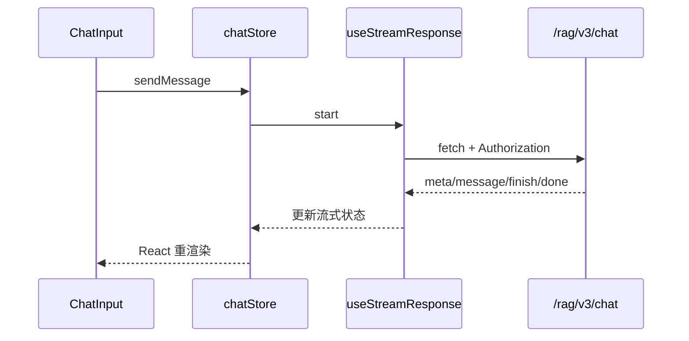

# 前端页面与接口关系

## 技术栈与结构

前端使用 React 18、TypeScript、Vite、React Router、Zustand、Axios、Tailwind CSS 和 Radix UI。入口是 `frontend/src/main.tsx`，路由在 `router.tsx`，页面在 `pages`，请求在 `services`，状态在 `stores`，流式处理在 `hooks/useStreamResponse.ts`。

| 页面/功能 | 前端文件 | 调用接口 | 后端入口 | 说明 |
|---|---|---|---|---|
| 登录 | `pages/LoginPage.tsx`、`authService.ts` | `/auth/login`、`/user/me` | `AuthController`、`UserController` | Token 放 Authorization |
| 聊天 | `pages/ChatPage.tsx`、`chatStore.ts` | `/rag/v3/chat`、`/rag/v3/stop` | `RAGChatController` | Fetch 读取 SSE |
| 会话 | `sessionService.ts` | `/conversations/**` | `ConversationController` | 列表、改名、删除、消息 |
| 知识库 | `KnowledgeListPage.tsx` | `/knowledge-base` | `KnowledgeBaseController` | CRUD |
| 文档 | `KnowledgeDocumentsPage.tsx` | `/knowledge-base/{id}/docs/**` | `KnowledgeDocumentController` | 上传、切块、预览 |
| 分块 | `KnowledgeChunksPage.tsx` | `/knowledge-base/docs/{id}/chunks/**` | `KnowledgeChunkController` | 人工维护 chunk |
| 入库 | `IngestionPage.tsx` | `/ingestion/pipelines`、`/ingestion/tasks` | 两个 Ingestion Controller | Pipeline 与执行记录 |
| 意图树 | `IntentTreePage.tsx` 等 | `/intent-tree/**` | `IntentTreeController` | 知识/MCP 路由配置 |
| Trace | `RagTracePage.tsx` | `/rag/traces/runs/**` | `RagTraceController` | 调用链可观测性 |
| 用户/设置 | `UserListPage.tsx`、`SystemSettingsPage.tsx` | `/users`、`/rag/settings` | `UserController`、`RAGSettingsController` | 管理功能 |

## 从按钮反查后端

1. 在页面中找到 `onClick` 或提交函数。
2. 跳到其引入的 `services/*Service.ts`。
3. 记下 URL 和 HTTP 方法。
4. 在后端用 `rg` 搜 URL 片段或 `@PostMapping`。
5. 从 Controller 注入字段继续进入 Service。

例如上传文档：`KnowledgeDocumentsPage.tsx` -> `uploadKnowledgeDocument()` -> `POST /knowledge-base/{kbId}/docs/upload` -> `KnowledgeDocumentController.upload()`。

## SSE 处理

聊天不使用浏览器 `EventSource`，而是 `useStreamResponse.ts` 使用 `fetch()`，这样可以加入 Authorization 头、AbortSignal 和重试逻辑。它读取响应流，解析 SSE event/data，再交给 `chatStore` 更新思考内容、回答、任务 ID 和完成状态。

## 本章复习问题

1. 为什么项目的 SSE 使用 fetch 而不是 EventSource？
2. 如何从一个页面按钮定位 Java Controller？
3. `services` 和 `stores` 各自负责什么？

## 下一步建议

打开 DevTools Network，完成登录、知识库列表和一次聊天，逐个把请求映射到本章表格中的 Controller。
