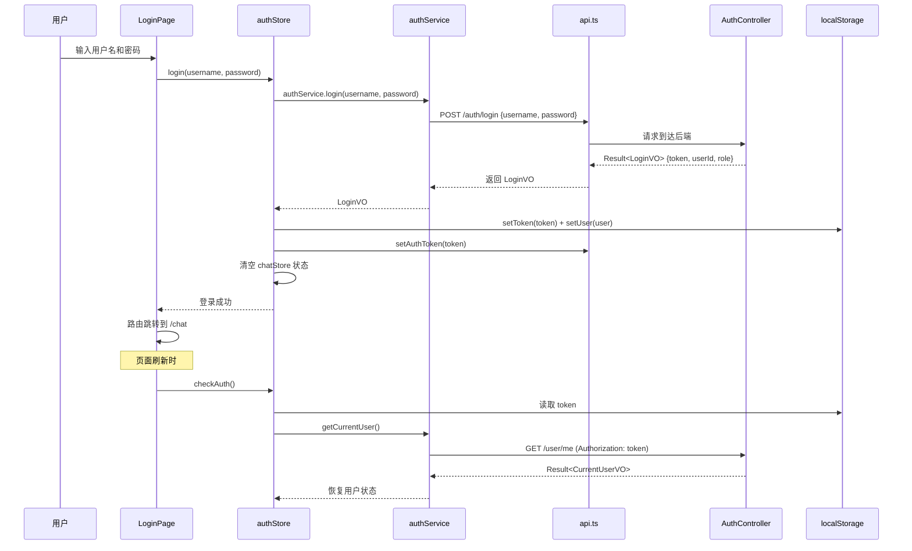
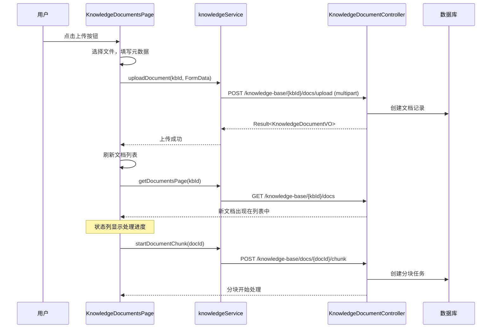
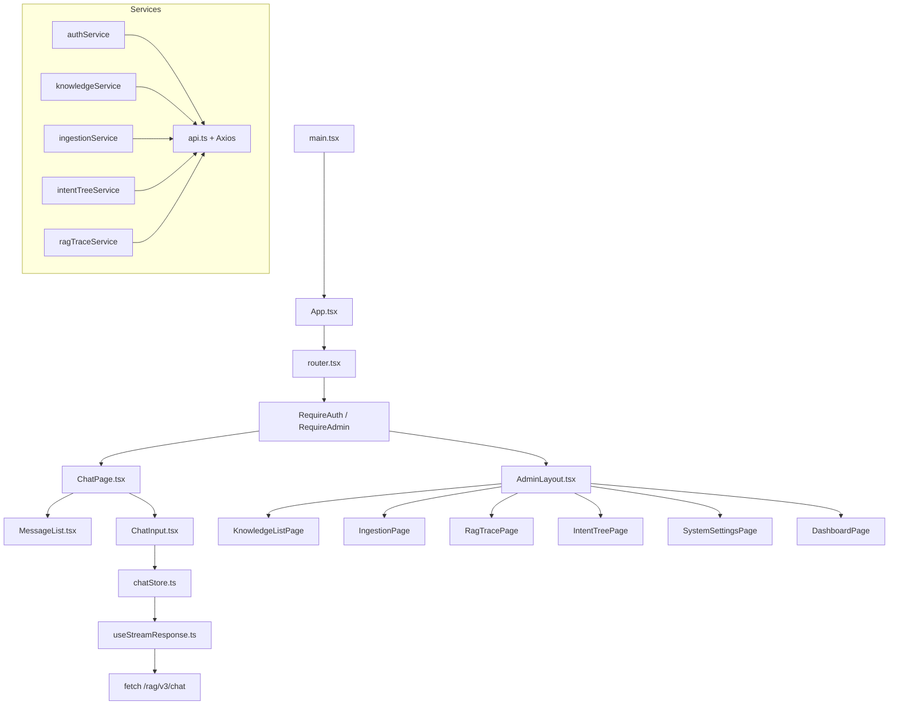
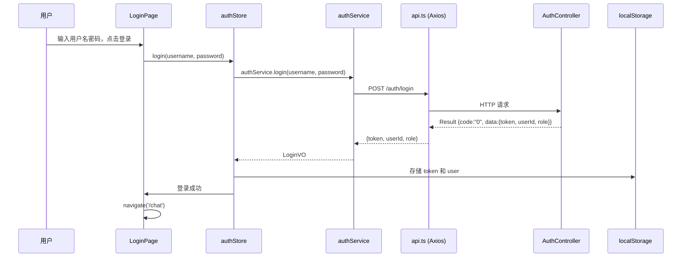
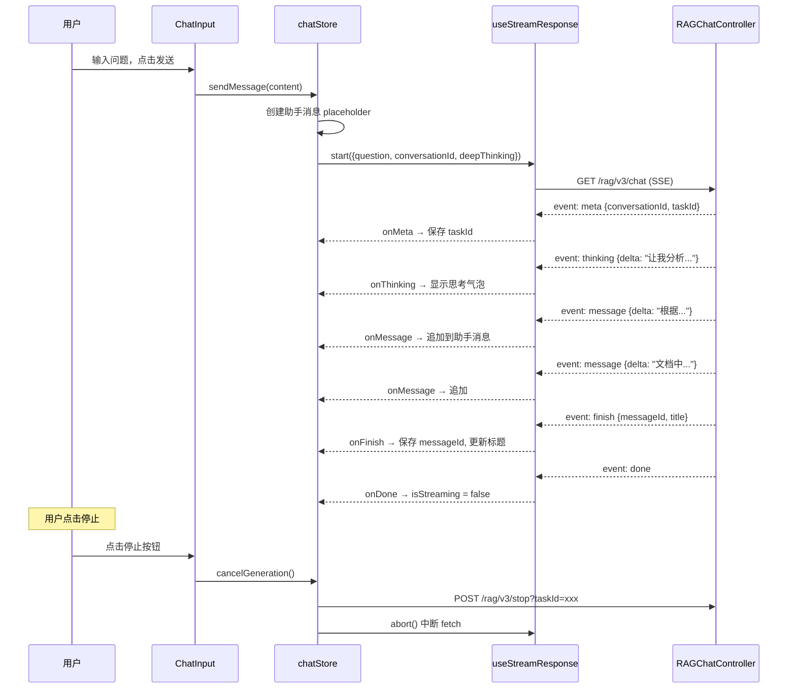
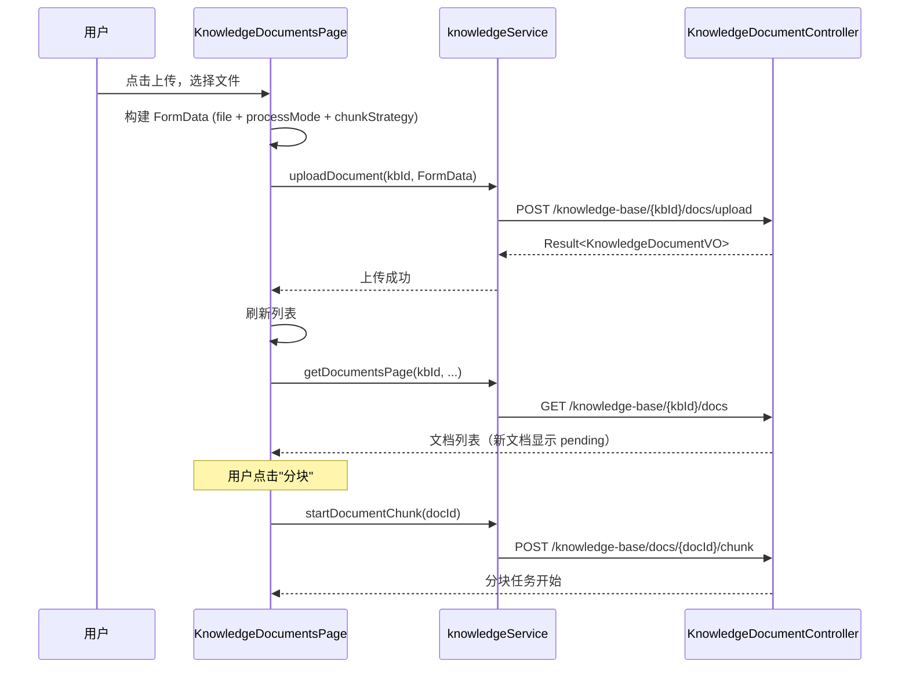

# 前端页面与接口关系

> 本章目标：让后端基础学习者也能看懂 Ragent 前端——页面在哪里、接口在哪里、状态在哪里、SSE 怎么解析、如何从按钮反查后端 Controller。读完本章后，你能在浏览器 DevTools 中追踪任何一个按钮的网络请求，并在 IDE 中找到对应的后端方法。

## 0. 先建立一个不会混乱的结论

Ragent 前端只有三条数据线：

1. **普通 REST 接口**——Axios `GET`/`POST`/`PUT`/`DELETE`，返回 JSON `Result<T>`，走 `/api` 代理到后端 9090 端口。
2. **SSE 流式接口**——`fetch()` 读取 `text/event-stream`，用于聊天，同样走代理。
3. **本地状态**——`authStore` 管理 Token，`chatStore` 管理会话和消息，`themeStore` 管理主题。管理后台页面用组件本地 `useState`，不依赖全局 Store。

所有 API 都通过 `services/api.ts` 的 Axios 实例统一封装，Token 自动从 `localStorage` 注入 `Authorization` 头。

---

## 1. 前端技术栈解释

| 技术 | 作用 | 在项目中的位置 | 初学者理解方式 |
|---|---|---|---|
| React 18 | UI 渲染框架 | 所有 `*.tsx` 文件 | 用组件描述页面，数据变了自动重渲染 |
| TypeScript | 类型系统 | 所有 `*.ts`/`*.tsx` 文件 | 给 JS 加类型检查，IDE 提示更好 |
| Vite 5 | 构建和开发服务器 | `vite.config.ts` | 快速启动和热更新，比 webpack 快 |
| React Router v6 | 页面路由 | `router.tsx` | URL 和页面的映射关系 |
| Zustand | 全局状态管理 | `stores/authStore.ts`, `stores/chatStore.ts`, `stores/themeStore.ts` | 比 Redux 简单，用 `useStore()` 就能读写全局数据 |
| Axios | HTTP 客户端 | `services/api.ts` | 封装请求、拦截器、Token |
| Tailwind CSS | 原子化 CSS | `className="flex items-center..."` | 用类名写样式，不改 CSS 文件 |
| Radix UI | 无样式组件原语 | `components/ui/*.tsx` | 提供 Dialog、Select、Dropdown 等无障碍基础组件 |
| shadcn/ui 风格 | 组件库 | `components/ui/*.tsx` | 基于 Radix UI + Tailwind 的预制样式组件 |
| react-markdown | Markdown 渲染 | `components/chat/MarkdownRenderer.tsx` | 把模型回答的 Markdown 渲染成 HTML |
| @tanstack/react-table | 表格 | 各管理页面的表格 | 分页、排序、筛选的表格组件 |
| recharts | 图表 | `DashboardPage.tsx` | 仪表盘趋势图 |
| sonner | Toast 通知 | `components/common/Toast.tsx` | 成功/失败提示气泡 |
| react-hook-form + zod | 表单 + 校验 | 各 Dialog 表单 | 表单数据收集和类型安全校验 |
| react-virtuoso | 虚拟滚动 | `components/chat/MessageList.tsx` | 聊天消息列表长列表性能优化 |

---

## 2. 前端目录结构

```
frontend/src/
├── main.tsx                  ← 入口：初始化主题 + 认证 + 渲染 App
├── App.tsx                  ← ErrorBoundary + RouterProvider
├── router.tsx               ← 所有路由定义 + 路由守卫
├── pages/                   ← 页面组件
│   ├── LoginPage.tsx        ← 登录
│   ├── ChatPage.tsx         ← 聊天（主页面）
│   ├── NotFoundPage.tsx     ← 404
│   └── admin/
│       ├── AdminLayout.tsx  ← 管理后台布局（侧边栏+顶栏）
│       ├── dashboard/       ← 仪表盘
│       ├── knowledge/       ← 知识库 + 文档 + 分块
│       ├── intent-tree/     ← 意图树 + 意图列表 + 意图编辑
│       ├── ingestion/       ← 入库 Pipeline + 任务
│       ├── traces/          ← Trace 列表 + 详情
│       ├── settings/        ← 系统设置
│       ├── sample-questions/← 示例问题
│       ├── query-term-mapping/ ← 术语映射
│       └── users/           ← 用户管理
├── components/              ← 通用组件
│   ├── chat/                ← 聊天相关：ChatInput, MessageItem, MessageList, MarkdownRenderer 等
│   ├── session/             ← 会话列表：SessionItem, SessionList
│   ├── admin/               ← 管理组件：CreateKnowledgeBaseDialog, SimpleLineChart
│   ├── common/              ← 通用：Avatar, ErrorBoundary, Loading, Toast
│   ├── layout/              ← 布局：Header, MainLayout, Sidebar
│   └── ui/                  ← shadcn/ui 原子组件：button, dialog, input, table 等
├── services/                ← API 接口封装
│   ├── api.ts               ← Axios 实例 + 拦截器
│   ├── authService.ts       ← 登录/登出/当前用户
│   ├── chatService.ts       ← 停止任务 + 反馈
│   ├── sessionService.ts    ← 会话 CRUD
│   ├── knowledgeService.ts  ← 知识库/文档/分块 CRUD
│   ├── ingestionService.ts  ← Pipeline/任务 CRUD
│   ├── intentTreeService.ts ← 意图树 CRUD
│   ├── ragTraceService.ts   ← Trace 查询
│   ├── sampleQuestionService.ts ← 示例问题 CRUD
│   ├── queryTermMappingService.ts ← 术语映射 CRUD
│   ├── settingsService.ts  ← 系统设置查询
│   ├── userService.ts       ← 用户 CRUD + 改密码
│   └── dashboardService.ts  ← 仪表盘数据
├── stores/                  ← Zustand 全局状态
│   ├── authStore.ts         ← 用户 + Token + 认证状态
│   ├── chatStore.ts         ← 会话列表 + 消息 + SSE 流状态
│   └── themeStore.ts        ← 明暗主题
├── hooks/                   ← 自定义 Hook
│   ├── useStreamResponse.ts ← SSE 流式解析核心
│   ├── useAuth.ts           ← authStore 简写
│   └── useChat.ts           ← chatStore 简写
├── utils/                   ← 工具函数
│   ├── storage.ts           ← localStorage 封装
│   ├── helpers.ts           ← 格式化 + URL 构建
│   ├── time.ts              ← 时间格式化（相对/绝对）
│   └── error.ts             ← 错误消息提取
├── types/                   ← TypeScript 类型
│   └── index.ts             ← User, Session, Message, StreamMeta 等
└── lib/
    └── utils.ts             ← cn() Tailwind 类名合并
```

---

## 3. 路由总览

**文件**：`frontend/src/router.tsx`

| 路径 | 页面组件 | 路由守卫 | 用途 |
|---|---|---|---|
| `/` | `HomeRedirect` | 无 | 根据登录状态跳转 |
| `/login` | `LoginPage` | `RedirectIfAuth` | 登录页，已登录则跳转聊天 |
| `/chat` | `ChatPage` | `RequireAuth` | 聊天主页（无会话 ID） |
| `/chat/:sessionId` | `ChatPage` | `RequireAuth` | 聊天主页（指定会话） |
| `/admin` | `AdminLayout` | `RequireAdmin` | 管理后台布局 |
| `/admin/dashboard` | `DashboardPage` | `RequireAdmin` | 仪表盘 |
| `/admin/knowledge` | `KnowledgeListPage` | `RequireAdmin` | 知识库列表 |
| `/admin/knowledge/:kbId` | `KnowledgeDocumentsPage` | `RequireAdmin` | 知识库下文档 |
| `/admin/knowledge/:kbId/docs/:docId` | `KnowledgeChunksPage` | `RequireAdmin` | 文档下分块 |
| `/admin/intent-tree` | `IntentTreePage` | `RequireAdmin` | 意图树管理 |
| `/admin/intent-list` | `IntentListPage` | `RequireAdmin` | 意图列表管理 |
| `/admin/intent-list/:id/edit` | `IntentEditPage` | `RequireAdmin` | 意图编辑 |
| `/admin/ingestion` | `IngestionPage` | `RequireAdmin` | 入库 Pipeline + 任务 |
| `/admin/traces` | `RagTracePage` | `RequireAdmin` | Trace 列表 |
| `/admin/traces/:traceId` | `RagTraceDetailPage` | `RequireAdmin` | Trace 详情 |
| `/admin/settings` | `SystemSettingsPage` | `RequireAdmin` | 系统设置 |
| `/admin/sample-questions` | `SampleQuestionPage` | `RequireAdmin` | 示例问题 |
| `/admin/mappings` | `QueryTermMappingPage` | `RequireAdmin` | 术语映射 |
| `/admin/users` | `UserListPage` | `RequireAdmin` | 用户管理 |

**路由守卫说明**：

| 守卫 | 检查 | 未通过跳转 |
|---|---|---|
| `RequireAuth` | `authStore.isAuthenticated` | `/login` |
| `RequireAdmin` | `isAuthenticated && user.role === "admin"` | `/chat` |
| `RedirectIfAuth` | `isAuthenticated` 则已登录 | `/chat` |

---

## 4. 接口封装方式

### 4.1 api.ts——Axios 实例

**文件**：`frontend/src/services/api.ts`

| 配置项 | 值 | 说明 |
|---|---|---|
| `baseURL` | `import.meta.env.VITE_API_BASE_URL` 或 `""` | 默认为空，开发时走 Vite 代理 |
| `timeout` | 60000 | 60 秒超时 |

**请求拦截器**：从 `localStorage` 取 `ragent_token`，设置 `Authorization: {token}`。

**响应拦截器**：
- 判断 `payload.code !== "0"` → `Promise.reject(new Error(message))`。
- HTTP 401 → 清除认证信息，跳转 `/login`。
- 网络错误 → 显示 toast 提示。

### 4.2 Token 处理

| 操作 | 位置 | 说明 |
|---|---|---|
| 登录成功保存 | `authStore.login()` | `localStorage.setItem('ragent_token', token)` |
| 每次请求自动携带 | `api.ts` 请求拦截器 | 从 localStorage 读取并设置 Authorization 头 |
| 登出清除 | `authStore.logout()` | `localStorage.removeItem('ragent_token')` + `localStorage.removeItem('ragent_user')` |
| 页面刷新恢复 | `main.tsx` → `checkAuth()` | 从 localStorage 恢复 token 和用户信息 |

### 4.3 Vite 代理配置

**文件**：`frontend/vite.config.ts`

```typescript
proxy: {
  '/api': {
    target: 'http://localhost:9090',
    changeOrigin: true,
  }
}
```

开发时，前端 `http://localhost:5173` 发出的 `/api/xxx` 请求会被代理到 `http://localhost:9090/api/xxx`。

**注意**：SSE 请求（`/rag/v3/chat`）不走 `/api` 前缀，而是直接请求同源。在开发环境中，Vite 需要额外配置 `/rag` 代理规则，或者前端 API_BASE_URL 指向后端地址。

---

## 5. 页面到后端 Controller 映射表

### 5.1 认证与用户

| 前端页面 | 前端文件 | service 方法 | URL | HTTP | 后端 Controller | 后端方法 | 用途 |
|---|---|---|---|---|---|---|---|
| 登录页 | `LoginPage.tsx` | `authService.login()` | `/auth/login` | POST | `AuthController` | `login()` | 用户登录，返回 token |
| 顶栏 | `AdminLayout.tsx` | `authService.logout()` | `/auth/logout` | POST | `AuthController` | `logout()` | 用户登出 |
| 登录页/刷新 | `authStore.checkAuth()` | `authService.getCurrentUser()` | `/user/me` | GET | `UserController` | `currentUser()` | 获取当前用户信息 |
| 用户管理 | `UserListPage.tsx` | `userService.getUsersPage()` | `/users` | GET | `UserController` | `pageQuery()` | 分页查询用户 |
| 用户管理 | `UserListPage.tsx` | `userService.createUser()` | `/users` | POST | `UserController` | `create()` | 创建用户 |
| 用户管理 | `UserListPage.tsx` | `userService.updateUser()` | `/users/{id}` | PUT | `UserController` | `update()` | 更新用户 |
| 用户管理 | `UserListPage.tsx` | `userService.deleteUser()` | `/users/{id}` | DELETE | `UserController` | `delete()` | 删除用户 |
| 改密码弹窗 | `AdminLayout.tsx` | `userService.changePassword()` | `/user/password` | PUT | `UserController` | `changePassword()` | 修改密码 |

### 5.2 聊天与会话

| 前端页面 | 前端文件 | service 方法 / store 方法 | URL | HTTP | 后端 Controller | 后端方法 | 用途 |
|---|---|---|---|---|---|---|---|
| 聊天页 | `ChatPage.tsx` | `chatStore.sendMessage()` | `/rag/v3/chat` | GET (SSE) | `RAGChatController` | `chat()` | 流式聊天 |
| 聊天页 | `ChatPage.tsx` | `chatService.stopTask()` | `/rag/v3/stop` | POST | `RAGChatController` | `stop()` | 停止回答 |
| 聊天页 | `chatStore` | `sessionService.listSessions()` | `/conversations` | GET | `ConversationController` | `listConversations()` | 会话列表 |
| 聊天页 | `chatStore` | `sessionService.listMessages()` | `/conversations/{id}/messages` | GET | `ConversationController` | `listMessages()` | 消息历史 |
| 聊天页 | `chatStore` | `sessionService.renameSession()` | `/conversations/{id}` | PUT | `ConversationController` | `rename()` | 重命名会话 |
| 聊天页 | `chatStore` | `sessionService.deleteSession()` | `/conversations/{id}` | DELETE | `ConversationController` | `delete()` | 删除会话 |
| 聊天页 | `chatStore` | `chatService.submitFeedback()` | `/conversations/messages/{id}/feedback` | POST | `MessageFeedbackController` | `submitFeedback()` | 消息反馈 |

### 5.3 知识库与文档

| 前端页面 | 前端文件 | service 方法 | URL | HTTP | 后端 Controller | 后端方法 | 用途 |
|---|---|---|---|---|---|---|---|
| 知识库列表 | `KnowledgeListPage.tsx` | `knowledgeService.getKnowledgeBasesPage()` | `/knowledge-base` | GET | `KnowledgeBaseController` | `pageQuery()` | 知识库分页 |
| 知识库列表 | `KnowledgeListPage.tsx` | `knowledgeService.createKnowledgeBase()` | `/knowledge-base` | POST | `KnowledgeBaseController` | `createKnowledgeBase()` | 创建知识库 |
| 知识库列表 | `KnowledgeListPage.tsx` | `knowledgeService.renameKnowledgeBase()` | `/knowledge-base/{id}` | PUT | `KnowledgeBaseController` | `renameKnowledgeBase()` | 重命名 |
| 知识库列表 | `KnowledgeListPage.tsx` | `knowledgeService.deleteKnowledgeBase()` | `/knowledge-base/{id}` | DELETE | `KnowledgeBaseController` | `deleteKnowledgeBase()` | 删除知识库 |
| 文档列表 | `KnowledgeDocumentsPage.tsx` | `knowledgeService.getDocumentsPage()` | `/knowledge-base/{kbId}/docs` | GET | `KnowledgeDocumentController` | `page()` | 文档分页 |
| 文档列表 | `KnowledgeDocumentsPage.tsx` | `knowledgeService.uploadDocument()` | `/knowledge-base/{kbId}/docs/upload` | POST | `KnowledgeDocumentController` | `upload()` | 上传文档（multipart） |
| 文档列表 | `KnowledgeDocumentsPage.tsx` | `knowledgeService.enableDocument()` | `/knowledge-base/docs/{docId}/enable` | PATCH | `KnowledgeDocumentController` | `enable()` | 启用/禁用文档 |
| 文档列表 | `KnowledgeDocumentsPage.tsx` | `knowledgeService.startDocumentChunk()` | `/knowledge-base/docs/{docId}/chunk` | POST | `KnowledgeDocumentController` | `startChunk()` | 开始分块 |
| 分块管理 | `KnowledgeChunksPage.tsx` | `knowledgeService.getChunksPage()` | `/knowledge-base/docs/{docId}/chunks` | GET | `KnowledgeChunkController` | `pageQuery()` | 分块分页 |
| 分块管理 | `KnowledgeChunksPage.tsx` | `knowledgeService.createChunk()` | `/knowledge-base/docs/{docId}/chunks` | POST | `KnowledgeChunkController` | `create()` | 创建分块 |
| 分块管理 | `KnowledgeChunksPage.tsx` | `knowledgeService.updateChunk()` | `/knowledge-base/docs/{docId}/chunks/{chunkId}` | PUT | `KnowledgeChunkController` | `update()` | 更新分块 |
| 分块管理 | `KnowledgeChunksPage.tsx` | `knowledgeService.deleteChunk()` | `/knowledge-base/docs/{docId}/chunks/{chunkId}` | DELETE | `KnowledgeChunkController` | `delete()` | 删除分块 |

### 5.4 入库 Pipeline 与任务

| 前端页面 | 前端文件 | service 方法 | URL | HTTP | 后端 Controller | 后端方法 | 用途 |
|---|---|---|---|---|---|---|---|
| 入库页 | `IngestionPage.tsx` | `ingestionService.getIngestionPipelines()` | `/ingestion/pipelines` | GET | `IngestionPipelineController` | `page()` | Pipeline 分页 |
| 入库页 | `IngestionPage.tsx` | `ingestionService.createIngestionPipeline()` | `/ingestion/pipelines` | POST | `IngestionPipelineController` | `create()` | 创建 Pipeline |
| 入库页 | `IngestionPage.tsx` | `ingestionService.updateIngestionPipeline()` | `/ingestion/pipelines/{id}` | PUT | `IngestionPipelineController` | `update()` | 更新 Pipeline |
| 入库页 | `IngestionPage.tsx` | `ingestionService.deleteIngestionPipeline()` | `/ingestion/pipelines/{id}` | DELETE | `IngestionPipelineController` | `delete()` | 删除 Pipeline |
| 入库页 | `IngestionPage.tsx` | `ingestionService.getIngestionTasks()` | `/ingestion/tasks` | GET | `IngestionTaskController` | `page()` | 任务分页 |
| 入库页 | `IngestionPage.tsx` | `ingestionService.createIngestionTask()` | `/ingestion/tasks` | POST | `IngestionTaskController` | `create()` | 创建任务 |
| 入库页 | `IngestionPage.tsx` | `ingestionService.uploadIngestionTask()` | `/ingestion/tasks/upload` | POST | `IngestionTaskController` | `upload()` | 上传文件入库（multipart） |
| 入库页 | `IngestionPage.tsx` | `ingestionService.getIngestionTaskNodes()` | `/ingestion/tasks/{id}/nodes` | GET | `IngestionTaskController` | `nodes()` | 查看任务节点日志 |

### 5.5 意图树、Trace、设置等

| 前端页面 | service 方法 | URL | HTTP | 后端 Controller | 用途 |
|---|---|---|---|---|---|
| 意图树 | `intentTreeService.getIntentTree()` | `/intent-tree/trees` | GET | `IntentTreeController.tree()` | 获取意图树 |
| 意图树 | `intentTreeService.createIntentNode()` | `/intent-tree` | POST | `IntentTreeController.createNode()` | 创建节点 |
| 意图树 | `intentTreeService.updateIntentNode()` | `/intent-tree/{id}` | PUT | `IntentTreeController.updateNode()` | 更新节点 |
| 意图树 | `intentTreeService.deleteIntentNode()` | `/intent-tree/{id}` | DELETE | `IntentTreeController.deleteNode()` | 删除节点 |
| Trace | `ragTraceService.getRagTraceRuns()` | `/rag/traces/runs` | GET | `RagTraceController.pageRuns()` | Trace 分页 |
| Trace | `ragTraceService.getRagTraceDetail()` | `/rag/traces/runs/{traceId}` | GET | `RagTraceController.detail()` | Trace 详情 |
| Trace | `ragTraceService.getRagTraceNodes()` | `/rag/traces/runs/{traceId}/nodes` | GET | `RagTraceController.nodes()` | Trace 节点 |
| 设置 | `settingsService.getSystemSettings()` | `/rag/settings` | GET | `RAGSettingsController.settings()` | 系统设置 |
| 仪表盘 | `dashboardService.getDashboardOverview()` | `/admin/dashboard/overview` | GET | `DashboardController.overview()` | 仪表盘概览 |
| 示例问题 | `sampleQuestionService.listSampleQuestions()` | `/rag/sample-questions` | GET | `SampleQuestionController.listSampleQuestions()` | 聊天页示例问题 |
| 术语映射 | `queryTermMappingService.getQueryTermMappingsPage()` | `/mappings` | GET | `QueryTermMappingController.pageQuery()` | 术语映射分页 |

---

## 6. 登录流程



### 6.1 登录状态判断

- **路由守卫**：`RequireAuth` 组件检查 `authStore.isAuthenticated`，未登录跳转 `/login`。
- **Token 过期**：后端返回 401 → Axios 响应拦截器清除认证 → 跳转 `/login`。
- **管理员守卫**：`RequireAdmin` 检查 `user.role === "admin"`，非管理员跳转 `/chat`。

---

## 7. 聊天流程

### 7.1 整体流程

1. **ChatPage** 挂载 → `chatStore.fetchSessions()` 加载会话列表。
2. URL 中有 `sessionId` → `chatStore.selectSession(sessionId)` 加载历史消息。
3. 用户在 `ChatInput` 输入问题 → `chatStore.sendMessage(content)`。
4. `sendMessage` 构造 SSE URL，调用 `createStreamResponse()` 开始流式接收。
5. 收到 `meta` 事件 → 保存 `taskId` 和 `conversationId`。
6. 收到 `message` 事件 → 追加内容到助手消息。
7. 收到 `thinking` 事件 → 追加思考内容。
8. 收到 `finish` 事件 → 保存 `messageId` 和 `title`。
9. 收到 `done` 事件 → 标记流结束。
10. 用户点击"停止" → `chatStore.cancelGeneration()` → `chatService.stopTask(taskId)` → `POST /rag/v3/stop`。

### 7.2 chatStore 关键状态

| 字段 | 类型 | 作用 |
|---|---|---|
| `sessions` | `Session[]` | 会话列表 |
| `currentSessionId` | `string` | 当前选中的会话 ID |
| `messages` | `Message[]` | 当前会话的消息列表 |
| `isStreaming` | `boolean` | 是否正在流式接收 |
| `streamTaskId` | `string` | 当前流的任务 ID |
| `streamAbort` | `AbortController` | 用于取消 SSE 请求 |
| `cancelRequested` | `boolean` | 用户是否请求了停止 |
| `deepThinkingEnabled` | `boolean` | 是否启用深度思考 |

### 7.3 useStreamResponse 核心逻辑

**文件**：`frontend/src/hooks/useStreamResponse.ts`

`createStreamResponse(options, handlers)` 返回 `{ start, cancel }`：

1. **`start()`**：
   - 用 `fetch()` 发起 GET 请求到 `/rag/v3/chat?question=...&conversationId=...&deepThinking=...`。
   - 设置 `Accept: text/event-stream`。
   - 设置 `Authorization` 头。
   - 创建 `AbortController` 用于取消。

2. **读取 SSE 流**：
   - 获取 `response.body.getReader()`。
   - 循环 `reader.read()` 读取字节。
   - 解码为文本，按 `\n` 分行。
   - 解析 `event:` 和 `data:` 行。

3. **事件分发**：

| 事件 | 数据类型 | 处理 |
|---|---|---|
| `meta` | `{ conversationId, taskId }` | 保存会话 ID 和任务 ID |
| `message` | `{ delta }` | 追加文本内容到助手消息 |
| `thinking` | `{ delta }` | 追加思考内容 |
| `finish` | `{ messageId?, title? }` | 保存消息 ID 和标题 |
| `done` | 无 | 标记流结束，清空流状态 |
| `reject` | 自定义 | 意图需要澄清时 |
| `cancel` | 无 | 服务端取消确认 |
| `error` | 错误信息 | 显示错误提示 |

4. **`cancel()`**：调用 `abortController.abort()` 中断 fetch 请求。

### 7.4 为什么用 fetch 而不是 EventSource

| 特性 | EventSource | fetch stream |
|---|---|---|
| 自定义 Header | ❌ 不能加 Authorization | ✅ 可以 |
| 读取自定义事件 | ✅ 但 API 有限 | ✅ 完全自主 |
| 取消请求 | ✅ `close()` | ✅ `AbortController.abort()` |
| POST 方法 | ❌ 只能 GET | ✅ 任何方法 |
| 错误重试 | 内置自动重连 | 需要自己实现 |
| 兼容性 | 所有浏览器 | 需要 `ReadableStream` API |

Ragent 选择 `fetch` 的核心原因：**需要 Authorization 头**。EventSource 不支持自定义 Header，用 fetch stream 可以在请求头中携带 Token。

### 7.5 停止回答流程

1. 用户点击"停止"按钮。
2. `chatStore.cancelGeneration()`：
   - 设置 `cancelRequested = true`。
   - 调用 `chatService.stopTask(taskId)` → `POST /rag/v3/stop?taskId=xxx`。
   - 前端同时调用 `streamAbort.abort()` 中断 SSE 连接。
3. 后端收到停止请求后，通过 `StreamTaskManager` 找到对应的 `StreamCancellationHandle` 并调用 `cancel()`。
4. 后端 `RoutingLLMService` 的 OkHttp Call 被取消，流停止。

---

## 8. 文档上传流程



**上传接口**：`POST /knowledge-base/{kbId}/docs/upload`，`Content-Type: multipart/form-data`。

**FormData 包含**：
- `file`：上传的文件（`MultipartFile`）
- `processMode`：处理模式（chunk / pipeline）
- `chunkStrategy`：分块策略
- 其他配置参数

**上传后刷新**：`KnowledgeDocumentsPage` 在上传成功后自动调用 `getDocumentsPage()` 刷新列表。

**状态展示**：文档状态字段（如 `pending`、`processing`、`completed`、`failed`）通过彩色圆点和标签展示在列表中。

---

## 9. 管理后台流程

### 9.1 知识库管理

`KnowledgeListPage` 提供知识库的 CRUD：
- 创建：`CreateKnowledgeBaseDialog` 弹窗，填写名称、描述、Embedding 模型。
- 重命名：双击名称或点击编辑图标。
- 删除：确认弹窗后调用 `deleteKnowledgeBase()`。
- 进入文档：点击知识库名称跳转 `/admin/knowledge/:kbId`。

### 9.2 入库 Pipeline

`IngestionPage` 有两个 Tab：

**Pipeline Tab**：
- 创建 Pipeline：选择节点类型（Fetcher、Parser、Enhancer、Chunker、Enricher、Indexer），配置节点参数。
- 编辑 Pipeline：修改节点配置。
- 删除 Pipeline。

**Task Tab**：
- 创建任务：选择 Pipeline，选择文件或 URL。
- 上传文件入库：`POST /ingestion/tasks/upload`（multipart）。
- 查看任务状态：`status` 字段显示 PENDING/RUNNING/SUCCESS/FAILED。
- 查看节点日志：`getIngestionTaskNodes()` 显示每个节点的执行状态和耗时。

### 9.3 Trace 页面

`RagTracePage`：
- 搜索 trace ID 或列表浏览。
- 统计卡片：成功/失败/运行数、成功率、平均耗时、平均首包时间（TTFT）。
- 点击进入详情 → `RagTraceDetailPage`：
  - 瀑布图显示每个节点的执行时间和占比。
  - 点击节点查看详细：类名、方法名、耗时、错误信息等。

### 9.4 系统设置

`SystemSettingsPage` 只读展示：
- RAG 默认配置（collection、dimension、metric type）。
- 模型候选列表（Chat、Embedding、Rerank）。
- 限流配置。
- 记忆管理配置。

---

## 10. SSE 专项

### 10.1 为什么不用普通 JSON

聊天接口返回的是**流式事件序列**——模型每生成一个 token 就推一个事件。普通 JSON 响应必须等模型生成完毕才能返回，用户等待时间太长。SSE 让用户逐 token 看到回答，体验近似实时。

### 10.2 EventSource 和 fetch stream 的区别

已在第 7.4 节详述。核心结论：Ragent 用 `fetch` + `ReadableStream` 读取 SSE，因为需要自定义 Authorization 头。

### 10.3 如何带 Authorization

```typescript
// useStreamResponse.ts 中的关键代码
const headers: Record<string, string> = {
  'Accept': 'text/event-stream',
};
const token = storage.getToken();
if (token) {
  headers['Authorization'] = token;
}
const response = await fetch(url, { headers, signal });
```

### 10.4 如何处理 AbortSignal

```typescript
// 在 chatStore.sendMessage 中
const abortController = new AbortController();
set({ streamAbort: abortController });

// 在 cancelGeneration 中
get().streamAbort?.abort();   // 取消 fetch 请求
chatService.stopTask(taskId);  // 通知后端
```

`AbortController` 是 Web 标准 API，调用 `abort()` 后 fetch 请求立即中断，`reader.read()` 抛出 `AbortError`。

### 10.5 SSE 事件类型

| 事件 | 字段 | 说明 | 处理方 |
|---|---|---|---|
| `meta` | `conversationId`, `taskId` | 流开始，返回会话和任务标识 | `chatStore.onMeta()` |
| `message` | `delta` | 模型输出内容增量 | `chatStore.appendStreamContent(delta)` |
| `thinking` | `delta` | 深度思考内容增量 | `chatStore.appendThinkingContent(delta)` |
| `finish` | `messageId?`, `title?` | 流正常结束 | 保存 messageId、更新会话标题 |
| `done` | 无 | SSE 连接关闭 | 标记 `isStreaming = false` |
| `reject` | 自定义 | 意图需要澄清 | 显示澄清提示 |
| `cancel` | 无 | 服务端确认取消 | 标记 `cancelRequested = false` |
| `error` | 错误信息 | 流错误 | 显示错误 toast |

### 10.6 浏览器 Network 如何观察

1. 打开 Chrome DevTools → Network 标签。
2. 筛选 `EventStream` 类型（或搜索 `chat`）。
3. 点击聊天发送按钮。
4. 找到 `rag/v3/chat?question=...` 请求。
5. 点击该请求 → EventStream 标签 → 实时观察每个事件。
6. 或者点击 Response 标签 → 查看原始 SSE 文本流。

---

## 11. 初学者反查后端方法

### 11.1 从按钮到后端的五步法

```
1. 在页面文件中找到 onClick 或提交函数
   ↓
2. 找到它调用的 service 方法
   ↓
3. 记下 service 方法中的 URL 和 HTTP 方法
   ↓
4. 在后端代码中用 "rg" 搜索 URL 片段（如 "/auth/login"）
   ↓
5. 从 Controller 方法名 Step Into Service
```

### 11.2 具体示例

**示例：用户删除知识库**

1. `KnowledgeListPage.tsx` → 删除按钮的 `onClick` 调用 `handleDelete()`。
2. `handleDelete()` 调用 `knowledgeService.deleteKnowledgeBase(id)`。
3. `knowledgeService.deleteKnowledgeBase(id)` → `DELETE /knowledge-base/{id}`。
4. IDE 搜索 `"/knowledge-base/{id}"` 或 `deleteKnowledgeBase` → 找到 `KnowledgeBaseController.deleteKnowledgeBase()`。
5. `deleteKnowledgeBase()` 调用 `knowledgeBaseService.delete()` → 进入 Service 层。

**示例：用户发送聊天消息**

1. `ChatInput.tsx` → 发送按钮触发 `chatStore.sendMessage(content)`。
2. `chatStore.sendMessage()` 构造 SSE URL `/rag/v3/chat?question=...`。
3. 调用 `createStreamResponse()` 开始流式读取。
4. 后端 `RAGChatController.chat()` 处理请求。
5. 注意：聊天不走 Axios，走 `fetch()` 直接读 SSE 流。

---

## 12. Mermaid 图

### 12.1 前端目录关系图



### 12.2 登录时序图



### 12.3 聊天 SSE 时序图



### 12.4 文档上传时序图



---

## 13. 实践任务

> 注意：只写建议，不要实际改业务代码。以下任务建议在独立分支上操作。

### 13.1 改一个页面文案

**目标**：理解前端组件和国际化结构。

**步骤**：
1. 创建分支 `learn/change-text`。
2. 打开 `LoginPage.tsx`。
3. 找到登录按钮的文字（如"登录"）。
4. 改成"进入系统"。
5. 验证：刷新页面，按钮文字变了。
6. 回滚：`git checkout -- frontend/src/pages/LoginPage.tsx`。

**涉及文件**：`frontend/src/pages/LoginPage.tsx`
**是否改数据库**：否
**是否改前端**：是
**风险点**：极低
**回滚方式**：`git checkout`
**完成标准**：页面显示新文案。

### 13.2 新增一个接口 loading 状态

**目标**：理解 React 状态管理和 API 调用模式。

**步骤**：
1. 打开 `KnowledgeListPage.tsx`。
2. 找到 `getKnowledgeBasesPage()` 调用处。
3. 添加 `const [isLoading, setIsLoading] = useState(false)` 状态。
4. 在 API 调用前 `setIsLoading(true)`，在 then/finally 中 `setIsLoading(false)`。
5. 在表格或按钮上添加 `{isLoading && <Loading />}` 显示加载指示器。
6. 验证：刷新页面，表格加载时显示 spinner。

**涉及文件**：`frontend/src/pages/admin/knowledge/KnowledgeListPage.tsx`
**是否改数据库**：否
**是否改前端**：是
**风险点**：低（只添加 UI 状态）
**回滚方式**：`git checkout`
**完成标准**：加载时看到 spinner，加载完成后消失。

### 13.3 给 SSE 事件打印调试日志

**目标**：理解 SSE 流解析逻辑。

**步骤**：
1. 打开 `useStreamResponse.ts`。
2. 在 `createStreamResponse` 的事件分发逻辑中，每个 `onMeta` / `onMessage` / `onThinking` / `onFinish` / `onDone` / `onError` 回调前添加 `console.log`。
3. 例如：`console.log('[SSE] message event:', data)`。
4. 打开浏览器 DevTools Console。
5. 发送一次聊天消息，观察每个事件的时间戳和数据。

**涉及文件**：`frontend/src/hooks/useStreamResponse.ts`
**是否改数据库**：否
**是否改前端**：是
**风险点**：低（只添加 console.log）
**回滚方式**：`git checkout`
**完成标准**：Console 中能看到每个 SSE 事件的类型和数据。

---

## 14. 本章复习问题

1. **技术栈**：Zustand 和 Redux 的区别是什么？Ragent 为什么选择 Zustand？
2. **路由守卫**：`RequireAuth` 和 `RequireAdmin` 分别检查什么？未通过时跳转哪里？
3. **Token 传递**：普通 REST 接口和 SSE 接口分别如何携带 Authorization？为什么方式不同？
4. **SSE 流程**：用户发送一条消息后，前端经过哪些步骤才看到第一个字？
5. **停止回答**：用户点击"停止"后，前端和后端分别做了什么？
6. **接口映射**：删除知识库的前端按钮调用了哪个 service 方法？对应后端哪个 Controller 的哪个方法？
7. **管理后台状态**：为什么管理后台页面不使用 Zustand store 而是用组件本地 `useState`？
8. **Vite 代理**：开发时 `/api/xxx` 请求如何到达后端 9090 端口？`/rag/v3/chat` 走不走这个代理？
9. **abort 机制**：`AbortController` 是什么？在 SSE 流中如何使用？和后端的 `StreamCancellationHandle` 是什么关系？
10. **事件类型**：SSE 中 `meta` 事件和 `finish` 事件分别携带什么数据？前端如何使用这些数据？
11. **deepThinking**：深度思考开关 `deepThinkingEnabled` 如何从 UI 传递到后端？
12. **文件上传**：上传文档时，前端如何构造 `multipart/form-data`？后端 Controller 如何接收？
13. **5 步反查法**：如果你在管理后台看到一个"新建意图节点"按钮，如何用 5 步找到后端方法？
14. **错误处理**：Axios 响应拦截器检查 `payload.code !== "0"` 时做了什么？HTTP 401 时呢？
15. **组件通信**：`ChatInput` 组件如何将用户输入传递给 `chatStore`？`MessageList` 如何从 `chatStore` 读取消息列表？
16. **路由参数**：`/admin/knowledge/:kbId/docs/:docId` 中的两个动态参数如何被 `KnowledgeChunksPage` 获取和使用？

---

## 15. 下一步建议

阅读 `11-两周学习计划.md`，按照计划把本章内容变成实践：打开 DevTools Network，完成登录、聊天、文档上传三个操作，逐个把请求映射到本章表格中的 Controller，确保你能在 5 秒内从按钮找到后端方法。同时在 IDE 中打开 `useStreamResponse.ts` 和 `chatStore.ts`，在关键方法上打断点，追踪一次完整的 SSE 聊天流程。