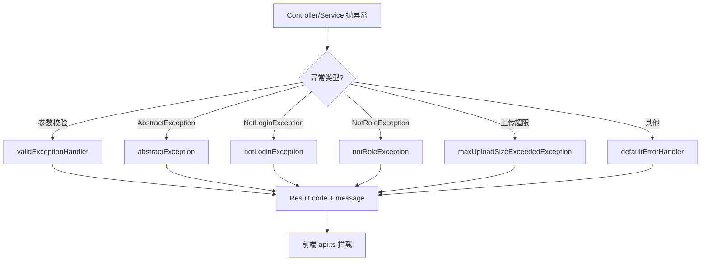
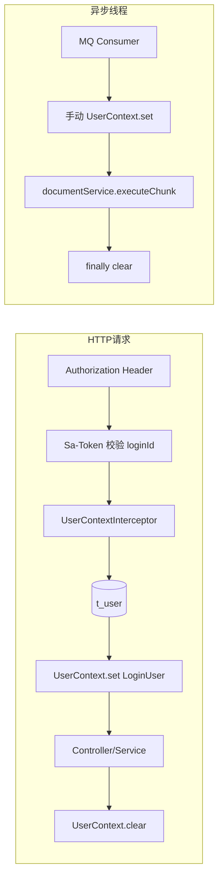
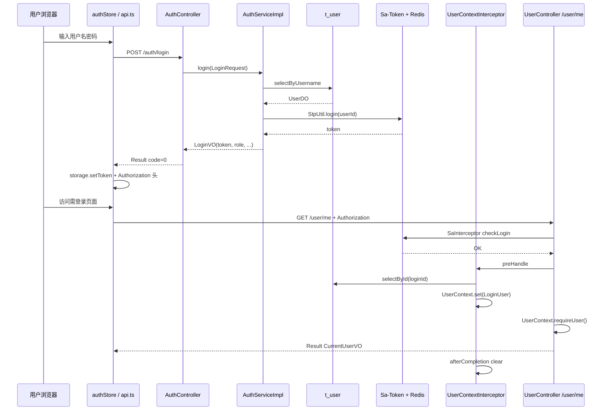
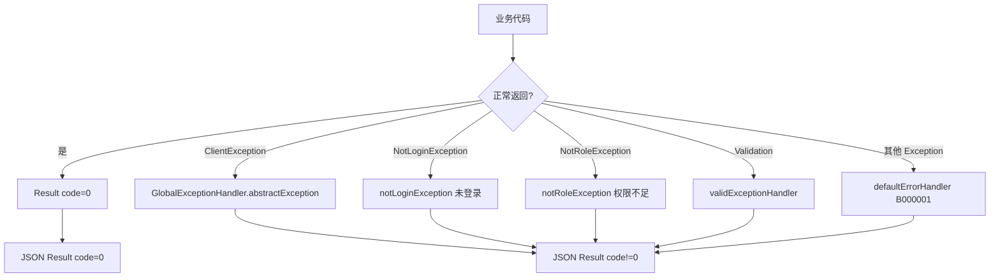

# 认证、上下文、幂等与异常处理

> 本章专门讲 Ragent 里那些「看起来不起眼但很重要」的通用能力：统一响应、异常体系、Sa-Token 登录、用户上下文、拦截器、幂等 AOP、SSE 封装，以及 Redis/Redisson/RocketMQ 的基础封装。
>
> 读完后，你应该能回答：**用户登录后 token 怎么传到 Controller？Service 里怎么拿当前用户？重复点击提交为什么会被拦住？401 是怎么变成 JSON 的？**

---

## 0. 先建立一个不会混乱的结论

Ragent 把「企业级横切能力」集中在 **`framework` 模块**，把「登录与用户业务」放在 **`bootstrap/user` 包**：

```text
前端带 Authorization 请求
  -> SaInterceptor 校验是否登录（StpUtil.checkLogin）
  -> UserContextInterceptor 查库并写入 UserContext（TTL）
  -> Controller / Service 通过 UserContext 取 userId、username、role
  -> 返回 Result<T> 或 SSE 流
  -> GlobalExceptionHandler 把异常统一转成 Result
  -> afterCompletion 清理 UserContext
```

**三个容器不要混：**

| 容器 | 存什么 | 典型读取方式 |
|---|---|---|
| Sa-Token / Redis | 登录会话、token 与 loginId 映射 | `StpUtil.getLoginIdAsString()` |
| `UserContext`（TTL） | 当前请求线程的业务用户快照 | `UserContext.getUserId()` |
| `RagTraceContext`（TTL） | 一次 RAG 请求的 traceId、节点栈 | `RagTraceContext.getTraceId()` |

---

## 1. framework 模块定位

### 1.1 为什么单独拆一个 framework

`framework` 是 **`bootstrap` 和 `infra-ai` 的共同依赖**，定位是：**与具体 RAG/入库业务无关，但所有 Web 服务都需要的通用基础设施**。

Maven 依赖见 `framework/pom.xml`，主要包括：

- Spring Web、MyBatis-Plus
- Sa-Token（含 Redis 会话存储）
- Redisson、Spring Data Redis
- RocketMQ Spring Boot Starter
- AspectJ（AOP 幂等）
- Alibaba TransmittableThreadLocal（TTL，线程池上下文透传）

### 1.2 framework 包结构速查

| 包路径 | 职责 | 代表类 |
|---|---|---|
| `framework/convention` | 通用模型对象 | `Result`、`ChatRequest`、`ChatMessage` |
| `framework/web` | Web 层工具 | `Results`、`GlobalExceptionHandler`、`SseEmitterSender` |
| `framework/exception` | 业务异常体系 | `AbstractException`、`ServiceException`、`ClientException` |
| `framework/errorcode` | 错误码枚举 | `BaseErrorCode`、`IErrorCode` |
| `framework/context` | 用户上下文 | `UserContext`、`LoginUser` |
| `framework/idempotent` | 幂等 AOP | `@IdempotentSubmit`、`@IdempotentConsume` |
| `framework/mq` | MQ 消息封装 | `MessageWrapper`、`RocketMQProducerAdapter` |
| `framework/config` | 自动装配 | `WebAutoConfiguration`、`RocketMQAutoConfiguration` |
| `framework/database` | MyBatis 填充 | `MyMetaObjectHandler` |
| `framework/trace` | RAG Trace 上下文 | `RagTraceContext`、`RagTraceNode` |
| `framework/cache` | Redis Key 前缀 | `RedisKeySerializer` |

### 1.3 bootstrap 与 framework 的边界

- **framework**：定义「怎么做」——返回格式、异常转换、上下文容器、幂等切面、MQ 适配器。
- **bootstrap/user**：定义「谁可以登录、角色从哪来」——`AuthController`、`SaTokenConfig`、`UserContextInterceptor`。
- **bootstrap/rag**：在 framework 能力之上编排 RAG；例如 `RAGChatController` 使用 `@IdempotentSubmit`，`StreamChatEventHandler` 读取 `UserContext.getUserId()`。

初学者常见误解：**Sa-Token 已经知道 loginId，为什么还要有 UserContext？**

答：Sa-Token 只管「是否登录、loginId 是什么」；业务代码还需要 **username、role、avatar**，且希望在 Service 层用统一 API 读取，而不在每个方法里查库或调 `StpUtil`。

---

## 2. 统一返回 Result / 响应对象

### 2.1 Result 结构

文件：`framework/src/main/java/com/nageoffer/ai/ragent/framework/convention/Result.java`

```java
public class Result<T> {
    public static final String SUCCESS_CODE = "0";
    private String code;      // "0" 表示成功
    private String message;   // 错误或提示文案
    private T data;           // 业务数据
    private String requestId; // 预留链路追踪
}
```

**约定：**

- 成功：`code = "0"`，`data` 放业务载荷。
- 失败：`code` 为错误码字符串（如 `A000001`），`message` 为可读说明，`data` 通常为 null。
- 前端 `frontend/src/services/api.ts` 会检查 `payload.code !== "0"` 并 reject。

### 2.2 Results 构造器

文件：`framework/src/main/java/com/nageoffer/ai/ragent/framework/web/Results.java`

| 方法 | 用途 |
|---|---|
| `Results.success()` | 无数据成功 |
| `Results.success(data)` | 带数据成功 |
| `Results.failure()` | 通用服务端失败（`B000001`） |
| `Results.failure(code, message)` | 指定错误码（包内可见） |
| `Results.failure(AbstractException)` | 从业务异常提取 code/message |

Controller 典型写法：

```java
@GetMapping("/user/me")
public Result<CurrentUserVO> currentUser() {
    LoginUser user = UserContext.requireUser();
    return Results.success(new CurrentUserVO(...));
}
```

### 2.3 与 SSE 的区别

普通 REST 接口返回 `Result<T>` JSON；RAG 聊天 `/rag/v3/chat` 返回 `SseEmitter`，**不走 Result 包装**，事件格式由 `StreamChatEventHandler` 和 `SseEmitterSender` 控制。若 SSE 已开始输出后再抛异常，`SseEmitterSender.fail()` 会吞掉异常，避免与 `GlobalExceptionHandler` 冲突。

---

## 3. 业务异常体系

### 3.1 继承关系

```text
RuntimeException
  └── AbstractException（errorCode + errorMessage）
        ├── ClientException   — 用户端/参数/权限问题（A 类码）
        ├── ServiceException  — 服务端业务不满足预期（B 类码）
        └── RemoteException   — 调用第三方失败（C 类码）
```

基类：`framework/.../exception/AbstractException.java`  
错误码接口：`framework/.../errorcode/IErrorCode.java`  
默认枚举：`framework/.../errorcode/BaseErrorCode.java`

### 3.2 三类异常何时使用

| 类型 | 典型场景 | 示例 |
|---|---|---|
| `ClientException` | 参数为空、登录失败、幂等冲突 | `AuthServiceImpl` 抛「用户名或密码错误」 |
| `ServiceException` | 业务规则不满足、MQ 幂等冲突 | `IdempotentConsumeAspect` 重复消费 |
| `RemoteException` | 外部 HTTP/RPC 失败 | 调用外部 API 封装层 |

### 3.3 错误码分层（阿里巴巴风格）

`BaseErrorCode` 中：

- **A 类**：`CLIENT_ERROR("A000001")`、用户注册、幂等、查询参数等。
- **B 类**：`SERVICE_ERROR("B000001")`、超时等。
- **C 类**：`REMOTE_ERROR("C000001")`。

业务代码可直接 `throw new ClientException("用户名或密码不能为空")`，会使用默认 `A000001`；也可 `throw new ServiceException(BaseErrorCode.SERVICE_TIMEOUT_ERROR)` 指定码。

---

## 4. 全局异常处理

### 4.1 注册方式

`framework/config/WebAutoConfiguration.java` 显式注册 Bean：

```java
@Bean
public GlobalExceptionHandler globalExceptionHandler() {
    return new GlobalExceptionHandler();
}
```

处理器类：`framework/web/GlobalExceptionHandler.java`，标注 `@RestControllerAdvice`。

### 4.2 处理的异常类型

| 异常 | 返回 message 示例 | HTTP 状态 |
|---|---|---|
| `MethodArgumentNotValidException` | 第一个字段校验消息 | 200 + Result 失败码 |
| `AbstractException` 子类 | `ex.getErrorMessage()` | 200 + Result 失败码 |
| `NotLoginException` | 「未登录或登录已过期」 | 200 + `A000001` |
| `NotRoleException` | 「权限不足」 | 200 + `A000001` |
| `MaxUploadSizeExceededException` | 文件/请求大小超限说明 | 200 + `A000001` |
| `Throwable` | 「系统执行出错」 | 200 + `B000001` |

**注意：** 项目选择 **HTTP 200 + Result.code 非 0** 表达业务失败，而不是一律返回 4xx。前端主要靠 `code` 和 `message` 判断；401 仅在部分 axios 网络层分支处理。

### 4.3 异常处理流程图



---

## 5. 用户登录流程

### 5.1 接口入口

| 步骤 | 类 / 方法 | URL | 说明 |
|---|---|---|---|
| 登录 | `AuthController.login()` | `POST /auth/login` | 无需 token，在 Sa-Token 白名单 |
| 登出 | `AuthController.logout()` | `POST /auth/logout` | 需已登录 |
| 当前用户 | `UserController.currentUser()` | `GET /user/me` | 读 `UserContext` |

完整 URL 前缀：`http://localhost:9090/api/ragent`（见 `application.yaml` 的 `server.servlet.context-path`）。

### 5.2 AuthServiceImpl.login() 逐步解析

文件：`bootstrap/.../user/service/impl/AuthServiceImpl.java`

1. 校验 username/password 非空，否则 `ClientException`。
2. `UserMapper` 按 username 查 `t_user`（`deleted = 0`）。
3. `passwordMatches()`：**当前实现为明文相等比较**（学习时注意：生产环境应使用哈希，此处以源码为准）。
4. `StpUtil.login(loginId)`：loginId 为 `user.getId().toString()`。
5. 返回 `LoginVO(userId, role, token, avatar)`，其中 `token = StpUtil.getTokenValue()`。

### 5.3 初始化用户

`resources/database/init_data_pg.sql` 会插入默认管理员。用户名与密码请以你本地脚本为准；**学习文档不要抄写真实密码到笔记或 commit**。

### 5.4 前端登录链路

| 步骤 | 文件 | 作用 |
|---|---|---|
| 表单提交 | 登录页组件 | 调 `authStore.login()` |
| 请求 | `frontend/src/services/authService.ts` | `POST /auth/login` |
| 存 token | `frontend/src/utils/storage.ts` | localStorage |
| 设置头 | `frontend/src/services/api.ts` | `Authorization: <token>` |
| 拉用户信息 | `authStore.fetchCurrentUser()` | `GET /user/me` |

---

## 6. Sa-Token 配置

### 6.1 application.yaml

文件：`bootstrap/src/main/resources/application.yaml`

```yaml
sa-token:
  token-name: Authorization      # HTTP 头名称
  timeout: 2592000               # 会话有效期（秒），约 30 天
  is-concurrent: true            # 允许同一账号多端同时登录
  is-share: false                # 不共享 token
  token-style: simple-uuid       # token 格式
  is-log: false
  is-print: false
```

Sa-Token 会话存储依赖 **`sa-token-redis-template`**（见 `framework/pom.xml`），token 与 loginId 映射在 Redis 中。

### 6.2 权限接口实现

`bootstrap/.../user/config/SaTokenStpInterfaceImpl.java` 实现 `StpInterface`：

- `getPermissionList()`：当前返回空列表（未启用细粒度权限）。
- `getRoleList()`：按 loginId 查 `t_user.role`，返回单元素列表。

角色校验示例：`UserController.pageQuery()` 内调用 `StpUtil.checkRole("admin")`。

### 6.3 路由拦截配置

`bootstrap/.../user/config/SaTokenConfig.java` 注册三个拦截器（顺序很重要）：

1. **SaInterceptor**：除 `/auth/**`、`/error` 外，`StpUtil.checkLogin()`。
2. **DemoModeInterceptor**：体验环境只读（`app.demo-mode: true` 时拦截写操作）。
3. **UserContextInterceptor**：登录后填充 `UserContext`。

特殊放行：

- `DispatcherType.ASYNC`：SSE 完成回调时 Sa-Token 上下文可能丢失，**跳过登录检查与用户上下文填充**。
- `OPTIONS`：CORS 预检放行。

---

## 7. Authorization token 如何传递

### 7.1 后端期望

- Header 名：**`Authorization`**（与 `sa-token.token-name` 一致）。
- Header 值：**token 字符串本身**（Sa-Token `simple-uuid` 生成值），项目前端**未加** `Bearer ` 前缀。

### 7.2 普通 REST 请求

`frontend/src/services/api.ts`：

```typescript
api.interceptors.request.use((config) => {
  const token = storage.getToken();
  if (token) {
    config.headers.Authorization = token;
  }
  return config;
});
```

响应拦截：若 `message` 含「未登录」，清空 storage 并跳转 `/login`。

### 7.3 SSE 流式请求

Axios 不适合读 SSE，聊天使用 `fetch`。`frontend/src/stores/chatStore.ts` 在发起流式请求时手动传：

```typescript
headers: token ? { Authorization: token } : undefined
```

Sa-Token 从请求头读取 token，与 REST 一致。

### 7.4 登出

`POST /auth/logout` → `AuthServiceImpl.logout()` → `StpUtil.logout()`，清除服务端会话；前端 `storage.clearAuth()` 并删除 axios 默认头。

---

## 8. UserContext / 上下文对象

### 8.1 LoginUser 字段

文件：`framework/context/LoginUser.java`

| 字段 | 含义 |
|---|---|
| `userId` | 用户 ID 字符串 |
| `username` | 登录名 |
| `role` | 如 `admin` / `user` |
| `avatar` | 头像 URL |

### 8.2 UserContext API

文件：`framework/context/UserContext.java`  
底层：`TransmittableThreadLocal<LoginUser>`（支持线程池透传，RAG 异步阶段仍可能读到用户 ID）。

| 方法 | 行为 |
|---|---|
| `set(LoginUser)` | 写入当前线程 |
| `get()` | 读取，可能为 null |
| `requireUser()` | 无用户则 `ClientException("未获取到当前登录用户")` |
| `getUserId()` / `getUsername()` / `getRole()` | 便捷读取 |
| `clear()` | 请求结束必须清理 |

### 8.3 谁写入 UserContext

**主路径：** `UserContextInterceptor.preHandle()`

1. `StpUtil.getLoginIdAsString()`
2. `UserMapper.selectById(loginId)`
3. 组装 `LoginUser` → `UserContext.set(...)`
4. `afterCompletion()` → `UserContext.clear()`

**异步/MQ 路径（无 HTTP 拦截器）：** 业务手动 set/clear，例如：

- `KnowledgeDocumentChunkConsumer.onMessage()`：从事件取 `operator` 写入 username。
- `ScheduleRefreshProcessor`：系统任务使用固定系统用户名。

### 8.4 请求上下文流转图



---

## 9. 拦截器如何工作

### 9.1 拦截器总览

| 拦截器 | 类 | 职责 |
|---|---|---|
| Sa-Token 登录 | `SaInterceptor` in `SaTokenConfig` | 未登录抛 `NotLoginException` |
| 体验只读 | `DemoModeInterceptor` | demo 模式禁止 POST/PUT/DELETE 和 SSE 聊天 |
| 用户上下文 | `UserContextInterceptor` | Sa-Token loginId → LoginUser |

### 9.2 执行顺序（同一请求）

```text
preHandle: SaInterceptor → DemoModeInterceptor → UserContextInterceptor
Controller 方法
afterCompletion: UserContextInterceptor.clear()
```

若 `DemoModeInterceptor` 返回 false，后续拦截器和 Controller 不会执行。

### 9.3 DemoModeInterceptor 要点

文件：`bootstrap/rag/config/DemoModeInterceptor.java`

- 配置：`app.demo-mode`（默认 false）。
- 允许：`GET` 且非 SSE 路径。
- 拦截：写操作；SSE 路径 `/rag/v3/chat` 返回 `event: reject` + `event: done`。

---

## 10. 幂等注解 / 幂等 AOP

### 10.1 @IdempotentSubmit — 防重复提交

**场景：** 用户双击按钮、网络重试导致同一 HTTP 请求重复执行。

注解：`framework/idempotent/IdempotentSubmit.java`  
切面：`framework/idempotent/IdempotentSubmitAspect.java`

**机制：**

1. 用 Redisson `RLock.tryLock()` 抢分布式锁。
2. 锁 key 默认：`idempotent-submit:path:{servletPath}:currentUserId:{userId}:md5:{argsJson}`。
3. 可通过 `@IdempotentSubmit(key = "SpEL")` 自定义 key。
4. 抢锁失败 → `ClientException(message)`，默认「您操作太快，请稍后再试」。
5. 方法执行完 `finally` 解锁。

**特殊：** `app.eval.enabled=true` 时切面直接放行（评测模式）。

**项目中的使用：**

| 位置 | 注解 | 作用 |
|---|---|---|
| `RAGChatController.chat()` | `@IdempotentSubmit(key = "T(...UserContext).getUserId()")` | 同一用户同时只能有一个进行中的 SSE 对话 |
| `RAGChatController.stop()` | `@IdempotentSubmit` | 防重复停止 |

### 10.2 @IdempotentConsume — 防 MQ 重复消费

**场景：** RocketMQ 至少一次投递，消费者可能收到重复消息。

注解：`framework/idempotent/IdempotentConsume.java`  
切面：`framework/idempotent/IdempotentConsumeAspect.java`

**机制：**

1. Redis Lua `SET key NX`：状态 `0`=消费中，`1`=已消费。
2. 若 key 已是消费中 → `ServiceException`，等待重试。
3. 若 key 已是已消费 → 直接 return null，跳过业务。
4. 成功 → 标记已消费；异常 → 删除 key 允许重试。

**当前状态：** 截至源码扫描，**bootstrap 中尚无消费者方法标注 `@IdempotentConsume`**；能力已在 framework 就绪，文档/发布说明中有提及。若你要给 `KnowledgeDocumentChunkConsumer` 加幂等，可在此注解上扩展（需自行改造并测试）。

### 10.3 幂等 vs 登录

- 登录拦截：**有没有资格**调用接口。
- 提交幂等：**短时间内是否重复**调用同一写操作。

---

## 11. SSE 发送工具

文件：`framework/web/SseEmitterSender.java`

对 Spring `SseEmitter` 的线程安全封装：

| 方法 | 作用 |
|---|---|
| `sendEvent(eventName, data)` | 发送命名/默认事件；连接已关则静默返回 |
| `complete()` | CAS 保证只 complete 一次 |
| `fail(throwable)` | 关闭连接并打 warn 日志，**不再向上抛** |

RAG 业务侧 `StreamChatEventHandler` 持有 `SseEmitterSender` 实例，按 `meta` / `message` / `thinking` / `finish` / `done` 推送。

**与认证的关系：** SSE 连接建立时仍走 Sa-Token 登录校验；连接存续期间异步 dispatch 跳过二次 login 检查（见 `SaTokenConfig` 注释）。

---

## 12. RocketMQ / Redis / Redisson 通用封装

### 12.1 RocketMQ

**自动配置：** `framework/config/RocketMQAutoConfiguration.java`

- 注册 `DelegatingTransactionListener`：支持事务消息本地回调注册。
- 注册 `MessageQueueProducer` → `RocketMQProducerAdapter`。

**生产者适配器：** `framework/mq/producer/RocketMQProducerAdapter.java`

| 方法 | 说明 |
|---|---|
| `send(topic, keys, bizDesc, body)` | 同步发送，包装为 `MessageWrapper` |
| `sendInTransaction(...)` | 事务消息 + 本地事务 Consumer |

**消息包装：** `framework/mq/MessageWrapper.java`（keys + body）。

**业务示例：** 知识库分块 `KnowledgeDocumentChunkConsumer` 监听 topic `knowledge-document-chunk_topic`，消费后手动设置 `UserContext` 再调 `documentService.executeChunk()`。

配置：`application.yaml` → `rocketmq.name-server`、`rocketmq.producer.group`。

### 12.2 Redis

- **Sa-Token 会话**：token 持久化（依赖 Redis）。
- **StringRedisTemplate**：`IdempotentConsumeAspect` 消费幂等状态。
- **RedisKeySerializer**：若配置 `framework.cache.redis.prefix`，为 key 统一加前缀（条件装配）。

配置：`spring.data.redis.host/port/password`。

### 12.3 Redisson

- **`IdempotentSubmitAspect`**：`RedissonClient.getLock()` 实现提交幂等。
- **`ChatRateLimiterConfig`**（bootstrap）：注册 `FairDistributedRateLimiter`，全局 SSE 聊天并发限流，name=`rag:global:chat`。

Redisson 由 `redisson-spring-boot-starter` 自动装配，与 Spring Data Redis 共用连接配置。

### 12.4 MyBatis 自动填充

`framework/database/MyMetaObjectHandler.java` + `DataBaseConfiguration`：

- insert 自动填 `createTime`、`updateTime`、`deleted=0`。
- update 自动填 `updateTime`。

与用户上下文配合：很多 Service 用 `UserContext.getUsername()` 写 `createdBy` / `updatedBy`（业务字段，非 MetaObjectHandler 自动填）。

---

## 13. 初学者如何从 Controller 看到用户身份

### 13.1 推荐断点路线

| 顺序 | 断点位置 | 观察变量 |
|---|---|---|
| 1 | `AuthController.login()` | 请求体、返回 `LoginVO.token` |
| 2 | `SaTokenConfig` 内 `StpUtil.checkLogin()` | 是否抛 NotLoginException |
| 3 | `UserContextInterceptor.preHandle()` | loginId、查库后的 `LoginUser` |
| 4 | `UserController.currentUser()` | `UserContext.requireUser()` |
| 5 | `ConversationServiceImpl` 等 | `UserContext.getUserId()` 写会话 |
| 6 | `UserContextInterceptor.afterCompletion()` | 确认 `clear()` 被调用 |

### 13.2 不用断点的快速验证

登录后请求：

```bash
# 将 <token> 替换为登录返回的 token，不要写入学习笔记仓库
curl -s http://localhost:9090/api/ragent/user/me \
  -H "Authorization: <token>"
```

期望：`{"code":"0","data":{"userId":"...","username":"...","role":"...","avatar":"..."}}`

去掉 Header 应得到：`code` 非 0，`message` 含「未登录或登录已过期」。

### 13.3 管理员接口

`GET /users` 内部 `StpUtil.checkRole("admin")`，非 admin 角色会得到「权限不足」。

---

## 14. 常见安全问题

学习与本项目开发时请遵守：

1. **不要提交真实密码、API Key、Redis 密码、数据库密码**到 Git；`application.yaml` 中 defaults 仅作本地示例，部署应环境变量化。
2. **不要把 token 打进 info 级业务日志**；Debug 时看完即删，勿粘贴到公开 Issue。
3. **学习文档不要抄写 init_data 中的真实凭据**；只记录「存在初始化用户，见 init_data_pg.sql」。
4. **UserContext 存的是线程局部变量**，异步代码若未使用 TTL 透传或未手动 set，可能出现 `getUserId()` 为 null——这不是 Sa-Token 失效，而是上下文未传递。
5. **当前密码明文存储与明文比对**（`AuthServiceImpl.passwordMatches`）是源码事实；面试时可作为「已知改进点」提及，不要误称为已加密。
6. **Demo 模式** 不等于安全沙箱；仍应对生产环境关闭 demo 并收紧 CORS、HTTPS。

---

## 15. Debug 实验：登录后看用户上下文进入 Controller

### 15.1 实验目标

验证 token → Sa-Token → UserContext → `/user/me` 全链路。

### 15.2 步骤

1. 启动 PostgreSQL、Redis、后端 bootstrap（见 `02-本地启动指南.md`）。
2. IDE 在 `UserContextInterceptor.preHandle()` 与 `UserController.currentUser()` 打断点。
3. 浏览器登录；Network 查看 `POST /auth/login` 响应中的 token（勿截图外泄）。
4. 刷新页面或访问需登录路由，触发 `GET /user/me`。
5. 在 `preHandle` 查看：`StpUtil.getLoginIdAsString()` 与 `UserContext.get()` 在 set 前后变化。
6. 在 `currentUser()` 查看：`UserContext.requireUser()` 与返回 VO 字段一致。
7. 请求结束单步到 `afterCompletion`，确认 `UserContext.get()` 已为 null。

### 15.3 延伸实验

- 双开浏览器用同一账号登录（`is-concurrent: true`），观察是否各自持有不同 token。
- 快速双击发送聊天，观察 `@IdempotentSubmit` 是否返回「当前会话处理中…」。
- 用普通用户 token 访问 `GET /users`，观察 `NotRoleException` → Result 消息。

---

## 16. Mermaid 图

### 16.1 登录认证时序图



### 16.2 请求上下文流转图

```mermaid
flowchart TB
    subgraph 入站
        REQ[HTTP Request] --> AUTHH[Authorization Header]
        AUTHH --> SAT[Sa-Token 解析 token]
        SAT --> LOGIN{已登录?}
        LOGIN -->|否| EX1[NotLoginException]
        LOGIN -->|是| DEMO{demo-mode 写操作?}
        DEMO -->|是| EX2[reject JSON/SSE]
        DEMO -->|否| LOAD[UserContextInterceptor 加载用户]
        LOAD --> CTRL[Controller]
    end

    subgraph 业务层
        CTRL --> SVC[Service]
        SVC --> UID[UserContext.getUserId]
        SVC --> IDEM{@IdempotentSubmit?}
        IDEM -->|锁失败| EX3[ClientException 太快]
        IDEM -->|OK| BIZ[执行业务]
    end

    subgraph 出站
        BIZ --> RES{返回类型}
        RES -->|JSON| RESULT[Results.success / 异常→GlobalExceptionHandler]
        RES -->|SSE| SSE[SseEmitterSender.sendEvent]
        RESULT --> RESP[HTTP Response]
        SSE --> RESP
    end

    EX1 --> GEH[GlobalExceptionHandler]
    EX3 --> GEH
    GEH --> RESP
```

### 16.3 异常处理图



---

## 17. 本章复习问题（含参考答案）

### 1. framework 模块解决什么问题？

**答：** 提供与具体 RAG 业务无关的 Web 基础设施：统一 `Result`、全局异常、用户上下文容器、幂等 AOP、SSE 封装、MQ 生产者适配、MyBatis 填充等；被 bootstrap 和 infra-ai 依赖。

### 2. 成功响应的 code 是什么？

**答：** 字符串 `"0"`，定义在 `Result.SUCCESS_CODE`；前端 `api.ts` 同样判断 `code !== "0"` 为失败。

### 3. ClientException 和 ServiceException 如何区分？

**答：** 都继承 `AbstractException`；ClientException 默认 A 类用户端错误（参数、登录、幂等等），ServiceException 默认 B 类系统/业务执行错误；GlobalExceptionHandler 对两者处理逻辑相同，都转 Result。

### 4. 未登录时后端返回什么？

**答：** `SaInterceptor` 触发 `NotLoginException`，`GlobalExceptionHandler.notLoginException()` 返回 `code=A000001`、`message=未登录或登录已过期`（HTTP 仍为 200）。

### 5. Sa-Token 的 token 放在哪个 Header？

**答：** Header 名为 `Authorization`（`sa-token.token-name`），值为 token 字符串；前端 axios 与 fetch SSE 均如此设置。

### 6. UserContext 与 StpUtil 有什么区别？

**答：** StpUtil 管认证会话（loginId、token、角色校验 API）；UserContext 管当前请求线程的业务用户快照（userId、username、role、avatar），供 Service 便捷读取，基于 TTL 并可向线程池透传。

### 7. UserContext 在哪里被清理？

**答：** `UserContextInterceptor.afterCompletion()` 调用 `UserContext.clear()`；MQ 消费者等在 `finally` 中手动 clear。

### 8. 为什么 SSE 异步 dispatch 要跳过 Sa-Token 检查？

**答：** SSE 完成时会触发 `DispatcherType.ASYNC`，此时 Sa-Token 上下文可能已丢失；若在 async dispatch 再 `checkLogin()` 会误杀合法连接。见 `SaTokenConfig` 注释。

### 9. @IdempotentSubmit 如何实现防重复？

**答：** `IdempotentSubmitAspect` 用 Redisson 分布式锁，key 默认含 path、userId、参数 MD5；`tryLock` 失败抛 ClientException；`app.eval.enabled=true` 时跳过。

### 10. @IdempotentConsume 当前在项目中有使用吗？

**答：** framework 已实现切面，但截至当前源码扫描，bootstrap 消费者类上**尚未标注**该注解；`KnowledgeDocumentChunkConsumer` 靠 MQ 语义与业务逻辑处理重复，若要严格幂等需自行加注解并测试。

### 11. SseEmitterSender.fail() 为什么不抛异常？

**答：** 流式响应开始后 HTTP 头已提交，再经 GlobalExceptionHandler 写 JSON 会冲突；fail 只关闭 SSE 并记日志。

### 12. 管理员列表接口如何鉴权？

**答：** 除全局登录拦截外，`UserController` 的 `/users` 等接口内显式 `StpUtil.checkRole("admin")`，失败抛 `NotRoleException` →「权限不足」。

### 13. RocketMQ 消息体如何统一包装？

**答：** 使用 `MessageWrapper`（keys + body），由 `RocketMQProducerAdapter` 发送；消费者如 `KnowledgeDocumentChunkConsumer` 接收 `MessageWrapper<KnowledgeDocumentChunkEvent>`。

### 14. 异步分块任务没有 HTTP 请求，UserContext 从哪来？

**答：** `KnowledgeDocumentChunkConsumer` 从事件 `operator` 手动 `UserContext.set(LoginUser.builder().username(...).build())`，执行完 `finally clear`。

---

## Debug 建议

1. 登录问题：先 Network 看 `Authorization` 是否带上，再断点 `StpUtil.checkLogin()`。
2. 上下文为空：确认是否走在 async/MQ 路径且未手动 set。
3. 幂等误伤：看 Redisson key 是否因相同 userId+相同参数被锁住；聊天接口 key 仅 userId，故同用户不能并发开两个 SSE。
4. 角色问题：查 `t_user.role` 与 `SaTokenStpInterfaceImpl.getRoleList()` 返回值。

---

## 实践任务

1. 画出登录到 `/user/me` 的时序图（可与本章 16.1 对照）。
2. 用 curl 分别带/不带 token 调 `/user/me`，记录 Result 差异。
3. 在 `IdempotentSubmitAspect.buildLockKey()` 打断点，连发两次 `/rag/v3/chat` 观察锁 key。
4. 阅读 `GlobalExceptionHandler` 每个 `@ExceptionHandler`，列出还会被谁抛出（如 `NotRoleException`）。

---

## 需要进一步确认

- 生产环境 Sa-Token 与 Redis 集群配置、token 刷新策略是否还有额外 YAML（当前仅见基础项）。
- `@IdempotentConsume` 未来是否会在 `KnowledgeDocumentChunkConsumer` 落地（需看后续版本或自行改造验证）。
- 密码是否计划改为 BCrypt 等哈希（当前源码为明文比对）。

---

## 下一步建议

- 阅读 **`18-Trace日志与问题排查.md`**（若已生成），理解 `RagTraceContext` 与 `UserContext` 并行工作方式。
- 回到 **`07-RAG问答主流程解析.md`**，在 `RAGChatServiceImpl` / `StreamChatEventHandler` 中观察 `UserContext.getUserId()` 如何进入 Trace 与消息持久化。
- 阅读 **`10-前端页面与接口关系.md`** 第 6 节登录流程，把前后端 token 传递串成闭环。
