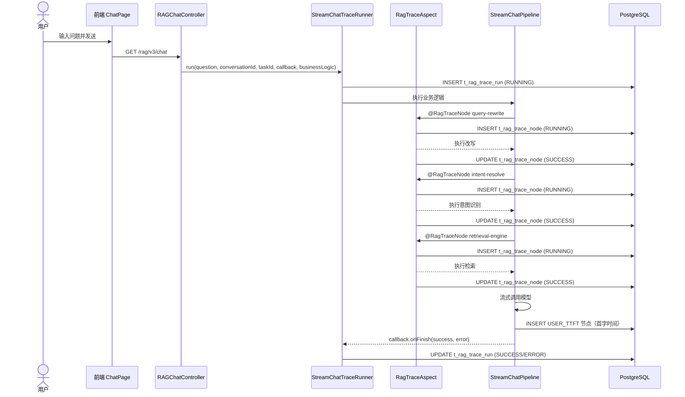
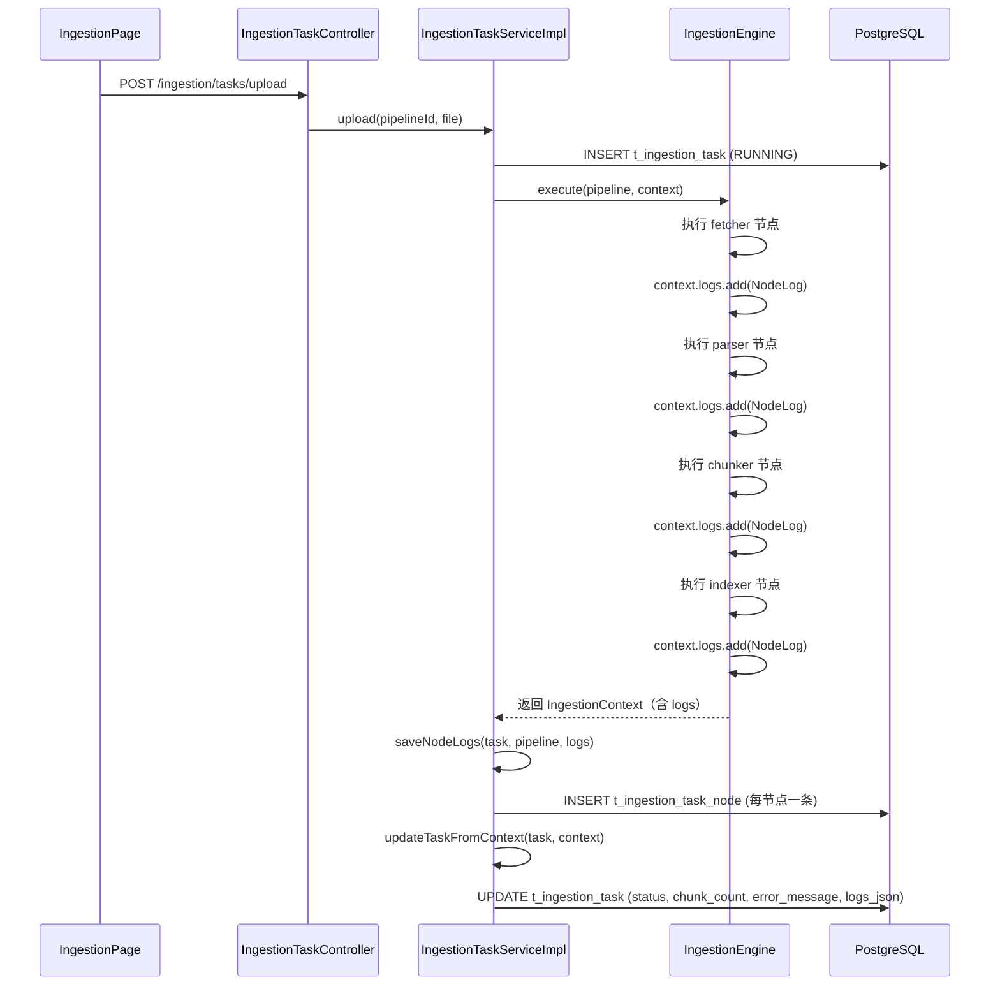

# Trace 日志与问题排查

> 本章目标：补齐 Ragent 的可观测性学习内容。读完后，初学者遇到“回答慢、回答错、上传失败、SSE 中断、模型超时、MCP 没返回”时，能按“前端 → 后端日志 → 数据库 Trace → 断点”的顺序定位问题，而不是在控制台里盲目翻异常。

---

## 0. 先建立全局结论

Ragent 的可观测性分四条线：

```text
普通日志（logback/log4j2）
  -> 控制台 / 文件，记录程序运行轨迹

RAG Trace（t_rag_trace_run / t_rag_trace_node）
  -> 一次问答请求的链路级瀑布图

入库节点日志（t_ingestion_task / t_ingestion_task_node）
  -> 一次文档入库 Pipeline 的节点级记录

前端 Network（浏览器 DevTools）
  -> 真实请求、响应、SSE EventStream、状态码
```

**排查问题的黄金顺序**：

```text
先看前端 Network（确认请求是否出去、响应码、SSE 事件）
  -> 再看后端 ERROR/WARN 日志（定位大致模块）
  -> 再查 Trace / 入库节点表（定位具体阶段）
  -> 最后打 Debug 断点（复现问题并跟源码）
```

---

## 1. 为什么 RAG 项目必须有 Trace

RAG 问答不是“一个接口进去、一个 JSON 出来”，而是：

```text
用户输入
  -> 记忆加载
  -> 问题改写
  -> 意图识别
  -> 检索 / MCP
  -> 去重 Rerank
  -> Prompt 组装
  -> 模型流式生成
  -> SSE 推送到前端
```

如果回答慢，慢在哪一步？如果回答错，哪一步出的错？如果 SSE 中途中断，是在模型阶段还是前端阶段？普通日志只能看到“某行代码报错”，无法直观回答“全流程中哪一步耗时最长”。

Trace 的价值：

1. **时序可视化**：每个阶段开始时间、结束时间、耗时、父子关系一目了然。
2. **错误定位**：哪个节点 ERROR，错误信息是什么，类名和方法名是什么。
3. **性能分析**：TTFT（首字时间）、总耗时、各阶段占比，便于发现瓶颈。
4. **用户投诉还原**：通过 `taskId` 或 `conversationId` 反查一次具体请求的完整链路。
5. **模型效果分析**：结合改写、检索、Rerank 各阶段耗时，判断是模型慢还是检索慢。

---

## 2. 普通日志、Trace、数据库记录、前端 Network 的区别

| 观测手段 | 存什么 | 优势 | 劣势 | 典型使用场景 |
|---|---|---|---|---|
| **普通日志** | 代码运行轨迹、异常堆栈、参数摘要 | 细粒度、开发期最直观 | 跨线程/异步场景不易串起来；大量日志时噪音大 | 启动失败、NPE、配置绑定错误 |
| **RAG Trace** | 一次问答的 Run + Node 瀑布图 | 结构化、可可视化、跨线程传播 | 只覆盖打了 `@RagTraceNode` 或手动 begin 的节点 | 问答慢、问答失败、模型超时 |
| **入库节点日志** | 每个 Pipeline 节点的执行结果 | 节点级输入输出、失败原因 | 只有通用 Ingestion 链路会写 `t_ingestion_task_node` | 文档上传失败、Parser 失败、Embedding 失败 |
| **数据库记录** | 会话、消息、文档、Chunk、向量等最终状态 | 持久化、可精确查询 | 只能看到结果，看不到过程 | 消息是否写入、文档状态是什么 |
| **前端 Network** | 浏览器实际发出的请求和收到的响应 | 真实用户视角 | 看不到后端内部细节 | 401、代理失败、SSE 无事件、前端 BUG |

**初学者常见误区**：

- 不要只盯着控制台异常。很多 RAG 问题不抛异常，只是“结果不好”，要靠 Trace 看各阶段耗时。
- 不要看到数据库有消息记录就认为流程没问题。可能是重试后写入的，真实第一次调用可能失败过。
- 前端 Network 看到 HTTP 200 不代表业务成功。项目用 `Result<T>` 包装，要看 `code` 是否为 `"0"`。

---

## 3. RAG Trace 表结构

### 3.1 运行记录表 `t_rag_trace_run`

路径：`resources/database/schema_pg.sql`

```sql
CREATE TABLE t_rag_trace_run (
    id              VARCHAR(20)      NOT NULL PRIMARY KEY,
    trace_id        VARCHAR(64)      NOT NULL,
    trace_name      VARCHAR(128),
    entry_method    VARCHAR(256),
    conversation_id VARCHAR(20),
    task_id         VARCHAR(20),
    user_id         VARCHAR(20),
    status          VARCHAR(16)      NOT NULL DEFAULT 'RUNNING',
    error_message   VARCHAR(1000),
    start_time      TIMESTAMP(3),
    end_time        TIMESTAMP(3),
    duration_ms     BIGINT,
    extra_data      TEXT,
    create_time     TIMESTAMP        DEFAULT CURRENT_TIMESTAMP,
    update_time     TIMESTAMP        DEFAULT CURRENT_TIMESTAMP,
    deleted         SMALLINT         DEFAULT 0,
    CONSTRAINT uk_run_id UNIQUE (trace_id)
);
CREATE INDEX idx_task_id ON t_rag_trace_run (task_id);
CREATE INDEX idx_user_id_trace ON t_rag_trace_run (user_id);
```

字段含义：

| 字段 | 含义 |
|---|---|
| `trace_id` | 一次 RAG 请求的全局链路 ID，雪花字符串 |
| `trace_name` | 固定为 `rag-stream-chat` |
| `entry_method` | 入口方法名，固定为 `RAGChatService#streamChat` |
| `conversation_id` | 会话 ID |
| `task_id` | 本次问答任务 ID |
| `user_id` | 当前用户 ID |
| `status` | `RUNNING` / `SUCCESS` / `ERROR` |
| `error_message` | 失败时记录精简后的异常信息 |
| `start_time` / `end_time` / `duration_ms` | 运行起止和耗时 |
| `extra_data` | JSON，包含 `question` 和 `questionLength` |

### 3.2 节点记录表 `t_rag_trace_node`

```sql
CREATE TABLE t_rag_trace_node (
    id             VARCHAR(20)      NOT NULL PRIMARY KEY,
    trace_id       VARCHAR(20)      NOT NULL,
    node_id        VARCHAR(20)      NOT NULL,
    parent_node_id VARCHAR(20),
    depth          INTEGER          DEFAULT 0,
    node_type      VARCHAR(16),
    node_name      VARCHAR(128),
    class_name     VARCHAR(256),
    method_name    VARCHAR(128),
    status         VARCHAR(16)      NOT NULL DEFAULT 'RUNNING',
    error_message  VARCHAR(1000),
    start_time     TIMESTAMP(3),
    end_time       TIMESTAMP(3),
    duration_ms    BIGINT,
    extra_data     TEXT,
    create_time    TIMESTAMP        DEFAULT CURRENT_TIMESTAMP,
    update_time    TIMESTAMP        DEFAULT CURRENT_TIMESTAMP,
    deleted        SMALLINT         DEFAULT 0,
    CONSTRAINT uk_run_node UNIQUE (trace_id, node_id)
);
```

字段含义：

| 字段 | 含义 |
|---|---|
| `trace_id` | 关联到 `t_rag_trace_run.trace_id` |
| `node_id` | 本节点唯一 ID，雪花字符串 |
| `parent_node_id` | 父节点 ID，用于画层级瀑布图 |
| `depth` | 节点深度，0 表示顶层 |
| `node_type` | 节点类型：`REWRITE`、`INTENT`、`GUIDANCE`、`RETRIEVE`、`RETRIEVE_CHANNEL`、`TITLE_GEN`、`USER_TTFT`、`METHOD` 等 |
| `node_name` | 节点展示名，如 `query-rewrite`、`retrieval-engine`、`user-first-packet` |
| `class_name` / `method_name` | 被拦截的类名和方法名 |
| `status` | `RUNNING` / `SUCCESS` / `ERROR` |
| `duration_ms` | 节点耗时 |

### 3.3 状态约定

RAG Trace 只有三种状态：

- `RUNNING`：节点或运行已开始，尚未结束。
- `SUCCESS`：正常完成。
- `ERROR`：方法抛异常或回调 `onError`。

**注意**：用户点击“停止生成”时，模型流会走取消逻辑，但当前 Trace 并不会记录为 `CANCELLED`，最终状态取决于取消前是否已经 `onError`。RAG Trace 没有单独的 `CANCELLED` 状态（跨线程 `StreamSpan` 有，但并未映射到 RAG Trace 运行记录中）。

---

## 4. RAG Trace 创建时机

### 4.1 入口：`StreamChatTraceRunner.run()`

文件：`bootstrap/src/main/java/com/nageoffer/ai/ragent/rag/trace/StreamChatTraceRunner.java`

每次流式问答进入 `RAGChatServiceImpl.streamChat()` 后，会调用 `StreamChatTraceRunner.run()`。

关键逻辑：

```java
String traceId = IdUtil.getSnowflakeNextIdStr();
traceRecordService.startRun(RagTraceRunDO.builder()
        .traceId(traceId)
        .traceName("rag-stream-chat")
        .entryMethod("RAGChatService#streamChat")
        .conversationId(conversationId)
        .taskId(taskId)
        .userId(UserContext.getUserId())
        .status("RUNNING")
        .startTime(new Date())
        .extraData(JSONUtil.createObj()
                .set("questionLength", StrUtil.length(question))
                .set("question", question)
                .toString())
        .build());
```

**创建时机**：在排队限流通过之后、Pipeline 执行之前。因此如果请求被限流拒绝，不会创建 Trace。

### 4.2 Trace 上下文传播

创建 Run 后，代码会设置 `RagTraceContext`：

```java
RagTraceContext.setTraceId(traceId);
RagTraceContext.setTaskId(taskId);
```

`RagTraceContext` 基于 `TransmittableThreadLocal`（TTL），因此能透传到线程池和异步线程中。`RagTraceAspect` 和 `RagStreamTraceSupportImpl` 都依赖这个上下文来判断当前是否处于 Trace 链路上。

### 4.3 结束时机

Trace 的结束由 `traceAwareCallback` 的 `onFinish` 触发：

```java
protected void onFinish(boolean success, Throwable error) {
    finishRun(traceId, success, error, startMillis);
}
```

无论模型正常完成、抛异常、还是 SSE 过程中出错，只要回调走到 `onFinish`，就会更新 `t_rag_trace_run` 的状态、错误信息、结束时间和总耗时。

### 4.4 首包时间（TTFT）节点

`StreamChatTraceRunner` 会记录一个特殊的 `USER_TTFT` 节点：

```java
private static final String USER_TTFT_NODE_NAME = "user-first-packet";
```

当模型第一个 token 到达并推给前端时，`onFirstContent()` 被触发，记录从 `run()` 开始到首字返回的时间。这个指标反映“完整链路前置开销”：排队 + 改写 + 意图 + 检索 + LLM 首包。

---

## 5. 每个 RAG 阶段如何记录

### 5.1 注解式节点：`@RagTraceNode` + `RagTraceAspect`

文件：`framework/src/main/java/com/nageoffer/ai/ragent/framework/trace/RagTraceNode.java`（注解）
文件：`bootstrap/src/main/java/com/nageoffer/ai/ragent/rag/aop/RagTraceAspect.java`（切面）

在业务方法上标注 `@RagTraceNode(name=..., type=...)`，切面会自动：

1. 从 `RagTraceContext` 取 `traceId`；如果没有，直接执行原方法。
2. 生成 `nodeId`，取当前栈顶作为 `parentNodeId`。
3. 插入一条 `RUNNING` 节点记录。
4. `pushNode(nodeId)`。
5. 执行原方法。
6. 成功则更新为 `SUCCESS`；异常则更新为 `ERROR`。
7. `finally` 中 `popNode()`。

源码中已标注的节点：

| 类 | 方法 | node_name | node_type |
|---|---|---|---|
| `MultiQuestionRewriteService` | `rewrite()` | `query-rewrite` | `REWRITE` |
| `MultiQuestionRewriteService` | `rewriteWithSplit()` | `query-rewrite-and-split` | `REWRITE` |
| `IntentResolver` | `resolve()` | `intent-resolve` | `INTENT` |
| `IntentGuidanceService` | `detectAmbiguity()` | `guidance-detect` | `GUIDANCE` |
| `RetrievalEngine` | `retrieve()` | `retrieval-engine` | `RETRIEVE` |
| `MultiChannelRetrievalEngine` | `retrieveKnowledgeChannels()` | `multi-channel-retrieval` | `RETRIEVE_CHANNEL` |
| `ConversationTitleGenerator` | `generateTitle()` | `conversation-title-gen` | `TITLE_GEN` |

### 5.2 跨线程流式节点：`RagStreamTraceSupportImpl`

文件：`bootstrap/src/main/java/com/nageoffer/ai/ragent/rag/trace/RagStreamTraceSupportImpl.java`

`@RagTraceNode` AOP 只能捕获同步方法调用。模型流式调用会进入异步线程，因此用 `RagStreamTraceSupport.beginStreamNode(name, type)` 手动开启节点。

它返回一个 `StreamSpan`，支持：

- `detach()`：从当前线程栈弹出本节点。
- `finishSuccess()` / `finishError(Throwable)` / `finishCancelledIfRunning()`：在异步线程中更新节点状态。
- 内部用 `AtomicBoolean` CAS 保证幂等，避免多次回调导致重复更新。

### 5.3 配置开关

文件：`bootstrap/src/main/java/com/nageoffer/ai/ragent/rag/config/RagTraceProperties.java`

```yaml
rag:
  trace:
    enabled: true
    max-error-length: 1000
```

- `enabled`：控制注解式 Trace 是否生效。即使关闭，`StreamChatTraceRunner` 也会走 `runWithoutTrace` 分支，不再写 Run/Node 记录。
- `max-error-length`：错误信息最大长度，超过截断。

---

## 6. Trace 页面如何读取数据

### 6.1 后端接口

文件：`bootstrap/src/main/java/com/nageoffer/ai/ragent/rag/controller/RagTraceController.java`

| 接口 | 说明 |
|---|---|
| `GET /rag/traces/runs` | 分页查询运行记录，支持 `traceId`、`conversationId`、`taskId`、`status` 过滤 |
| `GET /rag/traces/runs/{traceId}` | 查询链路详情（包含 Run 和 Nodes） |
| `GET /rag/traces/runs/{traceId}/nodes` | 仅查询节点列表 |

### 6.2 查询服务

文件：`bootstrap/src/main/java/com/nageoffer/ai/ragent/rag/service/impl/RagTraceQueryServiceImpl.java`

查询逻辑：

1. 从 `t_rag_trace_run` 分页查询。
2. 用 `user_id` 集批量查 `t_user`，回填 `username`。
3. 用 `trace_id` 集批量查 `t_rag_trace_node` 中 `node_type = 'USER_TTFT'` 的节点，回填 `ttftMs`。
4. 解析 `extra_data` JSON 中的 `question` 字段。

### 6.3 前端页面

文件：`frontend/src/pages/admin/traces/RagTracePage.tsx`
文件：`frontend/src/pages/admin/traces/RagTraceDetailPage.tsx`
文件：`frontend/src/services/ragTraceService.ts`

**列表页**：

- 展示成功/失败/运行中数量、成功率、平均耗时、平均首字时间。
- 支持按 `traceId` 搜索。
- 点击行进入详情页。

**详情页**：

- 顶部展示 Run 元信息、状态、总耗时、TTFT。
- 中部是瀑布图，按 `parent_node_id` 和 `depth` 画层级。
- 点击节点显示错误信息、`extra_data`、类名/方法名、耗时偏移。

### 6.4 页面上的中文名映射

文件：`frontend/src/pages/admin/traces/traceUtils.ts`

```ts
function prettifyNodeName(name?: string | null): string {
  const map: Record<string, string> = {
    "query-rewrite": "问题改写",
    "query-rewrite-and-split": "问题改写与拆分",
    "intent-resolve": "意图识别",
    "guidance-detect": "澄清检测",
    "retrieval-engine": "检索引擎",
    "multi-channel-retrieval": "多路召回",
    "conversation-title-gen": "会话标题生成",
    "user-first-packet": "首字返回",
  };
  // ...
}
```

---

## 7. 入库任务日志和节点日志

### 7.1 两条入库链路回顾

Ragent 有两条文档入库链路：

1. **通用 Ingestion Pipeline 链路**：前端 `IngestionPage` 上传 → `IngestionTaskController.upload()` → `IngestionTaskServiceImpl` 同步执行 Pipeline → 写 `t_ingestion_task` 和 `t_ingestion_task_node`。
2. **知识库文档链路**：前端 `KnowledgeDocumentsPage` 上传 → 用户再点击“分块” → RocketMQ 异步执行 → 走 `IngestionEngine` 或直接分块，最终写 `t_knowledge_document`、`t_knowledge_chunk`、`t_knowledge_vector`。

**节点级日志只存在于通用 Ingestion Pipeline 链路**。知识库文档链路虽然也会复用 `IngestionEngine`，但节点日志不会写入 `t_ingestion_task_node`，而是通过 `t_knowledge_document.status` 和 `error_message` 暴露结果。

### 7.2 任务表 `t_ingestion_task`

```sql
CREATE TABLE t_ingestion_task (
    id               VARCHAR(20)      NOT NULL PRIMARY KEY,
    pipeline_id      VARCHAR(20)      NOT NULL,
    source_type      VARCHAR(20)      NOT NULL,
    source_location  TEXT,
    source_file_name VARCHAR(255),
    status           VARCHAR(16)      NOT NULL,
    chunk_count      INTEGER          DEFAULT 0,
    error_message    TEXT,
    logs_json        JSONB,
    metadata_json    JSONB,
    started_at       TIMESTAMP,
    completed_at     TIMESTAMP,
    created_by       VARCHAR(20) DEFAULT '',
    updated_by       VARCHAR(20) DEFAULT '',
    create_time      TIMESTAMP NOT NULL DEFAULT CURRENT_TIMESTAMP,
    update_time      TIMESTAMP NOT NULL DEFAULT CURRENT_TIMESTAMP,
    deleted          SMALLINT  NOT NULL DEFAULT 0
);
```

关键字段：

- `status`：`pending` / `running` / `completed` / `failed`。
- `chunk_count`：最终生成的 Chunk 数量。
- `error_message`：失败时的错误信息。
- `logs_json`：所有节点日志的 JSON 摘要（去掉了 `output` 字段，避免体积过大）。
- `metadata_json`：任务元数据，如源文件 MIME 类型、文件大小等。

### 7.3 节点表 `t_ingestion_task_node`

```sql
CREATE TABLE t_ingestion_task_node (
    id            VARCHAR(20)      NOT NULL PRIMARY KEY,
    task_id       VARCHAR(20)      NOT NULL,
    pipeline_id   VARCHAR(20)      NOT NULL,
    node_id       VARCHAR(20)      NOT NULL,
    node_type     VARCHAR(16)      NOT NULL,
    node_order    INTEGER          NOT NULL DEFAULT 0,
    status        VARCHAR(16)      NOT NULL,
    duration_ms   BIGINT           NOT NULL DEFAULT 0,
    message       TEXT,
    error_message TEXT,
    output_json   TEXT,
    create_time   TIMESTAMP NOT NULL DEFAULT CURRENT_TIMESTAMP,
    update_time   TIMESTAMP NOT NULL DEFAULT CURRENT_TIMESTAMP,
    deleted       SMALLINT  NOT NULL DEFAULT 0
);
```

关键字段：

- `node_order`：节点在 Pipeline 中的执行顺序。
- `status`：`success` / `failed` / `skipped`。
- `message`：节点执行结果消息。
- `error_message`：失败信息。
- `output_json`：节点输出 JSON，超过 1MB 会被截断。

---

## 8. IngestionEngine 如何生成 NodeLog

### 8.1 NodeLog 定义

文件：`bootstrap/src/main/java/com/nageoffer/ai/ragent/ingestion/domain/context/NodeLog.java`

```java
@Data
@Builder
public class NodeLog {
    private String nodeId;        // 节点 ID
    private String nodeType;      // 如 fetcher、parser、chunker
    private String message;       // 日志消息
    private long durationMs;      // 耗时
    private boolean success;      // 是否成功
    private String error;         // 错误信息
    private Map<String, Object> output;  // 结构化输出
}
```

### 8.2 IngestionEngine 中三处写入

文件：`bootstrap/src/main/java/com/nageoffer/ai/ragent/ingestion/engine/IngestionEngine.java`

#### 第一处：条件跳过

```java
if (!conditionEvaluator.evaluate(context, nodeConfig.getCondition())) {
    NodeResult skip = NodeResult.skip("条件未满足");
    context.getLogs().add(NodeLog.builder()
            .nodeId(nodeId)
            .nodeType(nodeType)
            .message(skip.getMessage())
            .durationMs(0)
            .success(true)
            .output(outputExtractor.extract(context, nodeConfig))
            .build());
    return skip;
}
```

#### 第二处：正常执行成功

```java
long start = System.currentTimeMillis();
NodeResult result = node.execute(context, nodeConfig);
long duration = System.currentTimeMillis() - start;

context.getLogs().add(NodeLog.builder()
        .nodeId(nodeId)
        .nodeType(nodeType)
        .message(result.getMessage())
        .durationMs(duration)
        .success(result.isSuccess())
        .error(result.getError() == null ? null : result.getError().getMessage())
        .output(outputExtractor.extract(context, nodeConfig))
        .build());
```

#### 第三处：执行抛异常

```java
catch (Exception e) {
    long duration = System.currentTimeMillis() - start;
    context.getLogs().add(NodeLog.builder()
            .nodeId(nodeId)
            .nodeType(nodeType)
            .message(e.getMessage())
            .durationMs(duration)
            .success(false)
            .error(e.getMessage())
            .output(outputExtractor.extract(context, nodeConfig))
            .build());
    return NodeResult.fail(e);
}
```

### 8.3 NodeLog 如何落库

文件：`bootstrap/src/main/java/com/nageoffer/ai/ragent/ingestion/service/impl/IngestionTaskServiceImpl.java`

`executeInternal()` 在 `IngestionEngine.execute()` 返回后，做两件事：

```java
IngestionContext result = engine.execute(pipeline, context);
saveNodeLogs(task, pipeline, result.getLogs());   // 写入 t_ingestion_task_node
updateTaskFromContext(task, result);               // 更新 t_ingestion_task，包括 logs_json
```

`saveNodeLogs()` 方法：

1. 根据 `PipelineDefinition` 计算每个节点的执行顺序 `node_order`。
2. 遍历 `NodeLog` 列表。
3. `resolveNodeStatus(log)` 把 boolean `success` 和 message 转成 `"success"` / `"failed"` / `"skipped"`。
4. `truncateOutputJson()` 把 `output` Map 序列化为 JSON，超过 1MB 截断。
5. 插入 `t_ingestion_task_node`。

`updateTaskFromContext()` 方法：

1. 把 `context.status` 写入 `t_ingestion_task.status`。
2. 把 `chunkCount` 写入 `t_ingestion_task.chunk_count`。
3. 把 `errorMessage` 写入 `t_ingestion_task.error_message`。
4. `buildLogSummary()` 把 `NodeLog` 列表的 `output` 置空，然后 JSON 序列化，写入 `logs_json`。

---

## 9. 常见问题定位

### 9.1 文档上传失败

**定位路径**：

1. 前端 Network 看 `/knowledge-base/{kbId}/docs/upload` 或 `/ingestion/tasks/upload` 的响应。
2. 后端日志搜 `ClientException` 或 `读取上传文件失败`。
3. 查 `t_ingestion_task`：

```sql
SELECT id, status, error_message, source_file_name, started_at, completed_at
FROM t_ingestion_task
ORDER BY create_time DESC LIMIT 10;
```

4. 如果是通用 Ingestion 链路，查 `t_ingestion_task_node`：

```sql
SELECT node_type, status, message, error_message, duration_ms
FROM t_ingestion_task_node
WHERE task_id = 'xxx'
ORDER BY node_order;
```

**常见原因**：

- 文件超过 `spring.servlet.multipart.max-file-size=50MB`。
- RustFS/S3 连接失败（知识库链路）。
- 文件内容为空或 MIME 类型无法识别。
- Pipeline 中 `FetcherNode` 拿不到文件。

### 9.2 Parser 失败

**定位路径**：

1. 后端日志搜 `ParserNode` 或 `Tika` 异常。
2. 查 `t_ingestion_task_node` 中 `node_type = 'parser'` 的记录：

```sql
SELECT * FROM t_ingestion_task_node
WHERE task_id = 'xxx' AND node_type = 'parser';
```

3. 看 `error_message` 和 `output_json`。常见错误：PDF 加密、图片 PDF 无 OCR、编码异常、文件损坏。

**Debug 断点**：

- `bootstrap/src/main/java/com/nageoffer/ai/ragent/ingestion/node/ParserNode.java` 的 `execute()` 方法。
- `IngestionEngine.executeNode()` 第 233 行。

### 9.3 Embedding 失败

**定位路径**：

1. 后端日志搜 `EmbeddingService`、`RoutingEmbeddingService`、`RemoteException`。
2. 查 `t_ingestion_task_node` 中 `node_type = 'chunker'` 或 `node_type = 'indexer'` 的记录。
3. 看模型候选配置和 API Key 是否正确。
4. 查向量维度是否一致：`rag.default.dimension` 与 Embedding 模型输出维度。

```sql
SELECT node_type, status, error_message, duration_ms
FROM t_ingestion_task_node
WHERE task_id = 'xxx'
  AND node_type IN ('chunker', 'indexer', 'enricher');
```

**常见原因**：

- API Key 缺失或过期。
- 网络不通，无法访问 SiliconFlow / AIHubMix。
- 维度不匹配：`t_knowledge_vector.embedding vector(1536)` 与实际 Embedding 输出维度不同。
- 批量 Embedding 超过供应商限制（如 SiliconFlow 批量上限 32 条）。

### 9.4 检索为空

**定位路径**：

1. 前端提问后，看回答是否出现“未检索到相关知识”。
2. 查 RAG Trace 中 `node_type = 'RETRIEVE'` 和 `RETRIEVE_CHANNEL'` 节点：

```sql
SELECT node_name, node_type, status, duration_ms, extra_data
FROM t_rag_trace_node
WHERE trace_id = 'xxx'
  AND node_type IN ('RETRIEVE', 'RETRIEVE_CHANNEL');
```

3. 查 `t_knowledge_vector` 中是否有对应知识库的向量：

```sql
SELECT count(*) FROM t_knowledge_vector
WHERE metadata ->> 'knowledgeBaseId' = 'xxx';
```

4. 查 `t_knowledge_chunk` 中 Chunk 状态是否为启用。

**常见原因**：

- 知识库未上传文档。
- 文档上传成功但未分块（`t_knowledge_document.status != 'success'`）。
- 检索置信度阈值太高（`confidence-threshold=0.6`），没有 chunk 超过阈值。
- 问题改写后语义偏移，导致召回为空。
- 向量维度不匹配导致无法检索。

### 9.5 Rerank 失败

**定位路径**：

1. Rerank 失败通常不会直接报错，而是退化为 `rerank-noop`（不做排序直接返回前 Top-K）。
2. 后端日志搜 `RoutingRerankService`、`RerankClient` 异常。
3. 查 RAG Trace 中检索相关节点的 `extra_data` 和耗时。
4. 看配置 `rag.rerank.enabled` 是否为 `true`，以及 `ai.rerank.candidates` 是否可用。

**常见原因**：

- 百炼 API Key 缺失（Rerank 默认走百炼 `qwen3-rerank`）。
- 网络超时。
- 候选 `rerank-noop` 兜底生效，排序质量下降。

### 9.6 模型超时

**定位路径**：

1. 前端看 SSE 是否长时间无响应，然后断开。
2. 后端日志搜 `first packet timeout`、`RemoteException`、具体模型名。
3. 查 RAG Trace：

```sql
SELECT node_name, node_type, status, duration_ms, error_message
FROM t_rag_trace_node
WHERE trace_id = 'xxx'
ORDER BY start_time;
```

4. 看 `t_rag_trace_run.duration_ms` 和 `USER_TTFT` 节点。

**常见原因**：

- 模型服务网络慢或不可用。
- `rag.default.sse-timeout-ms=300000`（5 分钟）到达。
- 流式首包探测 60 秒超时，所有候选都失败。
- 问题上下文太长，模型处理慢。

### 9.7 SSE 中断

**定位路径**：

1. 浏览器 DevTools → Network → `/rag/v3/chat` → EventStream，看最后收到的事件是 `error`、`finish` 还是直接断开。
2. 后端日志搜 `SseEmitter`、`StreamChatEventHandler`、`StreamTaskManager`。
3. 查 `t_message` 中是否有助手消息记录。
4. 查 RAG Trace 最终状态。

**常见原因**：

- 用户点击“停止”：前端发 `/rag/v3/stop`，`StreamTaskManager` 通过 Redis 广播取消。
- 模型返回错误：`StreamChatEventHandler.onError()` 发送 `error` 事件。
- SSE 超时：5 分钟无活动，连接被关闭。
- 网络代理/Vite 开发服务器超时。

### 9.8 MCP 工具失败

**定位路径**：

1. 确认 MCP Server 是否启动：`curl` 测试 `tools/list`。
2. 后端日志搜 `McpClientToolExecutor`、`callTool`、`LLMMcpParameterExtractor`。
3. 查 RAG Trace 中 `INTENT` 节点，看是否识别出 `IntentKind.MCP`。
4. 查 `t_rag_trace_node` 中检索相关节点和 `StreamCallback` 阶段是否有异常。

**常见原因**：

- MCP Server 没启动或端口 9099 被占用。
- `rag.mcp.servers` 配置错误。
- 参数提取失败：用户问题缺少城市名、时间等必要参数。
- 工具 ID 与意图树中 `mcp_tool_id` 不匹配。

---

## 10. 排查路径表

| 现象 | 先看前端 | 再看后端日志 | 再查表 | 最后断点 |
|---|---|---|---|---|
| 上传后页面报错 | Network 看 `/upload` 响应码和 `Result.code` | 搜 `ClientException`、`MultipartException` | `t_ingestion_task` / `t_knowledge_document` | `IngestionTaskController.upload()` / `KnowledgeDocumentController.upload()` |
| 上传成功但一直 pending | 页面状态刷新是否正常 | 搜 RocketMQ Consumer 是否启动 | `t_knowledge_document.status` | `KnowledgeDocumentChunkConsumer.onMessage()` |
| Parser 失败 | 看错误提示 | 搜 `ParserNode`、`TikaException` | `t_ingestion_task_node` node_type='parser' | `ParserNode.execute()` |
| Embedding 失败 | 分块/入库任务状态 failed | 搜 `RoutingEmbeddingService`、`RemoteException` | `t_ingestion_task_node` chunker/indexer | `RoutingEmbeddingService.embedBatch()` |
| 检索为空 | 看回答是否提示未检索到 | 搜 `RetrievalEngine`、置信度日志 | `t_knowledge_vector` 数量、metadata | `RetrievalEngine.retrieve()` |
| Rerank 失败 | 回答质量下降但无明显报错 | 搜 `RoutingRerankService` | RAG Trace 检索阶段 | `RoutingRerankService.rerank()` |
| 模型超时 | SSE 长时间无首字 | 搜 `first packet timeout` | `t_rag_trace_run` + `USER_TTFT` 节点 | `RoutingLLMService.streamChat()` |
| SSE 中断 | EventStream 最后事件 | 搜 `SseEmitter`、`StreamTaskManager` | `t_message` 是否写入 | `StreamChatEventHandler.onError()` |
| MCP 工具失败 | 回答未调用工具 | 搜 `McpClientToolExecutor` | 意图树配置、`rag.mcp.servers` | `McpClientToolExecutor.execute()` |
| 回答整体慢 | 看 TTFT 和总耗时 | 看各阶段日志耗时 | RAG Trace 各节点 duration_ms | `StreamChatPipeline.execute()` |

---

## 11. 常用 SQL

### 11.1 RAG Trace 相关

```sql
-- 最近 10 条问答 Trace
SELECT trace_id, status, duration_ms, task_id, conversation_id, start_time, error_message
FROM t_rag_trace_run
ORDER BY start_time DESC
LIMIT 10;

-- 某个 taskId 的 Trace
SELECT * FROM t_rag_trace_run
WHERE task_id = 'xxx'
ORDER BY start_time DESC;

-- 某次 Trace 的所有节点
SELECT node_name, node_type, class_name, method_name, status, duration_ms,
       start_time, end_time, error_message, depth, parent_node_id
FROM t_rag_trace_node
WHERE trace_id = 'xxx'
ORDER BY start_time, id;

-- 找出最慢的 10 个节点
SELECT trace_id, node_name, node_type, duration_ms, status
FROM t_rag_trace_node
WHERE status = 'SUCCESS'
ORDER BY duration_ms DESC
LIMIT 10;

-- 失败的 Trace
SELECT trace_id, task_id, conversation_id, error_message, start_time
FROM t_rag_trace_run
WHERE status = 'ERROR'
ORDER BY start_time DESC
LIMIT 20;
```

### 11.2 入库任务相关

```sql
-- 最近 10 个入库任务
SELECT id, pipeline_id, source_file_name, status, chunk_count, error_message, started_at, completed_at
FROM t_ingestion_task
ORDER BY create_time DESC
LIMIT 10;

-- 某个任务的所有节点
SELECT node_id, node_type, node_order, status, duration_ms, message, error_message
FROM t_ingestion_task_node
WHERE task_id = 'xxx'
ORDER BY node_order, id;

-- 失败的入库任务
SELECT id, source_file_name, status, error_message, logs_json
FROM t_ingestion_task
WHERE status = 'failed'
ORDER BY create_time DESC
LIMIT 20;

-- 查看任务日志 JSON
SELECT id, status, logs_json
FROM t_ingestion_task
WHERE id = 'xxx';
```

### 11.3 知识库文档相关

```sql
-- 最近上传的文档
SELECT id, knowledge_base_id, file_name, status, error_message, create_time
FROM t_knowledge_document
ORDER BY create_time DESC
LIMIT 20;

-- 某知识库下的 Chunk 数量
SELECT count(*) FROM t_knowledge_chunk
WHERE knowledge_base_id = 'xxx' AND deleted = 0;

-- 某知识库下的向量数量
SELECT count(*) FROM t_knowledge_vector
WHERE metadata ->> 'knowledgeBaseId' = 'xxx';
```

---

## 12. Debug 断点

### 12.1 RAG Trace 链路

| 观察目标 | 文件路径 | 方法 | 看什么 |
|---|---|---|---|
| Trace 创建 | `rag/trace/StreamChatTraceRunner.java` | `run()` | `traceId` 生成、`extraData` |
| 注解节点拦截 | `rag/aop/RagTraceAspect.java` | `aroundNode()` | `nodeId`、`parentNodeId`、`depth` |
| 跨线程节点 | `rag/trace/RagStreamTraceSupportImpl.java` | `beginStreamNode()` | `traceId` 透传、CAS 状态 |
| Trace 写入 | `rag/service/impl/RagTraceRecordServiceImpl.java` | `startRun()` / `finishNode()` | SQL 参数 |
| Trace 查询 | `rag/service/impl/RagTraceQueryServiceImpl.java` | `detail()` | VO 组装 |

### 12.2 入库节点日志链路

| 观察目标 | 文件路径 | 方法 | 看什么 |
|---|---|---|---|
| 节点执行 | `ingestion/engine/IngestionEngine.java` | `executeNode()` | `NodeLog` 生成三处 |
| 节点写入 | `ingestion/service/impl/IngestionTaskServiceImpl.java` | `saveNodeLogs()` | `status` 转换、`outputJson` 截断 |
| 任务更新 | `ingestion/service/impl/IngestionTaskServiceImpl.java` | `updateTaskFromContext()` | `logs_json` 生成 |

### 12.3 常见问题断点

| 问题 | 断点位置 | 看什么 |
|---|---|---|
| 上传失败 | `ingestion/controller/IngestionTaskController.java` `upload()` | 文件是否读到、pipelineId 是否有效 |
| Parser 失败 | `ingestion/node/ParserNode.java` `execute()` | 原始 bytes、Tika 解析结果 |
| Embedding 失败 | `infra-ai/.../RoutingEmbeddingService.java` `embedBatch()` | 候选模型、API Key、响应 |
| 检索为空 | `rag/core/retrieve/RetrievalEngine.java` `retrieve()` | Top-K、候选列表、置信度 |
| Rerank 失败 | `infra-ai/.../RoutingRerankService.java` `rerank()` | 候选、异常、是否 fallback 到 noop |
| 模型超时 | `infra-ai/.../RoutingLLMService.java` `streamChat()` | 首包探测、候选切换 |
| SSE 中断 | `rag/service/handler/StreamChatEventHandler.java` `onError()` | 异常类型、SSE 发送状态 |
| MCP 失败 | `rag/core/mcp/McpClientToolExecutor.java` `execute()` | 参数、工具 ID、callTool 结果 |

---

## 13. 日志安全注意事项

### 13.1 绝不能打进日志的内容

1. **API Key / Token**：`BAILIAN_API_KEY`、`SILICONFLOW_API_KEY`、`AIHUBMIX_API_KEY`、用户登录 Token。
2. **数据库密码 / Redis 密码 / RustFS SecretKey**：`application.yaml` 中的敏感配置。
3. **用户隐私**：用户真实姓名、手机号、邮箱、身份证号、工资、病历等。
4. **原文档内容**：上传的 PDF、Word、TXT 全文，尤其含商业机密的文档。
5. **完整 Prompt**：可能包含检索到的内部文档片段，日志中只记录长度或摘要。

### 13.2 项目中的敏感处理

- `RagTraceAspect` 和 `RagStreamTraceSupportImpl` 的 `truncateError()` 只记录异常类名和 message，不记录完整堆栈，避免堆栈中泄露参数。
- `IngestionTaskServiceImpl.buildLogSummary()` 把 `NodeLog.output` 置空后再写入 `logs_json`，避免大段原文进入任务日志。
- `truncateOutputJson()` 限制 `output_json` 不超过 1MB，既是性能考虑，也是防止大文件内容落库。

### 13.3 学习阶段注意事项

- 不要把真实 API Key 写进学习文档。
- 不要把本地 `application.yaml` 的密码直接贴到 Markdown 中。
- 贴日志片段时，先手动脱敏：把 token、用户 ID、文件内容替换为 `xxx` 或 `[REDACTED]`。
- 提交前用 `git diff` 检查是否误把敏感信息写入文档。

---

## 14. Mermaid 图

### 14.1 一次 RAG Trace 记录图



### 14.2 一次入库日志记录图



---

## 15. 本章复习问题

### 15.1 问题

1. RAG Trace 和普通日志最大的区别是什么？
2. `t_rag_trace_run` 和 `t_rag_trace_node` 是什么关系？
3. RAG Trace 是在排队限流前创建还是排队限流后创建？
4. `@RagTraceNode` 注解由哪个类拦截？
5. 为什么流式模型调用不能只用 `@RagTraceNode` AOP？
6. `RagTraceContext` 为什么能跨线程传播？
7. `USER_TTFT` 节点记录的是什么时间？
8. 通用 Ingestion Pipeline 链路会写哪些表？知识库文档链路会写哪些表？
9. `NodeLog` 和 `t_ingestion_task_node` 的 `status` 取值有什么不同？
10. 为什么 `t_ingestion_task.logs_json` 要去掉 `NodeLog.output`？
11. 定位“检索为空”时，应该先看 RAG Trace 的哪个节点类型？
12. 日志中为什么不能记录完整 Prompt 和原文档内容？

### 15.2 参考答案

1. **普通日志是文本化的代码运行轨迹，RAG Trace 是结构化的请求级瀑布图**，包含每个阶段的开始/结束时间、耗时、父子关系和状态，更适合跨线程/异步场景定位问题。
2. **一对多关系**。一次 Run 对应一次问答请求，一次 Run 包含多个 Node，每个 Node 对应一个 RAG 阶段。
3. **排队限流后创建**。`StreamChatTraceRunner.run()` 在 `RAGChatServiceImpl.streamChat()` 中排队通过后才调用。
4. `RagTraceAspect`。
5. 因为流式调用会进入异步线程，AOP 只能捕获同步方法调用；异步阶段需要用 `RagStreamTraceSupportImpl.beginStreamNode()` 手动开启节点。
6. 因为它基于 `TransmittableThreadLocal`（TTL），可以透传到线程池中的子线程。
7. 从 `StreamChatTraceRunner.run()` 开始到模型第一个 token 推给前端的时间，反映完整链路前置开销。
8. 通用 Ingestion Pipeline 链路写 `t_ingestion_task` 和 `t_ingestion_task_node`；知识库文档链路写 `t_knowledge_document`、`t_knowledge_chunk`、`t_knowledge_vector`。
9. RAG Trace 节点状态是 `RUNNING` / `SUCCESS` / `ERROR`；`t_ingestion_task_node` 状态是 `success` / `failed` / `skipped`。
10. 避免 `logs_json` 体积过大，同时避免大段原文/向量等敏感或冗余数据进入任务日志。
11. 先看 `node_type = 'RETRIEVE'` 和 `'RETRIEVE_CHANNEL'` 的节点，再看向量表中对应知识库是否有数据。
12. 完整 Prompt 可能包含检索到的内部文档片段，原文档内容可能含商业机密和用户隐私；日志一旦写入就可能被长期保留、转发或泄露。

---

## 下一步建议

1. 在本地启动项目，发起一次普通聊天，打开管理后台“链路追踪”页面，确认能看到 Run 和 Node 瀑布图。
2. 上传一个最小 txt 文件到 Ingestion Pipeline，观察 `t_ingestion_task` 和 `t_ingestion_task_node` 的记录。
3. 人为制造一次模型超时（如断网或填错 API Key），对比 RAG Trace 中 `USER_TTFT` 节点和最终 Run 状态的变化。
4. 阅读 `07-RAG问答主流程解析.md` 和 `06-文档入库流程解析.md` 中关于 Trace 和日志的交叉引用，把本章排查思路嵌入到主流程学习中。
