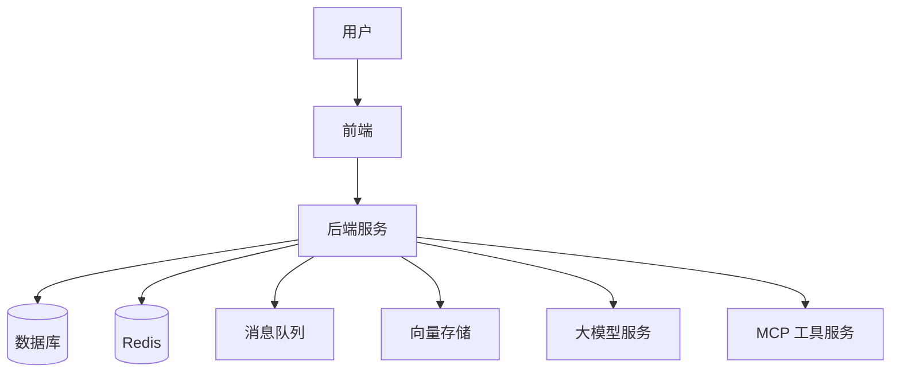
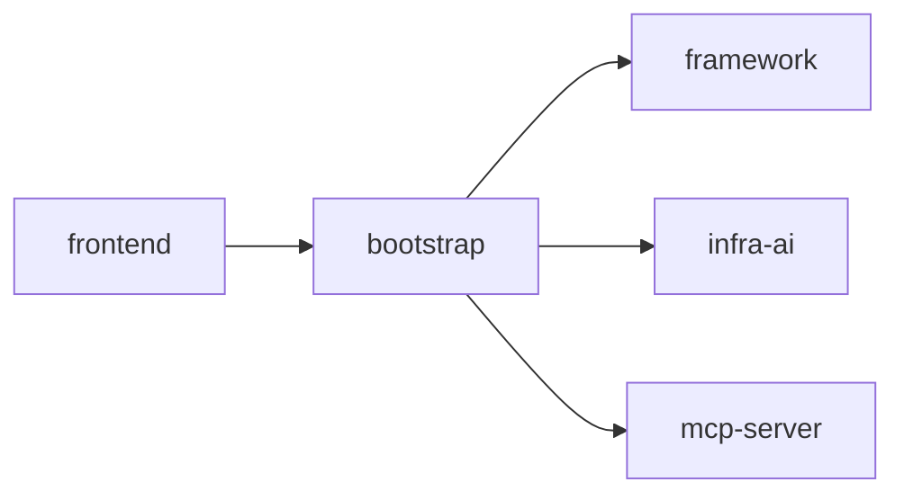
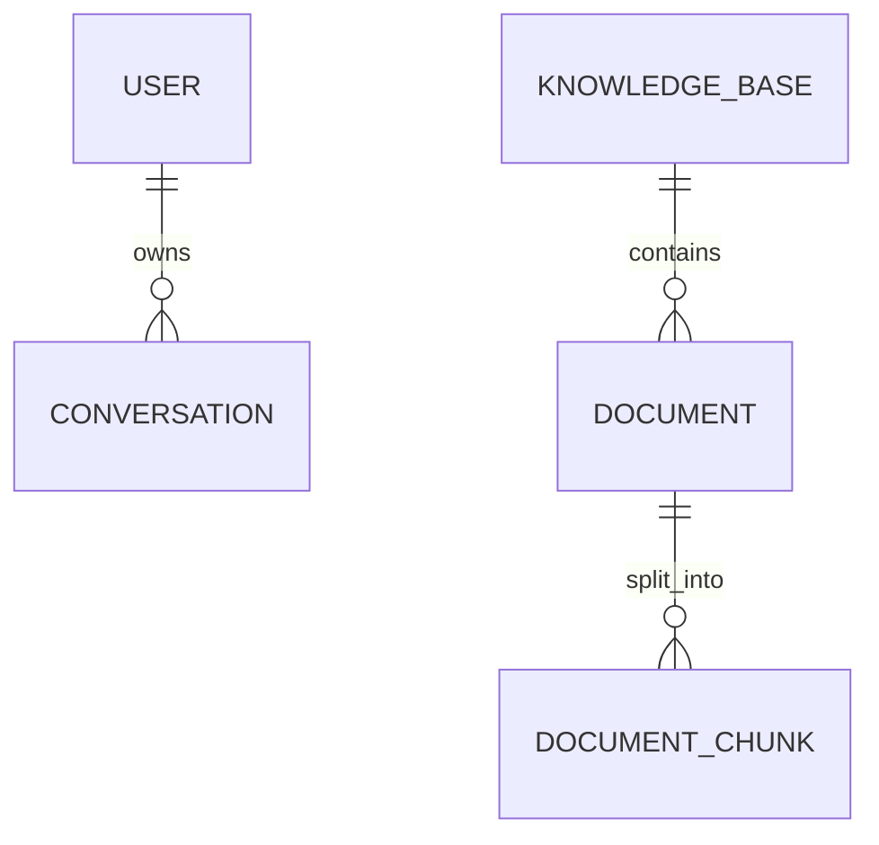
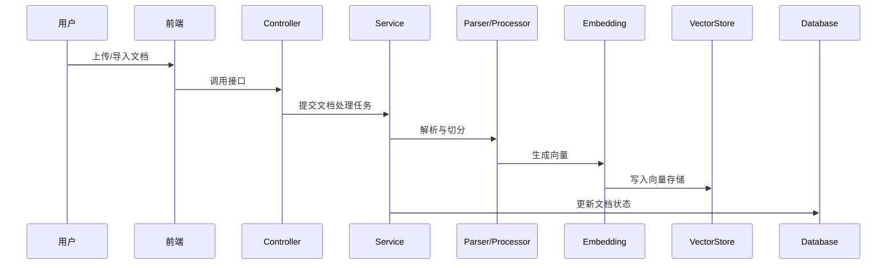

# CODEX 执行任务：从零学习 Ragent 项目并生成 Markdown 学习文档

> 适用场景：把本文件放到 Ragent 项目根目录后，让 Codex / Codex CLI / Cursor Agent / Claude Code / Trae / Windsurf 等代码 Agent 读取并执行。
>
> 推荐文件名：`CODEX_LEARNING_TASK.md`
>
> 目标：不要修改业务源码，只新增系统化学习文档，帮助基础较弱的 Java / Spring Boot / AI 项目学习者在约 2 周内看懂 Ragent 项目。

---

## 0. 给 Codex 的总指令

你现在是一名资深 Java 后端架构师、Spring Boot 项目讲解员、AI/RAG 项目学习教练。请你帮助我从零学习当前 Git 仓库中的 Ragent 项目。

我的基础比较弱，所以你的输出必须尽量详细、循序渐进、适合初学者。不要只做高层总结，也不要写“看起来很专业但没有代码依据”的空话。所有重要结论都应尽量结合当前仓库中的真实文件路径、类名、方法名、配置文件、SQL 文件、前端页面和接口调用位置。

请你先完整扫描当前仓库，再生成学习文档。**本次任务禁止修改业务源码，只允许新增或更新 `learning-notes/` 目录下的 Markdown 文档。**

---

## 1. 项目背景

当前要学习的仓库是：

```bash
git@github.com:nageoffer/ragent.git
```

我希望通过 2 周左右完成以下目标：

1. 能把项目本地跑起来；
2. 理解项目整体架构；
3. 看懂后端核心模块和核心调用链；
4. 看懂前端页面与后端接口的关系；
5. 理解 RAG、Agentic RAG、MCP、Embedding、向量检索、Rerank、SSE、模型路由、熔断降级等概念；
6. 能完整讲清楚一次“文档入库”流程；
7. 能完整讲清楚一次“RAG 问答”流程；
8. 能做一个小改造，并知道如何测试、提交、回滚；
9. 最终得到一套可以复习、面试、二次开发使用的 Markdown 学习笔记。

---

## 2. 执行前要求

请你先执行以下检查，但不要改业务代码：

```bash
git status
```

然后阅读项目结构，优先检查这些内容：

```text
README.md
pom.xml
bootstrap/
framework/
infra-ai/
mcp-server/
frontend/
resources/
resources/database/
resources/docker/
docs/
application.yml
application.yaml
application-*.yml
application-*.yaml
```

如果某些目录或文件不存在，请在文档中说明“当前仓库未发现该路径”，不要凭空编造。

如果项目结构与本任务描述不一致，请以当前仓库实际代码为准。

---

## 3. 重要约束

请严格遵守以下规则：

1. **禁止修改业务源码。**
2. **禁止删除、移动、重命名原项目文件。**
3. **禁止修改数据库 SQL、配置文件、前端代码、后端代码。**
4. **只允许新增或更新 `learning-notes/` 目录下的 Markdown 文件。**
5. **不要自动执行 `git push`。**
6. **不要自动提交 commit，除非我后续明确要求。**
7. **不要写入真实密钥、Token、密码、私有地址。**
8. **如果需要示例配置，只能使用占位符，例如 `your-api-key`、`your-password`。**
9. **不确定的结论必须标注“需要进一步确认”。**
10. **所有 Mermaid 图必须尽量保证语法正确。**
11. **每篇文档都要适合初学者阅读。**
12. **每篇文档都要尽量引用真实代码路径、类名、方法名。**
13. **每篇文档最后必须包含“本章复习问题”和“下一步建议”。**

---

## 4. 需要生成的目录结构

请在项目根目录创建：

```text
learning-notes/
```

并在其中生成以下 Markdown 文件：

```text
learning-notes/
  00-阅读顺序与使用说明.md
  01-项目总览.md
  02-本地启动指南.md
  03-目录结构与模块职责.md
  04-后端启动流程源码解析.md
  05-数据库与核心表结构.md
  06-文档入库流程解析.md
  07-RAG问答主流程解析.md
  08-模型调用与路由容错.md
  09-MCP工具调用解析.md
  10-前端页面与接口关系.md
  11-两周学习计划.md
  12-小改造任务建议.md
  13-面试复盘与项目讲解稿.md
  14-术语表.md
  15-GitHub-Fork与同步流程.md
  99-Codex执行报告.md
```

---

## 5. 每篇文档的详细要求

### 5.1 `00-阅读顺序与使用说明.md`

请说明：

1. 这套学习笔记适合谁；
2. 推荐阅读顺序；
3. 每篇文档解决什么问题；
4. 如何配合 IDE、Debug、接口测试工具学习；
5. 如何在 2 周内使用这些文档；
6. 学习时遇到看不懂的源码应该怎么处理；
7. 本项目学习前建议掌握的基础知识清单。

请加入表格：

| 阶段 | 推荐阅读文档 | 学习目标 | 验收标准 |

---

### 5.2 `01-项目总览.md`

请说明：

1. 这个项目是做什么的；
2. 它解决了什么业务问题；
3. 什么是 RAG；
4. 什么是 Agentic RAG；
5. 什么是 MCP；
6. 什么是 Embedding；
7. 什么是向量检索；
8. 什么是 Rerank；
9. 什么是 SSE 流式输出；
10. 什么是模型路由；
11. 前端、后端、数据库、中间件、大模型服务之间的关系；
12. 项目的整体技术栈。

请至少包含一个 Mermaid 架构图：



如果实际项目架构与上图不同，请根据当前代码调整。

---

### 5.3 `02-本地启动指南.md`

请结合当前仓库文档和配置文件说明：

1. 如何克隆项目；
2. 需要的 JDK 版本；
3. Maven 配置注意事项；
4. Node / pnpm / npm 等前端环境要求；
5. Docker / Docker Compose 中间件启动方式；
6. 数据库初始化步骤；
7. 后端启动步骤；
8. 前端启动步骤；
9. 常见报错和排查方法；
10. 哪些配置项必须修改；
11. 哪些配置项不要提交到 GitHub；
12. 如何判断项目是否启动成功。

请加入表格：

| 步骤 | 操作 | 作用 | 相关文件 | 常见问题 |

如果无法确认启动方式，请明确写：

```text
当前代码中未能完全确认该步骤，需要进一步查看官方文档或实际运行验证。
```

---

### 5.4 `03-目录结构与模块职责.md`

请逐层解释项目主要目录。

重点解释：

1. `bootstrap` 模块；
2. `framework` 模块；
3. `infra-ai` 模块；
4. `mcp-server` 模块；
5. `frontend` 模块；
6. `resources` 目录；
7. 数据库脚本目录；
8. Docker / 中间件配置目录。

请为每个模块输出：

| 模块 | 主要职责 | 推荐先读文件 | 关键类 | 初学者注意点 |

请画出模块依赖图，使用 Mermaid：



如果实际依赖关系不同，请根据 `pom.xml` 和代码调整。

---

### 5.5 `04-后端启动流程源码解析.md`

请从 Spring Boot 启动类开始讲解。

要求：

1. 找到后端启动类；
2. 说明启动类所在路径；
3. 说明启动时加载了哪些配置文件；
4. 说明项目如何注册 Controller、Service、Mapper、配置类；
5. 说明数据库、Redis、消息队列、对象存储、大模型配置在哪里；
6. 梳理后端启动后的主要 Bean；
7. 给出适合初学者的 Debug 断点建议。

请加入：

| 断点位置 | 文件路径 | 方法名 | 观察什么 |

---

### 5.6 `05-数据库与核心表结构.md`

请阅读 `resources/database` 或实际数据库脚本目录。

要求：

1. 找到初始化 SQL；
2. 梳理核心表；
3. 解释每张核心表的业务作用；
4. 说明表和 Java 实体类 / Mapper / Repository 的对应关系；
5. 说明知识库、文档、文档块、会话、用户、模型配置等数据如何存储；
6. 画出核心 ER 图。

请输出表格：

| 表名 | 业务含义 | 关键字段 | 对应代码 | 典型场景 |

请加入 Mermaid ER 图：



如果实际表名不同，请替换成真实表名。

---

### 5.7 `06-文档入库流程解析.md`

请完整追踪“文档入库”流程。

要求：

1. 从用户上传或导入文档入口开始；
2. 找到对应 Controller；
3. 找到对应 Service；
4. 说明文档如何解析；
5. 说明文档如何切分；
6. 说明是否有文档增强、清洗、摘要、关键词提取等步骤；
7. 说明如何生成 Embedding；
8. 说明如何写入数据库或向量存储；
9. 说明失败重试或状态更新逻辑；
10. 说明前端如何触发该流程。

请输出流程表：

| 步骤 | 输入 | 处理类/方法 | 输出 | 说明 |

请画 Mermaid 时序图：



请根据真实代码调整参与者名称。

---

### 5.8 `07-RAG问答主流程解析.md`

请完整追踪一次用户提问到模型返回答案的流程。

要求：

1. 找到问答接口入口；
2. 说明前端从哪里调用；
3. 说明后端 Controller、Service、Engine、Pipeline、Handler 等调用链；
4. 说明会话上下文如何处理；
5. 说明问题是否会重写；
6. 说明意图识别如何做；
7. 说明多路检索如何做；
8. 说明 Rerank 如何做；
9. 说明 Prompt 如何组装；
10. 说明大模型如何调用；
11. 说明 SSE / 流式响应如何返回前端；
12. 说明异常场景如何处理。

请输出调用链表：

| 调用顺序 | 类/文件 | 方法 | 作用 | 关键输入输出 |

请画两个图：

1. RAG 流程图；
2. 用户提问时序图。

---

### 5.9 `08-模型调用与路由容错.md`

请重点阅读 `infra-ai` 或实际 AI 基础设施模块。

要求：

1. 解释该模块职责；
2. 梳理 Chat Model 调用；
3. 梳理 Embedding Model 调用；
4. 梳理 Rerank Model 调用；
5. 说明项目如何适配不同模型供应商；
6. 说明模型配置从哪里来；
7. 说明是否有模型路由；
8. 说明是否有健康检查；
9. 说明是否有熔断、降级、重试；
10. 结合源码说明一次模型调用失败后可能发生什么。

请输出：

| 能力 | 相关类 | 配置来源 | 调用入口 | 失败处理 |

并总结 3 个可以在面试中讲的设计亮点。

---

### 5.10 `09-MCP工具调用解析.md`

请重点阅读 `mcp-server` 或实际 MCP 模块。

要求：

1. 解释 MCP 是什么；
2. 解释为什么 RAG / Agent 项目需要 MCP；
3. 找到 MCP 服务启动入口；
4. 找到工具注册机制；
5. 找到 JSON-RPC 或协议处理逻辑；
6. 说明一次工具调用如何被分发和执行；
7. 举一个项目中的真实工具调用例子；
8. 画出 MCP 调用流程图。

请输出：

| 组件 | 作用 | 相关代码 | 初学者理解方式 |

---

### 5.11 `10-前端页面与接口关系.md`

请阅读 `frontend` 模块。

要求：

1. 说明前端技术栈；
2. 说明前端目录结构；
3. 找出主要页面；
4. 找出 API 请求封装位置；
5. 梳理登录、知识库管理、文档管理、问答页面；
6. 建立前端页面与后端接口的对应关系；
7. 说明如何从页面按钮反查后端 Controller；
8. 说明前端如何处理 SSE / 流式响应。

请输出表格：

| 页面/功能 | 前端文件 | 调用接口 | 后端入口 | 说明 |

---

### 5.12 `11-两周学习计划.md`

请为基础较弱的学习者制定 14 天学习计划。

要求：

1. 每天学习 2~4 小时；
2. 每天有明确学习目标；
3. 每天列出要读的文件；
4. 每天列出要跑的功能；
5. 每天列出要写的笔记；
6. 每天有一个小练习；
7. 每天有验收标准；
8. 第 1 周以跑通、理解架构、读核心流程为主；
9. 第 2 周以深入源码、Debug、小改造、复盘为主。

请输出表格：

| 天数 | 学习目标 | 阅读文件 | 实操任务 | 产出 | 验收标准 |

---

### 5.13 `12-小改造任务建议.md`

请给出 5 个适合初学者的小改造任务，难度从低到高。

至少包含：

1. 一个后端日志增强任务；
2. 一个接口返回提示优化任务；
3. 一个前端展示优化任务；
4. 一个配置项或启动检查优化任务；
5. 一个 RAG 流程可观测性增强任务。

每个任务都要说明：

| 任务 | 难度 | 改什么 | 涉及文件 | 风险点 | 测试方式 | 完成标准 |

注意：本次只写建议，不要真的修改业务代码。

---

### 5.14 `13-面试复盘与项目讲解稿.md`

请整理以后面试可以使用的项目讲解材料。

要求包含：

1. 1 分钟项目介绍；
2. 3 分钟项目介绍；
3. 技术栈总结；
4. 项目核心流程；
5. 文档入库流程讲解；
6. RAG 问答流程讲解；
7. 模型调用与容错设计；
8. MCP 工具调用设计；
9. 可以突出讲的技术亮点；
10. 常见面试题与参考回答。

每个回答都要尽量结合当前项目代码，不要泛泛而谈。

---

### 5.15 `14-术语表.md`

请整理项目中涉及的重要术语。

至少包括：

```text
RAG
Agent
Agentic RAG
MCP
Embedding
Vector Search
Rerank
SSE
Prompt
Token
LLM
向量数据库
pgvector
文档切分
文档解析
模型路由
熔断
降级
重试
幂等
会话上下文
问题重写
意图识别
多路召回
知识库
对象存储
JSON-RPC
```

每个术语请包含：

| 术语 | 一句话解释 | 在本项目中的位置 | 相关代码/配置 | 初学者容易误解的点 |

---

### 5.16 `15-GitHub-Fork与同步流程.md`

请写一份适合初学者的 GitHub 工作流说明。

需要回答：

1. 后续要改项目，是不是要放到自己的 GitHub 仓库；
2. Fork 和直接重新上传有什么区别；
3. 什么是 `origin`；
4. 什么是 `upstream`；
5. 如果我已经 clone 了原仓库，如何改成自己的 fork；
6. 如果原项目后续更新了，我如何同步；
7. 我自己的学习笔记和改造代码应该放在哪个分支；
8. 如何减少同步冲突；
9. 如果产生冲突应该怎么解决；
10. 哪些文件不应该提交到 GitHub。

请包含以下命令示例。

#### 推荐方式：先 Fork，再克隆自己的 Fork

```bash
git clone git@github.com:你的用户名/ragent.git
cd ragent
git remote add upstream git@github.com:nageoffer/ragent.git
git remote -v
```

#### 如果已经 clone 了原仓库

```bash
git remote rename origin upstream
git remote add origin git@github.com:你的用户名/ragent.git
git push -u origin main
```

#### 同步原仓库更新

```bash
git fetch upstream
git checkout main
git merge upstream/main
git push origin main
```

#### 新建学习分支

```bash
git checkout main
git pull origin main
git checkout -b learn/day01-notes
```

#### 提交学习笔记

```bash
git add learning-notes/
git commit -m "docs: add ragent learning notes"
git push -u origin learn/day01-notes
```

---

### 5.17 `99-Codex执行报告.md`

请在最后生成执行报告，包含：

1. 本次扫描了哪些目录；
2. 本次生成了哪些文件；
3. 哪些内容已经根据源码确认；
4. 哪些内容需要进一步确认；
5. 是否发现项目启动风险；
6. 是否发现配置缺失风险；
7. 是否发现文档与代码不一致；
8. 建议我最先阅读哪 3 篇文档；
9. 建议我第一天做什么；
10. 本次没有修改业务源码的确认说明。

请加入表格：

| 项目 | 结果 | 说明 |

---

## 6. 写作风格要求

所有文档请遵守：

1. 使用中文；
2. 尽量详细；
3. 初学者友好；
4. 多用小标题；
5. 多用表格；
6. 多结合代码路径；
7. 多解释“为什么”；
8. 不要只有“是什么”，也要讲“在哪里、怎么跑、怎么调试”；
9. 每个复杂流程都尽量配 Mermaid 图；
10. 每章最后加：

```markdown
## 本章复习问题

1. ...
2. ...
3. ...

## 下一步建议

...
```

---

## 7. Mermaid 图要求

可以使用以下类型：

```text
flowchart TD
sequenceDiagram
erDiagram
classDiagram
```

要求：

1. Mermaid 语法尽量正确；
2. 图不要过度复杂；
3. 节点名称尽量使用中文 + 代码名；
4. 如果图是根据推测绘制，请标注“需要进一步确认”。

---

## 8. 代码引用格式要求

引用代码路径时，请使用这种格式：

```markdown
`bootstrap/src/main/java/.../XxxApplication.java`
```

引用类名时：

```markdown
`XxxService`
```

引用方法名时：

```markdown
`xxxMethod()`
```

引用配置项时：

```markdown
`spring.datasource.url`
```

如果路径不确定，请写：

```markdown
> 需要进一步确认：当前扫描未找到明确路径。
```

---

## 9. 推荐执行顺序

请按以下顺序执行：

1. 执行 `git status`，确认当前工作区状态；
2. 扫描项目根目录；
3. 阅读 README 和官方文档目录；
4. 阅读 Maven / Gradle 配置；
5. 阅读后端启动类；
6. 阅读后端 Controller；
7. 阅读核心 Service；
8. 阅读 AI 基础设施模块；
9. 阅读 MCP 模块；
10. 阅读数据库 SQL；
11. 阅读前端 API 封装和页面；
12. 生成 `learning-notes/` 文档；
13. 自查所有文档是否引用了真实路径；
14. 自查是否误改业务源码；
15. 生成 `99-Codex执行报告.md`。

---

## 10. 自检清单

完成后请检查：

```text
[ ] 是否只新增/更新 learning-notes/ 目录？
[ ] 是否没有修改业务源码？
[ ] 是否没有删除原文件？
[ ] 是否没有提交真实密钥？
[ ] 是否每篇文档都有复习问题？
[ ] 是否每篇文档都有下一步建议？
[ ] 是否复杂流程都有图？
[ ] 是否关键结论尽量有代码路径？
[ ] 是否不确定内容已经标注？
[ ] 是否生成了 Codex 执行报告？
```

---

## 11. 完成后输出格式

完成后请在终端或回复中输出：

```text
本次任务已完成。

新增/更新文件：
1. learning-notes/00-阅读顺序与使用说明.md
2. learning-notes/01-项目总览.md
...

建议优先阅读：
1. learning-notes/00-阅读顺序与使用说明.md
2. learning-notes/01-项目总览.md
3. learning-notes/02-本地启动指南.md

注意事项：
- 本次未修改业务源码。
- 某些内容需要通过实际启动进一步确认，已在文档中标注。
```

---

## 12. 后续如果我要让 Codex 做小改造，请使用这个提示词

等我学到第 2 周，如果我要求你做小改造，请先不要直接修改代码，先按下面模板输出方案。

```markdown
# 小改造方案设计

我的改造目标是：【填写目标】

请你先不要改代码，先输出：

1. 这个需求是否适合初学者完成；
2. 涉及哪些模块、类、方法、配置文件；
3. 推荐实现方案；
4. 改动范围清单；
5. 可能影响的功能；
6. 是否需要改数据库；
7. 是否需要改前端；
8. 是否需要新增测试；
9. 如何本地测试；
10. 如何回滚；
11. 分步骤执行计划。

在我明确说“开始改代码”之前，不要修改任何业务文件。
```

---

## 13. 结束语

请开始执行本任务。记住：我的目标不是让你快速生成漂亮文档，而是让我真的能学懂这个项目。所以请务必结合真实源码、真实配置、真实目录结构，详细、耐心、逐步讲解。
